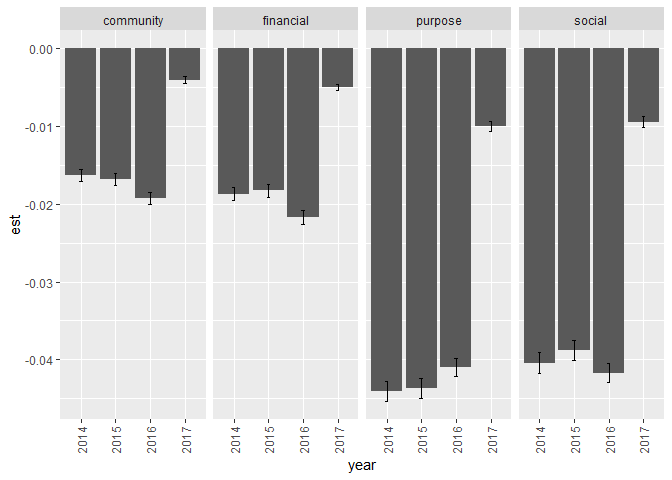
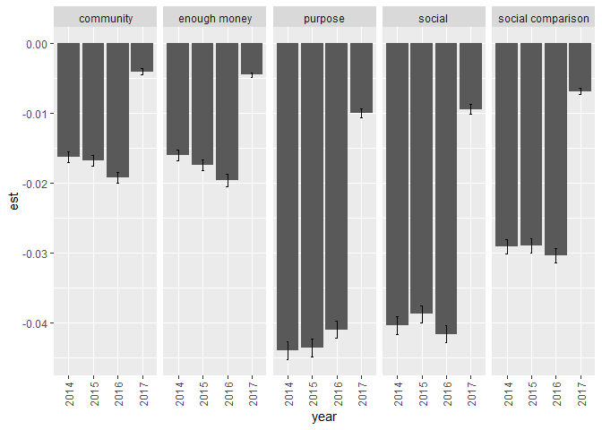
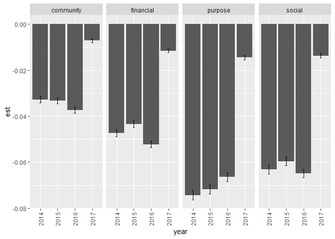
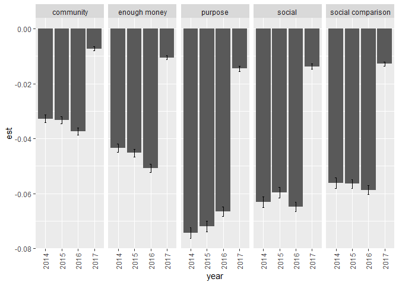
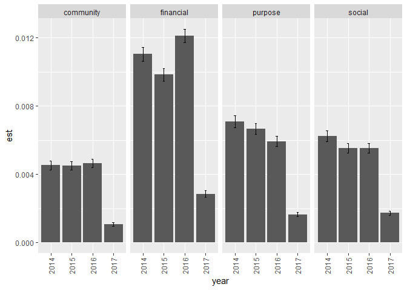
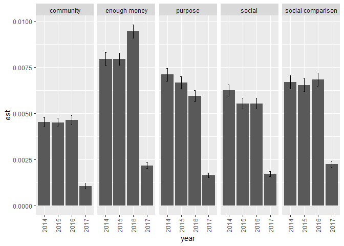

Gallup Relative Status Health Behavior Mediation Analysis
================
Daniel O’Leary
1/11/2021

  - [Analysis](#analysis)
      - [Days w/ 5 servings of fruits and
        veggies](#days-w-5-servings-of-fruits-and-veggies)
          - [Main Well-Being Measures](#main-well-being-measures)
          - [Alternative Well-Being
            Measures](#alternative-well-being-measures)
      - [Eat healthy yesterday?](#eat-healthy-yesterday)
          - [Main Well-Being Measures](#main-well-being-measures-1)
          - [Alternative Well-Being
            Measures](#alternative-well-being-measures-1)
      - [Smoke?](#smoke)
          - [Main Well-Being Measures](#main-well-being-measures-2)
          - [Alternative Well-Being
            Measures](#alternative-well-being-measures-2)

# Analysis

## Days w/ 5 servings of fruits and veggies

### Main Well-Being Measures

``` r
fv_med_main %>% 
  filter(str_detect(lhs, "indirect")) %>% 
  mutate(
    mech = 
      case_when(
        lhs == "indirect1" ~ "purpose",
        lhs == "indirect2" ~ "financial",
        lhs == "indirect3" ~ "community",
        lhs == "indirect4" ~ "social",
      )
  ) %>% 
  mutate(year = as.factor(year)) %>% 
  ggplot(aes(year, est)) +
  geom_col() +
  geom_errorbar(aes(ymin = est - se, ymax = est + se), width = 0.1) +
  theme(axis.text.x = element_text(angle = 90, vjust = 0.5, hjust = 1)) +
  facet_grid(. ~ mech)
```

<!-- -->

### Alternative Well-Being Measures

``` r
fv_med_alt %>% 
  filter(str_detect(lhs, "indirect")) %>% 
  mutate(
    mech = 
      case_when(
        lhs == "indirect1" ~ "purpose",
        lhs == "indirect2" ~ "enough money",
        lhs == "indirect3" ~ "social comparison",
        lhs == "indirect4" ~ "community",
        lhs == "indirect5" ~ "social"
      )
  ) %>% 
  mutate(year = as.factor(year)) %>% 
  ggplot(aes(year, est)) +
  geom_col() +
  geom_errorbar(aes(ymin = est - se, ymax = est + se), width = 0.1) +
  theme(axis.text.x = element_text(angle = 90, vjust = 0.5, hjust = 1)) +
  facet_grid(. ~ mech)
```

<!-- -->

## Eat healthy yesterday?

### Main Well-Being Measures

``` r
eh_med_main %>% 
  filter(str_detect(lhs, "indirect")) %>% 
  mutate(
    mech = 
      case_when(
        lhs == "indirect1" ~ "purpose",
        lhs == "indirect2" ~ "financial",
        lhs == "indirect3" ~ "community",
        lhs == "indirect4" ~ "social",
      )
  ) %>% 
  mutate(year = as.factor(year)) %>% 
  ggplot(aes(year, est)) +
  geom_col() +
  geom_errorbar(aes(ymin = est - se, ymax = est + se), width = 0.1) +
  theme(axis.text.x = element_text(angle = 90, vjust = 0.5, hjust = 1)) +
  facet_grid(. ~ mech)
```

<!-- -->

### Alternative Well-Being Measures

``` r
eh_med_alt %>% 
  filter(str_detect(lhs, "indirect")) %>% 
  mutate(
    mech = 
      case_when(
        lhs == "indirect1" ~ "purpose",
        lhs == "indirect2" ~ "enough money",
        lhs == "indirect3" ~ "social comparison",
        lhs == "indirect4" ~ "community",
        lhs == "indirect5" ~ "social"
      )
  ) %>% 
  mutate(year = as.factor(year)) %>% 
  ggplot(aes(year, est)) +
  geom_col() +
  geom_errorbar(aes(ymin = est - se, ymax = est + se), width = 0.1) +
  theme(axis.text.x = element_text(angle = 90, vjust = 0.5, hjust = 1)) +
  facet_grid(. ~ mech)
```

<!-- -->

## Smoke?

### Main Well-Being Measures

``` r
smoking_med_main %>% 
  filter(str_detect(lhs, "indirect")) %>% 
  mutate(
    mech = 
      case_when(
        lhs == "indirect1" ~ "purpose",
        lhs == "indirect2" ~ "financial",
        lhs == "indirect3" ~ "community",
        lhs == "indirect4" ~ "social",
      )
  ) %>% 
  mutate(year = as.factor(year)) %>% 
  ggplot(aes(year, est)) +
  geom_col() +
  geom_errorbar(aes(ymin = est - se, ymax = est + se), width = 0.1) +
  theme(axis.text.x = element_text(angle = 90, vjust = 0.5, hjust = 1)) +
  facet_grid(. ~ mech)
```

<!-- -->

### Alternative Well-Being Measures

``` r
smoking_med_alt %>% 
  filter(str_detect(lhs, "indirect")) %>% 
  mutate(
    mech = 
      case_when(
        lhs == "indirect1" ~ "purpose",
        lhs == "indirect2" ~ "enough money",
        lhs == "indirect3" ~ "social comparison",
        lhs == "indirect4" ~ "community",
        lhs == "indirect5" ~ "social"
      )
  ) %>% 
  mutate(year = as.factor(year)) %>% 
  ggplot(aes(year, est)) +
  geom_col() +
  geom_errorbar(aes(ymin = est - se, ymax = est + se), width = 0.1) +
  theme(axis.text.x = element_text(angle = 90, vjust = 0.5, hjust = 1)) +
  facet_grid(. ~ mech)
```

<!-- -->
