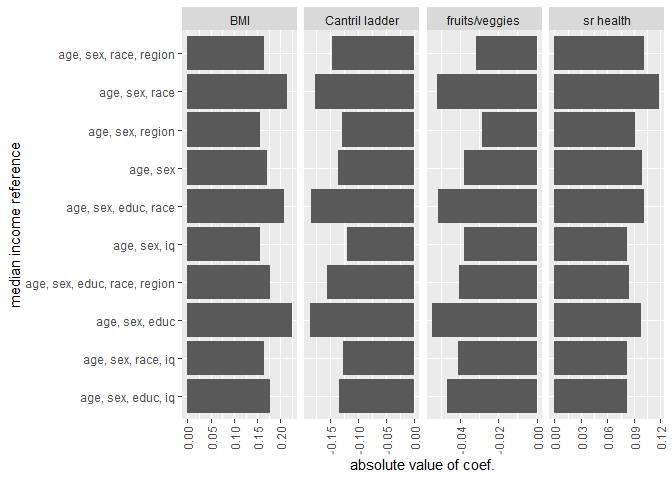
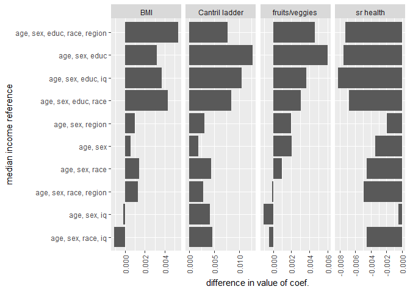
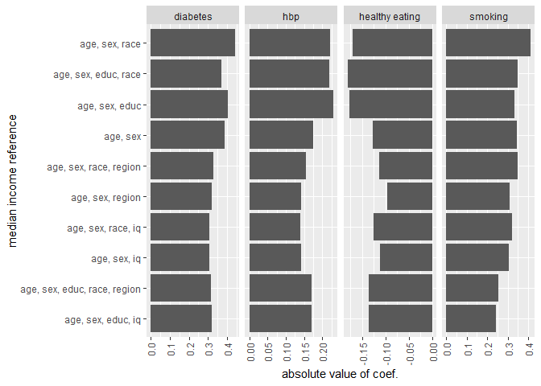
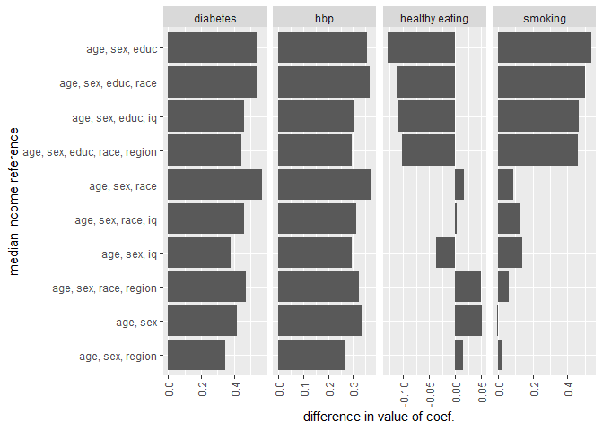
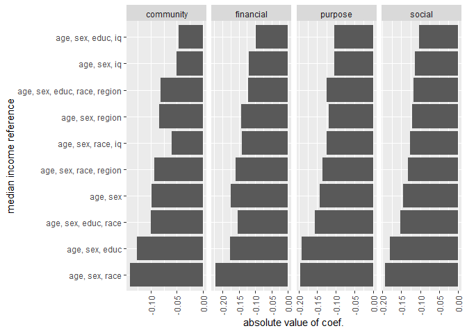
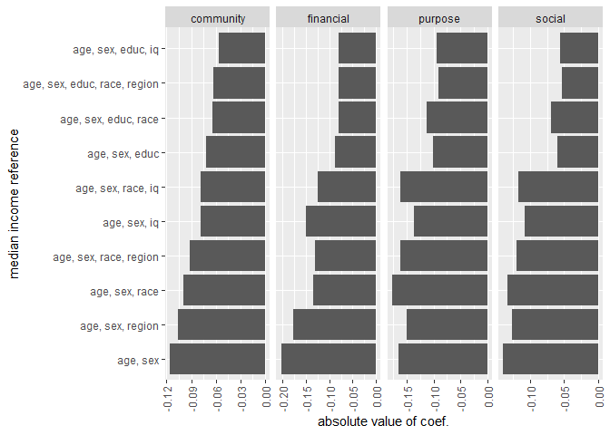

Gallup - Comparing Demographic Reference Median Incomes
================
Daniel O’Leary
5/28/2021

  - [Analysis](#analysis)
      - [Correlations among reference
        incomes](#correlations-among-reference-incomes)
      - [Linear models for focal
        outcomes](#linear-models-for-focal-outcomes)
          - [Coefficients with
            covariates](#coefficients-with-covariates)
          - [Coefficients w/o covariates](#coefficients-wo-covariates)
          - [Difference in coefficients](#difference-in-coefficients)
      - [Logistic models for focal
        outcomes](#logistic-models-for-focal-outcomes)
          - [Coefficients with
            covariates](#coefficients-with-covariates-1)
          - [Coefficients w/o covariates](#coefficients-wo-covariates-1)
          - [Difference in coefficients](#difference-in-coefficients-1)
      - [Linear models for mediators](#linear-models-for-mediators)
          - [Coefficients with
            covariates](#coefficients-with-covariates-2)
          - [Coefficients w/o covariates](#coefficients-wo-covariates-2)
          - [Difference in coefficients](#difference-in-coefficients-2)
      - [Median differences in
        coefficients](#median-differences-in-coefficients)
          - [Linear models for focal
            outcomes](#linear-models-for-focal-outcomes-1)
          - [Logistic models for focal
            outcomes](#logistic-models-for-focal-outcomes-1)
          - [Linear models for
            mediators](#linear-models-for-mediators-1)
      - [And this](#and-this)
      - [What happens when we don’t control for only demographics that
        are used in the reference
        income](#what-happens-when-we-dont-control-for-only-demographics-that-are-used-in-the-reference-income)
          - [Fruits  veggies](#fruits-veggies)
          - [Cantril ladder](#cantril-ladder)
          - [Sense of purpose](#sense-of-purpose)
          - [Smoking](#smoking)
          - [Diabetes](#diabetes)

``` r
source("G:/My Drive/research/projects/gallup_rs/analysis/median_income_regressions/comparing demographic reference incomes/comparing_demographic_reference_incomes_plot_functions.R")
```

# Analysis

## Correlations among reference incomes

``` r
dfg_rs %>% 
  dplyr::select(
    age_scale,
    education_scale,
    sex,
    starts_with("median_income_demo")
  ) %>% 
  mutate_all(as.numeric) %>% 
  dplyr::select(age_scale, education_scale, sex, median_income_demo_sa_scale:median_income_demo_esaiq_scale) %>% 
  cor(., use = "pairwise.complete.obs") %>% 
  round(., 2)
```

    ##                                age_scale education_scale   sex
    ## age_scale                           1.00           -0.01  0.11
    ## education_scale                    -0.01            1.00 -0.03
    ## sex                                 0.11           -0.03  1.00
    ## median_income_demo_sa_scale        -0.24            0.13 -0.38
    ## median_income_demo_esa_scale       -0.09            0.82 -0.28
    ## median_income_demo_esar_scale      -0.09            0.78 -0.27
    ## median_income_demo_sar_scale       -0.20            0.21 -0.39
    ## median_income_demo_saiq_scale      -0.20            0.20 -0.36
    ## median_income_demo_sariq_scale     -0.17            0.26 -0.30
    ## median_income_demo_esaiq_scale     -0.09            0.77 -0.26
    ##                                median_income_demo_sa_scale
    ## age_scale                                            -0.24
    ## education_scale                                       0.13
    ## sex                                                  -0.38
    ## median_income_demo_sa_scale                           1.00
    ## median_income_demo_esa_scale                          0.54
    ## median_income_demo_esar_scale                         0.51
    ## median_income_demo_sar_scale                          0.70
    ## median_income_demo_saiq_scale                         0.72
    ## median_income_demo_sariq_scale                        0.61
    ## median_income_demo_esaiq_scale                        0.49
    ##                                median_income_demo_esa_scale
    ## age_scale                                             -0.09
    ## education_scale                                        0.82
    ## sex                                                   -0.28
    ## median_income_demo_sa_scale                            0.54
    ## median_income_demo_esa_scale                           1.00
    ## median_income_demo_esar_scale                          0.93
    ## median_income_demo_sar_scale                           0.52
    ## median_income_demo_saiq_scale                          0.50
    ## median_income_demo_sariq_scale                         0.51
    ## median_income_demo_esaiq_scale                         0.89
    ##                                median_income_demo_esar_scale
    ## age_scale                                              -0.09
    ## education_scale                                         0.78
    ## sex                                                    -0.27
    ## median_income_demo_sa_scale                             0.51
    ## median_income_demo_esa_scale                            0.93
    ## median_income_demo_esar_scale                           1.00
    ## median_income_demo_sar_scale                            0.63
    ## median_income_demo_saiq_scale                           0.49
    ## median_income_demo_sariq_scale                          0.59
    ## median_income_demo_esaiq_scale                          0.86
    ##                                median_income_demo_sar_scale
    ## age_scale                                             -0.20
    ## education_scale                                        0.21
    ## sex                                                   -0.39
    ## median_income_demo_sa_scale                            0.70
    ## median_income_demo_esa_scale                           0.52
    ## median_income_demo_esar_scale                          0.63
    ## median_income_demo_sar_scale                           1.00
    ## median_income_demo_saiq_scale                          0.57
    ## median_income_demo_sariq_scale                         0.80
    ## median_income_demo_esaiq_scale                         0.49
    ##                                median_income_demo_saiq_scale
    ## age_scale                                              -0.20
    ## education_scale                                         0.20
    ## sex                                                    -0.36
    ## median_income_demo_sa_scale                             0.72
    ## median_income_demo_esa_scale                            0.50
    ## median_income_demo_esar_scale                           0.49
    ## median_income_demo_sar_scale                            0.57
    ## median_income_demo_saiq_scale                           1.00
    ## median_income_demo_sariq_scale                          0.78
    ## median_income_demo_esaiq_scale                          0.62
    ##                                median_income_demo_sariq_scale
    ## age_scale                                               -0.17
    ## education_scale                                          0.26
    ## sex                                                     -0.30
    ## median_income_demo_sa_scale                              0.61
    ## median_income_demo_esa_scale                             0.51
    ## median_income_demo_esar_scale                            0.59
    ## median_income_demo_sar_scale                             0.80
    ## median_income_demo_saiq_scale                            0.78
    ## median_income_demo_sariq_scale                           1.00
    ## median_income_demo_esaiq_scale                           0.60
    ##                                median_income_demo_esaiq_scale
    ## age_scale                                               -0.09
    ## education_scale                                          0.77
    ## sex                                                     -0.26
    ## median_income_demo_sa_scale                              0.49
    ## median_income_demo_esa_scale                             0.89
    ## median_income_demo_esar_scale                            0.86
    ## median_income_demo_sar_scale                             0.49
    ## median_income_demo_saiq_scale                            0.62
    ## median_income_demo_sariq_scale                           0.60
    ## median_income_demo_esaiq_scale                           1.00

## Linear models for focal outcomes

### Coefficients with covariates

``` r
coef_plot("scale(mi_value)", linear_models_outcomes_wc)
```

    ## Note: Using an external vector in selections is ambiguous.
    ## i Use `all_of(outcome)` instead of `outcome` to silence this message.
    ## i See <https://tidyselect.r-lib.org/reference/faq-external-vector.html>.
    ## This message is displayed once per session.

<!-- -->

### Coefficients w/o covariates

``` r
coef_plot("scale(mi_value)", linear_models_outcomes_woc)
```

<!-- -->

### Difference in coefficients

``` r
coef_diff_plot("mi_value_diff", linear_models_outcomes)
```

<!-- -->

## Logistic models for focal outcomes

### Coefficients with covariates

``` r
coef_plot("scale(mi_value)", logistic_models_outcomes_wc)
```

<!-- -->

### Coefficients w/o covariates

``` r
coef_plot("scale(mi_value)", logistic_models_outcomes_woc)
```

<!-- -->

### Difference in coefficients

``` r
coef_diff_plot("mi_value_diff", logistic_models_outcomes)
```

<!-- -->

## Linear models for mediators

### Coefficients with covariates

``` r
coef_plot("scale(mi_value)", linear_models_mediators_wc)
```

<!-- -->

### Coefficients w/o covariates

``` r
coef_plot("scale(mi_value)", linear_models_mediators_woc)
```

<!-- -->

### Difference in coefficients

``` r
coef_diff_plot("mi_value_diff", linear_models_mediators)
```

<!-- -->

## Median differences in coefficients

### Linear models for focal outcomes

``` r
linear_models_outcomes %>% 
  group_by(mi_var) %>% 
  summarise(
    median_coef_diff = median(mi_value_diff)
  )
```

    ## `summarise()` ungrouping output (override with `.groups` argument)

    ## # A tibble: 10 x 2
    ##    mi_var                         median_coef_diff
    ##    <chr>                                     <dbl>
    ##  1 median_income_demo_esa_scale           0.00457 
    ##  2 median_income_demo_esacr_scale         0.00497 
    ##  3 median_income_demo_esaiq_scale         0.00368 
    ##  4 median_income_demo_esar_scale          0.00366 
    ##  5 median_income_demo_sa_scale            0.00121 
    ##  6 median_income_demo_sacr_scale          0.00146 
    ##  7 median_income_demo_saiq_scale         -0.000329
    ##  8 median_income_demo_sar_scale           0.00118 
    ##  9 median_income_demo_sarcr_scale         0.000596
    ## 10 median_income_demo_sariq_scale        -0.000762

### Logistic models for focal outcomes

``` r
logistic_models_outcomes %>% 
  group_by(mi_var) %>% 
  summarise(
    median_coef_diff = round(median(mi_value_diff), 2)
  )
```

    ## `summarise()` ungrouping output (override with `.groups` argument)

    ## # A tibble: 10 x 2
    ##    mi_var                         median_coef_diff
    ##    <chr>                                     <dbl>
    ##  1 median_income_demo_esa_scale               0.45
    ##  2 median_income_demo_esacr_scale             0.37
    ##  3 median_income_demo_esaiq_scale             0.38
    ##  4 median_income_demo_esar_scale              0.43
    ##  5 median_income_demo_sa_scale                0.19
    ##  6 median_income_demo_sacr_scale              0.14
    ##  7 median_income_demo_saiq_scale              0.22
    ##  8 median_income_demo_sar_scale               0.23
    ##  9 median_income_demo_sarcr_scale             0.19
    ## 10 median_income_demo_sariq_scale             0.22

### Linear models for mediators

``` r
linear_models_mediators %>% 
  group_by(mi_var) %>% 
  summarise(
    median_coef_diff = round(median(mi_value_diff), 2)
  )
```

    ## `summarise()` ungrouping output (override with `.groups` argument)

    ## # A tibble: 10 x 2
    ##    mi_var                         median_coef_diff
    ##    <chr>                                     <dbl>
    ##  1 median_income_demo_esa_scale              -0.09
    ##  2 median_income_demo_esacr_scale            -0.04
    ##  3 median_income_demo_esaiq_scale            -0.01
    ##  4 median_income_demo_esar_scale             -0.06
    ##  5 median_income_demo_sa_scale                0.02
    ##  6 median_income_demo_sacr_scale              0.03
    ##  7 median_income_demo_saiq_scale              0.03
    ##  8 median_income_demo_sar_scale              -0.05
    ##  9 median_income_demo_sarcr_scale            -0.01
    ## 10 median_income_demo_sariq_scale             0

## And this

``` r
lm1 <-
  lm(
    fruits_veggies_scale ~
      scale(income) +
      median_income_demo_esa_scale,
    dfg_rs
  )

summary(lm1)
```

    ## 
    ## Call:
    ## lm(formula = fruits_veggies_scale ~ scale(income) + median_income_demo_esa_scale, 
    ##     data = dfg_rs)
    ## 
    ## Residuals:
    ##      Min       1Q   Median       3Q      Max 
    ## -1.81677 -0.82503 -0.01023  1.11085  1.28600 
    ## 
    ## Coefficients:
    ##                                Estimate Std. Error t value Pr(>|t|)    
    ## (Intercept)                  -0.0281354  0.0006920  -40.66   <2e-16 ***
    ## scale(income)                 0.0274017  0.0007909   34.65   <2e-16 ***
    ## median_income_demo_esa_scale -0.0387171  0.0008088  -47.87   <2e-16 ***
    ## ---
    ## Signif. codes:  0 '***' 0.001 '**' 0.01 '*' 0.05 '.' 0.1 ' ' 1
    ## 
    ## Residual standard error: 0.9984 on 2082015 degrees of freedom
    ##   (1448252 observations deleted due to missingness)
    ## Multiple R-squared:  0.001188,   Adjusted R-squared:  0.001187 
    ## F-statistic:  1238 on 2 and 2082015 DF,  p-value: < 2.2e-16

``` r
VIF(lm1)
```

    ##                scale(income) median_income_demo_esa_scale 
    ##                     1.290503                     1.290503

``` r
lm1 <-
  lm(
    fruits_veggies_scale ~
      scale(income) +
      median_income_demo_esa_scale +
      education_scale,
    dfg_rs
  )

summary(lm1)
```

    ## 
    ## Call:
    ## lm(formula = fruits_veggies_scale ~ scale(income) + median_income_demo_esa_scale + 
    ##     education_scale, data = dfg_rs)
    ## 
    ## Residuals:
    ##      Min       1Q   Median       3Q      Max 
    ## -2.13636 -0.81160  0.04437  1.06521  1.56171 
    ## 
    ## Coefficients:
    ##                                Estimate Std. Error t value Pr(>|t|)    
    ## (Intercept)                  -0.0322982  0.0006912  -46.73   <2e-16 ***
    ## scale(income)                 0.0215583  0.0007906   27.27   <2e-16 ***
    ## median_income_demo_esa_scale -0.1470092  0.0012953 -113.49   <2e-16 ***
    ## education_scale               0.1323648  0.0012389  106.84   <2e-16 ***
    ## ---
    ## Signif. codes:  0 '***' 0.001 '**' 0.01 '*' 0.05 '.' 0.1 ' ' 1
    ## 
    ## Residual standard error: 0.9957 on 2082014 degrees of freedom
    ##   (1448252 observations deleted due to missingness)
    ## Multiple R-squared:  0.006634,   Adjusted R-squared:  0.006633 
    ## F-statistic:  4635 on 3 and 2082014 DF,  p-value: < 2.2e-16

``` r
VIF(lm1)
```

    ##                scale(income) median_income_demo_esa_scale 
    ##                     1.296708                     3.328301 
    ##              education_scale 
    ##                     3.150704

``` r
lm1 <-
  lm(
    fruits_veggies_scale ~
      scale(income) +
      median_income_demo_esa_scale +
      total_pop_county_scale +
      median_monthly_housing_cost_county_scale +
      land_area_2010_scale +
      physicians_scale +
      education_scale +
      employment_all +
      sex +
      age_scale +
      race +
      married + 
      year,
    dfg_rs
  )

summary(lm1)
```

    ## 
    ## Call:
    ## lm(formula = fruits_veggies_scale ~ scale(income) + median_income_demo_esa_scale + 
    ##     total_pop_county_scale + median_monthly_housing_cost_county_scale + 
    ##     land_area_2010_scale + physicians_scale + education_scale + 
    ##     employment_all + sex + age_scale + race + married + year, 
    ##     data = dfg_rs)
    ## 
    ## Residuals:
    ##      Min       1Q   Median       3Q      Max 
    ## -2.39927 -0.72852  0.08099  0.93735  1.78731 
    ## 
    ## Coefficients:
    ##                                            Estimate Std. Error t value Pr(>|t|)
    ## (Intercept)                              -0.2183961  0.0029516 -73.992  < 2e-16
    ## scale(income)                             0.0229124  0.0008744  26.203  < 2e-16
    ## median_income_demo_esa_scale             -0.0545746  0.0016123 -33.848  < 2e-16
    ## total_pop_county_scale                   -0.0024174  0.0007795  -3.101  0.00193
    ## median_monthly_housing_cost_county_scale  0.0051021  0.0008068   6.324 2.55e-10
    ## land_area_2010_scale                      0.0067161  0.0007254   9.258  < 2e-16
    ## physicians_scale                         -0.0013325  0.0007692  -1.732  0.08320
    ## education_scale                           0.0620892  0.0014586  42.568  < 2e-16
    ## employment_all1                          -0.0160186  0.0016646  -9.623  < 2e-16
    ## sex2                                      0.2236499  0.0015772 141.800  < 2e-16
    ## age_scale                                 0.1278755  0.0009254 138.185  < 2e-16
    ## race2                                     0.1838977  0.0046134  39.862  < 2e-16
    ## race3                                     0.1615216  0.0026051  62.002  < 2e-16
    ## race4                                     0.1772655  0.0050356  35.203  < 2e-16
    ## race5                                     0.0914205  0.0027556  33.177  < 2e-16
    ## married2                                  0.1007951  0.0021474  46.938  < 2e-16
    ## married3                                  0.0167047  0.0052768   3.166  0.00155
    ## married4                                 -0.0127970  0.0027731  -4.615 3.94e-06
    ## married5                                  0.0454216  0.0032224  14.096  < 2e-16
    ## married8                                  0.0952941  0.0038321  24.867  < 2e-16
    ## year2009                                 -0.0310268  0.0027111 -11.445  < 2e-16
    ## year2010                                 -0.0070689  0.0027117  -2.607  0.00914
    ## year2011                                 -0.0256490  0.0026913  -9.530  < 2e-16
    ## year2012                                  0.0283952  0.0026589  10.679  < 2e-16
    ## year2013                                  0.0282457  0.0032375   8.725  < 2e-16
    ## year2014                                  0.0200635  0.0032539   6.166 7.01e-10
    ## year2015                                  0.0252358  0.0032864   7.679 1.61e-14
    ## year2016                                  0.0311127  0.0033266   9.353  < 2e-16
    ## year2017                                  0.0323671  0.0034159   9.476  < 2e-16
    ##                                             
    ## (Intercept)                              ***
    ## scale(income)                            ***
    ## median_income_demo_esa_scale             ***
    ## total_pop_county_scale                   ** 
    ## median_monthly_housing_cost_county_scale ***
    ## land_area_2010_scale                     ***
    ## physicians_scale                         .  
    ## education_scale                          ***
    ## employment_all1                          ***
    ## sex2                                     ***
    ## age_scale                                ***
    ## race2                                    ***
    ## race3                                    ***
    ## race4                                    ***
    ## race5                                    ***
    ## married2                                 ***
    ## married3                                 ** 
    ## married4                                 ***
    ## married5                                 ***
    ## married8                                 ***
    ## year2009                                 ***
    ## year2010                                 ** 
    ## year2011                                 ***
    ## year2012                                 ***
    ## year2013                                 ***
    ## year2014                                 ***
    ## year2015                                 ***
    ## year2016                                 ***
    ## year2017                                 ***
    ## ---
    ## Signif. codes:  0 '***' 0.001 '**' 0.01 '*' 0.05 '.' 0.1 ' ' 1
    ## 
    ## Residual standard error: 0.9793 on 2040844 degrees of freedom
    ##   (1489397 observations deleted due to missingness)
    ## Multiple R-squared:  0.03816,    Adjusted R-squared:  0.03815 
    ## F-statistic:  2892 on 28 and 2040844 DF,  p-value: < 2.2e-16

``` r
VIF(lm1)
```

    ##                                              GVIF Df GVIF^(1/(2*Df))
    ## scale(income)                            1.603655  1        1.266355
    ## median_income_demo_esa_scale             5.221344  1        2.285026
    ## total_pop_county_scale                   1.264880  1        1.124669
    ## median_monthly_housing_cost_county_scale 1.366563  1        1.169001
    ## land_area_2010_scale                     1.127479  1        1.061828
    ## physicians_scale                         1.228362  1        1.108315
    ## education_scale                          4.420004  1        2.102381
    ## employment_all                           1.422295  1        1.192600
    ## sex                                      1.322767  1        1.150116
    ## age_scale                                1.701798  1        1.304530
    ## race                                     1.243788  4        1.027645
    ## married                                  1.894620  5        1.065988
    ## year                                     1.267514  9        1.013257

``` r
lm1 <-
  lm(
    fruits_veggies_scale ~
      scale(income) +
      median_income_demo_esa_scale +
      total_pop_county_scale +
      median_monthly_housing_cost_county_scale +
      land_area_2010_scale +
      physicians_scale +
      employment_all +
      sex +
      age_scale +
      race +
      married + 
      year,
    dfg_rs
  )

summary(lm1)
```

    ## 
    ## Call:
    ## lm(formula = fruits_veggies_scale ~ scale(income) + median_income_demo_esa_scale + 
    ##     total_pop_county_scale + median_monthly_housing_cost_county_scale + 
    ##     land_area_2010_scale + physicians_scale + employment_all + 
    ##     sex + age_scale + race + married + year, data = dfg_rs)
    ## 
    ## Residuals:
    ##      Min       1Q   Median       3Q      Max 
    ## -2.34300 -0.72950  0.08117  0.93528  1.80869 
    ## 
    ## Coefficients:
    ##                                            Estimate Std. Error t value Pr(>|t|)
    ## (Intercept)                              -0.2103084  0.0029468 -71.368  < 2e-16
    ## scale(income)                             0.0273934  0.0008685  31.543  < 2e-16
    ## median_income_demo_esa_scale              0.0031546  0.0008725   3.616 0.000299
    ## total_pop_county_scale                   -0.0019542  0.0007797  -2.506 0.012204
    ## median_monthly_housing_cost_county_scale  0.0064275  0.0008065   7.969 1.60e-15
    ## land_area_2010_scale                      0.0071261  0.0007257   9.820  < 2e-16
    ## physicians_scale                          0.0003696  0.0007685   0.481 0.630513
    ## employment_all1                          -0.0216951  0.0016600 -13.070  < 2e-16
    ## sex2                                      0.2499527  0.0014518 172.169  < 2e-16
    ## age_scale                                 0.1296709  0.0009248 140.209  < 2e-16
    ## race2                                     0.1828492  0.0046154  39.617  < 2e-16
    ## race3                                     0.1575896  0.0026046  60.504  < 2e-16
    ## race4                                     0.1850977  0.0050344  36.766  < 2e-16
    ## race5                                     0.0880013  0.0027556  31.935  < 2e-16
    ## married2                                  0.0862839  0.0021211  40.678  < 2e-16
    ## married3                                 -0.0004564  0.0052637  -0.087 0.930898
    ## married4                                 -0.0269601  0.0027543  -9.788  < 2e-16
    ## married5                                  0.0432186  0.0032234  13.408  < 2e-16
    ## married8                                  0.0856453  0.0038271  22.379  < 2e-16
    ## year2009                                 -0.0266548  0.0027103  -9.835  < 2e-16
    ## year2010                                 -0.0057699  0.0027127  -2.127 0.033422
    ## year2011                                 -0.0225472  0.0026915  -8.377  < 2e-16
    ## year2012                                  0.0245448  0.0026586   9.232  < 2e-16
    ## year2013                                  0.0256107  0.0032383   7.909 2.60e-15
    ## year2014                                  0.0165296  0.0032543   5.079 3.79e-07
    ## year2015                                  0.0050541  0.0032535   1.553 0.120319
    ## year2016                                 -0.0017155  0.0032375  -0.530 0.596190
    ## year2017                                  0.0015582  0.0033398   0.467 0.640828
    ##                                             
    ## (Intercept)                              ***
    ## scale(income)                            ***
    ## median_income_demo_esa_scale             ***
    ## total_pop_county_scale                   *  
    ## median_monthly_housing_cost_county_scale ***
    ## land_area_2010_scale                     ***
    ## physicians_scale                            
    ## employment_all1                          ***
    ## sex2                                     ***
    ## age_scale                                ***
    ## race2                                    ***
    ## race3                                    ***
    ## race4                                    ***
    ## race5                                    ***
    ## married2                                 ***
    ## married3                                    
    ## married4                                 ***
    ## married5                                 ***
    ## married8                                 ***
    ## year2009                                 ***
    ## year2010                                 *  
    ## year2011                                 ***
    ## year2012                                 ***
    ## year2013                                 ***
    ## year2014                                 ***
    ## year2015                                    
    ## year2016                                    
    ## year2017                                    
    ## ---
    ## Signif. codes:  0 '***' 0.001 '**' 0.01 '*' 0.05 '.' 0.1 ' ' 1
    ## 
    ## Residual standard error: 0.9798 on 2040845 degrees of freedom
    ##   (1489397 observations deleted due to missingness)
    ## Multiple R-squared:  0.03731,    Adjusted R-squared:  0.03729 
    ## F-statistic:  2929 on 27 and 2040845 DF,  p-value: < 2.2e-16

``` r
VIF(lm1)
```

    ##                                              GVIF Df GVIF^(1/(2*Df))
    ## scale(income)                            1.580414  1        1.257145
    ## median_income_demo_esa_scale             1.527444  1        1.235898
    ## total_pop_county_scale                   1.264634  1        1.124559
    ## median_monthly_housing_cost_county_scale 1.364528  1        1.168130
    ## land_area_2010_scale                     1.127280  1        1.061734
    ## physicians_scale                         1.225042  1        1.106816
    ## employment_all                           1.413167  1        1.188767
    ## sex                                      1.119749  1        1.058182
    ## age_scale                                1.698263  1        1.303174
    ## race                                     1.239388  4        1.027190
    ## married                                  1.824838  5        1.061995
    ## year                                     1.095179  9        1.005064

## What happens when we don’t control for only demographics that are used in the reference income

### Fruits  veggies

``` r
lm1 <-
  lm(
    fruits_veggies_scale ~
      scale(income) +
      median_income_demo_esa_scale +
      total_pop_county_scale +
      median_monthly_housing_cost_county_scale +
      land_area_2010_scale +
      physicians_scale +
      education_scale +
      employment_all +
      race +
      married + 
      year,
    dfg_rs
  )

summary(lm1)
```

    ## 
    ## Call:
    ## lm(formula = fruits_veggies_scale ~ scale(income) + median_income_demo_esa_scale + 
    ##     total_pop_county_scale + median_monthly_housing_cost_county_scale + 
    ##     land_area_2010_scale + physicians_scale + education_scale + 
    ##     employment_all + race + married + year, data = dfg_rs)
    ## 
    ## Residuals:
    ##      Min       1Q   Median       3Q      Max 
    ## -2.30816 -0.76409  0.07088  1.00119  1.69537 
    ## 
    ## Coefficients:
    ##                                            Estimate Std. Error  t value
    ## (Intercept)                              -1.919e-01  2.925e-03  -65.612
    ## scale(income)                             1.825e-02  8.815e-04   20.698
    ## median_income_demo_esa_scale             -1.559e-01  1.464e-03 -106.540
    ## total_pop_county_scale                   -1.962e-03  7.866e-04   -2.495
    ## median_monthly_housing_cost_county_scale  5.012e-03  8.142e-04    6.155
    ## land_area_2010_scale                      7.138e-03  7.320e-04    9.751
    ## physicians_scale                         -3.535e-05  7.762e-04   -0.046
    ## education_scale                           1.488e-01  1.354e-03  109.943
    ## employment_all1                          -9.889e-02  1.561e-03  -63.337
    ## race2                                     1.406e-01  4.648e-03   30.253
    ## race3                                     1.463e-01  2.620e-03   55.861
    ## race4                                     9.333e-02  5.054e-03   18.465
    ## race5                                     2.515e-02  2.744e-03    9.163
    ## married2                                  2.237e-01  2.037e-03  109.789
    ## married3                                  1.296e-01  5.291e-03   24.502
    ## married4                                  1.521e-01  2.641e-03   57.585
    ## married5                                  2.921e-01  2.883e-03  101.312
    ## married8                                  1.472e-01  3.857e-03   38.160
    ## year2009                                 -4.311e-02  2.735e-03  -15.761
    ## year2010                                 -1.387e-03  2.736e-03   -0.507
    ## year2011                                 -2.490e-02  2.716e-03   -9.169
    ## year2012                                  4.454e-02  2.682e-03   16.608
    ## year2013                                  3.789e-02  3.267e-03   11.600
    ## year2014                                  3.345e-02  3.283e-03   10.190
    ## year2015                                  7.113e-02  3.306e-03   21.517
    ## year2016                                  9.795e-02  3.332e-03   29.395
    ## year2017                                  8.990e-02  3.428e-03   26.227
    ##                                          Pr(>|t|)    
    ## (Intercept)                               < 2e-16 ***
    ## scale(income)                             < 2e-16 ***
    ## median_income_demo_esa_scale              < 2e-16 ***
    ## total_pop_county_scale                     0.0126 *  
    ## median_monthly_housing_cost_county_scale 7.49e-10 ***
    ## land_area_2010_scale                      < 2e-16 ***
    ## physicians_scale                           0.9637    
    ## education_scale                           < 2e-16 ***
    ## employment_all1                           < 2e-16 ***
    ## race2                                     < 2e-16 ***
    ## race3                                     < 2e-16 ***
    ## race4                                     < 2e-16 ***
    ## race5                                     < 2e-16 ***
    ## married2                                  < 2e-16 ***
    ## married3                                  < 2e-16 ***
    ## married4                                  < 2e-16 ***
    ## married5                                  < 2e-16 ***
    ## married8                                  < 2e-16 ***
    ## year2009                                  < 2e-16 ***
    ## year2010                                   0.6121    
    ## year2011                                  < 2e-16 ***
    ## year2012                                  < 2e-16 ***
    ## year2013                                  < 2e-16 ***
    ## year2014                                  < 2e-16 ***
    ## year2015                                  < 2e-16 ***
    ## year2016                                  < 2e-16 ***
    ## year2017                                  < 2e-16 ***
    ## ---
    ## Signif. codes:  0 '***' 0.001 '**' 0.01 '*' 0.05 '.' 0.1 ' ' 1
    ## 
    ## Residual standard error: 0.9883 on 2040846 degrees of freedom
    ##   (1489397 observations deleted due to missingness)
    ## Multiple R-squared:  0.02041,    Adjusted R-squared:  0.0204 
    ## F-statistic:  1636 on 26 and 2040846 DF,  p-value: < 2.2e-16

``` r
VIF(lm1)
```

    ##                                              GVIF Df GVIF^(1/(2*Df))
    ## scale(income)                            1.600168  1        1.264978
    ## median_income_demo_esa_scale             4.224391  1        2.055332
    ## total_pop_county_scale                   1.264794  1        1.124631
    ## median_monthly_housing_cost_county_scale 1.366558  1        1.168999
    ## land_area_2010_scale                     1.127298  1        1.061743
    ## physicians_scale                         1.228215  1        1.108249
    ## education_scale                          3.737769  1        1.933331
    ## employment_all                           1.228714  1        1.108474
    ## race                                     1.193842  4        1.022394
    ## married                                  1.433950  5        1.036701
    ## year                                     1.220776  9        1.011144

``` r
lm1 <-
  lm(
    fruits_veggies_scale ~
      scale(income) +
      median_income_demo_sar_scale +
      total_pop_county_scale +
      median_monthly_housing_cost_county_scale +
      land_area_2010_scale +
      physicians_scale +
      education_scale +
      employment_all +
      education_scale +
      married + 
      year,
    dfg_rs
  )

summary(lm1)
```

    ## 
    ## Call:
    ## lm(formula = fruits_veggies_scale ~ scale(income) + median_income_demo_sar_scale + 
    ##     total_pop_county_scale + median_monthly_housing_cost_county_scale + 
    ##     land_area_2010_scale + physicians_scale + education_scale + 
    ##     employment_all + education_scale + married + year, data = dfg_rs)
    ## 
    ## Residuals:
    ##      Min       1Q   Median       3Q      Max 
    ## -2.21972 -0.75551  0.07332  0.98528  1.65776 
    ## 
    ## Coefficients:
    ##                                            Estimate Std. Error  t value
    ## (Intercept)                              -0.1746608  0.0028784  -60.680
    ## scale(income)                             0.0203526  0.0008772   23.202
    ## median_income_demo_sar_scale             -0.1167430  0.0008362 -139.612
    ## total_pop_county_scale                   -0.0064768  0.0007797   -8.307
    ## median_monthly_housing_cost_county_scale  0.0026299  0.0008098    3.248
    ## land_area_2010_scale                      0.0048363  0.0007290    6.634
    ## physicians_scale                          0.0010350  0.0007746    1.336
    ## education_scale                           0.0397750  0.0007888   50.425
    ## employment_all1                          -0.0859680  0.0015572  -55.206
    ## married2                                  0.2121618  0.0020140  105.344
    ## married3                                  0.1222971  0.0052776   23.173
    ## married4                                  0.1407253  0.0026221   53.670
    ## married5                                  0.2524694  0.0028661   88.089
    ## married8                                  0.1334197  0.0038418   34.729
    ## year2009                                 -0.0399283  0.0027312  -14.619
    ## year2010                                  0.0039470  0.0027331    1.444
    ## year2011                                 -0.0155504  0.0027112   -5.736
    ## year2012                                  0.0565739  0.0026796   21.113
    ## year2013                                  0.0523209  0.0032642   16.029
    ## year2014                                  0.0500555  0.0032803   15.259
    ## year2015                                  0.0719622  0.0032846   21.909
    ## year2016                                  0.0992545  0.0032841   30.223
    ## year2017                                  0.1074861  0.0034114   31.508
    ##                                          Pr(>|t|)    
    ## (Intercept)                               < 2e-16 ***
    ## scale(income)                             < 2e-16 ***
    ## median_income_demo_sar_scale              < 2e-16 ***
    ## total_pop_county_scale                    < 2e-16 ***
    ## median_monthly_housing_cost_county_scale  0.00116 ** 
    ## land_area_2010_scale                     3.27e-11 ***
    ## physicians_scale                          0.18148    
    ## education_scale                           < 2e-16 ***
    ## employment_all1                           < 2e-16 ***
    ## married2                                  < 2e-16 ***
    ## married3                                  < 2e-16 ***
    ## married4                                  < 2e-16 ***
    ## married5                                  < 2e-16 ***
    ## married8                                  < 2e-16 ***
    ## year2009                                  < 2e-16 ***
    ## year2010                                  0.14869    
    ## year2011                                 9.72e-09 ***
    ## year2012                                  < 2e-16 ***
    ## year2013                                  < 2e-16 ***
    ## year2014                                  < 2e-16 ***
    ## year2015                                  < 2e-16 ***
    ## year2016                                  < 2e-16 ***
    ## year2017                                  < 2e-16 ***
    ## ---
    ## Signif. codes:  0 '***' 0.001 '**' 0.01 '*' 0.05 '.' 0.1 ' ' 1
    ## 
    ## Residual standard error: 0.9873 on 2040116 degrees of freedom
    ##   (1490131 observations deleted due to missingness)
    ## Multiple R-squared:  0.02241,    Adjusted R-squared:  0.0224 
    ## F-statistic:  2126 on 22 and 2040116 DF,  p-value: < 2.2e-16

``` r
VIF(lm1)
```

    ##                                              GVIF Df GVIF^(1/(2*Df))
    ## scale(income)                            1.586984  1        1.259756
    ## median_income_demo_sar_scale             1.364342  1        1.168051
    ## total_pop_county_scale                   1.243171  1        1.114976
    ## median_monthly_housing_cost_county_scale 1.353256  1        1.163295
    ## land_area_2010_scale                     1.119747  1        1.058181
    ## physicians_scale                         1.225215  1        1.106894
    ## education_scale                          1.271231  1        1.127489
    ## employment_all                           1.224289  1        1.106476
    ## married                                  1.386827  5        1.033242
    ## year                                     1.137533  9        1.007185

``` r
lm1 <-
  lm(
    fruits_veggies_scale ~
      scale(income) +
      median_income_demo_esar_scale +
      total_pop_county_scale +
      median_monthly_housing_cost_county_scale +
      land_area_2010_scale +
      physicians_scale +
      employment_all +
      married + 
      year,
    dfg_rs
  )

summary(lm1)
```

    ## 
    ## Call:
    ## lm(formula = fruits_veggies_scale ~ scale(income) + median_income_demo_esar_scale + 
    ##     total_pop_county_scale + median_monthly_housing_cost_county_scale + 
    ##     land_area_2010_scale + physicians_scale + employment_all + 
    ##     married + year, data = dfg_rs)
    ## 
    ## Residuals:
    ##      Min       1Q   Median       3Q      Max 
    ## -2.04328 -0.77907  0.07342  1.02571  1.51352 
    ## 
    ## Coefficients:
    ##                                            Estimate Std. Error t value Pr(>|t|)
    ## (Intercept)                              -0.1301944  0.0028826 -45.165  < 2e-16
    ## scale(income)                             0.0310265  0.0008790  35.297  < 2e-16
    ## median_income_demo_esar_scale            -0.0411248  0.0008596 -47.841  < 2e-16
    ## total_pop_county_scale                    0.0014106  0.0007842   1.799   0.0721
    ## median_monthly_housing_cost_county_scale  0.0097910  0.0008144  12.022  < 2e-16
    ## land_area_2010_scale                      0.0068543  0.0007344   9.334  < 2e-16
    ## physicians_scale                          0.0074680  0.0007776   9.603  < 2e-16
    ## employment_all1                          -0.1117066  0.0015568 -71.753  < 2e-16
    ## married2                                  0.1845435  0.0020221  91.264  < 2e-16
    ## married3                                  0.0990833  0.0053212  18.621  < 2e-16
    ## married4                                  0.1257410  0.0026426  47.582  < 2e-16
    ## married5                                  0.2895053  0.0028711 100.835  < 2e-16
    ## married8                                  0.1191014  0.0038744  30.740  < 2e-16
    ## year2009                                 -0.0334612  0.0027439 -12.195  < 2e-16
    ## year2010                                  0.0021457  0.0027460   0.781   0.4346
    ## year2011                                 -0.0131945  0.0027241  -4.844 1.27e-06
    ## year2012                                  0.0393672  0.0026888  14.641  < 2e-16
    ## year2013                                  0.0379620  0.0032782  11.580  < 2e-16
    ## year2014                                  0.0298394  0.0032926   9.063  < 2e-16
    ## year2015                                  0.0336736  0.0032907  10.233  < 2e-16
    ## year2016                                  0.0335572  0.0032691  10.265  < 2e-16
    ## year2017                                  0.0226023  0.0034693   6.515 7.27e-11
    ##                                             
    ## (Intercept)                              ***
    ## scale(income)                            ***
    ## median_income_demo_esar_scale            ***
    ## total_pop_county_scale                   .  
    ## median_monthly_housing_cost_county_scale ***
    ## land_area_2010_scale                     ***
    ## physicians_scale                         ***
    ## employment_all1                          ***
    ## married2                                 ***
    ## married3                                 ***
    ## married4                                 ***
    ## married5                                 ***
    ## married8                                 ***
    ## year2009                                 ***
    ## year2010                                    
    ## year2011                                 ***
    ## year2012                                 ***
    ## year2013                                 ***
    ## year2014                                 ***
    ## year2015                                 ***
    ## year2016                                 ***
    ## year2017                                 ***
    ## ---
    ## Signif. codes:  0 '***' 0.001 '**' 0.01 '*' 0.05 '.' 0.1 ' ' 1
    ## 
    ## Residual standard error: 0.992 on 2030175 degrees of freedom
    ##   (1500073 observations deleted due to missingness)
    ## Multiple R-squared:  0.01349,    Adjusted R-squared:  0.01348 
    ## F-statistic:  1322 on 21 and 2030175 DF,  p-value: < 2.2e-16

``` r
VIF(lm1)
```

    ##                                              GVIF Df GVIF^(1/(2*Df))
    ## scale(income)                            1.568803  1        1.252519
    ## median_income_demo_esar_scale            1.435850  1        1.198269
    ## total_pop_county_scale                   1.235394  1        1.111483
    ## median_monthly_housing_cost_county_scale 1.347385  1        1.160769
    ## land_area_2010_scale                     1.119377  1        1.058006
    ## physicians_scale                         1.218831  1        1.104007
    ## employment_all                           1.206135  1        1.098242
    ## married                                  1.335544  5        1.029356
    ## year                                     1.071291  9        1.003833

### Cantril ladder

``` r
lm1 <-
  lm(
    ladder_now_scale ~
      scale(income) +
      median_income_demo_esa_scale +
      total_pop_county_scale +
      median_monthly_housing_cost_county_scale +
      land_area_2010_scale +
      physicians_scale +
      employment_all +
      race +
      married + 
      year,
    dfg_rs
  )

summary(lm1)
```

    ## 
    ## Call:
    ## lm(formula = ladder_now_scale ~ scale(income) + median_income_demo_esa_scale + 
    ##     total_pop_county_scale + median_monthly_housing_cost_county_scale + 
    ##     land_area_2010_scale + physicians_scale + employment_all + 
    ##     race + married + year, data = dfg_rs)
    ## 
    ## Residuals:
    ##     Min      1Q  Median      3Q     Max 
    ## -3.8816 -0.6008  0.1208  0.6296  2.7834 
    ## 
    ## Coefficients:
    ##                                            Estimate Std. Error t value Pr(>|t|)
    ## (Intercept)                              -0.2688487  0.0028028 -95.920  < 2e-16
    ## scale(income)                             0.2449748  0.0008515 287.690  < 2e-16
    ## median_income_demo_esa_scale             -0.0186178  0.0008336 -22.333  < 2e-16
    ## total_pop_county_scale                   -0.0028006  0.0007629  -3.671 0.000242
    ## median_monthly_housing_cost_county_scale -0.0181046  0.0007894 -22.933  < 2e-16
    ## land_area_2010_scale                      0.0037365  0.0007106   5.259 1.45e-07
    ## physicians_scale                          0.0167621  0.0007525  22.276  < 2e-16
    ## employment_all1                          -0.0426636  0.0015068 -28.314  < 2e-16
    ## race2                                    -0.0397362  0.0045367  -8.759  < 2e-16
    ## race3                                     0.0899804  0.0025429  35.385  < 2e-16
    ## race4                                    -0.0027869  0.0048836  -0.571 0.568221
    ## race5                                     0.1403455  0.0026564  52.834  < 2e-16
    ## married2                                  0.1223837  0.0019586  62.484  < 2e-16
    ## married3                                 -0.2325255  0.0051605 -45.059  < 2e-16
    ## married4                                 -0.0709451  0.0025605 -27.708  < 2e-16
    ## married5                                  0.2018969  0.0027964  72.198  < 2e-16
    ## married8                                 -0.0089975  0.0037332  -2.410 0.015948
    ## year2009                                  0.1697941  0.0027414  61.936  < 2e-16
    ## year2010                                  0.1891143  0.0026333  71.817  < 2e-16
    ## year2011                                  0.1936809  0.0026120  74.151  < 2e-16
    ## year2012                                  0.1758001  0.0025793  68.159  < 2e-16
    ## year2013                                  0.1950320  0.0031405  62.102  < 2e-16
    ## year2014                                  0.2059972  0.0031579  65.232  < 2e-16
    ## year2015                                  0.2167678  0.0031551  68.705  < 2e-16
    ## year2016                                  0.2085491  0.0031412  66.392  < 2e-16
    ## year2017                                  0.2175827  0.0032411  67.132  < 2e-16
    ##                                             
    ## (Intercept)                              ***
    ## scale(income)                            ***
    ## median_income_demo_esa_scale             ***
    ## total_pop_county_scale                   ***
    ## median_monthly_housing_cost_county_scale ***
    ## land_area_2010_scale                     ***
    ## physicians_scale                         ***
    ## employment_all1                          ***
    ## race2                                    ***
    ## race3                                    ***
    ## race4                                       
    ## race5                                    ***
    ## married2                                 ***
    ## married3                                 ***
    ## married4                                 ***
    ## married5                                 ***
    ## married8                                 *  
    ## year2009                                 ***
    ## year2010                                 ***
    ## year2011                                 ***
    ## year2012                                 ***
    ## year2013                                 ***
    ## year2014                                 ***
    ## year2015                                 ***
    ## year2016                                 ***
    ## year2017                                 ***
    ## ---
    ## Signif. codes:  0 '***' 0.001 '**' 0.01 '*' 0.05 '.' 0.1 ' ' 1
    ## 
    ## Residual standard error: 0.9494 on 2000232 degrees of freedom
    ##   (1530012 observations deleted due to missingness)
    ## Multiple R-squared:  0.07359,    Adjusted R-squared:  0.07358 
    ## F-statistic:  6356 on 25 and 2000232 DF,  p-value: < 2.2e-16

``` r
VIF(lm1)
```

    ##                                              GVIF Df GVIF^(1/(2*Df))
    ## scale(income)                            1.576135  1        1.255442
    ## median_income_demo_esa_scale             1.454170  1        1.205890
    ## total_pop_county_scale                   1.264692  1        1.124585
    ## median_monthly_housing_cost_county_scale 1.364292  1        1.168029
    ## land_area_2010_scale                     1.127285  1        1.061737
    ## physicians_scale                         1.224300  1        1.106481
    ## employment_all                           1.212627  1        1.101194
    ## race                                     1.190702  4        1.022058
    ## married                                  1.383090  5        1.032964
    ## year                                     1.091125  9        1.004857

``` r
lm1 <-
  lm(
    ladder_now_scale ~
      scale(income) +
      median_income_demo_sar_scale +
      total_pop_county_scale +
      median_monthly_housing_cost_county_scale +
      land_area_2010_scale +
      physicians_scale +
      employment_all +
      education_scale +
      married + 
      year,
    dfg_rs
  )

summary(lm1)
```

    ## 
    ## Call:
    ## lm(formula = ladder_now_scale ~ scale(income) + median_income_demo_sar_scale + 
    ##     total_pop_county_scale + median_monthly_housing_cost_county_scale + 
    ##     land_area_2010_scale + physicians_scale + employment_all + 
    ##     education_scale + married + year, data = dfg_rs)
    ## 
    ## Residuals:
    ##     Min      1Q  Median      3Q     Max 
    ## -4.0840 -0.5840  0.1015  0.6129  2.8045 
    ## 
    ## Coefficients:
    ##                                            Estimate Std. Error  t value
    ## (Intercept)                              -0.3284645  0.0027600 -119.008
    ## scale(income)                             0.2314938  0.0008449  273.978
    ## median_income_demo_sar_scale             -0.1623020  0.0008046 -201.706
    ## total_pop_county_scale                   -0.0090680  0.0007495  -12.099
    ## median_monthly_housing_cost_county_scale -0.0254323  0.0007787  -32.659
    ## land_area_2010_scale                      0.0014599  0.0007013    2.082
    ## physicians_scale                          0.0084619  0.0007453   11.353
    ## employment_all1                           0.0068433  0.0014980    4.568
    ## education_scale                           0.0683219  0.0007587   90.052
    ## married2                                  0.1620833  0.0019345   83.784
    ## married3                                 -0.1894890  0.0051087  -37.092
    ## married4                                 -0.0516035  0.0025248  -20.438
    ## married5                                  0.1279897  0.0027588   46.393
    ## married8                                  0.0189647  0.0036881    5.142
    ## year2009                                  0.1602600  0.0027140   59.048
    ## year2010                                  0.1909063  0.0026068   73.235
    ## year2011                                  0.1911495  0.0025848   73.950
    ## year2012                                  0.2048840  0.0025544   80.208
    ## year2013                                  0.2252647  0.0031099   72.434
    ## year2014                                  0.2431958  0.0031274   77.762
    ## year2015                                  0.2886918  0.0031306   92.217
    ## year2016                                  0.3257760  0.0031328  103.990
    ## year2017                                  0.3542636  0.0032540  108.871
    ##                                          Pr(>|t|)    
    ## (Intercept)                               < 2e-16 ***
    ## scale(income)                             < 2e-16 ***
    ## median_income_demo_sar_scale              < 2e-16 ***
    ## total_pop_county_scale                    < 2e-16 ***
    ## median_monthly_housing_cost_county_scale  < 2e-16 ***
    ## land_area_2010_scale                       0.0374 *  
    ## physicians_scale                          < 2e-16 ***
    ## employment_all1                          4.92e-06 ***
    ## education_scale                           < 2e-16 ***
    ## married2                                  < 2e-16 ***
    ## married3                                  < 2e-16 ***
    ## married4                                  < 2e-16 ***
    ## married5                                  < 2e-16 ***
    ## married8                                 2.72e-07 ***
    ## year2009                                  < 2e-16 ***
    ## year2010                                  < 2e-16 ***
    ## year2011                                  < 2e-16 ***
    ## year2012                                  < 2e-16 ***
    ## year2013                                  < 2e-16 ***
    ## year2014                                  < 2e-16 ***
    ## year2015                                  < 2e-16 ***
    ## year2016                                  < 2e-16 ***
    ## year2017                                  < 2e-16 ***
    ## ---
    ## Signif. codes:  0 '***' 0.001 '**' 0.01 '*' 0.05 '.' 0.1 ' ' 1
    ## 
    ## Residual standard error: 0.9399 on 1999496 degrees of freedom
    ##   (1530751 observations deleted due to missingness)
    ## Multiple R-squared:  0.09228,    Adjusted R-squared:  0.09227 
    ## F-statistic:  9239 on 22 and 1999496 DF,  p-value: < 2.2e-16

``` r
VIF(lm1)
```

    ##                                              GVIF Df GVIF^(1/(2*Df))
    ## scale(income)                            1.582734  1        1.258067
    ## median_income_demo_sar_scale             1.365738  1        1.168648
    ## total_pop_county_scale                   1.243410  1        1.115083
    ## median_monthly_housing_cost_county_scale 1.353227  1        1.163283
    ## land_area_2010_scale                     1.119874  1        1.058241
    ## physicians_scale                         1.225447  1        1.106999
    ## employment_all                           1.222504  1        1.105669
    ## education_scale                          1.269056  1        1.126524
    ## married                                  1.385755  5        1.033163
    ## year                                     1.138562  9        1.007235

``` r
lm1 <-
  lm(
    ladder_now_scale ~
      scale(income) +
      median_income_demo_esar_scale +
      total_pop_county_scale +
      median_monthly_housing_cost_county_scale +
      land_area_2010_scale +
      physicians_scale +
      employment_all +
      married + 
      year,
    dfg_rs
  )

summary(lm1)
```

    ## 
    ## Call:
    ## lm(formula = ladder_now_scale ~ scale(income) + median_income_demo_esar_scale + 
    ##     total_pop_county_scale + median_monthly_housing_cost_county_scale + 
    ##     land_area_2010_scale + physicians_scale + employment_all + 
    ##     married + year, data = dfg_rs)
    ## 
    ## Residuals:
    ##     Min      1Q  Median      3Q     Max 
    ## -3.8266 -0.6019  0.1214  0.6290  2.7336 
    ## 
    ## Coefficients:
    ##                                            Estimate Std. Error t value Pr(>|t|)
    ## (Intercept)                              -0.2602841  0.0027790 -93.662  < 2e-16
    ## scale(income)                             0.2464086  0.0008514 289.416  < 2e-16
    ## median_income_demo_esar_scale            -0.0432961  0.0008314 -52.079  < 2e-16
    ## total_pop_county_scale                    0.0024077  0.0007580   3.176  0.00149
    ## median_monthly_housing_cost_county_scale -0.0151206  0.0007875 -19.201  < 2e-16
    ## land_area_2010_scale                      0.0041988  0.0007103   5.911  3.4e-09
    ## physicians_scale                          0.0178137  0.0007524  23.675  < 2e-16
    ## employment_all1                          -0.0313479  0.0015059 -20.817  < 2e-16
    ## married2                                  0.1193546  0.0019531  61.111  < 2e-16
    ## married3                                 -0.2254283  0.0051794 -43.524  < 2e-16
    ## married4                                 -0.0760044  0.0025587 -29.704  < 2e-16
    ## married5                                  0.1804756  0.0027792  64.938  < 2e-16
    ## married8                                 -0.0039235  0.0037401  -1.049  0.29416
    ## year2009                                  0.1701054  0.0027415  62.047  < 2e-16
    ## year2010                                  0.1887630  0.0026335  71.677  < 2e-16
    ## year2011                                  0.1945371  0.0026113  74.497  < 2e-16
    ## year2012                                  0.1800321  0.0025772  69.855  < 2e-16
    ## year2013                                  0.2037573  0.0031404  64.883  < 2e-16
    ## year2014                                  0.2136820  0.0031562  67.701  < 2e-16
    ## year2015                                  0.2304337  0.0031533  73.077  < 2e-16
    ## year2016                                  0.2268433  0.0031350  72.359  < 2e-16
    ## year2017                                  0.2371403  0.0033258  71.302  < 2e-16
    ##                                             
    ## (Intercept)                              ***
    ## scale(income)                            ***
    ## median_income_demo_esar_scale            ***
    ## total_pop_county_scale                   ** 
    ## median_monthly_housing_cost_county_scale ***
    ## land_area_2010_scale                     ***
    ## physicians_scale                         ***
    ## employment_all1                          ***
    ## married2                                 ***
    ## married3                                 ***
    ## married4                                 ***
    ## married5                                 ***
    ## married8                                    
    ## year2009                                 ***
    ## year2010                                 ***
    ## year2011                                 ***
    ## year2012                                 ***
    ## year2013                                 ***
    ## year2014                                 ***
    ## year2015                                 ***
    ## year2016                                 ***
    ## year2017                                 ***
    ## ---
    ## Signif. codes:  0 '***' 0.001 '**' 0.01 '*' 0.05 '.' 0.1 ' ' 1
    ## 
    ## Residual standard error: 0.9495 on 1989612 degrees of freedom
    ##   (1540636 observations deleted due to missingness)
    ## Multiple R-squared:  0.07282,    Adjusted R-squared:  0.07281 
    ## F-statistic:  7441 on 21 and 1989612 DF,  p-value: < 2.2e-16

``` r
VIF(lm1)
```

    ##                                              GVIF Df GVIF^(1/(2*Df))
    ## scale(income)                            1.564757  1        1.250903
    ## median_income_demo_esar_scale            1.434658  1        1.197772
    ## total_pop_county_scale                   1.235587  1        1.111570
    ## median_monthly_housing_cost_county_scale 1.347314  1        1.160739
    ## land_area_2010_scale                     1.119524  1        1.058075
    ## physicians_scale                         1.219054  1        1.104108
    ## employment_all                           1.204470  1        1.097484
    ## married                                  1.335105  5        1.029323
    ## year                                     1.071907  9        1.003865

### Sense of purpose

``` r
lm1 <-
  lm(
    PURPOSE_scale ~
      scale(income) +
      median_income_demo_esa_scale +
      total_pop_county_scale +
      median_monthly_housing_cost_county_scale +
      land_area_2010_scale +
      physicians_scale +
      employment_all +
      race +
      married + 
      year,
    dfg_rs
  )

summary(lm1)
```

    ## 
    ## Call:
    ## lm(formula = PURPOSE_scale ~ scale(income) + median_income_demo_esa_scale + 
    ##     total_pop_county_scale + median_monthly_housing_cost_county_scale + 
    ##     land_area_2010_scale + physicians_scale + employment_all + 
    ##     race + married + year, data = dfg_rs)
    ## 
    ## Residuals:
    ##     Min      1Q  Median      3Q     Max 
    ## -3.7323 -0.5877  0.1338  0.7422  2.2199 
    ## 
    ## Coefficients:
    ##                                           Estimate Std. Error t value Pr(>|t|)
    ## (Intercept)                              -0.091595   0.004526 -20.239  < 2e-16
    ## scale(income)                             0.206258   0.001625 126.932  < 2e-16
    ## median_income_demo_esa_scale             -0.064478   0.001504 -42.874  < 2e-16
    ## total_pop_county_scale                   -0.003166   0.001442  -2.196   0.0281
    ## median_monthly_housing_cost_county_scale -0.036205   0.001560 -23.203  < 2e-16
    ## land_area_2010_scale                      0.008966   0.001393   6.435 1.23e-10
    ## physicians_scale                          0.001735   0.001643   1.056   0.2911
    ## employment_all1                          -0.201401   0.002907 -69.286  < 2e-16
    ## race2                                     0.053546   0.010384   5.157 2.52e-07
    ## race3                                     0.089717   0.004560  19.675  < 2e-16
    ## race4                                     0.043664   0.008556   5.103 3.34e-07
    ## race5                                     0.243169   0.004603  52.826  < 2e-16
    ## married2                                  0.210491   0.003634  57.926  < 2e-16
    ## married3                                 -0.146967   0.009717 -15.125  < 2e-16
    ## married4                                 -0.039887   0.004887  -8.162 3.31e-16
    ## married5                                  0.262519   0.005416  48.473  < 2e-16
    ## married8                                  0.077782   0.006327  12.293  < 2e-16
    ## year2015                                  0.029532   0.003668   8.051 8.25e-16
    ## year2016                                  0.050885   0.003688  13.798  < 2e-16
    ## year2017                                 -0.020365   0.003776  -5.393 6.91e-08
    ##                                             
    ## (Intercept)                              ***
    ## scale(income)                            ***
    ## median_income_demo_esa_scale             ***
    ## total_pop_county_scale                   *  
    ## median_monthly_housing_cost_county_scale ***
    ## land_area_2010_scale                     ***
    ## physicians_scale                            
    ## employment_all1                          ***
    ## race2                                    ***
    ## race3                                    ***
    ## race4                                    ***
    ## race5                                    ***
    ## married2                                 ***
    ## married3                                 ***
    ## married4                                 ***
    ## married5                                 ***
    ## married8                                 ***
    ## year2015                                 ***
    ## year2016                                 ***
    ## year2017                                 ***
    ## ---
    ## Signif. codes:  0 '***' 0.001 '**' 0.01 '*' 0.05 '.' 0.1 ' ' 1
    ## 
    ## Residual standard error: 0.9712 on 565032 degrees of freedom
    ##   (2965218 observations deleted due to missingness)
    ## Multiple R-squared:  0.0598, Adjusted R-squared:  0.05977 
    ## F-statistic:  1892 on 19 and 565032 DF,  p-value: < 2.2e-16

``` r
VIF(lm1)
```

    ##                                              GVIF Df GVIF^(1/(2*Df))
    ## scale(income)                            1.591359  1        1.261491
    ## median_income_demo_esa_scale             1.424495  1        1.193522
    ## total_pop_county_scale                   1.287697  1        1.134767
    ## median_monthly_housing_cost_county_scale 1.452548  1        1.205217
    ## land_area_2010_scale                     1.126400  1        1.061320
    ## physicians_scale                         1.248305  1        1.117276
    ## employment_all                           1.211940  1        1.100881
    ## race                                     1.213276  4        1.024460
    ## married                                  1.376952  5        1.032504
    ## year                                     1.055974  3        1.009119

``` r
lm1 <-
  lm(
    PURPOSE_scale ~
      scale(income) +
      median_income_demo_sar_scale +
      total_pop_county_scale +
      median_monthly_housing_cost_county_scale +
      land_area_2010_scale +
      physicians_scale +
      education_scale +
      employment_all +
      married + 
      year,
    dfg_rs
  )

summary(lm1)
```

    ## 
    ## Call:
    ## lm(formula = PURPOSE_scale ~ scale(income) + median_income_demo_sar_scale + 
    ##     total_pop_county_scale + median_monthly_housing_cost_county_scale + 
    ##     land_area_2010_scale + physicians_scale + education_scale + 
    ##     employment_all + married + year, data = dfg_rs)
    ## 
    ## Residuals:
    ##     Min      1Q  Median      3Q     Max 
    ## -3.8211 -0.5870  0.1270  0.7326  2.3818 
    ## 
    ## Coefficients:
    ##                                           Estimate Std. Error  t value Pr(>|t|)
    ## (Intercept)                              -0.084838   0.004389  -19.330  < 2e-16
    ## scale(income)                             0.192171   0.001621  118.520  < 2e-16
    ## median_income_demo_sar_scale             -0.165467   0.001421 -116.457  < 2e-16
    ## total_pop_county_scale                   -0.007694   0.001425   -5.398 6.75e-08
    ## median_monthly_housing_cost_county_scale -0.040737   0.001542  -26.412  < 2e-16
    ## land_area_2010_scale                      0.009395   0.001380    6.809 9.85e-12
    ## physicians_scale                         -0.005087   0.001634   -3.113  0.00185
    ## education_scale                           0.015648   0.001444   10.837  < 2e-16
    ## employment_all1                          -0.156923   0.002884  -54.419  < 2e-16
    ## married2                                  0.233636   0.003593   65.030  < 2e-16
    ## married3                                 -0.116263   0.009652  -12.045  < 2e-16
    ## married4                                 -0.035593   0.004833   -7.365 1.78e-13
    ## married5                                  0.183255   0.005347   34.274  < 2e-16
    ## married8                                  0.102071   0.006271   16.277  < 2e-16
    ## year2015                                  0.052001   0.003640   14.285  < 2e-16
    ## year2016                                  0.110541   0.003675   30.076  < 2e-16
    ## year2017                                  0.060748   0.003806   15.963  < 2e-16
    ##                                             
    ## (Intercept)                              ***
    ## scale(income)                            ***
    ## median_income_demo_sar_scale             ***
    ## total_pop_county_scale                   ***
    ## median_monthly_housing_cost_county_scale ***
    ## land_area_2010_scale                     ***
    ## physicians_scale                         ** 
    ## education_scale                          ***
    ## employment_all1                          ***
    ## married2                                 ***
    ## married3                                 ***
    ## married4                                 ***
    ## married5                                 ***
    ## married8                                 ***
    ## year2015                                 ***
    ## year2016                                 ***
    ## year2017                                 ***
    ## ---
    ## Signif. codes:  0 '***' 0.001 '**' 0.01 '*' 0.05 '.' 0.1 ' ' 1
    ## 
    ## Residual standard error: 0.9645 on 564303 degrees of freedom
    ##   (2965950 observations deleted due to missingness)
    ## Multiple R-squared:  0.07291,    Adjusted R-squared:  0.07289 
    ## F-statistic:  2774 on 16 and 564303 DF,  p-value: < 2.2e-16

``` r
VIF(lm1)
```

    ##                                              GVIF Df GVIF^(1/(2*Df))
    ## scale(income)                            1.603880  1        1.266444
    ## median_income_demo_sar_scale             1.288578  1        1.135156
    ## total_pop_county_scale                   1.269232  1        1.126602
    ## median_monthly_housing_cost_county_scale 1.433854  1        1.197436
    ## land_area_2010_scale                     1.117899  1        1.057307
    ## physicians_scale                         1.249619  1        1.117864
    ## education_scale                          1.269026  1        1.126511
    ## employment_all                           1.207757  1        1.098980
    ## married                                  1.361380  5        1.031331
    ## year                                     1.084668  3        1.013638

``` r
lm1 <-
  lm(
    PURPOSE_scale ~
      scale(income) +
      median_income_demo_esar_scale +
      total_pop_county_scale +
      median_monthly_housing_cost_county_scale +
      land_area_2010_scale +
      physicians_scale +
      employment_all +
      married + 
      year,
    dfg_rs
  )

summary(lm1)
```

    ## 
    ## Call:
    ## lm(formula = PURPOSE_scale ~ scale(income) + median_income_demo_esar_scale + 
    ##     total_pop_county_scale + median_monthly_housing_cost_county_scale + 
    ##     land_area_2010_scale + physicians_scale + employment_all + 
    ##     married + year, data = dfg_rs)
    ## 
    ## Residuals:
    ##     Min      1Q  Median      3Q     Max 
    ## -3.7036 -0.5896  0.1336  0.7432  2.2370 
    ## 
    ## Coefficients:
    ##                                            Estimate Std. Error t value Pr(>|t|)
    ## (Intercept)                              -0.0601580  0.0044593 -13.491  < 2e-16
    ## scale(income)                             0.2018370  0.0016338 123.540  < 2e-16
    ## median_income_demo_esar_scale            -0.0894554  0.0014817 -60.373  < 2e-16
    ## total_pop_county_scale                    0.0044830  0.0014514   3.089 0.002010
    ## median_monthly_housing_cost_county_scale -0.0296160  0.0015659 -18.913  < 2e-16
    ## land_area_2010_scale                      0.0114320  0.0014051   8.136 4.09e-16
    ## physicians_scale                         -0.0008662  0.0016564  -0.523 0.601014
    ## employment_all1                          -0.1848435  0.0029216 -63.267  < 2e-16
    ## married2                                  0.2040471  0.0036529  55.860  < 2e-16
    ## married3                                 -0.1433072  0.0098685 -14.522  < 2e-16
    ## married4                                 -0.0533525  0.0049194 -10.845  < 2e-16
    ## married5                                  0.2317292  0.0054198  42.756  < 2e-16
    ## married8                                  0.0887416  0.0063970  13.872  < 2e-16
    ## year2015                                  0.0355263  0.0036693   9.682  < 2e-16
    ## year2016                                  0.0611277  0.0036761  16.628  < 2e-16
    ## year2017                                 -0.0127590  0.0038523  -3.312 0.000926
    ##                                             
    ## (Intercept)                              ***
    ## scale(income)                            ***
    ## median_income_demo_esar_scale            ***
    ## total_pop_county_scale                   ** 
    ## median_monthly_housing_cost_county_scale ***
    ## land_area_2010_scale                     ***
    ## physicians_scale                            
    ## employment_all1                          ***
    ## married2                                 ***
    ## married3                                 ***
    ## married4                                 ***
    ## married5                                 ***
    ## married8                                 ***
    ## year2015                                 ***
    ## year2016                                 ***
    ## year2017                                 ***
    ## ---
    ## Signif. codes:  0 '***' 0.001 '**' 0.01 '*' 0.05 '.' 0.1 ' ' 1
    ## 
    ## Residual standard error: 0.972 on 554243 degrees of freedom
    ##   (2976011 observations deleted due to missingness)
    ## Multiple R-squared:  0.05711,    Adjusted R-squared:  0.05709 
    ## F-statistic:  2238 on 15 and 554243 DF,  p-value: < 2.2e-16

``` r
VIF(lm1)
```

    ##                                              GVIF Df GVIF^(1/(2*Df))
    ## scale(income)                            1.566512  1        1.251604
    ## median_income_demo_esar_scale            1.376978  1        1.173447
    ## total_pop_county_scale                   1.258734  1        1.121933
    ## median_monthly_housing_cost_county_scale 1.423498  1        1.193104
    ## land_area_2010_scale                     1.117707  1        1.057217
    ## physicians_scale                         1.243278  1        1.115024
    ## employment_all                           1.198723  1        1.094862
    ## married                                  1.325672  5        1.028593
    ## year                                     1.045595  3        1.007459

### Smoking

``` r
lm1 <-
  glm(
    smoke ~
      scale(income) +
      median_income_demo_esa_scale +
      total_pop_county_scale +
      median_monthly_housing_cost_county_scale +
      land_area_2010_scale +
      physicians_scale +
      employment_all +
      race +
      married + 
      year,
    dfg_rs,
    family = "binomial"
  )

summary(lm1)
```

    ## 
    ## Call:
    ## glm(formula = smoke ~ scale(income) + median_income_demo_esa_scale + 
    ##     total_pop_county_scale + median_monthly_housing_cost_county_scale + 
    ##     land_area_2010_scale + physicians_scale + employment_all + 
    ##     race + married + year, family = "binomial", data = dfg_rs)
    ## 
    ## Deviance Residuals: 
    ##     Min       1Q   Median       3Q      Max  
    ## -1.4844  -0.6419  -0.5046  -0.3844   2.7316  
    ## 
    ## Coefficients:
    ##                                           Estimate Std. Error  z value Pr(>|z|)
    ## (Intercept)                              -1.399017   0.007714 -181.352  < 2e-16
    ## scale(income)                            -0.298245   0.002390 -124.811  < 2e-16
    ## median_income_demo_esa_scale             -0.262493   0.002335 -112.429  < 2e-16
    ## total_pop_county_scale                   -0.023904   0.002341  -10.212  < 2e-16
    ## median_monthly_housing_cost_county_scale -0.107883   0.002385  -45.232  < 2e-16
    ## land_area_2010_scale                     -0.015640   0.002090   -7.483 7.24e-14
    ## physicians_scale                         -0.058849   0.002215  -26.563  < 2e-16
    ## employment_all1                           0.199283   0.004277   46.597  < 2e-16
    ## race2                                     0.284171   0.011363   25.010  < 2e-16
    ## race3                                     0.057660   0.006713    8.590  < 2e-16
    ## race4                                    -0.294286   0.016390  -17.955  < 2e-16
    ## race5                                    -0.448419   0.007801  -57.483  < 2e-16
    ## married2                                 -0.496658   0.005309  -93.545  < 2e-16
    ## married3                                  0.371276   0.011862   31.299  < 2e-16
    ## married4                                  0.122470   0.006338   19.323  < 2e-16
    ## married5                                 -0.828228   0.008004 -103.480  < 2e-16
    ## married8                                  0.405484   0.008974   45.183  < 2e-16
    ## year2009                                 -0.022920   0.007399   -3.098 0.001950
    ## year2010                                 -0.054391   0.007426   -7.324 2.41e-13
    ## year2011                                 -0.115007   0.007418  -15.504  < 2e-16
    ## year2012                                 -0.074478   0.007348  -10.135  < 2e-16
    ## year2013                                 -0.078625   0.008947   -8.788  < 2e-16
    ## year2014                                 -0.119979   0.009050  -13.257  < 2e-16
    ## year2015                                 -0.100071   0.009177  -10.904  < 2e-16
    ## year2016                                 -0.034315   0.009191   -3.734 0.000189
    ## year2017                                 -0.033647   0.009485   -3.547 0.000389
    ##                                             
    ## (Intercept)                              ***
    ## scale(income)                            ***
    ## median_income_demo_esa_scale             ***
    ## total_pop_county_scale                   ***
    ## median_monthly_housing_cost_county_scale ***
    ## land_area_2010_scale                     ***
    ## physicians_scale                         ***
    ## employment_all1                          ***
    ## race2                                    ***
    ## race3                                    ***
    ## race4                                    ***
    ## race5                                    ***
    ## married2                                 ***
    ## married3                                 ***
    ## married4                                 ***
    ## married5                                 ***
    ## married8                                 ***
    ## year2009                                 ** 
    ## year2010                                 ***
    ## year2011                                 ***
    ## year2012                                 ***
    ## year2013                                 ***
    ## year2014                                 ***
    ## year2015                                 ***
    ## year2016                                 ***
    ## year2017                                 ***
    ## ---
    ## Signif. codes:  0 '***' 0.001 '**' 0.01 '*' 0.05 '.' 0.1 ' ' 1
    ## 
    ## (Dispersion parameter for binomial family taken to be 1)
    ## 
    ##     Null deviance: 1873565  on 2058301  degrees of freedom
    ## Residual deviance: 1758778  on 2058276  degrees of freedom
    ##   (1471968 observations deleted due to missingness)
    ## AIC: 1758830
    ## 
    ## Number of Fisher Scoring iterations: 4

``` r
VIF(lm1)
```

    ##                                              GVIF Df GVIF^(1/(2*Df))
    ## scale(income)                            1.508510  1        1.228214
    ## median_income_demo_esa_scale             1.373232  1        1.171850
    ## total_pop_county_scale                   1.288840  1        1.135271
    ## median_monthly_housing_cost_county_scale 1.383122  1        1.176062
    ## land_area_2010_scale                     1.120698  1        1.058630
    ## physicians_scale                         1.227164  1        1.107774
    ## employment_all                           1.215427  1        1.102464
    ## race                                     1.216616  4        1.024812
    ## married                                  1.368840  5        1.031894
    ## year                                     1.080199  9        1.004295

``` r
lm1 <-
  glm(
    smoke ~
      scale(income) +
      median_income_demo_sar_scale +
      total_pop_county_scale +
      median_monthly_housing_cost_county_scale +
      land_area_2010_scale +
      physicians_scale +
      education_scale +
      employment_all +
      education_scale +
      married + 
      year,
    dfg_rs,
    family = "binomial"
  )

summary(lm1)
```

    ## 
    ## Call:
    ## glm(formula = smoke ~ scale(income) + median_income_demo_sar_scale + 
    ##     total_pop_county_scale + median_monthly_housing_cost_county_scale + 
    ##     land_area_2010_scale + physicians_scale + education_scale + 
    ##     employment_all + education_scale + married + year, family = "binomial", 
    ##     data = dfg_rs)
    ## 
    ## Deviance Residuals: 
    ##     Min       1Q   Median       3Q      Max  
    ## -1.7168  -0.6365  -0.4763  -0.3442   2.9546  
    ## 
    ## Coefficients:
    ##                                           Estimate Std. Error  z value Pr(>|z|)
    ## (Intercept)                              -1.207468   0.007727 -156.269  < 2e-16
    ## scale(income)                            -0.270458   0.002416 -111.924  < 2e-16
    ## median_income_demo_sar_scale              0.379282   0.002387  158.925  < 2e-16
    ## total_pop_county_scale                   -0.008583   0.002321   -3.699 0.000217
    ## median_monthly_housing_cost_county_scale -0.089826   0.002396  -37.491  < 2e-16
    ## land_area_2010_scale                     -0.013280   0.002111   -6.292 3.14e-10
    ## physicians_scale                         -0.027168   0.002226  -12.204  < 2e-16
    ## education_scale                          -0.452353   0.002177 -207.754  < 2e-16
    ## employment_all1                           0.065267   0.004356   14.985  < 2e-16
    ## married2                                 -0.682843   0.005382 -126.880  < 2e-16
    ## married3                                  0.224457   0.012061   18.610  < 2e-16
    ## married4                                  0.020432   0.006423    3.181 0.001468
    ## married5                                 -0.633623   0.008067  -78.542  < 2e-16
    ## married8                                  0.294126   0.009071   32.424  < 2e-16
    ## year2009                                  0.022259   0.007516    2.962 0.003060
    ## year2010                                 -0.048284   0.007538   -6.405 1.50e-10
    ## year2011                                 -0.083158   0.007517  -11.063  < 2e-16
    ## year2012                                 -0.160109   0.007458  -21.469  < 2e-16
    ## year2013                                 -0.158708   0.009072  -17.494  < 2e-16
    ## year2014                                 -0.224611   0.009182  -24.462  < 2e-16
    ## year2015                                 -0.376067   0.009344  -40.247  < 2e-16
    ## year2016                                 -0.483419   0.009418  -51.329  < 2e-16
    ## year2017                                 -0.528956   0.009826  -53.834  < 2e-16
    ##                                             
    ## (Intercept)                              ***
    ## scale(income)                            ***
    ## median_income_demo_sar_scale             ***
    ## total_pop_county_scale                   ***
    ## median_monthly_housing_cost_county_scale ***
    ## land_area_2010_scale                     ***
    ## physicians_scale                         ***
    ## education_scale                          ***
    ## employment_all1                          ***
    ## married2                                 ***
    ## married3                                 ***
    ## married4                                 ** 
    ## married5                                 ***
    ## married8                                 ***
    ## year2009                                 ** 
    ## year2010                                 ***
    ## year2011                                 ***
    ## year2012                                 ***
    ## year2013                                 ***
    ## year2014                                 ***
    ## year2015                                 ***
    ## year2016                                 ***
    ## year2017                                 ***
    ## ---
    ## Signif. codes:  0 '***' 0.001 '**' 0.01 '*' 0.05 '.' 0.1 ' ' 1
    ## 
    ## (Dispersion parameter for binomial family taken to be 1)
    ## 
    ##     Null deviance: 1873208  on 2057569  degrees of freedom
    ## Residual deviance: 1710621  on 2057547  degrees of freedom
    ##   (1472700 observations deleted due to missingness)
    ## AIC: 1710667
    ## 
    ## Number of Fisher Scoring iterations: 5

``` r
VIF(lm1)
```

    ##                                              GVIF Df GVIF^(1/(2*Df))
    ## scale(income)                            1.517780  1        1.231982
    ## median_income_demo_sar_scale             1.371350  1        1.171047
    ## total_pop_county_scale                   1.267636  1        1.125893
    ## median_monthly_housing_cost_county_scale 1.375411  1        1.172779
    ## land_area_2010_scale                     1.113257  1        1.055110
    ## physicians_scale                         1.224810  1        1.106711
    ## education_scale                          1.235279  1        1.111431
    ## employment_all                           1.222166  1        1.105516
    ## married                                  1.359908  5        1.031219
    ## year                                     1.155819  9        1.008077

``` r
lm1 <-
  glm(
    smoke ~
      scale(income) +
      median_income_demo_esar_scale +
      total_pop_county_scale +
      median_monthly_housing_cost_county_scale +
      land_area_2010_scale +
      physicians_scale +
      employment_all +
      married + 
      year,
    dfg_rs,
    family = "binomial"
  )

summary(lm1)
```

    ## 
    ## Call:
    ## glm(formula = smoke ~ scale(income) + median_income_demo_esar_scale + 
    ##     total_pop_county_scale + median_monthly_housing_cost_county_scale + 
    ##     land_area_2010_scale + physicians_scale + employment_all + 
    ##     married + year, family = "binomial", data = dfg_rs)
    ## 
    ## Deviance Residuals: 
    ##     Min       1Q   Median       3Q      Max  
    ## -1.3870  -0.6416  -0.5092  -0.3945   2.6439  
    ## 
    ## Coefficients:
    ##                                           Estimate Std. Error  z value Pr(>|z|)
    ## (Intercept)                              -1.382853   0.007621 -181.451  < 2e-16
    ## scale(income)                            -0.303443   0.002381 -127.436  < 2e-16
    ## median_income_demo_esar_scale            -0.182111   0.002290  -79.527  < 2e-16
    ## total_pop_county_scale                   -0.047671   0.002340  -20.375  < 2e-16
    ## median_monthly_housing_cost_county_scale -0.126481   0.002378  -53.179  < 2e-16
    ## land_area_2010_scale                     -0.021434   0.002116  -10.129  < 2e-16
    ## physicians_scale                         -0.061536   0.002211  -27.827  < 2e-16
    ## employment_all1                           0.163697   0.004258   38.447  < 2e-16
    ## married2                                 -0.506549   0.005270  -96.117  < 2e-16
    ## married3                                  0.340691   0.011846   28.760  < 2e-16
    ## married4                                  0.127681   0.006303   20.257  < 2e-16
    ## married5                                 -0.777251   0.007935  -97.958  < 2e-16
    ## married8                                  0.369537   0.008945   41.313  < 2e-16
    ## year2009                                 -0.013947   0.007381   -1.890   0.0588
    ## year2010                                 -0.054731   0.007407   -7.389 1.48e-13
    ## year2011                                 -0.097443   0.007391  -13.184  < 2e-16
    ## year2012                                 -0.088234   0.007323  -12.049  < 2e-16
    ## year2013                                 -0.085079   0.008921   -9.537  < 2e-16
    ## year2014                                 -0.130965   0.009021  -14.517  < 2e-16
    ## year2015                                 -0.132812   0.009146  -14.521  < 2e-16
    ## year2016                                 -0.090753   0.009148   -9.921  < 2e-16
    ## year2017                                 -0.101537   0.009774  -10.389  < 2e-16
    ##                                             
    ## (Intercept)                              ***
    ## scale(income)                            ***
    ## median_income_demo_esar_scale            ***
    ## total_pop_county_scale                   ***
    ## median_monthly_housing_cost_county_scale ***
    ## land_area_2010_scale                     ***
    ## physicians_scale                         ***
    ## employment_all1                          ***
    ## married2                                 ***
    ## married3                                 ***
    ## married4                                 ***
    ## married5                                 ***
    ## married8                                 ***
    ## year2009                                 .  
    ## year2010                                 ***
    ## year2011                                 ***
    ## year2012                                 ***
    ## year2013                                 ***
    ## year2014                                 ***
    ## year2015                                 ***
    ## year2016                                 ***
    ## year2017                                 ***
    ## ---
    ## Signif. codes:  0 '***' 0.001 '**' 0.01 '*' 0.05 '.' 0.1 ' ' 1
    ## 
    ## (Dispersion parameter for binomial family taken to be 1)
    ## 
    ##     Null deviance: 1862885  on 2047517  degrees of freedom
    ## Residual deviance: 1758536  on 2047496  degrees of freedom
    ##   (1482752 observations deleted due to missingness)
    ## AIC: 1758580
    ## 
    ## Number of Fisher Scoring iterations: 4

``` r
VIF(lm1)
```

    ##                                              GVIF Df GVIF^(1/(2*Df))
    ## scale(income)                            1.501166  1        1.225221
    ## median_income_demo_esar_scale            1.354919  1        1.164010
    ## total_pop_county_scale                   1.262455  1        1.123590
    ## median_monthly_housing_cost_county_scale 1.368145  1        1.169677
    ## land_area_2010_scale                     1.113951  1        1.055439
    ## physicians_scale                         1.222228  1        1.105544
    ## employment_all                           1.203970  1        1.097256
    ## married                                  1.308337  5        1.027240
    ## year                                     1.061218  9        1.003306

### Diabetes

``` r
lm1 <-
  glm(
    diabetes ~
      scale(income) +
      median_income_demo_esa_scale +
      total_pop_county_scale +
      median_monthly_housing_cost_county_scale +
      land_area_2010_scale +
      physicians_scale +
      employment_all +
      race +
      married + 
      year,
    dfg_rs,
    family = "binomial"
  )

summary(lm1)
```

    ## 
    ## Call:
    ## glm(formula = diabetes ~ scale(income) + median_income_demo_esa_scale + 
    ##     total_pop_county_scale + median_monthly_housing_cost_county_scale + 
    ##     land_area_2010_scale + physicians_scale + employment_all + 
    ##     race + married + year, family = "binomial", data = dfg_rs)
    ## 
    ## Deviance Residuals: 
    ##     Min       1Q   Median       3Q      Max  
    ## -1.1215  -0.5720  -0.4183  -0.3468   2.7511  
    ## 
    ## Coefficients:
    ##                                            Estimate Std. Error  z value
    ## (Intercept)                              -2.1551458  0.0096649 -222.987
    ## scale(income)                            -0.1840840  0.0027318  -67.385
    ## median_income_demo_esa_scale             -0.0170907  0.0026568   -6.433
    ## total_pop_county_scale                   -0.0005489  0.0026265   -0.209
    ## median_monthly_housing_cost_county_scale -0.0858091  0.0026825  -31.988
    ## land_area_2010_scale                     -0.0211004  0.0024330   -8.673
    ## physicians_scale                         -0.0535537  0.0025450  -21.043
    ## employment_all1                          -0.8563599  0.0048334 -177.174
    ## race2                                     0.2494927  0.0138408   18.026
    ## race3                                     0.4384301  0.0074799   58.614
    ## race4                                    -0.0826777  0.0191175   -4.325
    ## race5                                     0.1238144  0.0086207   14.362
    ## married2                                  0.5741761  0.0072336   79.376
    ## married3                                  0.5967405  0.0154745   38.563
    ## married4                                  0.6386798  0.0085063   75.083
    ## married5                                  0.7714715  0.0085703   90.017
    ## married8                                  0.0626737  0.0145088    4.320
    ## year2009                                 -0.0514271  0.0087215   -5.897
    ## year2010                                  0.0791369  0.0086378    9.162
    ## year2011                                  0.0317497  0.0086559    3.668
    ## year2012                                  0.0767586  0.0085237    9.005
    ## year2013                                  0.0683969  0.0103703    6.595
    ## year2014                                  0.1109629  0.0102744   10.800
    ## year2015                                  0.1446988  0.0102433   14.126
    ## year2016                                  0.1636027  0.0102702   15.930
    ## year2017                                  0.1508879  0.0107358   14.055
    ##                                          Pr(>|z|)    
    ## (Intercept)                               < 2e-16 ***
    ## scale(income)                             < 2e-16 ***
    ## median_income_demo_esa_scale             1.25e-10 ***
    ## total_pop_county_scale                   0.834455    
    ## median_monthly_housing_cost_county_scale  < 2e-16 ***
    ## land_area_2010_scale                      < 2e-16 ***
    ## physicians_scale                          < 2e-16 ***
    ## employment_all1                           < 2e-16 ***
    ## race2                                     < 2e-16 ***
    ## race3                                     < 2e-16 ***
    ## race4                                    1.53e-05 ***
    ## race5                                     < 2e-16 ***
    ## married2                                  < 2e-16 ***
    ## married3                                  < 2e-16 ***
    ## married4                                  < 2e-16 ***
    ## married5                                  < 2e-16 ***
    ## married8                                 1.56e-05 ***
    ## year2009                                 3.71e-09 ***
    ## year2010                                  < 2e-16 ***
    ## year2011                                 0.000244 ***
    ## year2012                                  < 2e-16 ***
    ## year2013                                 4.24e-11 ***
    ## year2014                                  < 2e-16 ***
    ## year2015                                  < 2e-16 ***
    ## year2016                                  < 2e-16 ***
    ## year2017                                  < 2e-16 ***
    ## ---
    ## Signif. codes:  0 '***' 0.001 '**' 0.01 '*' 0.05 '.' 0.1 ' ' 1
    ## 
    ## (Dispersion parameter for binomial family taken to be 1)
    ## 
    ##     Null deviance: 1540005  on 2056392  degrees of freedom
    ## Residual deviance: 1453806  on 2056367  degrees of freedom
    ##   (1473877 observations deleted due to missingness)
    ## AIC: 1453858
    ## 
    ## Number of Fisher Scoring iterations: 5

``` r
VIF(lm1)
```

    ##                                              GVIF Df GVIF^(1/(2*Df))
    ## scale(income)                            1.580620  1        1.257227
    ## median_income_demo_esa_scale             1.453941  1        1.205795
    ## total_pop_county_scale                   1.299169  1        1.139811
    ## median_monthly_housing_cost_county_scale 1.391193  1        1.179488
    ## land_area_2010_scale                     1.132206  1        1.064052
    ## physicians_scale                         1.228865  1        1.108542
    ## employment_all                           1.195873  1        1.093560
    ## race                                     1.205902  4        1.023680
    ## married                                  1.406058  5        1.034666
    ## year                                     1.085189  9        1.004552

``` r
lm1 <-
  glm(
    diabetes ~
      scale(income) +
      median_income_demo_sar_scale +
      total_pop_county_scale +
      median_monthly_housing_cost_county_scale +
      land_area_2010_scale +
      physicians_scale +
      education_scale +
      employment_all +
      education_scale +
      married + 
      year,
    dfg_rs,
    family = "binomial"
  )

summary(lm1)
```

    ## 
    ## Call:
    ## glm(formula = diabetes ~ scale(income) + median_income_demo_sar_scale + 
    ##     total_pop_county_scale + median_monthly_housing_cost_county_scale + 
    ##     land_area_2010_scale + physicians_scale + education_scale + 
    ##     employment_all + education_scale + married + year, family = "binomial", 
    ##     data = dfg_rs)
    ## 
    ## Deviance Residuals: 
    ##     Min       1Q   Median       3Q      Max  
    ## -1.0062  -0.5686  -0.4178  -0.3480   2.8215  
    ## 
    ## Coefficients:
    ##                                           Estimate Std. Error  z value Pr(>|z|)
    ## (Intercept)                              -2.092972   0.009577 -218.534  < 2e-16
    ## scale(income)                            -0.158342   0.002740  -57.779  < 2e-16
    ## median_income_demo_sar_scale             -0.029066   0.002583  -11.254  < 2e-16
    ## total_pop_county_scale                    0.010405   0.002588    4.021 5.80e-05
    ## median_monthly_housing_cost_county_scale -0.080664   0.002669  -30.220  < 2e-16
    ## land_area_2010_scale                     -0.025454   0.002456  -10.363  < 2e-16
    ## physicians_scale                         -0.038764   0.002533  -15.304  < 2e-16
    ## education_scale                          -0.108888   0.002409  -45.194  < 2e-16
    ## employment_all1                          -0.830472   0.004849 -171.262  < 2e-16
    ## married2                                  0.522249   0.007165   72.889  < 2e-16
    ## married3                                  0.596004   0.015443   38.593  < 2e-16
    ## married4                                  0.609961   0.008450   72.182  < 2e-16
    ## married5                                  0.687093   0.008515   80.690  < 2e-16
    ## married8                                  0.023519   0.014456    1.627    0.104
    ## year2009                                 -0.050107   0.008722   -5.745 9.20e-09
    ## year2010                                  0.084038   0.008639    9.728  < 2e-16
    ## year2011                                  0.039873   0.008654    4.608 4.07e-06
    ## year2012                                  0.088393   0.008533   10.359  < 2e-16
    ## year2013                                  0.086051   0.010377    8.293  < 2e-16
    ## year2014                                  0.125863   0.010282   12.241  < 2e-16
    ## year2015                                  0.157963   0.010271   15.379  < 2e-16
    ## year2016                                  0.181377   0.010348   17.527  < 2e-16
    ## year2017                                  0.167688   0.010891   15.397  < 2e-16
    ##                                             
    ## (Intercept)                              ***
    ## scale(income)                            ***
    ## median_income_demo_sar_scale             ***
    ## total_pop_county_scale                   ***
    ## median_monthly_housing_cost_county_scale ***
    ## land_area_2010_scale                     ***
    ## physicians_scale                         ***
    ## education_scale                          ***
    ## employment_all1                          ***
    ## married2                                 ***
    ## married3                                 ***
    ## married4                                 ***
    ## married5                                 ***
    ## married8                                    
    ## year2009                                 ***
    ## year2010                                 ***
    ## year2011                                 ***
    ## year2012                                 ***
    ## year2013                                 ***
    ## year2014                                 ***
    ## year2015                                 ***
    ## year2016                                 ***
    ## year2017                                 ***
    ## ---
    ## Signif. codes:  0 '***' 0.001 '**' 0.01 '*' 0.05 '.' 0.1 ' ' 1
    ## 
    ## (Dispersion parameter for binomial family taken to be 1)
    ## 
    ##     Null deviance: 1539126  on 2055659  degrees of freedom
    ## Residual deviance: 1454360  on 2055637  degrees of freedom
    ##   (1474610 observations deleted due to missingness)
    ## AIC: 1454406
    ## 
    ## Number of Fisher Scoring iterations: 5

``` r
VIF(lm1)
```

    ##                                              GVIF Df GVIF^(1/(2*Df))
    ## scale(income)                            1.584892  1        1.258925
    ## median_income_demo_sar_scale             1.382289  1        1.175708
    ## total_pop_county_scale                   1.280259  1        1.131485
    ## median_monthly_housing_cost_county_scale 1.384958  1        1.176842
    ## land_area_2010_scale                     1.126568  1        1.061399
    ## physicians_scale                         1.227805  1        1.108064
    ## education_scale                          1.269086  1        1.126537
    ## employment_all                           1.203782  1        1.097170
    ## married                                  1.408303  5        1.034831
    ## year                                     1.132194  9        1.006921

``` r
lm1 <-
  glm(
    diabetes ~
      scale(income) +
      median_income_demo_sa_scale +
      total_pop_county_scale +
      median_monthly_housing_cost_county_scale +
      land_area_2010_scale +
      physicians_scale +
      education_scale +
      employment_all +
      education_scale +
      married + 
      sex + 
      age_scale +
      race +
      year,
    dfg_rs,
    family = "binomial"
  )

summary(lm1)
```

    ## 
    ## Call:
    ## glm(formula = diabetes ~ scale(income) + median_income_demo_sa_scale + 
    ##     total_pop_county_scale + median_monthly_housing_cost_county_scale + 
    ##     land_area_2010_scale + physicians_scale + education_scale + 
    ##     employment_all + education_scale + married + sex + age_scale + 
    ##     race + year, family = "binomial", data = dfg_rs)
    ## 
    ## Deviance Residuals: 
    ##     Min       1Q   Median       3Q      Max  
    ## -1.6126  -0.5719  -0.4052  -0.2449   3.2740  
    ## 
    ## Coefficients:
    ##                                           Estimate Std. Error  z value Pr(>|z|)
    ## (Intercept)                              -1.917822   0.009949 -192.773  < 2e-16
    ## scale(income)                            -0.179192   0.002856  -62.738  < 2e-16
    ## median_income_demo_sa_scale               0.406943   0.003718  109.454  < 2e-16
    ## total_pop_county_scale                   -0.003123   0.002669   -1.170  0.24193
    ## median_monthly_housing_cost_county_scale -0.077786   0.002722  -28.580  < 2e-16
    ## land_area_2010_scale                     -0.025863   0.002500  -10.346  < 2e-16
    ## physicians_scale                         -0.054330   0.002595  -20.933  < 2e-16
    ## education_scale                          -0.128473   0.002455  -52.324  < 2e-16
    ## employment_all1                          -0.486578   0.005272  -92.290  < 2e-16
    ## married2                                 -0.014050   0.007639   -1.839  0.06586
    ## married3                                  0.153048   0.015904    9.623  < 2e-16
    ## married4                                  0.029543   0.008865    3.333  0.00086
    ## married5                                 -0.048363   0.009510   -5.086 3.67e-07
    ## married8                                 -0.104055   0.014860   -7.003 2.51e-12
    ## sex2                                      0.050939   0.005275    9.657  < 2e-16
    ## age_scale                                 0.859812   0.003969  216.636  < 2e-16
    ## race2                                     0.425115   0.014192   29.954  < 2e-16
    ## race3                                     0.589632   0.007729   76.285  < 2e-16
    ## race4                                     0.397616   0.019727   20.156  < 2e-16
    ## race5                                     0.448455   0.008994   49.860  < 2e-16
    ## year2009                                  0.037908   0.008837    4.289 1.79e-05
    ## year2010                                  0.065398   0.008736    7.486 7.09e-14
    ## year2011                                  0.003910   0.008774    0.446  0.65586
    ## year2012                                 -0.100575   0.008767  -11.472  < 2e-16
    ## year2013                                 -0.043744   0.010594   -4.129 3.64e-05
    ## year2014                                 -0.046177   0.010501   -4.397 1.10e-05
    ## year2015                                 -0.225921   0.010761  -20.994  < 2e-16
    ## year2016                                 -0.371217   0.011188  -33.178  < 2e-16
    ## year2017                                 -0.423807   0.011829  -35.829  < 2e-16
    ##                                             
    ## (Intercept)                              ***
    ## scale(income)                            ***
    ## median_income_demo_sa_scale              ***
    ## total_pop_county_scale                      
    ## median_monthly_housing_cost_county_scale ***
    ## land_area_2010_scale                     ***
    ## physicians_scale                         ***
    ## education_scale                          ***
    ## employment_all1                          ***
    ## married2                                 .  
    ## married3                                 ***
    ## married4                                 ***
    ## married5                                 ***
    ## married8                                 ***
    ## sex2                                     ***
    ## age_scale                                ***
    ## race2                                    ***
    ## race3                                    ***
    ## race4                                    ***
    ## race5                                    ***
    ## year2009                                 ***
    ## year2010                                 ***
    ## year2011                                    
    ## year2012                                 ***
    ## year2013                                 ***
    ## year2014                                 ***
    ## year2015                                 ***
    ## year2016                                 ***
    ## year2017                                 ***
    ## ---
    ## Signif. codes:  0 '***' 0.001 '**' 0.01 '*' 0.05 '.' 0.1 ' ' 1
    ## 
    ## (Dispersion parameter for binomial family taken to be 1)
    ## 
    ##     Null deviance: 1540741  on 2057311  degrees of freedom
    ## Residual deviance: 1389402  on 2057283  degrees of freedom
    ##   (1472958 observations deleted due to missingness)
    ## AIC: 1389460
    ## 
    ## Number of Fisher Scoring iterations: 6

``` r
VIF(lm1)
```

    ##                                              GVIF Df GVIF^(1/(2*Df))
    ## scale(income)                            1.631249  1        1.277204
    ## median_income_demo_sa_scale              2.877822  1        1.696415
    ## total_pop_county_scale                   1.302095  1        1.141094
    ## median_monthly_housing_cost_county_scale 1.399127  1        1.182847
    ## land_area_2010_scale                     1.135041  1        1.065383
    ## physicians_scale                         1.238500  1        1.112879
    ## education_scale                          1.299687  1        1.140038
    ## employment_all                           1.379289  1        1.174431
    ## married                                  1.776050  5        1.059121
    ## sex                                      1.435233  1        1.198012
    ## age_scale                                2.194579  1        1.481411
    ## race                                     1.258830  4        1.029191
    ## year                                     1.621898  9        1.027231

``` r
lm1 <-
  glm(
    diabetes ~
      scale(income) +
      median_income_demo_esar_scale +
      total_pop_county_scale +
      median_monthly_housing_cost_county_scale +
      land_area_2010_scale +
      physicians_scale +
      employment_all +
      married + 
      year,
    dfg_rs,
    family = "binomial"
  )

summary(lm1)
```

    ## 
    ## Call:
    ## glm(formula = diabetes ~ scale(income) + median_income_demo_esar_scale + 
    ##     total_pop_county_scale + median_monthly_housing_cost_county_scale + 
    ##     land_area_2010_scale + physicians_scale + employment_all + 
    ##     married + year, family = "binomial", data = dfg_rs)
    ## 
    ## Deviance Residuals: 
    ##     Min       1Q   Median       3Q      Max  
    ## -1.0236  -0.5713  -0.4179  -0.3500   2.8238  
    ## 
    ## Coefficients:
    ##                                           Estimate Std. Error  z value Pr(>|z|)
    ## (Intercept)                              -2.098551   0.009554 -219.647  < 2e-16
    ## scale(income)                            -0.178627   0.002729  -65.447  < 2e-16
    ## median_income_demo_esar_scale            -0.074311   0.002641  -28.136  < 2e-16
    ## total_pop_county_scale                    0.010356   0.002595    3.991 6.58e-05
    ## median_monthly_housing_cost_county_scale -0.085352   0.002673  -31.928  < 2e-16
    ## land_area_2010_scale                     -0.026253   0.002469  -10.633  < 2e-16
    ## physicians_scale                         -0.044043   0.002535  -17.376  < 2e-16
    ## employment_all1                          -0.831198   0.004823 -172.348  < 2e-16
    ## married2                                  0.530798   0.007178   73.947  < 2e-16
    ## married3                                  0.605493   0.015519   39.017  < 2e-16
    ## married4                                  0.610536   0.008478   72.013  < 2e-16
    ## married5                                  0.693094   0.008475   81.779  < 2e-16
    ## married8                                  0.039136   0.014520    2.695  0.00703
    ## year2009                                 -0.051680   0.008717   -5.929 3.05e-09
    ## year2010                                  0.080438   0.008632    9.318  < 2e-16
    ## year2011                                  0.039413   0.008648    4.557 5.18e-06
    ## year2012                                  0.086154   0.008510   10.124  < 2e-16
    ## year2013                                  0.086605   0.010360    8.360  < 2e-16
    ## year2014                                  0.127555   0.010258   12.435  < 2e-16
    ## year2015                                  0.172779   0.010227   16.894  < 2e-16
    ## year2016                                  0.202622   0.010242   19.783  < 2e-16
    ## year2017                                  0.170297   0.011081   15.368  < 2e-16
    ##                                             
    ## (Intercept)                              ***
    ## scale(income)                            ***
    ## median_income_demo_esar_scale            ***
    ## total_pop_county_scale                   ***
    ## median_monthly_housing_cost_county_scale ***
    ## land_area_2010_scale                     ***
    ## physicians_scale                         ***
    ## employment_all1                          ***
    ## married2                                 ***
    ## married3                                 ***
    ## married4                                 ***
    ## married5                                 ***
    ## married8                                 ** 
    ## year2009                                 ***
    ## year2010                                 ***
    ## year2011                                 ***
    ## year2012                                 ***
    ## year2013                                 ***
    ## year2014                                 ***
    ## year2015                                 ***
    ## year2016                                 ***
    ## year2017                                 ***
    ## ---
    ## Signif. codes:  0 '***' 0.001 '**' 0.01 '*' 0.05 '.' 0.1 ' ' 1
    ## 
    ## (Dispersion parameter for binomial family taken to be 1)
    ## 
    ##     Null deviance: 1530585  on 2045617  degrees of freedom
    ## Residual deviance: 1448008  on 2045596  degrees of freedom
    ##   (1484652 observations deleted due to missingness)
    ## AIC: 1448052
    ## 
    ## Number of Fisher Scoring iterations: 5

``` r
VIF(lm1)
```

    ##                                              GVIF Df GVIF^(1/(2*Df))
    ## scale(income)                            1.563030  1        1.250212
    ## median_income_demo_esar_scale            1.428730  1        1.195295
    ## total_pop_county_scale                   1.273064  1        1.128302
    ## median_monthly_housing_cost_county_scale 1.377669  1        1.173742
    ## land_area_2010_scale                     1.126531  1        1.061381
    ## physicians_scale                         1.222333  1        1.105592
    ## employment_all                           1.185095  1        1.088620
    ## married                                  1.339130  5        1.029633
    ## year                                     1.066953  9        1.003607
