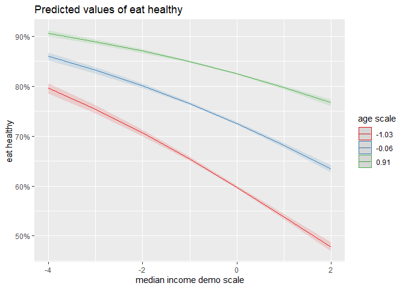

Gallup Relative Status Health Behavior Regression Analysis
================
Daniel O’Leary
1/11/2021

  - [Analysis](#analysis)
      - [Days w/ 5 servings of fruits and
        veggies](#days-w-5-servings-of-fruits-and-veggies)
          - [Effect of median income](#effect-of-median-income)
          - [Main effects model](#main-effects-model)
          - [Interactive model](#interactive-model)
          - [Model comparison](#model-comparison)
          - [Interaction plots](#interaction-plots)
      - [Eat healthy all day yesterday](#eat-healthy-all-day-yesterday)
          - [Effect of median income](#effect-of-median-income-1)
          - [Main effects model](#main-effects-model-1)
          - [Interactive model](#interactive-model-1)
          - [Model comparison](#model-comparison-1)
          - [Interaction plots](#interaction-plots-1)
      - [Smoker?](#smoker)
          - [Effect of median income](#effect-of-median-income-2)
          - [Main effects model](#main-effects-model-2)
          - [Interactive model](#interactive-model-2)
          - [Model comparison](#model-comparison-2)
          - [Interaction plots](#interaction-plots-2)

``` r
contrasts(dfg_rs$sex) <- contr.sum(2)
contrasts(dfg_rs$employment_all) <- contr.sum(2)
contrasts(dfg_rs$race) <- contr.sum(5)
contrasts(dfg_rs$married) <- contr.sum(6)
```

# Analysis

## Days w/ 5 servings of fruits and veggies

### Effect of median income

``` r
fv_terms %>% 
  filter(term == "median_income_var_scale") %>% 
  mutate(median_income_var = factor(median_income_var, labels = c("geo", "demo"))) %>% 
  mutate(id_controls = factor(id_controls, labels = c("id controls m.e.", "id controls int."))) %>% 
  filter(id_controls != "no id controls") %>% 
  mutate(year = as.factor(year)) %>% 
  ggplot(aes(year, estimate)) +
  geom_col() +
  geom_errorbar(aes(ymin = estimate - std.error, ymax = estimate + std.error), width = 0.1) +
  theme(axis.text.x = element_text(angle = 90, vjust = 0.5, hjust = 1)) +
  labs(
    y = "median income"
  ) +
  facet_grid(id_controls ~ median_income_var)
```

<!-- -->

### Main effects model

``` r
lm0 <-
  lmer(
    fruits_veggies_scale ~
      raw_income_scale +
      physicians_scale +
      unweighted_pop_county_scale +
      median_monthly_housing_cost_county_scale +
      land_area_2010_scale +
      education_scale +
      employment_all +
      sex +
      age_scale +
      race +
      married + 
      year +
      (1 + raw_income_scale|fips_code),
      REML = FALSE,
      control = lmerControl(optimizer = "bobyqa"),
    data = dfg_rs %>% filter(!is.na(median_income_demo_scale))
  )
```

    ## Warning in checkConv(attr(opt, "derivs"), opt$par, ctrl = control$checkConv, : Model is nearly unidentifiable: very large eigenvalue
    ##  - Rescale variables?

``` r
summary(lm0)
```

    ## Linear mixed model fit by maximum likelihood  ['lmerMod']
    ## Formula: fruits_veggies_scale ~ raw_income_scale + physicians_scale +  
    ##     unweighted_pop_county_scale + median_monthly_housing_cost_county_scale +  
    ##     land_area_2010_scale + education_scale + employment_all +  
    ##     sex + age_scale + race + married + year + (1 + raw_income_scale |  
    ##     fips_code)
    ##    Data: dfg_rs %>% filter(!is.na(median_income_demo_scale))
    ## Control: lmerControl(optimizer = "bobyqa")
    ## 
    ##      AIC      BIC   logLik deviance df.resid 
    ##  5705654  5706055 -2852795  5705590  2040841 
    ## 
    ## Scaled residuals: 
    ##     Min      1Q  Median      3Q     Max 
    ## -2.3011 -0.7435  0.0826  0.9526  1.8307 
    ## 
    ## Random effects:
    ##  Groups    Name             Variance  Std.Dev. Corr
    ##  fips_code (Intercept)      0.0021829 0.04672      
    ##            raw_income_scale 0.0002576 0.01605  0.47
    ##  Residual                   0.9576452 0.97859      
    ## Number of obs: 2040873, groups:  fips_code, 3131
    ## 
    ## Fixed effects:
    ##                                            Estimate Std. Error  t value
    ## (Intercept)                               0.0587321  0.0034556   16.996
    ## raw_income_scale                          0.0191980  0.0010441   18.387
    ## physicians_scale                          0.0002570  0.0013396    0.192
    ## unweighted_pop_county_scale              -0.0058745  0.0040041   -1.467
    ## median_monthly_housing_cost_county_scale  0.0059400  0.0016929    3.509
    ## land_area_2010_scale                      0.0030497  0.0014128    2.159
    ## education_scale                           0.0209055  0.0007914   26.416
    ## employment_all1                           0.0108577  0.0008200   13.242
    ## sex1                                     -0.1234609  0.0007096 -173.984
    ## age_scale                                 0.1275130  0.0009286  137.313
    ## race1                                    -0.1242375  0.0017343  -71.635
    ## race2                                     0.0580535  0.0038377   15.127
    ## race3                                     0.0402317  0.0024913   16.149
    ## race4                                     0.0547707  0.0041507   13.196
    ## married1                                 -0.0339213  0.0019022  -17.833
    ## married2                                  0.0569509  0.0014865   38.311
    ## married3                                 -0.0320960  0.0042344   -7.580
    ## married4                                 -0.0598108  0.0020317  -29.439
    ## married5                                  0.0160341  0.0023799    6.737
    ## year2009                                 -0.0272368  0.0027080  -10.058
    ## year2010                                 -0.0054615  0.0027110   -2.015
    ## year2011                                 -0.0215667  0.0026920   -8.011
    ## year2012                                  0.0262796  0.0026634    9.867
    ## year2013                                  0.0272541  0.0032547    8.374
    ## year2014                                  0.0191425  0.0032746    5.846
    ## year2015                                  0.0096981  0.0032752    2.961
    ## year2016                                  0.0038774  0.0032470    1.194
    ## year2017                                  0.0067346  0.0033492    2.011

    ## 
    ## Correlation matrix not shown by default, as p = 28 > 12.
    ## Use print(x, correlation=TRUE)  or
    ##     vcov(x)        if you need it

    ## convergence code: 0
    ## Model is nearly unidentifiable: very large eigenvalue
    ##  - Rescale variables?

``` r
lm1 <-
  lmer(
    fruits_veggies_scale ~
      raw_income_scale +
      median_income_demo_scale +
      physicians_scale +
      unweighted_pop_county_scale +
      median_monthly_housing_cost_county_scale +
      land_area_2010_scale +
      education_scale +
      employment_all +
      sex +
      age_scale +
      race +
      married + 
      year +
      (1 + raw_income_scale|fips_code) +
      (1 + median_income_demo_scale|fips_code),
      REML = FALSE,
      control = lmerControl(optimizer = "bobyqa"),
    data = dfg_rs 
  )
```

    ## boundary (singular) fit: see ?isSingular

``` r
summary(lm1)
```

    ## Linear mixed model fit by maximum likelihood  ['lmerMod']
    ## Formula: fruits_veggies_scale ~ raw_income_scale + median_income_demo_scale +  
    ##     physicians_scale + unweighted_pop_county_scale + median_monthly_housing_cost_county_scale +  
    ##     land_area_2010_scale + education_scale + employment_all +  
    ##     sex + age_scale + race + married + year + (1 + raw_income_scale |  
    ##     fips_code) + (1 + median_income_demo_scale | fips_code)
    ##    Data: dfg_rs
    ## Control: lmerControl(optimizer = "bobyqa")
    ## 
    ##      AIC      BIC   logLik deviance df.resid 
    ##  5704365  5704816 -2852146  5704293  2040837 
    ## 
    ## Scaled residuals: 
    ##      Min       1Q   Median       3Q      Max 
    ## -2.38098 -0.74411  0.08141  0.95335  1.87628 
    ## 
    ## Random effects:
    ##  Groups      Name                     Variance  Std.Dev. Corr
    ##  fips_code   (Intercept)              0.0000000 0.00000      
    ##              raw_income_scale         0.0001397 0.01182   NaN
    ##  fips_code.1 (Intercept)              0.0021434 0.04630      
    ##              median_income_demo_scale 0.0003567 0.01889  0.39
    ##  Residual                             0.9568833 0.97820      
    ## Number of obs: 2040873, groups:  fips_code, 3131
    ## 
    ## Fixed effects:
    ##                                            Estimate Std. Error  t value
    ## (Intercept)                               0.0454829  0.0034743   13.091
    ## raw_income_scale                          0.0218561  0.0009894   22.089
    ## median_income_demo_scale                 -0.0586802  0.0017445  -33.638
    ## physicians_scale                          0.0004832  0.0013412    0.360
    ## unweighted_pop_county_scale              -0.0106993  0.0040695   -2.629
    ## median_monthly_housing_cost_county_scale  0.0045269  0.0016885    2.681
    ## land_area_2010_scale                      0.0032804  0.0014145    2.319
    ## education_scale                           0.0631542  0.0014619   43.200
    ## employment_all1                           0.0067938  0.0008286    8.199
    ## sex1                                     -0.1116741  0.0007886 -141.618
    ## age_scale                                 0.1265668  0.0009288  136.265
    ## race1                                    -0.1237048  0.0017355  -71.279
    ## race2                                     0.0587958  0.0038372   15.322
    ## race3                                     0.0432389  0.0024956   17.326
    ## race4                                     0.0508354  0.0041536   12.239
    ## married1                                 -0.0413129  0.0019137  -21.589
    ## married2                                  0.0623545  0.0014938   41.743
    ## married3                                 -0.0259021  0.0042369   -6.114
    ## married4                                 -0.0534114  0.0020397  -26.186
    ## married5                                  0.0062405  0.0023959    2.605
    ## year2009                                 -0.0309065  0.0027091  -11.408
    ## year2010                                 -0.0063960  0.0027102   -2.360
    ## year2011                                 -0.0239509  0.0026923   -8.896
    ## year2012                                  0.0308519  0.0026653   11.575
    ## year2013                                  0.0310483  0.0032552    9.538
    ## year2014                                  0.0228327  0.0032753    6.971
    ## year2015                                  0.0283876  0.0033175    8.557
    ## year2016                                  0.0342981  0.0033623   10.201
    ## year2017                                  0.0352235  0.0034471   10.218

    ## 
    ## Correlation matrix not shown by default, as p = 29 > 12.
    ## Use print(x, correlation=TRUE)  or
    ##     vcov(x)        if you need it

    ## convergence code: 0
    ## boundary (singular) fit: see ?isSingular

### Interactive model

``` r
lm2 <-
  lmer(
    fruits_veggies_scale ~
      median_income_demo_scale * raw_income_scale +
      median_income_demo_scale * education_scale +
      median_income_demo_scale * employment_all +
      median_income_demo_scale * sex +
      median_income_demo_scale * age_scale +
      median_income_demo_scale * race +
      median_income_demo_scale * married +
      median_income_demo_scale * year +
      physicians_scale +
      unweighted_pop_county_scale +
      median_monthly_housing_cost_county_scale +
      land_area_2010_scale +
      education_scale +
      employment_all +
      sex +
      age_scale +
      race +
      married +
      year +
      (1 + raw_income_scale|fips_code) +
      (1 + median_income_demo_scale|fips_code),
      REML = FALSE,
      control = lmerControl(optimizer = "bobyqa"),
    data = dfg_rs
  )
```

    ## Warning in checkConv(attr(opt, "derivs"), opt$par, ctrl = control$checkConv, :
    ## Model failed to converge with max|grad| = 0.00576256 (tol = 0.002, component 1)

    ## Warning in checkConv(attr(opt, "derivs"), opt$par, ctrl = control$checkConv, : Model is nearly unidentifiable: very large eigenvalue
    ##  - Rescale variables?

``` r
summary(lm2)
```

    ## Linear mixed model fit by maximum likelihood  ['lmerMod']
    ## Formula: fruits_veggies_scale ~ median_income_demo_scale * raw_income_scale +  
    ##     median_income_demo_scale * education_scale + median_income_demo_scale *  
    ##     employment_all + median_income_demo_scale * sex + median_income_demo_scale *  
    ##     age_scale + median_income_demo_scale * race + median_income_demo_scale *  
    ##     married + median_income_demo_scale * year + physicians_scale +  
    ##     unweighted_pop_county_scale + median_monthly_housing_cost_county_scale +  
    ##     land_area_2010_scale + education_scale + employment_all +  
    ##     sex + age_scale + race + married + year + (1 + raw_income_scale |  
    ##     fips_code) + (1 + median_income_demo_scale | fips_code)
    ##    Data: dfg_rs
    ## Control: lmerControl(optimizer = "bobyqa")
    ## 
    ##      AIC      BIC   logLik deviance df.resid 
    ##  5702926  5703666 -2851404  5702808  2040814 
    ## 
    ## Scaled residuals: 
    ##      Min       1Q   Median       3Q      Max 
    ## -2.32873 -0.74265  0.08184  0.95073  1.86858 
    ## 
    ## Random effects:
    ##  Groups      Name                     Variance  Std.Dev. Corr
    ##  fips_code   (Intercept)              0.0003880 0.01970      
    ##              raw_income_scale         0.0001630 0.01277  0.84
    ##  fips_code.1 (Intercept)              0.0017614 0.04197      
    ##              median_income_demo_scale 0.0001652 0.01285  0.41
    ##  Residual                             0.9562941 0.97790      
    ## Number of obs: 2040873, groups:  fips_code, 3131
    ## 
    ## Fixed effects:
    ##                                             Estimate Std. Error  t value
    ## (Intercept)                                0.0472324  0.0035592   13.271
    ## median_income_demo_scale                  -0.0482904  0.0031540  -15.311
    ## raw_income_scale                           0.0222159  0.0010057   22.089
    ## education_scale                            0.0678899  0.0015174   44.740
    ## employment_all1                            0.0065601  0.0008329    7.876
    ## sex1                                      -0.1100831  0.0007965 -138.204
    ## age_scale                                  0.1254844  0.0009758  128.595
    ## race1                                     -0.1258980  0.0018003  -69.931
    ## race2                                      0.0599000  0.0038953   15.377
    ## race3                                      0.0418471  0.0025476   16.426
    ## race4                                      0.0365545  0.0044683    8.181
    ## married1                                  -0.0455976  0.0019545  -23.330
    ## married2                                   0.0629408  0.0015278   41.196
    ## married3                                  -0.0216273  0.0043799   -4.938
    ## married4                                  -0.0548000  0.0020735  -26.429
    ## married5                                   0.0016707  0.0027517    0.607
    ## year2009                                  -0.0318410  0.0027316  -11.657
    ## year2010                                  -0.0053574  0.0027237   -1.967
    ## year2011                                  -0.0223144  0.0027168   -8.213
    ## year2012                                   0.0323462  0.0026723   12.104
    ## year2013                                   0.0324674  0.0032607    9.957
    ## year2014                                   0.0250180  0.0032889    7.607
    ## year2015                                   0.0309143  0.0033555    9.213
    ## year2016                                   0.0349872  0.0035269    9.920
    ## year2017                                   0.0292315  0.0035547    8.223
    ## physicians_scale                           0.0006601  0.0013337    0.495
    ## unweighted_pop_county_scale               -0.0089476  0.0039677   -2.255
    ## median_monthly_housing_cost_county_scale   0.0056908  0.0016814    3.384
    ## land_area_2010_scale                       0.0033966  0.0014046    2.418
    ## median_income_demo_scale:raw_income_scale -0.0085059  0.0009387   -9.062
    ## median_income_demo_scale:education_scale   0.0089232  0.0008970    9.948
    ## median_income_demo_scale:employment_all1   0.0018326  0.0008899    2.059
    ## median_income_demo_scale:sex1             -0.0081269  0.0007740  -10.499
    ## median_income_demo_scale:age_scale         0.0017176  0.0009931    1.730
    ## median_income_demo_scale:race1            -0.0363544  0.0017615  -20.638
    ## median_income_demo_scale:race2             0.0127978  0.0039287    3.258
    ## median_income_demo_scale:race3            -0.0048360  0.0025098   -1.927
    ## median_income_demo_scale:race4            -0.0002918  0.0043527   -0.067
    ## median_income_demo_scale:married1         -0.0116635  0.0019810   -5.888
    ## median_income_demo_scale:married2         -0.0065132  0.0015333   -4.248
    ## median_income_demo_scale:married3         -0.0003769  0.0041627   -0.091
    ## median_income_demo_scale:married4          0.0061593  0.0021654    2.844
    ## median_income_demo_scale:married5         -0.0118215  0.0025986   -4.549
    ## median_income_demo_scale:year2009          0.0058480  0.0028913    2.023
    ## median_income_demo_scale:year2010          0.0165050  0.0028872    5.717
    ## median_income_demo_scale:year2011          0.0200444  0.0028826    6.954
    ## median_income_demo_scale:year2012          0.0200901  0.0028738    6.991
    ## median_income_demo_scale:year2013          0.0210248  0.0034562    6.083
    ## median_income_demo_scale:year2014          0.0240028  0.0035151    6.828
    ## median_income_demo_scale:year2015          0.0262071  0.0033810    7.751
    ## median_income_demo_scale:year2016          0.0272084  0.0033171    8.202
    ## median_income_demo_scale:year2017          0.0435807  0.0032082   13.584

    ## 
    ## Correlation matrix not shown by default, as p = 52 > 12.
    ## Use print(x, correlation=TRUE)  or
    ##     vcov(x)        if you need it

    ## convergence code: 0
    ## Model failed to converge with max|grad| = 0.00576256 (tol = 0.002, component 1)
    ## Model is nearly unidentifiable: very large eigenvalue
    ##  - Rescale variables?

### Model comparison

``` r
# anova(lm0, lm1, lm2)
```

### Interaction plots

``` r
plot_model(lm2, type = "pred", terms = c("median_income_demo_scale", "education_scale"))
```

<!-- -->

``` r
plot_model(lm2, type = "pred", terms = c("median_income_demo_scale", "raw_income_scale"))
```

<!-- -->

``` r
plot_model(lm2, type = "pred", terms = c("median_income_demo_scale", "age_scale"))
```

<!-- -->

``` r
plot_model(lm2, type = "pred", terms = c("median_income_demo_scale", "sex"))
```

<!-- -->

## Eat healthy all day yesterday

### Effect of median income

``` r
eh_terms %>% 
  filter(term == "median_income_var_scale") %>% 
  mutate(median_income_var = factor(median_income_var, labels = c("geo", "demo"))) %>% 
  mutate(id_controls = factor(id_controls, labels = c("id controls m.e.", "id controls int."))) %>% 
  filter(id_controls != "no id controls") %>% 
  mutate(year = as.factor(year)) %>% 
  ggplot(aes(year, estimate)) +
  geom_col() +
  geom_errorbar(aes(ymin = estimate - std.error, ymax = estimate + std.error), width = 0.1) +
  theme(axis.text.x = element_text(angle = 90, vjust = 0.5, hjust = 1)) +
  labs(
    y = "median income"
  ) +
  facet_grid(id_controls ~ median_income_var)
```

<!-- -->

### Main effects model

``` r
lm0 <-
  glm(
    eat_healthy ~
      raw_income_scale +
      #median_income_demo_scale +
      physicians_scale +
      unweighted_pop_county_scale +
      median_monthly_housing_cost_county_scale +
      land_area_2010_scale +
      education_scale +
      employment_all +
      sex +
      age_scale +
      race +
      married +
      year,
    family = "binomial",
    data = dfg_rs  %>% filter(!is.na(median_income_demo_scale))
  )

lm1 <-
  glm(
    eat_healthy ~
      raw_income_scale +
      median_income_demo_scale +
      physicians_scale +
      unweighted_pop_county_scale +
      median_monthly_housing_cost_county_scale +
      land_area_2010_scale +
      education_scale +
      employment_all +
      sex +
      age_scale +
      race +
      married +
      year,
    family = "binomial",
    data = dfg_rs  %>% filter(!is.na(median_income_demo_scale))
  )

summary(lm1)
```

    ## 
    ## Call:
    ## glm(formula = eat_healthy ~ raw_income_scale + median_income_demo_scale + 
    ##     physicians_scale + unweighted_pop_county_scale + median_monthly_housing_cost_county_scale + 
    ##     land_area_2010_scale + education_scale + employment_all + 
    ##     sex + age_scale + race + married + year, family = "binomial", 
    ##     data = dfg_rs %>% filter(!is.na(median_income_demo_scale)))
    ## 
    ## Deviance Residuals: 
    ##     Min       1Q   Median       3Q      Max  
    ## -2.4879  -1.2319   0.6791   0.9017   1.7608  
    ## 
    ## Coefficients:
    ##                                           Estimate Std. Error z value Pr(>|z|)
    ## (Intercept)                               0.984573   0.006013 163.731  < 2e-16
    ## raw_income_scale                         -0.007349   0.001940  -3.788 0.000152
    ## median_income_demo_scale                 -0.171997   0.003700 -46.491  < 2e-16
    ## physicians_scale                          0.021468   0.001744  12.312  < 2e-16
    ## unweighted_pop_county_scale              -0.003635   0.001800  -2.019 0.043489
    ## median_monthly_housing_cost_county_scale  0.055515   0.001841  30.159  < 2e-16
    ## land_area_2010_scale                      0.011078   0.001662   6.665 2.65e-11
    ## education_scale                           0.154783   0.003369  45.948  < 2e-16
    ## employment_all1                           0.102303   0.001876  54.535  < 2e-16
    ## sex1                                      0.084852   0.001780  47.663  < 2e-16
    ## age_scale                                 0.578221   0.002139 270.374  < 2e-16
    ## race1                                    -0.212391   0.003811 -55.738  < 2e-16
    ## race2                                    -0.052562   0.008535  -6.159 7.33e-10
    ## race3                                    -0.257223   0.005335 -48.216  < 2e-16
    ## race4                                     0.237230   0.009278  25.569  < 2e-16
    ## married1                                  0.041471   0.004193   9.892  < 2e-16
    ## married2                                  0.098580   0.003339  29.527  < 2e-16
    ## married3                                 -0.096286   0.009192 -10.475  < 2e-16
    ## married4                                 -0.124672   0.004538 -27.472  < 2e-16
    ## married5                                 -0.023478   0.005883  -3.991 6.58e-05
    ## year2009                                 -0.041770   0.006137  -6.807 9.98e-12
    ## year2010                                  0.045838   0.006174   7.424 1.14e-13
    ## year2011                                  0.002443   0.006101   0.400 0.688811
    ## year2012                                  0.046565   0.006033   7.718 1.18e-14
    ## year2013                                 -0.077270   0.007243 -10.668  < 2e-16
    ## year2014                                 -0.088977   0.007303 -12.184  < 2e-16
    ## year2015                                 -0.071525   0.007374  -9.699  < 2e-16
    ## year2016                                 -0.053424   0.007463  -7.158 8.16e-13
    ## year2017                                 -0.049273   0.007652  -6.439 1.20e-10
    ##                                             
    ## (Intercept)                              ***
    ## raw_income_scale                         ***
    ## median_income_demo_scale                 ***
    ## physicians_scale                         ***
    ## unweighted_pop_county_scale              *  
    ## median_monthly_housing_cost_county_scale ***
    ## land_area_2010_scale                     ***
    ## education_scale                          ***
    ## employment_all1                          ***
    ## sex1                                     ***
    ## age_scale                                ***
    ## race1                                    ***
    ## race2                                    ***
    ## race3                                    ***
    ## race4                                    ***
    ## married1                                 ***
    ## married2                                 ***
    ## married3                                 ***
    ## married4                                 ***
    ## married5                                 ***
    ## year2009                                 ***
    ## year2010                                 ***
    ## year2011                                    
    ## year2012                                 ***
    ## year2013                                 ***
    ## year2014                                 ***
    ## year2015                                 ***
    ## year2016                                 ***
    ## year2017                                 ***
    ## ---
    ## Signif. codes:  0 '***' 0.001 '**' 0.01 '*' 0.05 '.' 0.1 ' ' 1
    ## 
    ## (Dispersion parameter for binomial family taken to be 1)
    ## 
    ##     Null deviance: 2577149  on 2055434  degrees of freedom
    ## Residual deviance: 2430454  on 2055406  degrees of freedom
    ##   (1379082 observations deleted due to missingness)
    ## AIC: 2430512
    ## 
    ## Number of Fisher Scoring iterations: 4

### Interactive model

``` r
lm2 <-
  glm(
    eat_healthy ~
      median_income_demo_scale * raw_income_scale +
      median_income_demo_scale * education_scale +
      median_income_demo_scale * employment_all +
      median_income_demo_scale * sex +
      median_income_demo_scale * age_scale +
      median_income_demo_scale * race +
      median_income_demo_scale * married +
      median_income_demo_scale * year +
      physicians_scale +
      unweighted_pop_county_scale +
      median_monthly_housing_cost_county_scale +
      land_area_2010_scale +
      education_scale +
      employment_all +
      sex +
      age_scale +
      race +
      married,
    family = "binomial",
    data = dfg_rs
  )

summary(lm2)
```

    ## 
    ## Call:
    ## glm(formula = eat_healthy ~ median_income_demo_scale * raw_income_scale + 
    ##     median_income_demo_scale * education_scale + median_income_demo_scale * 
    ##     employment_all + median_income_demo_scale * sex + median_income_demo_scale * 
    ##     age_scale + median_income_demo_scale * race + median_income_demo_scale * 
    ##     married + median_income_demo_scale * year + physicians_scale + 
    ##     unweighted_pop_county_scale + median_monthly_housing_cost_county_scale + 
    ##     land_area_2010_scale + education_scale + employment_all + 
    ##     sex + age_scale + race + married, family = "binomial", data = dfg_rs)
    ## 
    ## Deviance Residuals: 
    ##     Min       1Q   Median       3Q      Max  
    ## -2.5462  -1.2252   0.6756   0.8991   1.7757  
    ## 
    ## Coefficients:
    ##                                            Estimate Std. Error z value Pr(>|z|)
    ## (Intercept)                                0.955565   0.006311 151.418  < 2e-16
    ## median_income_demo_scale                  -0.177767   0.007119 -24.971  < 2e-16
    ## raw_income_scale                          -0.007708   0.001963  -3.927 8.59e-05
    ## education_scale                            0.166160   0.003473  47.844  < 2e-16
    ## employment_all1                            0.103583   0.001897  54.594  < 2e-16
    ## sex1                                       0.085173   0.001808  47.117  < 2e-16
    ## age_scale                                  0.594624   0.002233 266.274  < 2e-16
    ## race1                                     -0.191859   0.003937 -48.738  < 2e-16
    ## race2                                     -0.034817   0.008659  -4.021 5.80e-05
    ## race3                                     -0.234648   0.005446 -43.088  < 2e-16
    ## race4                                      0.238776   0.009883  24.160  < 2e-16
    ## married1                                   0.036999   0.004292   8.621  < 2e-16
    ## married2                                   0.100592   0.003419  29.422  < 2e-16
    ## married3                                  -0.098270   0.009486 -10.359  < 2e-16
    ## married4                                  -0.120648   0.004616 -26.138  < 2e-16
    ## married5                                  -0.008549   0.006660  -1.284  0.19928
    ## year2009                                  -0.047412   0.006163  -7.693 1.44e-14
    ## year2010                                   0.038398   0.006189   6.205 5.49e-10
    ## year2011                                  -0.010330   0.006140  -1.682  0.09249
    ## year2012                                   0.035460   0.006048   5.863 4.54e-09
    ## year2013                                  -0.087909   0.007254 -12.118  < 2e-16
    ## year2014                                  -0.099373   0.007326 -13.564  < 2e-16
    ## year2015                                  -0.077841   0.007507 -10.369  < 2e-16
    ## year2016                                  -0.063998   0.007927  -8.074 6.83e-16
    ## year2017                                  -0.080106   0.007941 -10.087  < 2e-16
    ## physicians_scale                           0.020991   0.001747  12.017  < 2e-16
    ## unweighted_pop_county_scale               -0.003953   0.001806  -2.189  0.02861
    ## median_monthly_housing_cost_county_scale   0.054106   0.001844  29.340  < 2e-16
    ## land_area_2010_scale                       0.010503   0.001664   6.311 2.77e-10
    ## median_income_demo_scale:raw_income_scale -0.001246   0.002102  -0.593  0.55333
    ## median_income_demo_scale:education_scale   0.041455   0.002039  20.330  < 2e-16
    ## median_income_demo_scale:employment_all1   0.019338   0.002037   9.495  < 2e-16
    ## median_income_demo_scale:sex1             -0.039626   0.001762 -22.494  < 2e-16
    ## median_income_demo_scale:age_scale         0.032038   0.002303  13.910  < 2e-16
    ## median_income_demo_scale:race1             0.017182   0.003906   4.398 1.09e-05
    ## median_income_demo_scale:race2             0.013054   0.008796   1.484  0.13781
    ## median_income_demo_scale:race3             0.037389   0.005472   6.833 8.34e-12
    ## median_income_demo_scale:race4             0.090660   0.009748   9.300  < 2e-16
    ## median_income_demo_scale:married1         -0.028550   0.004383  -6.514 7.32e-11
    ## median_income_demo_scale:married2         -0.007596   0.003464  -2.193  0.02832
    ## median_income_demo_scale:married3          0.016834   0.009125   1.845  0.06506
    ## median_income_demo_scale:married4          0.074664   0.004846  15.407  < 2e-16
    ## median_income_demo_scale:married5         -0.038455   0.006366  -6.041 1.54e-09
    ## median_income_demo_scale:year2009          0.007984   0.006696   1.193  0.23306
    ## median_income_demo_scale:year2010          0.011949   0.006735   1.774  0.07603
    ## median_income_demo_scale:year2011          0.011875   0.006632   1.790  0.07338
    ## median_income_demo_scale:year2012          0.002290   0.006655   0.344  0.73077
    ## median_income_demo_scale:year2013          0.021818   0.007835   2.785  0.00536
    ## median_income_demo_scale:year2014          0.018799   0.007982   2.355  0.01851
    ## median_income_demo_scale:year2015          0.010719   0.007748   1.383  0.16652
    ## median_income_demo_scale:year2016          0.019348   0.007567   2.557  0.01056
    ## median_income_demo_scale:year2017          0.082137   0.007323  11.216  < 2e-16
    ##                                              
    ## (Intercept)                               ***
    ## median_income_demo_scale                  ***
    ## raw_income_scale                          ***
    ## education_scale                           ***
    ## employment_all1                           ***
    ## sex1                                      ***
    ## age_scale                                 ***
    ## race1                                     ***
    ## race2                                     ***
    ## race3                                     ***
    ## race4                                     ***
    ## married1                                  ***
    ## married2                                  ***
    ## married3                                  ***
    ## married4                                  ***
    ## married5                                     
    ## year2009                                  ***
    ## year2010                                  ***
    ## year2011                                  .  
    ## year2012                                  ***
    ## year2013                                  ***
    ## year2014                                  ***
    ## year2015                                  ***
    ## year2016                                  ***
    ## year2017                                  ***
    ## physicians_scale                          ***
    ## unweighted_pop_county_scale               *  
    ## median_monthly_housing_cost_county_scale  ***
    ## land_area_2010_scale                      ***
    ## median_income_demo_scale:raw_income_scale    
    ## median_income_demo_scale:education_scale  ***
    ## median_income_demo_scale:employment_all1  ***
    ## median_income_demo_scale:sex1             ***
    ## median_income_demo_scale:age_scale        ***
    ## median_income_demo_scale:race1            ***
    ## median_income_demo_scale:race2               
    ## median_income_demo_scale:race3            ***
    ## median_income_demo_scale:race4            ***
    ## median_income_demo_scale:married1         ***
    ## median_income_demo_scale:married2         *  
    ## median_income_demo_scale:married3         .  
    ## median_income_demo_scale:married4         ***
    ## median_income_demo_scale:married5         ***
    ## median_income_demo_scale:year2009            
    ## median_income_demo_scale:year2010         .  
    ## median_income_demo_scale:year2011         .  
    ## median_income_demo_scale:year2012            
    ## median_income_demo_scale:year2013         ** 
    ## median_income_demo_scale:year2014         *  
    ## median_income_demo_scale:year2015            
    ## median_income_demo_scale:year2016         *  
    ## median_income_demo_scale:year2017         ***
    ## ---
    ## Signif. codes:  0 '***' 0.001 '**' 0.01 '*' 0.05 '.' 0.1 ' ' 1
    ## 
    ## (Dispersion parameter for binomial family taken to be 1)
    ## 
    ##     Null deviance: 2577149  on 2055434  degrees of freedom
    ## Residual deviance: 2426934  on 2055383  degrees of freedom
    ##   (1474835 observations deleted due to missingness)
    ## AIC: 2427038
    ## 
    ## Number of Fisher Scoring iterations: 4

### Model comparison

``` r
anova(lm0, lm1, lm2,  test = "Chisq")
```

    ## Analysis of Deviance Table
    ## 
    ## Model 1: eat_healthy ~ raw_income_scale + physicians_scale + unweighted_pop_county_scale + 
    ##     median_monthly_housing_cost_county_scale + land_area_2010_scale + 
    ##     education_scale + employment_all + sex + age_scale + race + 
    ##     married + year
    ## Model 2: eat_healthy ~ raw_income_scale + median_income_demo_scale + physicians_scale + 
    ##     unweighted_pop_county_scale + median_monthly_housing_cost_county_scale + 
    ##     land_area_2010_scale + education_scale + employment_all + 
    ##     sex + age_scale + race + married + year
    ## Model 3: eat_healthy ~ median_income_demo_scale * raw_income_scale + median_income_demo_scale * 
    ##     education_scale + median_income_demo_scale * employment_all + 
    ##     median_income_demo_scale * sex + median_income_demo_scale * 
    ##     age_scale + median_income_demo_scale * race + median_income_demo_scale * 
    ##     married + median_income_demo_scale * year + physicians_scale + 
    ##     unweighted_pop_county_scale + median_monthly_housing_cost_county_scale + 
    ##     land_area_2010_scale + education_scale + employment_all + 
    ##     sex + age_scale + race + married
    ##   Resid. Df Resid. Dev Df Deviance  Pr(>Chi)    
    ## 1   2055407    2432624                          
    ## 2   2055406    2430454  1   2170.3 < 2.2e-16 ***
    ## 3   2055383    2426934 23   3520.0 < 2.2e-16 ***
    ## ---
    ## Signif. codes:  0 '***' 0.001 '**' 0.01 '*' 0.05 '.' 0.1 ' ' 1

### Interaction plots

``` r
plot_model(lm2, type = "pred", terms = c("median_income_demo_scale", "education_scale"))
```

    ## Data were 'prettified'. Consider using `terms="median_income_demo_scale [all]"` to get smooth plots.

<!-- -->

``` r
plot_model(lm2, type = "pred", terms = c("median_income_demo_scale", "raw_income_scale"))
```

    ## Data were 'prettified'. Consider using `terms="median_income_demo_scale [all]"` to get smooth plots.

<!-- -->

``` r
plot_model(lm2, type = "pred", terms = c("median_income_demo_scale", "age_scale"))
```

    ## Data were 'prettified'. Consider using `terms="median_income_demo_scale [all]"` to get smooth plots.

<!-- -->

``` r
plot_model(lm2, type = "pred", terms = c("median_income_demo_scale", "sex"))
```

    ## Data were 'prettified'. Consider using `terms="median_income_demo_scale [all]"` to get smooth plots.

<!-- -->

## Smoker?

### Effect of median income

``` r
smoke_terms %>% 
  filter(term == "median_income_var_scale") %>% 
  mutate(median_income_var = factor(median_income_var, labels = c("geo", "demo"))) %>% 
  mutate(id_controls = factor(id_controls, labels = c("id controls m.e.", "id controls int."))) %>% 
  filter(id_controls != "no id controls") %>% 
  mutate(year = as.factor(year)) %>% 
  ggplot(aes(year, estimate)) +
  geom_col() +
  geom_errorbar(aes(ymin = estimate - std.error, ymax = estimate + std.error), width = 0.1) +
  theme(axis.text.x = element_text(angle = 90, vjust = 0.5, hjust = 1)) +
  labs(
    y = "median income"
  ) +
  facet_grid(id_controls ~ median_income_var)
```

<!-- -->

### Main effects model

``` r
lm0 <-
  glm(
    smoke ~
      raw_income_scale +
      #median_income_demo_scale +
      physicians_scale +
      unweighted_pop_county_scale +
      median_monthly_housing_cost_county_scale +
      land_area_2010_scale +
      education_scale +
      employment_all +
      sex +
      age_scale +
      race +
      married +
      year,
    family = "binomial",
    data = dfg_rs  %>% filter(!is.na(median_income_demo_scale))
  )


lm1 <-
  glm(
    smoke ~
      raw_income_scale +
      median_income_demo_scale +
      physicians_scale +
      unweighted_pop_county_scale +
      median_monthly_housing_cost_county_scale +
      land_area_2010_scale +
      education_scale +
      employment_all +
      sex +
      age_scale +
      race +
      married +
      year,
    family = "binomial",
    data = dfg_rs  
  )

summary(lm1)
```

    ## 
    ## Call:
    ## glm(formula = smoke ~ raw_income_scale + median_income_demo_scale + 
    ##     physicians_scale + unweighted_pop_county_scale + median_monthly_housing_cost_county_scale + 
    ##     land_area_2010_scale + education_scale + employment_all + 
    ##     sex + age_scale + race + married + year, family = "binomial", 
    ##     data = dfg_rs)
    ## 
    ## Deviance Residuals: 
    ##     Min       1Q   Median       3Q      Max  
    ## -1.7584  -0.6356  -0.4709  -0.3273   3.0822  
    ## 
    ## Coefficients:
    ##                                           Estimate Std. Error  z value Pr(>|z|)
    ## (Intercept)                              -1.544021   0.007502 -205.806  < 2e-16
    ## raw_income_scale                         -0.274637   0.002556 -107.428  < 2e-16
    ## median_income_demo_scale                  0.326859   0.004657   70.191  < 2e-16
    ## physicians_scale                         -0.030819   0.002239  -13.766  < 2e-16
    ## unweighted_pop_county_scale              -0.014579   0.002423   -6.016 1.78e-09
    ## median_monthly_housing_cost_county_scale -0.085124   0.002421  -35.157  < 2e-16
    ## land_area_2010_scale                     -0.009627   0.002079   -4.630 3.66e-06
    ## education_scale                          -0.671181   0.004235 -158.501  < 2e-16
    ## employment_all1                           0.060511   0.002303   26.278  < 2e-16
    ## sex1                                      0.092712   0.002262   40.988  < 2e-16
    ## age_scale                                -0.394554   0.002635 -149.742  < 2e-16
    ## race1                                     0.204591   0.004966   41.195  < 2e-16
    ## race2                                     0.358039   0.009845   36.367  < 2e-16
    ## race3                                     0.164008   0.006629   24.739  < 2e-16
    ## race4                                    -0.224018   0.013488  -16.608  < 2e-16
    ## married1                                 -0.156461   0.004879  -32.071  < 2e-16
    ## married2                                 -0.483095   0.003976 -121.495  < 2e-16
    ## married3                                  0.342735   0.009734   35.209  < 2e-16
    ## married4                                  0.271846   0.004994   54.435  < 2e-16
    ## married5                                 -0.251413   0.006858  -36.659  < 2e-16
    ## year2009                                  0.017509   0.007542    2.322   0.0202
    ## year2010                                 -0.010184   0.007561   -1.347   0.1780
    ## year2011                                 -0.063822   0.007555   -8.448  < 2e-16
    ## year2012                                 -0.095132   0.007484  -12.712  < 2e-16
    ## year2013                                 -0.094883   0.009101  -10.425  < 2e-16
    ## year2014                                 -0.141833   0.009220  -15.383  < 2e-16
    ## year2015                                 -0.281346   0.009447  -29.781  < 2e-16
    ## year2016                                 -0.339487   0.009598  -35.370  < 2e-16
    ## year2017                                 -0.343166   0.009957  -34.464  < 2e-16
    ##                                             
    ## (Intercept)                              ***
    ## raw_income_scale                         ***
    ## median_income_demo_scale                 ***
    ## physicians_scale                         ***
    ## unweighted_pop_county_scale              ***
    ## median_monthly_housing_cost_county_scale ***
    ## land_area_2010_scale                     ***
    ## education_scale                          ***
    ## employment_all1                          ***
    ## sex1                                     ***
    ## age_scale                                ***
    ## race1                                    ***
    ## race2                                    ***
    ## race3                                    ***
    ## race4                                    ***
    ## married1                                 ***
    ## married2                                 ***
    ## married3                                 ***
    ## married4                                 ***
    ## married5                                 ***
    ## year2009                                 *  
    ## year2010                                    
    ## year2011                                 ***
    ## year2012                                 ***
    ## year2013                                 ***
    ## year2014                                 ***
    ## year2015                                 ***
    ## year2016                                 ***
    ## year2017                                 ***
    ## ---
    ## Signif. codes:  0 '***' 0.001 '**' 0.01 '*' 0.05 '.' 0.1 ' ' 1
    ## 
    ## (Dispersion parameter for binomial family taken to be 1)
    ## 
    ##     Null deviance: 1873565  on 2058301  degrees of freedom
    ## Residual deviance: 1698348  on 2058273  degrees of freedom
    ##   (1471968 observations deleted due to missingness)
    ## AIC: 1698406
    ## 
    ## Number of Fisher Scoring iterations: 5

### Interactive model

``` r
lm2 <-
  glm(
    smoke ~
      median_income_demo_scale * raw_income_scale +
      median_income_demo_scale * education_scale +
      median_income_demo_scale * employment_all +
      median_income_demo_scale * sex +
      median_income_demo_scale * age_scale +
      median_income_demo_scale * race +
      median_income_demo_scale * married +
      median_income_demo_scale * year +
      physicians_scale +
      unweighted_pop_county_scale +
      median_monthly_housing_cost_county_scale +
      land_area_2010_scale +
      education_scale +
      employment_all +
      sex +
      age_scale +
      race +
      married,
    family = "binomial",
    data = dfg_rs
  )

summary(lm2)
```

    ## 
    ## Call:
    ## glm(formula = smoke ~ median_income_demo_scale * raw_income_scale + 
    ##     median_income_demo_scale * education_scale + median_income_demo_scale * 
    ##     employment_all + median_income_demo_scale * sex + median_income_demo_scale * 
    ##     age_scale + median_income_demo_scale * race + median_income_demo_scale * 
    ##     married + median_income_demo_scale * year + physicians_scale + 
    ##     unweighted_pop_county_scale + median_monthly_housing_cost_county_scale + 
    ##     land_area_2010_scale + education_scale + employment_all + 
    ##     sex + age_scale + race + married, family = "binomial", data = dfg_rs)
    ## 
    ## Deviance Residuals: 
    ##     Min       1Q   Median       3Q      Max  
    ## -1.8742  -0.6327  -0.4626  -0.3170   3.1793  
    ## 
    ## Coefficients:
    ##                                             Estimate Std. Error  z value
    ## (Intercept)                               -1.337e+00  7.941e-03 -168.387
    ## median_income_demo_scale                   5.752e-01  8.966e-03   64.146
    ## raw_income_scale                          -2.620e-01  2.577e-03 -101.671
    ## education_scale                           -7.266e-01  4.347e-03 -167.156
    ## employment_all1                            6.719e-02  2.391e-03   28.097
    ## sex1                                       7.910e-02  2.355e-03   33.588
    ## age_scale                                 -3.119e-01  2.979e-03 -104.699
    ## race1                                      1.361e-01  5.090e-03   26.746
    ## race2                                      3.315e-01  1.024e-02   32.368
    ## race3                                      1.170e-01  6.967e-03   16.796
    ## race4                                     -2.303e-01  1.356e-02  -16.983
    ## married1                                  -1.865e-01  5.119e-03  -36.439
    ## married2                                  -5.276e-01  4.157e-03 -126.907
    ## married3                                   3.047e-01  1.055e-02   28.886
    ## married4                                   2.168e-01  5.187e-03   41.809
    ## married5                                  -6.129e-02  7.849e-03   -7.809
    ## year2009                                   5.818e-03  7.983e-03    0.729
    ## year2010                                  -2.862e-02  7.952e-03   -3.600
    ## year2011                                  -7.960e-02  8.020e-03   -9.926
    ## year2012                                  -1.150e-01  7.751e-03  -14.838
    ## year2013                                  -1.269e-01  9.482e-03  -13.385
    ## year2014                                  -1.835e-01  9.783e-03  -18.761
    ## year2015                                  -3.251e-01  9.637e-03  -33.736
    ## year2016                                  -3.896e-01  9.816e-03  -39.691
    ## year2017                                  -3.634e-01  1.011e-02  -35.926
    ## physicians_scale                          -2.430e-02  2.248e-03  -10.808
    ## unweighted_pop_county_scale               -1.047e-02  2.426e-03   -4.314
    ## median_monthly_housing_cost_county_scale  -8.228e-02  2.431e-03  -33.852
    ## land_area_2010_scale                      -1.388e-02  2.104e-03   -6.598
    ## median_income_demo_scale:raw_income_scale -9.803e-05  2.789e-03   -0.035
    ## median_income_demo_scale:education_scale  -7.756e-02  2.531e-03  -30.650
    ## median_income_demo_scale:employment_all1   4.168e-02  2.527e-03   16.495
    ## median_income_demo_scale:sex1              1.185e-03  2.278e-03    0.520
    ## median_income_demo_scale:age_scale         1.741e-01  2.982e-03   58.390
    ## median_income_demo_scale:race1            -1.789e-01  5.113e-03  -34.992
    ## median_income_demo_scale:race2             1.360e-03  1.032e-02    0.132
    ## median_income_demo_scale:race3            -1.105e-01  7.018e-03  -15.744
    ## median_income_demo_scale:race4             8.401e-02  1.390e-02    6.045
    ## median_income_demo_scale:married1          8.116e-02  5.227e-03   15.528
    ## median_income_demo_scale:married2         -1.216e-01  4.228e-03  -28.766
    ## median_income_demo_scale:married3         -6.315e-02  1.009e-02   -6.258
    ## median_income_demo_scale:married4         -6.969e-02  5.470e-03  -12.739
    ## median_income_demo_scale:married5          1.269e-01  7.479e-03   16.973
    ## median_income_demo_scale:year2009         -1.127e-02  8.452e-03   -1.334
    ## median_income_demo_scale:year2010         -2.530e-02  8.430e-03   -3.002
    ## median_income_demo_scale:year2011          1.445e-02  8.387e-03    1.724
    ## median_income_demo_scale:year2012          1.783e-02  8.431e-03    2.114
    ## median_income_demo_scale:year2013         -3.649e-02  1.011e-02   -3.608
    ## median_income_demo_scale:year2014         -4.948e-02  1.047e-02   -4.724
    ## median_income_demo_scale:year2015         -6.688e-02  1.034e-02   -6.466
    ## median_income_demo_scale:year2016         -3.606e-03  1.012e-02   -0.356
    ## median_income_demo_scale:year2017         -2.178e-01  9.548e-03  -22.815
    ##                                           Pr(>|z|)    
    ## (Intercept)                                < 2e-16 ***
    ## median_income_demo_scale                   < 2e-16 ***
    ## raw_income_scale                           < 2e-16 ***
    ## education_scale                            < 2e-16 ***
    ## employment_all1                            < 2e-16 ***
    ## sex1                                       < 2e-16 ***
    ## age_scale                                  < 2e-16 ***
    ## race1                                      < 2e-16 ***
    ## race2                                      < 2e-16 ***
    ## race3                                      < 2e-16 ***
    ## race4                                      < 2e-16 ***
    ## married1                                   < 2e-16 ***
    ## married2                                   < 2e-16 ***
    ## married3                                   < 2e-16 ***
    ## married4                                   < 2e-16 ***
    ## married5                                  5.75e-15 ***
    ## year2009                                  0.466145    
    ## year2010                                  0.000319 ***
    ## year2011                                   < 2e-16 ***
    ## year2012                                   < 2e-16 ***
    ## year2013                                   < 2e-16 ***
    ## year2014                                   < 2e-16 ***
    ## year2015                                   < 2e-16 ***
    ## year2016                                   < 2e-16 ***
    ## year2017                                   < 2e-16 ***
    ## physicians_scale                           < 2e-16 ***
    ## unweighted_pop_county_scale               1.60e-05 ***
    ## median_monthly_housing_cost_county_scale   < 2e-16 ***
    ## land_area_2010_scale                      4.17e-11 ***
    ## median_income_demo_scale:raw_income_scale 0.971959    
    ## median_income_demo_scale:education_scale   < 2e-16 ***
    ## median_income_demo_scale:employment_all1   < 2e-16 ***
    ## median_income_demo_scale:sex1             0.602863    
    ## median_income_demo_scale:age_scale         < 2e-16 ***
    ## median_income_demo_scale:race1             < 2e-16 ***
    ## median_income_demo_scale:race2            0.895112    
    ## median_income_demo_scale:race3             < 2e-16 ***
    ## median_income_demo_scale:race4            1.50e-09 ***
    ## median_income_demo_scale:married1          < 2e-16 ***
    ## median_income_demo_scale:married2          < 2e-16 ***
    ## median_income_demo_scale:married3         3.89e-10 ***
    ## median_income_demo_scale:married4          < 2e-16 ***
    ## median_income_demo_scale:married5          < 2e-16 ***
    ## median_income_demo_scale:year2009         0.182281    
    ## median_income_demo_scale:year2010         0.002686 ** 
    ## median_income_demo_scale:year2011         0.084784 .  
    ## median_income_demo_scale:year2012         0.034476 *  
    ## median_income_demo_scale:year2013         0.000309 ***
    ## median_income_demo_scale:year2014         2.32e-06 ***
    ## median_income_demo_scale:year2015         1.00e-10 ***
    ## median_income_demo_scale:year2016         0.721591    
    ## median_income_demo_scale:year2017          < 2e-16 ***
    ## ---
    ## Signif. codes:  0 '***' 0.001 '**' 0.01 '*' 0.05 '.' 0.1 ' ' 1
    ## 
    ## (Dispersion parameter for binomial family taken to be 1)
    ## 
    ##     Null deviance: 1873565  on 2058301  degrees of freedom
    ## Residual deviance: 1685507  on 2058250  degrees of freedom
    ##   (1471968 observations deleted due to missingness)
    ## AIC: 1685611
    ## 
    ## Number of Fisher Scoring iterations: 5

### Model comparison

``` r
anova(lm0, lm1, lm2, test = "Chisq")
```

    ## Analysis of Deviance Table
    ## 
    ## Model 1: smoke ~ raw_income_scale + physicians_scale + unweighted_pop_county_scale + 
    ##     median_monthly_housing_cost_county_scale + land_area_2010_scale + 
    ##     education_scale + employment_all + sex + age_scale + race + 
    ##     married + year
    ## Model 2: smoke ~ raw_income_scale + median_income_demo_scale + physicians_scale + 
    ##     unweighted_pop_county_scale + median_monthly_housing_cost_county_scale + 
    ##     land_area_2010_scale + education_scale + employment_all + 
    ##     sex + age_scale + race + married + year
    ## Model 3: smoke ~ median_income_demo_scale * raw_income_scale + median_income_demo_scale * 
    ##     education_scale + median_income_demo_scale * employment_all + 
    ##     median_income_demo_scale * sex + median_income_demo_scale * 
    ##     age_scale + median_income_demo_scale * race + median_income_demo_scale * 
    ##     married + median_income_demo_scale * year + physicians_scale + 
    ##     unweighted_pop_county_scale + median_monthly_housing_cost_county_scale + 
    ##     land_area_2010_scale + education_scale + employment_all + 
    ##     sex + age_scale + race + married
    ##   Resid. Df Resid. Dev Df Deviance  Pr(>Chi)    
    ## 1   2058274    1703353                          
    ## 2   2058273    1698348  1   5005.3 < 2.2e-16 ***
    ## 3   2058250    1685507 23  12840.9 < 2.2e-16 ***
    ## ---
    ## Signif. codes:  0 '***' 0.001 '**' 0.01 '*' 0.05 '.' 0.1 ' ' 1

### Interaction plots

``` r
plot_model(lm2, type = "pred", terms = c("median_income_demo_scale", "education_scale"))
```

    ## Data were 'prettified'. Consider using `terms="median_income_demo_scale [all]"` to get smooth plots.

<!-- -->

``` r
plot_model(lm2, type = "pred", terms = c("median_income_demo_scale", "raw_income_scale"))
```

    ## Data were 'prettified'. Consider using `terms="median_income_demo_scale [all]"` to get smooth plots.

<!-- -->

``` r
plot_model(lm2, type = "pred", terms = c("median_income_demo_scale", "age_scale"))
```

    ## Data were 'prettified'. Consider using `terms="median_income_demo_scale [all]"` to get smooth plots.

<!-- -->

``` r
plot_model(lm2, type = "pred", terms = c("median_income_demo_scale", "sex"))
```

    ## Data were 'prettified'. Consider using `terms="median_income_demo_scale [all]"` to get smooth plots.

<!-- -->
