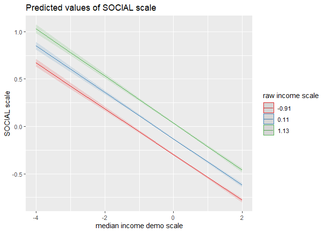

Gallup Relative Status Mechanism Regression Analysis
================
Daniel O’Leary
1/11/2021

  - [Analysis](#analysis)
      - [Purpose](#purpose)
          - [Effect of median income across the
            years](#effect-of-median-income-across-the-years)
          - [Demographic median income - all
            years](#demographic-median-income---all-years)
              - [No median income model](#no-median-income-model)
              - [Main effects model](#main-effects-model)
              - [Interactive model](#interactive-model)
                  - [Interaction plots](#interaction-plots)
          - [Geographic median income - all
            years](#geographic-median-income---all-years)
              - [No median income model](#no-median-income-model-1)
              - [Main effects model](#main-effects-model-1)
              - [Interactive model](#interactive-model-1)
      - [Financial](#financial)
          - [Effect of median income across the
            years](#effect-of-median-income-across-the-years-1)
          - [Demographic median income - all
            years](#demographic-median-income---all-years-1)
              - [No median income model](#no-median-income-model-2)
              - [Main effects model](#main-effects-model-2)
              - [Interactive model](#interactive-model-2)
                  - [Interaction plots](#interaction-plots-1)
          - [Geographic median income - all
            years](#geographic-median-income---all-years-1)
              - [No median income model](#no-median-income-model-3)
              - [Main effects model](#main-effects-model-3)
              - [Interactive model](#interactive-model-3)
      - [Community](#community)
          - [Effect of median income across the
            years](#effect-of-median-income-across-the-years-2)
          - [Demographic median income - all
            years](#demographic-median-income---all-years-2)
              - [No median income model](#no-median-income-model-4)
              - [Main effects model](#main-effects-model-4)
              - [Interactive model](#interactive-model-4)
                  - [Interaction plots](#interaction-plots-2)
          - [Geographic median income - all
            years](#geographic-median-income---all-years-2)
              - [No median income model](#no-median-income-model-5)
              - [Main effects model](#main-effects-model-5)
              - [Interactive model](#interactive-model-5)
      - [Social](#social)
          - [Effect of median income across the
            years](#effect-of-median-income-across-the-years-3)
          - [Demographic median income - all
            years](#demographic-median-income---all-years-3)
              - [No median income model](#no-median-income-model-6)
              - [Main effects model](#main-effects-model-6)
              - [Interactive model](#interactive-model-6)
                  - [Interaction plots](#interaction-plots-3)
          - [Geographic median income - all
            years](#geographic-median-income---all-years-3)
              - [No median income model](#no-median-income-model-7)
              - [Main effects model](#main-effects-model-7)
              - [Interactive model](#interactive-model-7)

``` r
contrasts(dfg_rs$sex) <- contr.sum(2)
contrasts(dfg_rs$employment_all) <- contr.sum(2)
contrasts(dfg_rs$race) <- contr.sum(5)
contrasts(dfg_rs$married) <- contr.sum(6)
```

# Analysis

## Purpose

### Effect of median income across the years

``` r
pur_terms %>% 
  filter(term == "median_income_var_scale") %>% 
  mutate(median_income_var = factor(median_income_var, labels = c("geo", "demo"))) %>% 
  mutate(id_controls = factor(id_controls, labels = c("id controls m.e.", "id controls int."))) %>% 
  filter(id_controls != "no id controls") %>% 
  mutate(year = as.factor(year)) %>% 
  ggplot(aes(year, estimate)) +
  geom_col() +
  geom_errorbar(aes(ymin = estimate - std.error, ymax = estimate + std.error), width = 0.1) +
  theme(axis.text.x = element_text(angle = 90, vjust = 0.5, hjust = 1)) +
  labs(
    y = "median income"
  ) +
  facet_grid(id_controls ~ median_income_var)
```

<!-- -->

### Demographic median income - all years

#### No median income model

``` r
lm1 <-
  lmer(
    PURPOSE_scale ~
      raw_income_scale +
      physicians_scale +
      unweighted_pop_county_scale +
      median_monthly_housing_cost_county_scale +
      land_area_2010_scale +
      education_scale +
      employment_all +
      sex +
      age_scale +
      race +
      married + 
      year +
      (1 + raw_income_scale | fips_code),
    REML = FALSE,
    control = lmerControl(optimizer = "bobyqa"),
    data = dfg_rs 
  )

summary(lm1)
```

    ## Linear mixed model fit by maximum likelihood  ['lmerMod']
    ## Formula: 
    ## PURPOSE_scale ~ raw_income_scale + physicians_scale + unweighted_pop_county_scale +  
    ##     median_monthly_housing_cost_county_scale + land_area_2010_scale +  
    ##     education_scale + employment_all + sex + age_scale + race +  
    ##     married + year + (1 + raw_income_scale | fips_code)
    ##    Data: dfg_rs
    ## Control: lmerControl(optimizer = "bobyqa")
    ## 
    ##       AIC       BIC    logLik  deviance  df.resid 
    ## 1568129.3 1568421.8 -784038.7 1568077.3    565988 
    ## 
    ## Scaled residuals: 
    ##     Min      1Q  Median      3Q     Max 
    ## -3.8393 -0.6082  0.1321  0.7608  2.2840 
    ## 
    ## Random effects:
    ##  Groups    Name             Variance Std.Dev. Corr 
    ##  fips_code (Intercept)      0.002842 0.05331       
    ##            raw_income_scale 0.002035 0.04511  -0.48
    ##  Residual                   0.932007 0.96540       
    ## Number of obs: 566014, groups:  fips_code, 3028
    ## 
    ## Fixed effects:
    ##                                            Estimate Std. Error t value
    ## (Intercept)                              -1.584e-02  4.854e-03  -3.264
    ## raw_income_scale                          2.007e-01  2.162e-03  92.808
    ## physicians_scale                         -6.769e-05  2.311e-03  -0.029
    ## unweighted_pop_county_scale              -2.660e-02  5.028e-03  -5.291
    ## median_monthly_housing_cost_county_scale -4.268e-02  2.516e-03 -16.962
    ## land_area_2010_scale                      9.701e-03  2.334e-03   4.156
    ## education_scale                           2.292e-03  1.470e-03   1.560
    ## employment_all1                           6.762e-02  1.551e-03  43.595
    ## sex1                                     -7.620e-02  1.330e-03 -57.300
    ## age_scale                                 9.457e-02  1.711e-03  55.278
    ## race1                                    -1.169e-01  3.291e-03 -35.507
    ## race2                                    -3.188e-02  8.479e-03  -3.759
    ## race3                                    -1.602e-02  4.481e-03  -3.575
    ## race4                                    -2.283e-02  7.163e-03  -3.187
    ## married1                                  2.666e-02  3.456e-03   7.713
    ## married2                                  1.335e-01  2.759e-03  48.387
    ## married3                                 -2.053e-01  7.845e-03 -26.168
    ## married4                                 -1.419e-01  3.836e-03 -36.990
    ## married5                                  1.128e-01  4.514e-03  24.996
    ## year2015                                  1.062e-02  3.638e-03   2.921
    ## year2016                                  1.813e-02  3.618e-03   5.010
    ## year2017                                 -4.846e-02  3.707e-03 -13.073

    ## 
    ## Correlation matrix not shown by default, as p = 22 > 12.
    ## Use print(x, correlation=TRUE)  or
    ##     vcov(x)        if you need it

#### Main effects model

``` r
lm1 <-
  lmer(
    PURPOSE_scale ~
      raw_income_scale +
      median_income_demo_scale +
      physicians_scale +
      unweighted_pop_county_scale +
      median_monthly_housing_cost_county_scale +
      land_area_2010_scale +
      education_scale +
      employment_all +
      sex +
      age_scale +
      race +
      married + 
      year +
      (1 + median_income_demo_scale | fips_code) +
      (1 + raw_income_scale | fips_code),
    REML = FALSE,
    control = lmerControl(optimizer = "bobyqa"),
    data = dfg_rs 
  )
```

    ## boundary (singular) fit: see ?isSingular

``` r
summary(lm1)
```

    ## Linear mixed model fit by maximum likelihood  ['lmerMod']
    ## Formula: PURPOSE_scale ~ raw_income_scale + median_income_demo_scale +  
    ##     physicians_scale + unweighted_pop_county_scale + median_monthly_housing_cost_county_scale +  
    ##     land_area_2010_scale + education_scale + employment_all +  
    ##     sex + age_scale + race + married + year + (1 + median_income_demo_scale |  
    ##     fips_code) + (1 + raw_income_scale | fips_code)
    ##    Data: dfg_rs
    ## Control: lmerControl(optimizer = "bobyqa")
    ## 
    ##       AIC       BIC    logLik  deviance  df.resid 
    ## 1561507.3 1561844.7 -780723.7 1561447.3    565022 
    ## 
    ## Scaled residuals: 
    ##     Min      1Q  Median      3Q     Max 
    ## -3.8017 -0.6082  0.1302  0.7579  2.4115 
    ## 
    ## Random effects:
    ##  Groups      Name                     Variance  Std.Dev. Corr 
    ##  fips_code   (Intercept)              0.0022983 0.04794       
    ##              median_income_demo_scale 0.0006202 0.02490  -0.08
    ##  fips_code.1 (Intercept)              0.0000000 0.00000       
    ##              raw_income_scale         0.0014501 0.03808   NaN 
    ##  Residual                             0.9254416 0.96200       
    ## Number of obs: 565052, groups:  fips_code, 3028
    ## 
    ## Fixed effects:
    ##                                            Estimate Std. Error t value
    ## (Intercept)                              -0.0290465  0.0048318  -6.011
    ## raw_income_scale                          0.2051717  0.0020743  98.912
    ## median_income_demo_scale                 -0.1612389  0.0028181 -57.216
    ## physicians_scale                         -0.0001679  0.0022926  -0.073
    ## unweighted_pop_county_scale              -0.0192232  0.0051000  -3.769
    ## median_monthly_housing_cost_county_scale -0.0371027  0.0025287 -14.672
    ## land_area_2010_scale                      0.0096952  0.0023047   4.207
    ## education_scale                           0.1318455  0.0025378  51.952
    ## employment_all1                           0.0556062  0.0015582  35.686
    ## sex1                                     -0.0385019  0.0014586 -26.396
    ## age_scale                                 0.0905072  0.0017084  52.977
    ## race1                                    -0.1145505  0.0032792 -34.932
    ## race2                                    -0.0279616  0.0084475  -3.310
    ## race3                                    -0.0054940  0.0044610  -1.232
    ## race4                                    -0.0266244  0.0071466  -3.725
    ## married1                                  0.0064367  0.0034616   1.859
    ## married2                                  0.1483003  0.0027626  53.682
    ## married3                                 -0.1897441  0.0078256 -24.247
    ## married4                                 -0.1235599  0.0038371 -32.201
    ## married5                                  0.0896305  0.0045219  19.821
    ## year2015                                  0.0557868  0.0036963  15.093
    ## year2016                                  0.0981257  0.0038277  25.635
    ## year2017                                  0.0254511  0.0038880   6.546

    ## 
    ## Correlation matrix not shown by default, as p = 23 > 12.
    ## Use print(x, correlation=TRUE)  or
    ##     vcov(x)        if you need it

    ## convergence code: 0
    ## boundary (singular) fit: see ?isSingular

#### Interactive model

``` r
lm1 <-
  lmer(
    PURPOSE_scale ~
      median_income_demo_scale * raw_income_scale +
      median_income_demo_scale * education_scale +
      median_income_demo_scale * employment_all +
      median_income_demo_scale * sex +
      median_income_demo_scale * age_scale +
      median_income_demo_scale * race +
      median_income_demo_scale * married +
      median_income_demo_scale * year +
      physicians_scale +
      unweighted_pop_county_scale +
      median_monthly_housing_cost_county_scale +
      land_area_2010_scale +
      education_scale +
      employment_all +
      sex +
      age_scale +
      race +
      married +
      year +
      (1 + median_income_demo_scale | fips_code) +
      (1 + raw_income_scale | fips_code),
    REML = FALSE,
    control = lmerControl(optimizer = "bobyqa"),
    data = dfg_rs 
  )

summary(lm1)
```

    ## Linear mixed model fit by maximum likelihood  ['lmerMod']
    ## Formula: PURPOSE_scale ~ median_income_demo_scale * raw_income_scale +  
    ##     median_income_demo_scale * education_scale + median_income_demo_scale *  
    ##     employment_all + median_income_demo_scale * sex + median_income_demo_scale *  
    ##     age_scale + median_income_demo_scale * race + median_income_demo_scale *  
    ##     married + median_income_demo_scale * year + physicians_scale +  
    ##     unweighted_pop_county_scale + median_monthly_housing_cost_county_scale +  
    ##     land_area_2010_scale + education_scale + employment_all +  
    ##     sex + age_scale + race + married + year + (1 + median_income_demo_scale |  
    ##     fips_code) + (1 + raw_income_scale | fips_code)
    ##    Data: dfg_rs
    ## Control: lmerControl(optimizer = "bobyqa")
    ## 
    ##       AIC       BIC    logLik  deviance  df.resid 
    ## 1560379.4 1560907.9 -780142.7 1560285.4    565005 
    ## 
    ## Scaled residuals: 
    ##     Min      1Q  Median      3Q     Max 
    ## -3.8334 -0.6081  0.1300  0.7584  2.4107 
    ## 
    ## Random effects:
    ##  Groups      Name                     Variance  Std.Dev. Corr 
    ##  fips_code   (Intercept)              0.0002511 0.01585       
    ##              median_income_demo_scale 0.0005308 0.02304  0.30 
    ##  fips_code.1 (Intercept)              0.0022448 0.04738       
    ##              raw_income_scale         0.0016746 0.04092  -0.52
    ##  Residual                             0.9234447 0.96096       
    ## Number of obs: 565052, groups:  fips_code, 3028
    ## 
    ## Fixed effects:
    ##                                            Estimate Std. Error t value
    ## (Intercept)                               -0.044414   0.005065  -8.769
    ## median_income_demo_scale                  -0.193355   0.005086 -38.019
    ## raw_income_scale                           0.201849   0.002140  94.338
    ## education_scale                            0.141825   0.002612  54.300
    ## employment_all1                            0.052272   0.001579  33.104
    ## sex1                                      -0.035072   0.001517 -23.115
    ## age_scale                                  0.094684   0.001738  54.492
    ## race1                                     -0.114111   0.003540 -32.233
    ## race2                                     -0.027951   0.008543  -3.272
    ## race3                                     -0.007740   0.004642  -1.667
    ## race4                                     -0.010620   0.008560  -1.241
    ## married1                                   0.012839   0.003521   3.647
    ## married2                                   0.149307   0.002822  52.905
    ## married3                                  -0.188231   0.007848 -23.985
    ## married4                                  -0.129186   0.003909 -33.049
    ## married5                                   0.084810   0.004720  17.970
    ## year2015                                   0.061961   0.003733  16.600
    ## year2016                                   0.109220   0.003954  27.622
    ## year2017                                   0.012755   0.003939   3.238
    ## physicians_scale                          -0.001139   0.002275  -0.501
    ## unweighted_pop_county_scale               -0.023523   0.004780  -4.921
    ## median_monthly_housing_cost_county_scale  -0.043063   0.002464 -17.477
    ## land_area_2010_scale                       0.009242   0.002283   4.048
    ## median_income_demo_scale:raw_income_scale  0.013515   0.001671   8.089
    ## median_income_demo_scale:education_scale   0.005962   0.001570   3.797
    ## median_income_demo_scale:employment_all1   0.017358   0.001585  10.951
    ## median_income_demo_scale:sex1             -0.005009   0.001353  -3.702
    ## median_income_demo_scale:age_scale        -0.007588   0.001727  -4.394
    ## median_income_demo_scale:race1             0.012117   0.003183   3.806
    ## median_income_demo_scale:race2             0.025480   0.008064   3.160
    ## median_income_demo_scale:race3             0.016024   0.004290   3.735
    ## median_income_demo_scale:race4            -0.017789   0.007351  -2.420
    ## median_income_demo_scale:married1         -0.035447   0.003378 -10.492
    ## median_income_demo_scale:married2         -0.005628   0.002647  -2.126
    ## median_income_demo_scale:married3          0.017119   0.006980   2.453
    ## median_income_demo_scale:married4          0.041275   0.003796  10.874
    ## median_income_demo_scale:married5         -0.006561   0.004588  -1.430
    ## median_income_demo_scale:year2015          0.011952   0.003836   3.116
    ## median_income_demo_scale:year2016          0.008986   0.003809   2.359
    ## median_income_demo_scale:year2017          0.067653   0.003754  18.022

    ## 
    ## Correlation matrix not shown by default, as p = 40 > 12.
    ## Use print(x, correlation=TRUE)  or
    ##     vcov(x)        if you need it

##### Interaction plots

``` r
plot_model(lm1, type = "pred", terms = c("median_income_demo_scale", "education_scale"))
```

<!-- -->

``` r
plot_model(lm1, type = "pred", terms = c("median_income_demo_scale", "raw_income_scale"))
```

<!-- -->

``` r
plot_model(lm1, type = "pred", terms = c("median_income_demo_scale", "age_scale"))
```

<!-- -->

``` r
plot_model(lm1, type = "pred", terms = c("median_income_demo_scale", "sex"))
```

<!-- -->

### Geographic median income - all years

#### No median income model

``` r
lm1 <-
  lmer(
    PURPOSE_scale ~
      raw_income_scale +
      physicians_scale +
      unweighted_pop_county_scale +
      median_monthly_housing_cost_county_scale +
      land_area_2010_scale +
      education_scale +
      employment_all +
      sex +
      age_scale +
      race +
      married + 
      year +
      (1 + raw_income_scale | fips_code),
    REML = FALSE,
    control = lmerControl(optimizer = "bobyqa"),
    data = dfg_rs 
  )

summary(lm1)
```

    ## Linear mixed model fit by maximum likelihood  ['lmerMod']
    ## Formula: 
    ## PURPOSE_scale ~ raw_income_scale + physicians_scale + unweighted_pop_county_scale +  
    ##     median_monthly_housing_cost_county_scale + land_area_2010_scale +  
    ##     education_scale + employment_all + sex + age_scale + race +  
    ##     married + year + (1 + raw_income_scale | fips_code)
    ##    Data: dfg_rs
    ## Control: lmerControl(optimizer = "bobyqa")
    ## 
    ##       AIC       BIC    logLik  deviance  df.resid 
    ## 1568129.3 1568421.8 -784038.7 1568077.3    565988 
    ## 
    ## Scaled residuals: 
    ##     Min      1Q  Median      3Q     Max 
    ## -3.8393 -0.6082  0.1321  0.7608  2.2840 
    ## 
    ## Random effects:
    ##  Groups    Name             Variance Std.Dev. Corr 
    ##  fips_code (Intercept)      0.002842 0.05331       
    ##            raw_income_scale 0.002035 0.04511  -0.48
    ##  Residual                   0.932007 0.96540       
    ## Number of obs: 566014, groups:  fips_code, 3028
    ## 
    ## Fixed effects:
    ##                                            Estimate Std. Error t value
    ## (Intercept)                              -1.584e-02  4.854e-03  -3.264
    ## raw_income_scale                          2.007e-01  2.162e-03  92.808
    ## physicians_scale                         -6.769e-05  2.311e-03  -0.029
    ## unweighted_pop_county_scale              -2.660e-02  5.028e-03  -5.291
    ## median_monthly_housing_cost_county_scale -4.268e-02  2.516e-03 -16.962
    ## land_area_2010_scale                      9.701e-03  2.334e-03   4.156
    ## education_scale                           2.292e-03  1.470e-03   1.560
    ## employment_all1                           6.762e-02  1.551e-03  43.595
    ## sex1                                     -7.620e-02  1.330e-03 -57.300
    ## age_scale                                 9.457e-02  1.711e-03  55.278
    ## race1                                    -1.169e-01  3.291e-03 -35.507
    ## race2                                    -3.188e-02  8.479e-03  -3.759
    ## race3                                    -1.602e-02  4.481e-03  -3.575
    ## race4                                    -2.283e-02  7.163e-03  -3.187
    ## married1                                  2.666e-02  3.456e-03   7.713
    ## married2                                  1.335e-01  2.759e-03  48.387
    ## married3                                 -2.053e-01  7.845e-03 -26.168
    ## married4                                 -1.419e-01  3.836e-03 -36.990
    ## married5                                  1.128e-01  4.514e-03  24.996
    ## year2015                                  1.062e-02  3.638e-03   2.921
    ## year2016                                  1.813e-02  3.618e-03   5.010
    ## year2017                                 -4.846e-02  3.707e-03 -13.073

    ## 
    ## Correlation matrix not shown by default, as p = 22 > 12.
    ## Use print(x, correlation=TRUE)  or
    ##     vcov(x)        if you need it

#### Main effects model

``` r
lm1 <-
  lmer(
    PURPOSE_scale ~
      raw_income_scale +
      median_income_county_scale +
      physicians_scale +
      unweighted_pop_county_scale +
      median_monthly_housing_cost_county_scale +
      land_area_2010_scale +
      education_scale +
      employment_all +
      sex +
      age_scale +
      race +
      married + 
      year +
      (1 + median_income_county_scale | fips_code) +
      (1 + raw_income_scale | fips_code),
    REML = FALSE,
    control = lmerControl(optimizer = "bobyqa"),
    data = dfg_rs 
  )
```

    ## boundary (singular) fit: see ?isSingular

``` r
summary(lm1)
```

    ## Linear mixed model fit by maximum likelihood  ['lmerMod']
    ## Formula: PURPOSE_scale ~ raw_income_scale + median_income_county_scale +  
    ##     physicians_scale + unweighted_pop_county_scale + median_monthly_housing_cost_county_scale +  
    ##     land_area_2010_scale + education_scale + employment_all +  
    ##     sex + age_scale + race + married + year + (1 + median_income_county_scale |  
    ##     fips_code) + (1 + raw_income_scale | fips_code)
    ##    Data: dfg_rs
    ## Control: lmerControl(optimizer = "bobyqa")
    ## 
    ##       AIC       BIC    logLik  deviance  df.resid 
    ## 1568135.9 1568473.3 -784037.9 1568075.9    565984 
    ## 
    ## Scaled residuals: 
    ##     Min      1Q  Median      3Q     Max 
    ## -3.8391 -0.6082  0.1320  0.7608  2.2839 
    ## 
    ## Random effects:
    ##  Groups      Name                       Variance  Std.Dev. Corr 
    ##  fips_code   (Intercept)                0.000e+00 0.000000      
    ##              median_income_county_scale 7.516e-05 0.008669  NaN 
    ##  fips_code.1 (Intercept)                2.767e-03 0.052599      
    ##              raw_income_scale           2.036e-03 0.045119 -0.49
    ##  Residual                               9.320e-01 0.965404      
    ## Number of obs: 566014, groups:  fips_code, 3028
    ## 
    ## Fixed effects:
    ##                                            Estimate Std. Error t value
    ## (Intercept)                              -0.0157824  0.0048509  -3.254
    ## raw_income_scale                          0.2006078  0.0021625  92.767
    ## median_income_county_scale                0.0045475  0.0045918   0.990
    ## physicians_scale                          0.0001024  0.0023146   0.044
    ## unweighted_pop_county_scale              -0.0249117  0.0051443  -4.843
    ## median_monthly_housing_cost_county_scale -0.0475128  0.0052787  -9.001
    ## land_area_2010_scale                      0.0096908  0.0023256   4.167
    ## education_scale                           0.0023191  0.0014703   1.577
    ## employment_all1                           0.0676540  0.0015514  43.609
    ## sex1                                     -0.0761932  0.0013298 -57.297
    ## age_scale                                 0.0945888  0.0017109  55.288
    ## race1                                    -0.1170274  0.0032963 -35.502
    ## race2                                    -0.0319318  0.0084795  -3.766
    ## race3                                    -0.0158261  0.0044851  -3.529
    ## race4                                    -0.0228988  0.0071641  -3.196
    ## married1                                  0.0266732  0.0034565   7.717
    ## married2                                  0.1334530  0.0027599  48.354
    ## married3                                 -0.2052191  0.0078447 -26.160
    ## married4                                 -0.1418976  0.0038359 -36.992
    ## married5                                  0.1127876  0.0045145  24.983
    ## year2015                                  0.0103412  0.0036478   2.835
    ## year2016                                  0.0175047  0.0036738   4.765
    ## year2017                                 -0.0494119  0.0038422 -12.860

    ## 
    ## Correlation matrix not shown by default, as p = 23 > 12.
    ## Use print(x, correlation=TRUE)  or
    ##     vcov(x)        if you need it

    ## convergence code: 0
    ## boundary (singular) fit: see ?isSingular

#### Interactive model

``` r
lm1 <-
  lmer(
    PURPOSE_scale ~
      median_income_county_scale * raw_income_scale +
      median_income_county_scale * education_scale +
      median_income_county_scale * employment_all +
      median_income_county_scale * sex +
      median_income_county_scale * age_scale +
      median_income_county_scale * race +
      median_income_county_scale * married +
      median_income_county_scale * year +
      physicians_scale +
      unweighted_pop_county_scale +
      median_monthly_housing_cost_county_scale +
      land_area_2010_scale +
      education_scale +
      employment_all +
      sex +
      age_scale +
      race +
      married +
      year +
      (1 + median_income_county_scale | fips_code) +
      (1 + raw_income_scale | fips_code),
    REML = FALSE,
    control = lmerControl(optimizer = "bobyqa"),
    data = dfg_rs 
  )

summary(lm1)
```

    ## Linear mixed model fit by maximum likelihood  ['lmerMod']
    ## Formula: PURPOSE_scale ~ median_income_county_scale * raw_income_scale +  
    ##     median_income_county_scale * education_scale + median_income_county_scale *  
    ##     employment_all + median_income_county_scale * sex + median_income_county_scale *  
    ##     age_scale + median_income_county_scale * race + median_income_county_scale *  
    ##     married + median_income_county_scale * year + physicians_scale +  
    ##     unweighted_pop_county_scale + median_monthly_housing_cost_county_scale +  
    ##     land_area_2010_scale + education_scale + employment_all +  
    ##     sex + age_scale + race + married + year + (1 + median_income_county_scale |  
    ##     fips_code) + (1 + raw_income_scale | fips_code)
    ##    Data: dfg_rs
    ## Control: lmerControl(optimizer = "bobyqa")
    ## 
    ##       AIC       BIC    logLik  deviance  df.resid 
    ## 1567676.7 1568205.3 -783791.4 1567582.7    565967 
    ## 
    ## Scaled residuals: 
    ##     Min      1Q  Median      3Q     Max 
    ## -3.8941 -0.6091  0.1321  0.7601  2.3328 
    ## 
    ## Random effects:
    ##  Groups      Name                       Variance  Std.Dev. Corr 
    ##  fips_code   (Intercept)                0.0009070 0.03012       
    ##              median_income_county_scale 0.0002802 0.01674  -0.46
    ##  fips_code.1 (Intercept)                0.0016827 0.04102       
    ##              raw_income_scale           0.0012811 0.03579  -0.58
    ##  Residual                               0.9314945 0.96514       
    ## Number of obs: 566014, groups:  fips_code, 3028
    ## 
    ## Fixed effects:
    ##                                               Estimate Std. Error t value
    ## (Intercept)                                 -0.0076092  0.0049841  -1.527
    ## median_income_county_scale                   0.0255652  0.0061333   4.168
    ## raw_income_scale                             0.1953269  0.0020300  96.221
    ## education_scale                              0.0025107  0.0014733   1.704
    ## employment_all1                              0.0661481  0.0015568  42.491
    ## sex1                                        -0.0762746  0.0013388 -56.973
    ## age_scale                                    0.0957756  0.0017194  55.703
    ## race1                                       -0.1187568  0.0034877 -34.050
    ## race2                                       -0.0313927  0.0085589  -3.668
    ## race3                                       -0.0154450  0.0046084  -3.351
    ## race4                                       -0.0201445  0.0083743  -2.406
    ## married1                                     0.0267162  0.0034778   7.682
    ## married2                                     0.1336228  0.0027710  48.222
    ## married3                                    -0.2027564  0.0078435 -25.850
    ## married4                                    -0.1420998  0.0038378 -37.026
    ## married5                                     0.1119141  0.0045208  24.755
    ## year2015                                     0.0098907  0.0036474   2.712
    ## year2016                                     0.0164442  0.0036866   4.461
    ## year2017                                    -0.0485339  0.0038982 -12.450
    ## physicians_scale                            -0.0003321  0.0023134  -0.144
    ## unweighted_pop_county_scale                 -0.0254446  0.0050279  -5.061
    ## median_monthly_housing_cost_county_scale    -0.0479391  0.0052751  -9.088
    ## land_area_2010_scale                         0.0093465  0.0023298   4.012
    ## median_income_county_scale:raw_income_scale -0.0158511  0.0019418  -8.163
    ## median_income_county_scale:education_scale  -0.0071465  0.0014487  -4.933
    ## median_income_county_scale:employment_all1   0.0208451  0.0015040  13.860
    ## median_income_county_scale:sex1              0.0004531  0.0012754   0.355
    ## median_income_county_scale:age_scale        -0.0152342  0.0016589  -9.184
    ## median_income_county_scale:race1             0.0007618  0.0030746   0.248
    ## median_income_county_scale:race2             0.0248211  0.0083616   2.968
    ## median_income_county_scale:race3            -0.0128448  0.0042591  -3.016
    ## median_income_county_scale:race4            -0.0068208  0.0060209  -1.133
    ## median_income_county_scale:married1         -0.0183859  0.0033582  -5.475
    ## median_income_county_scale:married2         -0.0053412  0.0026723  -1.999
    ## median_income_county_scale:married3          0.0114999  0.0076416   1.505
    ## median_income_county_scale:married4          0.0130575  0.0038472   3.394
    ## median_income_county_scale:married5         -0.0085859  0.0045409  -1.891
    ## median_income_county_scale:year2015         -0.0028337  0.0036520  -0.776
    ## median_income_county_scale:year2016         -0.0036545  0.0035767  -1.022
    ## median_income_county_scale:year2017         -0.0104837  0.0036007  -2.912

    ## 
    ## Correlation matrix not shown by default, as p = 40 > 12.
    ## Use print(x, correlation=TRUE)  or
    ##     vcov(x)        if you need it

## Financial

### Effect of median income across the years

``` r
fin_terms %>% 
  filter(term == "median_income_var_scale") %>% 
  mutate(median_income_var = factor(median_income_var, labels = c("geo", "demo"))) %>% 
  mutate(id_controls = factor(id_controls, labels = c("id controls m.e.", "id controls int."))) %>% 
  filter(id_controls != "no id controls") %>% 
  mutate(year = as.factor(year)) %>% 
  ggplot(aes(year, estimate)) +
  geom_col() +
  geom_errorbar(aes(ymin = estimate - std.error, ymax = estimate + std.error), width = 0.1) +
  theme(axis.text.x = element_text(angle = 90, vjust = 0.5, hjust = 1)) +
  labs(
    y = "median income"
  ) +
  facet_grid(id_controls ~ median_income_var)
```

<!-- -->

### Demographic median income - all years

#### No median income model

``` r
lm1 <-
  lmer(
    FINANCIAL_scale ~
      raw_income_scale +
      physicians_scale +
      unweighted_pop_county_scale +
      median_monthly_housing_cost_county_scale +
      land_area_2010_scale +
      education_scale +
      employment_all +
      sex +
      age_scale +
      race +
      married + 
      year +
      (1 + raw_income_scale | fips_code),
    REML = FALSE,
    control = lmerControl(optimizer = "bobyqa"),
    data = dfg_rs 
  )
```

    ## boundary (singular) fit: see ?isSingular

``` r
summary(lm1)
```

    ## Linear mixed model fit by maximum likelihood  ['lmerMod']
    ## Formula: 
    ## FINANCIAL_scale ~ raw_income_scale + physicians_scale + unweighted_pop_county_scale +  
    ##     median_monthly_housing_cost_county_scale + land_area_2010_scale +  
    ##     education_scale + employment_all + sex + age_scale + race +  
    ##     married + year + (1 + raw_income_scale | fips_code)
    ##    Data: dfg_rs
    ## Control: lmerControl(optimizer = "bobyqa")
    ## 
    ##       AIC       BIC    logLik  deviance  df.resid 
    ## 1489270.8 1489563.2 -744609.4 1489218.8    565770 
    ## 
    ## Scaled residuals: 
    ##     Min      1Q  Median      3Q     Max 
    ## -4.0414 -0.6209  0.1344  0.7281  3.2082 
    ## 
    ## Random effects:
    ##  Groups    Name             Variance Std.Dev. Corr
    ##  fips_code (Intercept)      0.000000 0.00000      
    ##            raw_income_scale 0.001614 0.04017   NaN
    ##  Residual                   0.812986 0.90166      
    ## Number of obs: 565796, groups:  fips_code, 3028
    ## 
    ## Fixed effects:
    ##                                           Estimate Std. Error t value
    ## (Intercept)                              -0.090367   0.003934 -22.970
    ## raw_income_scale                          0.386215   0.001991 193.934
    ## physicians_scale                          0.015139   0.001560   9.703
    ## unweighted_pop_county_scale              -0.005409   0.001250  -4.326
    ## median_monthly_housing_cost_county_scale -0.030080   0.001509 -19.939
    ## land_area_2010_scale                      0.003449   0.001297   2.660
    ## education_scale                           0.003578   0.001366   2.618
    ## employment_all1                           0.102854   0.001446  71.113
    ## sex1                                      0.012235   0.001241   9.857
    ## age_scale                                 0.222148   0.001593 139.476
    ## race1                                    -0.010608   0.003024  -3.508
    ## race2                                    -0.121583   0.007877 -15.436
    ## race3                                    -0.150389   0.004091 -36.757
    ## race4                                     0.199838   0.006662  29.995
    ## married1                                  0.132268   0.003222  41.048
    ## married2                                  0.049965   0.002572  19.426
    ## married3                                 -0.306204   0.007323 -41.815
    ## married4                                 -0.112618   0.003579 -31.462
    ## married5                                  0.276416   0.004213  65.617
    ## year2015                                  0.018058   0.003394   5.321
    ## year2016                                  0.006528   0.003375   1.934
    ## year2017                                 -0.010336   0.003457  -2.990

    ## 
    ## Correlation matrix not shown by default, as p = 22 > 12.
    ## Use print(x, correlation=TRUE)  or
    ##     vcov(x)        if you need it

    ## convergence code: 0
    ## boundary (singular) fit: see ?isSingular

#### Main effects model

``` r
lm1 <-
  lmer(
    FINANCIAL_scale ~
      raw_income_scale +
      median_income_demo_scale +
      physicians_scale +
      unweighted_pop_county_scale +
      median_monthly_housing_cost_county_scale +
      land_area_2010_scale +
      education_scale +
      employment_all +
      sex +
      age_scale +
      race +
      married + 
      year +
      (1 + median_income_demo_scale | fips_code) +
      (1 + raw_income_scale | fips_code),
    REML = FALSE,
    control = lmerControl(optimizer = "bobyqa"),
    data = dfg_rs 
  )
```

    ## Warning in checkConv(attr(opt, "derivs"), opt$par, ctrl = control$checkConv, :
    ## Model failed to converge with max|grad| = 0.0136381 (tol = 0.002, component 1)

``` r
summary(lm1)
```

    ## Linear mixed model fit by maximum likelihood  ['lmerMod']
    ## Formula: FINANCIAL_scale ~ raw_income_scale + median_income_demo_scale +  
    ##     physicians_scale + unweighted_pop_county_scale + median_monthly_housing_cost_county_scale +  
    ##     land_area_2010_scale + education_scale + employment_all +  
    ##     sex + age_scale + race + married + year + (1 + median_income_demo_scale |  
    ##     fips_code) + (1 + raw_income_scale | fips_code)
    ##    Data: dfg_rs
    ## Control: lmerControl(optimizer = "bobyqa")
    ## 
    ##       AIC       BIC    logLik  deviance  df.resid 
    ## 1482130.9 1482468.2 -741035.4 1482070.9    564806 
    ## 
    ## Scaled residuals: 
    ##     Min      1Q  Median      3Q     Max 
    ## -4.0224 -0.6210  0.1303  0.7276  3.1934 
    ## 
    ## Random effects:
    ##  Groups      Name                     Variance  Std.Dev. Corr 
    ##  fips_code   (Intercept)              2.349e-05 0.004847      
    ##              median_income_demo_scale 2.571e-04 0.016033 -0.35
    ##  fips_code.1 (Intercept)              3.879e-03 0.062280      
    ##              raw_income_scale         1.942e-03 0.044070 -0.75
    ##  Residual                             8.044e-01 0.896872      
    ## Number of obs: 564836, groups:  fips_code, 3028
    ## 
    ## Fixed effects:
    ##                                           Estimate Std. Error t value
    ## (Intercept)                              -0.114915   0.004619 -24.878
    ## raw_income_scale                          0.391532   0.002036 192.333
    ## median_income_demo_scale                 -0.149973   0.002563 -58.522
    ## physicians_scale                          0.015936   0.002240   7.114
    ## unweighted_pop_county_scale              -0.023496   0.004633  -5.071
    ## median_monthly_housing_cost_county_scale -0.037291   0.002412 -15.458
    ## land_area_2010_scale                      0.005964   0.002241   2.661
    ## education_scale                           0.120696   0.002368  50.979
    ## employment_all1                           0.092762   0.001454  63.815
    ## sex1                                      0.046651   0.001360  34.296
    ## age_scale                                 0.219241   0.001594 137.530
    ## race1                                    -0.010602   0.003067  -3.456
    ## race2                                    -0.119974   0.007898 -15.190
    ## race3                                    -0.133535   0.004183 -31.926
    ## race4                                     0.190414   0.006662  28.581
    ## married1                                  0.113547   0.003230  35.154
    ## married2                                  0.061081   0.002577  23.704
    ## married3                                 -0.289648   0.007303 -39.661
    ## married4                                 -0.095752   0.003580 -26.743
    ## married5                                  0.254354   0.004220  60.276
    ## year2015                                  0.059543   0.003448  17.271
    ## year2016                                  0.080280   0.003570  22.487
    ## year2017                                  0.059441   0.003626  16.391

    ## 
    ## Correlation matrix not shown by default, as p = 23 > 12.
    ## Use print(x, correlation=TRUE)  or
    ##     vcov(x)        if you need it

    ## convergence code: 0
    ## Model failed to converge with max|grad| = 0.0136381 (tol = 0.002, component 1)

#### Interactive model

``` r
lm1 <-
  lmer(
    FINANCIAL_scale ~
      median_income_demo_scale * raw_income_scale +
      median_income_demo_scale * education_scale +
      median_income_demo_scale * employment_all +
      median_income_demo_scale * sex +
      median_income_demo_scale * age_scale +
      median_income_demo_scale * race +
      median_income_demo_scale * married +
      median_income_demo_scale * year +
      physicians_scale +
      unweighted_pop_county_scale +
      median_monthly_housing_cost_county_scale +
      land_area_2010_scale +
      education_scale +
      employment_all +
      sex +
      age_scale +
      race +
      married +
      year +
      (1 + median_income_demo_scale | fips_code) +
      (1 + raw_income_scale | fips_code),
    REML = FALSE,
    control = lmerControl(optimizer = "bobyqa"),
    data = dfg_rs 
  )
```

    ## boundary (singular) fit: see ?isSingular

``` r
summary(lm1)
```

    ## Linear mixed model fit by maximum likelihood  ['lmerMod']
    ## Formula: FINANCIAL_scale ~ median_income_demo_scale * raw_income_scale +  
    ##     median_income_demo_scale * education_scale + median_income_demo_scale *  
    ##     employment_all + median_income_demo_scale * sex + median_income_demo_scale *  
    ##     age_scale + median_income_demo_scale * race + median_income_demo_scale *  
    ##     married + median_income_demo_scale * year + physicians_scale +  
    ##     unweighted_pop_county_scale + median_monthly_housing_cost_county_scale +  
    ##     land_area_2010_scale + education_scale + employment_all +  
    ##     sex + age_scale + race + married + year + (1 + median_income_demo_scale |  
    ##     fips_code) + (1 + raw_income_scale | fips_code)
    ##    Data: dfg_rs
    ## Control: lmerControl(optimizer = "bobyqa")
    ## 
    ##       AIC       BIC    logLik  deviance  df.resid 
    ## 1479849.2 1480377.7 -739877.6 1479755.2    564789 
    ## 
    ## Scaled residuals: 
    ##     Min      1Q  Median      3Q     Max 
    ## -4.0157 -0.6211  0.1296  0.7283  3.2362 
    ## 
    ## Random effects:
    ##  Groups      Name                     Variance Std.Dev. Corr 
    ##  fips_code   (Intercept)              0.000000 0.00000       
    ##              median_income_demo_scale 0.000201 0.01418   NaN 
    ##  fips_code.1 (Intercept)              0.003818 0.06179       
    ##              raw_income_scale         0.001937 0.04401  -0.74
    ##  Residual                             0.801140 0.89506       
    ## Number of obs: 564836, groups:  fips_code, 3028
    ## 
    ## Fixed effects:
    ##                                            Estimate Std. Error t value
    ## (Intercept)                               -0.121514   0.004870 -24.954
    ## median_income_demo_scale                  -0.199120   0.004688 -42.476
    ## raw_income_scale                           0.391189   0.002060 189.935
    ## education_scale                            0.143822   0.002434  59.083
    ## employment_all1                            0.090916   0.001472  61.780
    ## sex1                                       0.054919   0.001414  38.846
    ## age_scale                                  0.219979   0.001620 135.820
    ## race1                                     -0.013140   0.003306  -3.974
    ## race2                                     -0.123231   0.007973 -15.456
    ## race3                                     -0.139895   0.004342 -32.220
    ## race4                                      0.211439   0.007976  26.509
    ## married1                                   0.114649   0.003281  34.938
    ## married2                                   0.066841   0.002630  25.413
    ## married3                                  -0.285108   0.007315 -38.975
    ## married4                                  -0.101084   0.003643 -27.744
    ## married5                                   0.245204   0.004399  55.742
    ## year2015                                   0.073308   0.003478  21.076
    ## year2016                                   0.109758   0.003685  29.787
    ## year2017                                   0.035237   0.003671   9.599
    ## physicians_scale                           0.015644   0.002233   7.006
    ## unweighted_pop_county_scale               -0.024191   0.004627  -5.228
    ## median_monthly_housing_cost_county_scale  -0.038047   0.002406 -15.813
    ## land_area_2010_scale                       0.006141   0.002234   2.748
    ## median_income_demo_scale:raw_income_scale  0.005078   0.001555   3.266
    ## median_income_demo_scale:education_scale   0.004901   0.001461   3.355
    ## median_income_demo_scale:employment_all1  -0.001234   0.001476  -0.836
    ## median_income_demo_scale:sex1             -0.005591   0.001260  -4.436
    ## median_income_demo_scale:age_scale        -0.011471   0.001608  -7.132
    ## median_income_demo_scale:race1             0.003890   0.002955   1.316
    ## median_income_demo_scale:race2             0.015041   0.007509   2.003
    ## median_income_demo_scale:race3             0.031605   0.003983   7.935
    ## median_income_demo_scale:race4            -0.039785   0.006840  -5.817
    ## median_income_demo_scale:married1         -0.015083   0.003146  -4.794
    ## median_income_demo_scale:married2         -0.014074   0.002464  -5.711
    ## median_income_demo_scale:married3         -0.003855   0.006503  -0.593
    ## median_income_demo_scale:married4          0.038919   0.003537  11.003
    ## median_income_demo_scale:married5          0.009546   0.004276   2.232
    ## median_income_demo_scale:year2015         -0.004118   0.003575  -1.152
    ## median_income_demo_scale:year2016         -0.014496   0.003549  -4.084
    ## median_income_demo_scale:year2017          0.111067   0.003497  31.758

    ## 
    ## Correlation matrix not shown by default, as p = 40 > 12.
    ## Use print(x, correlation=TRUE)  or
    ##     vcov(x)        if you need it

    ## convergence code: 0
    ## boundary (singular) fit: see ?isSingular

##### Interaction plots

``` r
plot_model(lm1, type = "pred", terms = c("median_income_demo_scale", "education_scale"))
```

<!-- -->

``` r
plot_model(lm1, type = "pred", terms = c("median_income_demo_scale", "raw_income_scale"))
```

<!-- -->

``` r
plot_model(lm1, type = "pred", terms = c("median_income_demo_scale", "age_scale"))
```

<!-- -->

``` r
plot_model(lm1, type = "pred", terms = c("median_income_demo_scale", "sex"))
```

<!-- -->

### Geographic median income - all years

#### No median income model

``` r
lm1 <-
  lmer(
    FINANCIAL_scale ~
      raw_income_scale +
      physicians_scale +
      unweighted_pop_county_scale +
      median_monthly_housing_cost_county_scale +
      land_area_2010_scale +
      education_scale +
      employment_all +
      sex +
      age_scale +
      race +
      married + 
      year +
      (1 + raw_income_scale | fips_code),
    REML = FALSE,
    control = lmerControl(optimizer = "bobyqa"),
    data = dfg_rs 
  )
```

    ## boundary (singular) fit: see ?isSingular

``` r
summary(lm1)
```

    ## Linear mixed model fit by maximum likelihood  ['lmerMod']
    ## Formula: 
    ## FINANCIAL_scale ~ raw_income_scale + physicians_scale + unweighted_pop_county_scale +  
    ##     median_monthly_housing_cost_county_scale + land_area_2010_scale +  
    ##     education_scale + employment_all + sex + age_scale + race +  
    ##     married + year + (1 + raw_income_scale | fips_code)
    ##    Data: dfg_rs
    ## Control: lmerControl(optimizer = "bobyqa")
    ## 
    ##       AIC       BIC    logLik  deviance  df.resid 
    ## 1489270.8 1489563.2 -744609.4 1489218.8    565770 
    ## 
    ## Scaled residuals: 
    ##     Min      1Q  Median      3Q     Max 
    ## -4.0414 -0.6209  0.1344  0.7281  3.2082 
    ## 
    ## Random effects:
    ##  Groups    Name             Variance Std.Dev. Corr
    ##  fips_code (Intercept)      0.000000 0.00000      
    ##            raw_income_scale 0.001614 0.04017   NaN
    ##  Residual                   0.812986 0.90166      
    ## Number of obs: 565796, groups:  fips_code, 3028
    ## 
    ## Fixed effects:
    ##                                           Estimate Std. Error t value
    ## (Intercept)                              -0.090367   0.003934 -22.970
    ## raw_income_scale                          0.386215   0.001991 193.934
    ## physicians_scale                          0.015139   0.001560   9.703
    ## unweighted_pop_county_scale              -0.005409   0.001250  -4.326
    ## median_monthly_housing_cost_county_scale -0.030080   0.001509 -19.939
    ## land_area_2010_scale                      0.003449   0.001297   2.660
    ## education_scale                           0.003578   0.001366   2.618
    ## employment_all1                           0.102854   0.001446  71.113
    ## sex1                                      0.012235   0.001241   9.857
    ## age_scale                                 0.222148   0.001593 139.476
    ## race1                                    -0.010608   0.003024  -3.508
    ## race2                                    -0.121583   0.007877 -15.436
    ## race3                                    -0.150389   0.004091 -36.757
    ## race4                                     0.199838   0.006662  29.995
    ## married1                                  0.132268   0.003222  41.048
    ## married2                                  0.049965   0.002572  19.426
    ## married3                                 -0.306204   0.007323 -41.815
    ## married4                                 -0.112618   0.003579 -31.462
    ## married5                                  0.276416   0.004213  65.617
    ## year2015                                  0.018058   0.003394   5.321
    ## year2016                                  0.006528   0.003375   1.934
    ## year2017                                 -0.010336   0.003457  -2.990

    ## 
    ## Correlation matrix not shown by default, as p = 22 > 12.
    ## Use print(x, correlation=TRUE)  or
    ##     vcov(x)        if you need it

    ## convergence code: 0
    ## boundary (singular) fit: see ?isSingular

#### Main effects model

``` r
lm1 <-
  lmer(
    FINANCIAL_scale ~
      raw_income_scale +
      median_income_county_scale +
      physicians_scale +
      unweighted_pop_county_scale +
      median_monthly_housing_cost_county_scale +
      land_area_2010_scale +
      education_scale +
      employment_all +
      sex +
      age_scale +
      race +
      married + 
      year +
      (1 + median_income_county_scale | fips_code) +
      (1 + raw_income_scale | fips_code),
    REML = FALSE,
    control = lmerControl(optimizer = "bobyqa"),
    data = dfg_rs 
  )
```

    ## boundary (singular) fit: see ?isSingular

``` r
summary(lm1)
```

    ## Linear mixed model fit by maximum likelihood  ['lmerMod']
    ## Formula: FINANCIAL_scale ~ raw_income_scale + median_income_county_scale +  
    ##     physicians_scale + unweighted_pop_county_scale + median_monthly_housing_cost_county_scale +  
    ##     land_area_2010_scale + education_scale + employment_all +  
    ##     sex + age_scale + race + married + year + (1 + median_income_county_scale |  
    ##     fips_code) + (1 + raw_income_scale | fips_code)
    ##    Data: dfg_rs
    ## Control: lmerControl(optimizer = "bobyqa")
    ## 
    ##       AIC       BIC    logLik  deviance  df.resid 
    ## 1488294.3 1488631.6 -744117.1 1488234.3    565766 
    ## 
    ## Scaled residuals: 
    ##     Min      1Q  Median      3Q     Max 
    ## -4.0388 -0.6204  0.1341  0.7275  3.1660 
    ## 
    ## Random effects:
    ##  Groups      Name                       Variance  Std.Dev. Corr 
    ##  fips_code   (Intercept)                0.0000000 0.00000       
    ##              median_income_county_scale 0.0004469 0.02114   NaN 
    ##  fips_code.1 (Intercept)                0.0031873 0.05646       
    ##              raw_income_scale           0.0021301 0.04615  -0.85
    ##  Residual                               0.8098758 0.89993       
    ## Number of obs: 565796, groups:  fips_code, 3028
    ## 
    ## Fixed effects:
    ##                                           Estimate Std. Error t value
    ## (Intercept)                              -0.095947   0.004486 -21.389
    ## raw_income_scale                          0.385946   0.002054 187.861
    ## median_income_county_scale                0.043178   0.004316  10.005
    ## physicians_scale                          0.017275   0.002165   7.979
    ## unweighted_pop_county_scale              -0.009666   0.003801  -2.543
    ## median_monthly_housing_cost_county_scale -0.081832   0.004848 -16.881
    ## land_area_2010_scale                      0.005875   0.002085   2.817
    ## education_scale                           0.003206   0.001371   2.338
    ## employment_all1                           0.103867   0.001447  71.803
    ## sex1                                      0.012281   0.001240   9.905
    ## age_scale                                 0.222763   0.001595 139.626
    ## race1                                    -0.014618   0.003077  -4.750
    ## race2                                    -0.123843   0.007917 -15.643
    ## race3                                    -0.141600   0.004191 -33.789
    ## race4                                     0.194301   0.006679  29.089
    ## married1                                  0.132166   0.003224  40.998
    ## married2                                  0.047426   0.002574  18.428
    ## married3                                 -0.303368   0.007318 -41.454
    ## married4                                 -0.112694   0.003578 -31.497
    ## married5                                  0.274805   0.004211  65.255
    ## year2015                                  0.015711   0.003401   4.620
    ## year2016                                  0.001092   0.003425   0.319
    ## year2017                                 -0.018809   0.003591  -5.237

    ## 
    ## Correlation matrix not shown by default, as p = 23 > 12.
    ## Use print(x, correlation=TRUE)  or
    ##     vcov(x)        if you need it

    ## convergence code: 0
    ## boundary (singular) fit: see ?isSingular

#### Interactive model

``` r
lm1 <-
  lmer(
    FINANCIAL_scale ~
      median_income_county_scale * raw_income_scale +
      median_income_county_scale * education_scale +
      median_income_county_scale * employment_all +
      median_income_county_scale * sex +
      median_income_county_scale * age_scale +
      median_income_county_scale * race +
      median_income_county_scale * married +
      median_income_county_scale * year +
      physicians_scale +
      unweighted_pop_county_scale +
      median_monthly_housing_cost_county_scale +
      land_area_2010_scale +
      education_scale +
      employment_all +
      sex +
      age_scale +
      race +
      married +
      year +
      (1 + median_income_county_scale | fips_code) +
      (1 + raw_income_scale | fips_code),
    REML = FALSE,
    control = lmerControl(optimizer = "bobyqa"),
    data = dfg_rs 
  )
```

    ## Warning in checkConv(attr(opt, "derivs"), opt$par, ctrl = control$checkConv, :
    ## Model failed to converge with max|grad| = 0.012195 (tol = 0.002, component 1)

``` r
summary(lm1)
```

    ## Linear mixed model fit by maximum likelihood  ['lmerMod']
    ## Formula: FINANCIAL_scale ~ median_income_county_scale * raw_income_scale +  
    ##     median_income_county_scale * education_scale + median_income_county_scale *  
    ##     employment_all + median_income_county_scale * sex + median_income_county_scale *  
    ##     age_scale + median_income_county_scale * race + median_income_county_scale *  
    ##     married + median_income_county_scale * year + physicians_scale +  
    ##     unweighted_pop_county_scale + median_monthly_housing_cost_county_scale +  
    ##     land_area_2010_scale + education_scale + employment_all +  
    ##     sex + age_scale + race + married + year + (1 + median_income_county_scale |  
    ##     fips_code) + (1 + raw_income_scale | fips_code)
    ##    Data: dfg_rs
    ## Control: lmerControl(optimizer = "bobyqa")
    ## 
    ##       AIC       BIC    logLik  deviance  df.resid 
    ## 1487822.2 1488350.7 -743864.1 1487728.2    565749 
    ## 
    ## Scaled residuals: 
    ##     Min      1Q  Median      3Q     Max 
    ## -4.0312 -0.6206  0.1338  0.7284  3.1934 
    ## 
    ## Random effects:
    ##  Groups      Name                       Variance  Std.Dev. Corr 
    ##  fips_code   (Intercept)                0.0006806 0.02609       
    ##              median_income_county_scale 0.0002530 0.01591  0.36 
    ##  fips_code.1 (Intercept)                0.0024327 0.04932       
    ##              raw_income_scale           0.0012165 0.03488  -0.99
    ##  Residual                               0.8096110 0.89978       
    ## Number of obs: 565796, groups:  fips_code, 3028
    ## 
    ## Fixed effects:
    ##                                               Estimate Std. Error t value
    ## (Intercept)                                 -0.0854602  0.0046359 -18.435
    ## median_income_county_scale                   0.0663603  0.0057358  11.570
    ## raw_income_scale                             0.3808943  0.0018925 201.263
    ## education_scale                              0.0029171  0.0013738   2.123
    ## employment_all1                              0.1024951  0.0014515  70.614
    ## sex1                                         0.0126402  0.0012483  10.126
    ## age_scale                                    0.2246051  0.0016033 140.089
    ## race1                                       -0.0181757  0.0032536  -5.586
    ## race2                                       -0.1249387  0.0079863 -15.644
    ## race3                                       -0.1435140  0.0043036 -33.347
    ## race4                                        0.2030478  0.0078064  26.010
    ## married1                                     0.1317698  0.0032437  40.624
    ## married2                                     0.0473262  0.0025838  18.316
    ## married3                                    -0.3012394  0.0073170 -41.170
    ## married4                                    -0.1128316  0.0035797 -31.520
    ## married5                                     0.2741772  0.0042170  65.017
    ## year2015                                     0.0152298  0.0034000   4.479
    ## year2016                                     0.0005852  0.0034352   0.170
    ## year2017                                    -0.0238355  0.0036373  -6.553
    ## physicians_scale                             0.0172062  0.0021740   7.915
    ## unweighted_pop_county_scale                 -0.0123392  0.0037670  -3.276
    ## median_monthly_housing_cost_county_scale    -0.0816748  0.0048763 -16.749
    ## land_area_2010_scale                         0.0052908  0.0020884   2.533
    ## median_income_county_scale:raw_income_scale -0.0198593  0.0017901 -11.094
    ## median_income_county_scale:education_scale   0.0023509  0.0013525   1.738
    ## median_income_county_scale:employment_all1   0.0164309  0.0014023  11.717
    ## median_income_county_scale:sex1             -0.0032181  0.0011893  -2.706
    ## median_income_county_scale:age_scale        -0.0209617  0.0015472 -13.548
    ## median_income_county_scale:race1             0.0019271  0.0028716   0.671
    ## median_income_county_scale:race2             0.0360561  0.0078062   4.619
    ## median_income_county_scale:race3            -0.0070761  0.0039791  -1.778
    ## median_income_county_scale:race4            -0.0213128  0.0056156  -3.795
    ## median_income_county_scale:married1         -0.0135319  0.0031331  -4.319
    ## median_income_county_scale:married2         -0.0025953  0.0024920  -1.041
    ## median_income_county_scale:married3         -0.0108842  0.0071283  -1.527
    ## median_income_county_scale:married4          0.0075346  0.0035882   2.100
    ## median_income_county_scale:married5          0.0134161  0.0042361   3.167
    ## median_income_county_scale:year2015         -0.0107257  0.0034054  -3.150
    ## median_income_county_scale:year2016         -0.0142702  0.0033338  -4.280
    ## median_income_county_scale:year2017         -0.0002646  0.0033519  -0.079

    ## 
    ## Correlation matrix not shown by default, as p = 40 > 12.
    ## Use print(x, correlation=TRUE)  or
    ##     vcov(x)        if you need it

    ## convergence code: 0
    ## Model failed to converge with max|grad| = 0.012195 (tol = 0.002, component 1)

## Community

### Effect of median income across the years

``` r
com_terms %>% 
  filter(term == "median_income_var_scale") %>% 
  mutate(median_income_var = factor(median_income_var, labels = c("geo", "demo"))) %>% 
  mutate(id_controls = factor(id_controls, labels = c("id controls m.e.", "id controls int."))) %>% 
  filter(id_controls != "no id controls") %>% 
  mutate(year = as.factor(year)) %>% 
  ggplot(aes(year, estimate)) +
  geom_col() +
  geom_errorbar(aes(ymin = estimate - std.error, ymax = estimate + std.error), width = 0.1) +
  theme(axis.text.x = element_text(angle = 90, vjust = 0.5, hjust = 1)) +
  labs(
    y = "median income"
  ) +
  facet_grid(id_controls ~ median_income_var)
```

<!-- -->

### Demographic median income - all years

#### No median income model

``` r
lm1 <-
  lmer(
    COMMUNITY_scale ~
      raw_income_scale +
      physicians_scale +
      unweighted_pop_county_scale +
      median_monthly_housing_cost_county_scale +
      land_area_2010_scale +
      education_scale +
      employment_all +
      sex +
      age_scale +
      race +
      married + 
      year +
      (1 + raw_income_scale | fips_code),
    REML = FALSE,
    control = lmerControl(optimizer = "bobyqa"),
    data = dfg_rs 
  )

summary(lm1)
```

    ## Linear mixed model fit by maximum likelihood  ['lmerMod']
    ## Formula: 
    ## COMMUNITY_scale ~ raw_income_scale + physicians_scale + unweighted_pop_county_scale +  
    ##     median_monthly_housing_cost_county_scale + land_area_2010_scale +  
    ##     education_scale + employment_all + sex + age_scale + race +  
    ##     married + year + (1 + raw_income_scale | fips_code)
    ##    Data: dfg_rs
    ## Control: lmerControl(optimizer = "bobyqa")
    ## 
    ##       AIC       BIC    logLik  deviance  df.resid 
    ## 1546098.5 1546390.9 -773023.3 1546046.5    565984 
    ## 
    ## Scaled residuals: 
    ##     Min      1Q  Median      3Q     Max 
    ## -4.1978 -0.5457  0.1505  0.7057  2.6259 
    ## 
    ## Random effects:
    ##  Groups    Name             Variance Std.Dev. Corr
    ##  fips_code (Intercept)      0.02370  0.15393      
    ##            raw_income_scale 0.00148  0.03848  0.19
    ##  Residual                   0.89252  0.94473      
    ## Number of obs: 566010, groups:  fips_code, 3028
    ## 
    ## Fixed effects:
    ##                                           Estimate Std. Error t value
    ## (Intercept)                              -0.001566   0.008156  -0.192
    ## raw_income_scale                          0.149809   0.002045  73.245
    ## physicians_scale                          0.014985   0.003999   3.747
    ## unweighted_pop_county_scale              -0.126215   0.014066  -8.973
    ## median_monthly_housing_cost_county_scale -0.005572   0.005086  -1.096
    ## land_area_2010_scale                      0.011480   0.003589   3.198
    ## education_scale                          -0.019303   0.001444 -13.371
    ## employment_all1                          -0.026259   0.001521 -17.264
    ## sex1                                     -0.037103   0.001303 -28.482
    ## age_scale                                 0.183384   0.001679 109.223
    ## race1                                    -0.067316   0.003249 -20.718
    ## race2                                    -0.077244   0.008339  -9.263
    ## race3                                    -0.123932   0.004428 -27.991
    ## race4                                     0.095213   0.007026  13.551
    ## married1                                  0.004906   0.003386   1.449
    ## married2                                  0.083679   0.002705  30.933
    ## married3                                 -0.150484   0.007683 -19.587
    ## married4                                 -0.089896   0.003757 -23.927
    ## married5                                  0.175213   0.004422  39.625
    ## year2015                                 -0.005771   0.003578  -1.613
    ## year2016                                  0.006253   0.003567   1.753
    ## year2017                                 -0.010693   0.003646  -2.933

    ## 
    ## Correlation matrix not shown by default, as p = 22 > 12.
    ## Use print(x, correlation=TRUE)  or
    ##     vcov(x)        if you need it

#### Main effects model

``` r
lm1 <-
  lmer(
    COMMUNITY_scale ~
      raw_income_scale +
      median_income_demo_scale +
      physicians_scale +
      unweighted_pop_county_scale +
      median_monthly_housing_cost_county_scale +
      land_area_2010_scale +
      education_scale +
      employment_all +
      sex +
      age_scale +
      race +
      married + 
      year +
      (1 + median_income_demo_scale | fips_code) +
      (1 + raw_income_scale | fips_code),
    REML = FALSE,
    control = lmerControl(optimizer = "bobyqa"),
    data = dfg_rs 
  )
```

    ## Warning in checkConv(attr(opt, "derivs"), opt$par, ctrl = control$checkConv, :
    ## Model failed to converge with max|grad| = 0.0397454 (tol = 0.002, component 1)

    ## Warning in checkConv(attr(opt, "derivs"), opt$par, ctrl = control$checkConv, : Model is nearly unidentifiable: large eigenvalue ratio
    ##  - Rescale variables?

``` r
summary(lm1)
```

    ## Linear mixed model fit by maximum likelihood  ['lmerMod']
    ## Formula: COMMUNITY_scale ~ raw_income_scale + median_income_demo_scale +  
    ##     physicians_scale + unweighted_pop_county_scale + median_monthly_housing_cost_county_scale +  
    ##     land_area_2010_scale + education_scale + employment_all +  
    ##     sex + age_scale + race + married + year + (1 + median_income_demo_scale |  
    ##     fips_code) + (1 + raw_income_scale | fips_code)
    ##    Data: dfg_rs
    ## Control: lmerControl(optimizer = "bobyqa")
    ## 
    ##      AIC      BIC   logLik deviance df.resid 
    ##  1541816  1542153  -770878  1541756   565019 
    ## 
    ## Scaled residuals: 
    ##     Min      1Q  Median      3Q     Max 
    ## -4.2515 -0.5449  0.1502  0.7048  2.6911 
    ## 
    ## Random effects:
    ##  Groups      Name                     Variance Std.Dev. Corr
    ##  fips_code   (Intercept)              0.012534 0.11195      
    ##              median_income_demo_scale 0.000939 0.03064  0.54
    ##  fips_code.1 (Intercept)              0.010646 0.10318      
    ##              raw_income_scale         0.001142 0.03379  0.06
    ##  Residual                             0.889479 0.94312      
    ## Number of obs: 565049, groups:  fips_code, 3028
    ## 
    ## Fixed effects:
    ##                                           Estimate Std. Error t value
    ## (Intercept)                              -0.014029   0.007947  -1.765
    ## raw_income_scale                          0.153798   0.001988  77.356
    ## median_income_demo_scale                 -0.105052   0.002823 -37.212
    ## physicians_scale                          0.013820   0.003976   3.476
    ## unweighted_pop_county_scale              -0.118744   0.013451  -8.828
    ## median_monthly_housing_cost_county_scale -0.009726   0.005016  -1.939
    ## land_area_2010_scale                      0.012011   0.003570   3.365
    ## education_scale                           0.063953   0.002495  25.634
    ## employment_all1                          -0.033803   0.001531 -22.078
    ## sex1                                     -0.012930   0.001432  -9.031
    ## age_scale                                 0.180710   0.001680 107.558
    ## race1                                    -0.065393   0.003247 -20.138
    ## race2                                    -0.074212   0.008332  -8.906
    ## race3                                    -0.117190   0.004427 -26.469
    ## race4                                     0.091779   0.007023  13.068
    ## married1                                 -0.008123   0.003399  -2.390
    ## married2                                  0.093032   0.002714  34.282
    ## married3                                 -0.140386   0.007681 -18.277
    ## married4                                 -0.077722   0.003767 -20.634
    ## married5                                  0.160547   0.004439  36.169
    ## year2015                                  0.023016   0.003641   6.321
    ## year2016                                  0.057520   0.003776  15.231
    ## year2017                                  0.037150   0.003830   9.700

    ## 
    ## Correlation matrix not shown by default, as p = 23 > 12.
    ## Use print(x, correlation=TRUE)  or
    ##     vcov(x)        if you need it

    ## convergence code: 0
    ## Model failed to converge with max|grad| = 0.0397454 (tol = 0.002, component 1)
    ## Model is nearly unidentifiable: large eigenvalue ratio
    ##  - Rescale variables?

#### Interactive model

``` r
lm1 <-
  lmer(
    COMMUNITY_scale ~
      median_income_demo_scale * raw_income_scale +
      median_income_demo_scale * education_scale +
      median_income_demo_scale * employment_all +
      median_income_demo_scale * sex +
      median_income_demo_scale * age_scale +
      median_income_demo_scale * race +
      median_income_demo_scale * married +
      median_income_demo_scale * year +
      physicians_scale +
      unweighted_pop_county_scale +
      median_monthly_housing_cost_county_scale +
      land_area_2010_scale +
      education_scale +
      employment_all +
      sex +
      age_scale +
      race +
      married +
      year +
      (1 + median_income_demo_scale | fips_code) +
      (1 + raw_income_scale | fips_code),
    REML = FALSE,
    control = lmerControl(optimizer = "bobyqa"),
    data = dfg_rs 
  )
```

    ## Warning in checkConv(attr(opt, "derivs"), opt$par, ctrl = control$checkConv, :
    ## unable to evaluate scaled gradient

    ## Warning in checkConv(attr(opt, "derivs"), opt$par, ctrl = control$checkConv, :
    ## Model failed to converge: degenerate Hessian with 1 negative eigenvalues

``` r
summary(lm1)
```

    ## Linear mixed model fit by maximum likelihood  ['lmerMod']
    ## Formula: COMMUNITY_scale ~ median_income_demo_scale * raw_income_scale +  
    ##     median_income_demo_scale * education_scale + median_income_demo_scale *  
    ##     employment_all + median_income_demo_scale * sex + median_income_demo_scale *  
    ##     age_scale + median_income_demo_scale * race + median_income_demo_scale *  
    ##     married + median_income_demo_scale * year + physicians_scale +  
    ##     unweighted_pop_county_scale + median_monthly_housing_cost_county_scale +  
    ##     land_area_2010_scale + education_scale + employment_all +  
    ##     sex + age_scale + race + married + year + (1 + median_income_demo_scale |  
    ##     fips_code) + (1 + raw_income_scale | fips_code)
    ##    Data: dfg_rs
    ## Control: lmerControl(optimizer = "bobyqa")
    ## 
    ##       AIC       BIC    logLik  deviance  df.resid 
    ## 1540513.8 1541042.3 -770209.9 1540419.8    565002 
    ## 
    ## Scaled residuals: 
    ##     Min      1Q  Median      3Q     Max 
    ## -4.2143 -0.5449  0.1496  0.7047  2.7165 
    ## 
    ## Random effects:
    ##  Groups      Name                     Variance  Std.Dev. Corr
    ##  fips_code   (Intercept)              0.0038831 0.06231      
    ##              median_income_demo_scale 0.0007915 0.02813  0.99
    ##  fips_code.1 (Intercept)              0.0193831 0.13922      
    ##              raw_income_scale         0.0010907 0.03303  0.07
    ##  Residual                             0.8874696 0.94206      
    ## Number of obs: 565049, groups:  fips_code, 3028
    ## 
    ## Fixed effects:
    ##                                             Estimate Std. Error t value
    ## (Intercept)                               -0.0308705  0.0080971  -3.813
    ## median_income_demo_scale                  -0.1415065  0.0050284 -28.142
    ## raw_income_scale                           0.1533456  0.0020113  76.244
    ## education_scale                            0.0738187  0.0025670  28.757
    ## employment_all1                           -0.0344748  0.0015511 -22.227
    ## sex1                                      -0.0090863  0.0014890  -6.102
    ## age_scale                                  0.1824937  0.0017085 106.816
    ## race1                                     -0.0658138  0.0034999 -18.804
    ## race2                                     -0.0730112  0.0084179  -8.673
    ## race3                                     -0.1174194  0.0045958 -25.549
    ## race4                                      0.1039605  0.0084079  12.365
    ## married1                                   0.0043851  0.0034558   1.269
    ## married2                                   0.0904622  0.0027717  32.638
    ## married3                                  -0.1421065  0.0077008 -18.454
    ## married4                                  -0.0774563  0.0038358 -20.193
    ## married5                                   0.1461176  0.0046314  31.549
    ## year2015                                   0.0252665  0.0036763   6.873
    ## year2016                                   0.0644955  0.0038990  16.541
    ## year2017                                   0.0250393  0.0038802   6.453
    ## physicians_scale                           0.0142963  0.0039790   3.593
    ## unweighted_pop_county_scale               -0.1269344  0.0134808  -9.416
    ## median_monthly_housing_cost_county_scale  -0.0104752  0.0050262  -2.084
    ## land_area_2010_scale                       0.0114914  0.0035703   3.219
    ## median_income_demo_scale:raw_income_scale  0.0023863  0.0016402   1.455
    ## median_income_demo_scale:education_scale   0.0162468  0.0015423  10.534
    ## median_income_demo_scale:employment_all1   0.0117150  0.0015556   7.531
    ## median_income_demo_scale:sex1             -0.0037767  0.0013276  -2.845
    ## median_income_demo_scale:age_scale        -0.0345592  0.0016953 -20.385
    ## median_income_demo_scale:race1             0.0205080  0.0031288   6.555
    ## median_income_demo_scale:race2             0.0289685  0.0079148   3.660
    ## median_income_demo_scale:race3             0.0348309  0.0042137   8.266
    ## median_income_demo_scale:race4            -0.0218778  0.0072152  -3.032
    ## median_income_demo_scale:married1         -0.0256935  0.0033151  -7.750
    ## median_income_demo_scale:married2          0.0085595  0.0025983   3.294
    ## median_income_demo_scale:married3         -0.0106240  0.0068470  -1.552
    ## median_income_demo_scale:married4          0.0191089  0.0037243   5.131
    ## median_income_demo_scale:married5          0.0058564  0.0045016   1.301
    ## median_income_demo_scale:year2015          0.0089945  0.0037637   2.390
    ## median_income_demo_scale:year2016          0.0006156  0.0037376   0.165
    ## median_income_demo_scale:year2017          0.0452206  0.0036834  12.277

    ## 
    ## Correlation matrix not shown by default, as p = 40 > 12.
    ## Use print(x, correlation=TRUE)  or
    ##     vcov(x)        if you need it

    ## convergence code: 0
    ## unable to evaluate scaled gradient
    ## Model failed to converge: degenerate  Hessian with 1 negative eigenvalues

##### Interaction plots

``` r
plot_model(lm1, type = "pred", terms = c("median_income_demo_scale", "education_scale"))
```

<!-- -->

``` r
plot_model(lm1, type = "pred", terms = c("median_income_demo_scale", "raw_income_scale"))
```

<!-- -->

``` r
plot_model(lm1, type = "pred", terms = c("median_income_demo_scale", "age_scale"))
```

<!-- -->

``` r
plot_model(lm1, type = "pred", terms = c("median_income_demo_scale", "sex"))
```

<!-- -->

### Geographic median income - all years

#### No median income model

``` r
lm1 <-
  lmer(
    COMMUNITY_scale ~
      raw_income_scale +
      physicians_scale +
      unweighted_pop_county_scale +
      median_monthly_housing_cost_county_scale +
      land_area_2010_scale +
      education_scale +
      employment_all +
      sex +
      age_scale +
      race +
      married + 
      year +
      (1 + raw_income_scale | fips_code),
    REML = FALSE,
    control = lmerControl(optimizer = "bobyqa"),
    data = dfg_rs 
  )

summary(lm1)
```

    ## Linear mixed model fit by maximum likelihood  ['lmerMod']
    ## Formula: 
    ## COMMUNITY_scale ~ raw_income_scale + physicians_scale + unweighted_pop_county_scale +  
    ##     median_monthly_housing_cost_county_scale + land_area_2010_scale +  
    ##     education_scale + employment_all + sex + age_scale + race +  
    ##     married + year + (1 + raw_income_scale | fips_code)
    ##    Data: dfg_rs
    ## Control: lmerControl(optimizer = "bobyqa")
    ## 
    ##       AIC       BIC    logLik  deviance  df.resid 
    ## 1546098.5 1546390.9 -773023.3 1546046.5    565984 
    ## 
    ## Scaled residuals: 
    ##     Min      1Q  Median      3Q     Max 
    ## -4.1978 -0.5457  0.1505  0.7057  2.6259 
    ## 
    ## Random effects:
    ##  Groups    Name             Variance Std.Dev. Corr
    ##  fips_code (Intercept)      0.02370  0.15393      
    ##            raw_income_scale 0.00148  0.03848  0.19
    ##  Residual                   0.89252  0.94473      
    ## Number of obs: 566010, groups:  fips_code, 3028
    ## 
    ## Fixed effects:
    ##                                           Estimate Std. Error t value
    ## (Intercept)                              -0.001566   0.008156  -0.192
    ## raw_income_scale                          0.149809   0.002045  73.245
    ## physicians_scale                          0.014985   0.003999   3.747
    ## unweighted_pop_county_scale              -0.126215   0.014066  -8.973
    ## median_monthly_housing_cost_county_scale -0.005572   0.005086  -1.096
    ## land_area_2010_scale                      0.011480   0.003589   3.198
    ## education_scale                          -0.019303   0.001444 -13.371
    ## employment_all1                          -0.026259   0.001521 -17.264
    ## sex1                                     -0.037103   0.001303 -28.482
    ## age_scale                                 0.183384   0.001679 109.223
    ## race1                                    -0.067316   0.003249 -20.718
    ## race2                                    -0.077244   0.008339  -9.263
    ## race3                                    -0.123932   0.004428 -27.991
    ## race4                                     0.095213   0.007026  13.551
    ## married1                                  0.004906   0.003386   1.449
    ## married2                                  0.083679   0.002705  30.933
    ## married3                                 -0.150484   0.007683 -19.587
    ## married4                                 -0.089896   0.003757 -23.927
    ## married5                                  0.175213   0.004422  39.625
    ## year2015                                 -0.005771   0.003578  -1.613
    ## year2016                                  0.006253   0.003567   1.753
    ## year2017                                 -0.010693   0.003646  -2.933

    ## 
    ## Correlation matrix not shown by default, as p = 22 > 12.
    ## Use print(x, correlation=TRUE)  or
    ##     vcov(x)        if you need it

#### Main effects model

``` r
lm1 <-
  lmer(
    COMMUNITY_scale ~
      raw_income_scale +
      median_income_county_scale +
      physicians_scale +
      unweighted_pop_county_scale +
      median_monthly_housing_cost_county_scale +
      land_area_2010_scale +
      education_scale +
      employment_all +
      sex +
      age_scale +
      race +
      married + 
      year +
      (1 + median_income_county_scale | fips_code) +
      (1 + raw_income_scale | fips_code),
    REML = FALSE,
    control = lmerControl(optimizer = "bobyqa"),
    data = dfg_rs 
  )
```

    ## Warning in checkConv(attr(opt, "derivs"), opt$par, ctrl = control$checkConv, :
    ## Model failed to converge with max|grad| = 0.00210945 (tol = 0.002, component 1)

``` r
summary(lm1)
```

    ## Linear mixed model fit by maximum likelihood  ['lmerMod']
    ## Formula: COMMUNITY_scale ~ raw_income_scale + median_income_county_scale +  
    ##     physicians_scale + unweighted_pop_county_scale + median_monthly_housing_cost_county_scale +  
    ##     land_area_2010_scale + education_scale + employment_all +  
    ##     sex + age_scale + race + married + year + (1 + median_income_county_scale |  
    ##     fips_code) + (1 + raw_income_scale | fips_code)
    ##    Data: dfg_rs
    ## Control: lmerControl(optimizer = "bobyqa")
    ## 
    ##       AIC       BIC    logLik  deviance  df.resid 
    ## 1545960.5 1546297.8 -772950.2 1545900.5    565980 
    ## 
    ## Scaled residuals: 
    ##     Min      1Q  Median      3Q     Max 
    ## -4.1958 -0.5458  0.1506  0.7058  2.6421 
    ## 
    ## Random effects:
    ##  Groups      Name                       Variance  Std.Dev. Corr 
    ##  fips_code   (Intercept)                0.0026119 0.05111       
    ##              median_income_county_scale 0.0006327 0.02515  -1.00
    ##  fips_code.1 (Intercept)                0.0179531 0.13399       
    ##              raw_income_scale           0.0015026 0.03876  0.22 
    ##  Residual                               0.8924698 0.94471       
    ## Number of obs: 566010, groups:  fips_code, 3028
    ## 
    ## Fixed effects:
    ##                                           Estimate Std. Error t value
    ## (Intercept)                              -0.001677   0.007715  -0.217
    ## raw_income_scale                          0.149111   0.002050  72.724
    ## median_income_county_scale                0.090131   0.007721  11.673
    ## physicians_scale                          0.016948   0.003867   4.383
    ## unweighted_pop_county_scale              -0.088901   0.013229  -6.720
    ## median_monthly_housing_cost_county_scale -0.097107   0.009066 -10.711
    ## land_area_2010_scale                      0.009670   0.003519   2.748
    ## education_scale                          -0.019083   0.001444 -13.219
    ## employment_all1                          -0.026016   0.001521 -17.103
    ## sex1                                     -0.037064   0.001303 -28.454
    ## age_scale                                 0.183371   0.001679 109.225
    ## race1                                    -0.068256   0.003250 -21.003
    ## race2                                    -0.077488   0.008339  -9.292
    ## race3                                    -0.122547   0.004429 -27.669
    ## race4                                     0.094887   0.007026  13.506
    ## married1                                  0.004873   0.003386   1.439
    ## married2                                  0.083537   0.002705  30.882
    ## married3                                 -0.150215   0.007683 -19.552
    ## married4                                 -0.089950   0.003757 -23.942
    ## married5                                  0.174954   0.004422  39.568
    ## year2015                                 -0.011336   0.003606  -3.143
    ## year2016                                 -0.006508   0.003729  -1.745
    ## year2017                                 -0.030567   0.004043  -7.561

    ## 
    ## Correlation matrix not shown by default, as p = 23 > 12.
    ## Use print(x, correlation=TRUE)  or
    ##     vcov(x)        if you need it

    ## convergence code: 0
    ## Model failed to converge with max|grad| = 0.00210945 (tol = 0.002, component 1)

#### Interactive model

``` r
lm1 <-
  lmer(
    COMMUNITY_scale ~
      median_income_county_scale * raw_income_scale +
      median_income_county_scale * education_scale +
      median_income_county_scale * employment_all +
      median_income_county_scale * sex +
      median_income_county_scale * age_scale +
      median_income_county_scale * race +
      median_income_county_scale * married +
      median_income_county_scale * year +
      physicians_scale +
      unweighted_pop_county_scale +
      median_monthly_housing_cost_county_scale +
      land_area_2010_scale +
      education_scale +
      employment_all +
      sex +
      age_scale +
      race +
      married +
      year +
      (1 + median_income_county_scale | fips_code) +
      (1 + raw_income_scale | fips_code),
    REML = FALSE,
    control = lmerControl(optimizer = "bobyqa"),
    data = dfg_rs 
  )
```

    ## Warning in checkConv(attr(opt, "derivs"), opt$par, ctrl = control$checkConv, :
    ## Model failed to converge with max|grad| = 0.00663218 (tol = 0.002, component 1)

``` r
summary(lm1)
```

    ## Linear mixed model fit by maximum likelihood  ['lmerMod']
    ## Formula: COMMUNITY_scale ~ median_income_county_scale * raw_income_scale +  
    ##     median_income_county_scale * education_scale + median_income_county_scale *  
    ##     employment_all + median_income_county_scale * sex + median_income_county_scale *  
    ##     age_scale + median_income_county_scale * race + median_income_county_scale *  
    ##     married + median_income_county_scale * year + physicians_scale +  
    ##     unweighted_pop_county_scale + median_monthly_housing_cost_county_scale +  
    ##     land_area_2010_scale + education_scale + employment_all +  
    ##     sex + age_scale + race + married + year + (1 + median_income_county_scale |  
    ##     fips_code) + (1 + raw_income_scale | fips_code)
    ##    Data: dfg_rs
    ## Control: lmerControl(optimizer = "bobyqa")
    ## 
    ##       AIC       BIC    logLik  deviance  df.resid 
    ## 1545269.0 1545797.6 -772587.5 1545175.0    565963 
    ## 
    ## Scaled residuals: 
    ##     Min      1Q  Median      3Q     Max 
    ## -4.1945 -0.5452  0.1499  0.7052  2.7721 
    ## 
    ## Random effects:
    ##  Groups      Name                       Variance  Std.Dev. Corr 
    ##  fips_code   (Intercept)                0.0016029 0.04004       
    ##              median_income_county_scale 0.0006128 0.02476  -0.99
    ##  fips_code.1 (Intercept)                0.0189230 0.13756       
    ##              raw_income_scale           0.0013495 0.03674  0.24 
    ##  Residual                               0.8914344 0.94416       
    ## Number of obs: 566010, groups:  fips_code, 3028
    ## 
    ## Fixed effects:
    ##                                               Estimate Std. Error t value
    ## (Intercept)                                 -0.0052274  0.0078100  -0.669
    ## median_income_county_scale                   0.1044958  0.0088798  11.768
    ## raw_income_scale                             0.1475848  0.0020232  72.947
    ## education_scale                             -0.0195719  0.0014463 -13.532
    ## employment_all1                             -0.0276726  0.0015263 -18.131
    ## sex1                                        -0.0361013  0.0013113 -27.532
    ## age_scale                                    0.1865339  0.0016873 110.554
    ## race1                                       -0.0670631  0.0034356 -19.520
    ## race2                                       -0.0759641  0.0084113  -9.031
    ## race3                                       -0.1204712  0.0045476 -26.491
    ## race4                                        0.0871800  0.0082070  10.623
    ## married1                                     0.0031055  0.0034064   0.912
    ## married2                                     0.0840205  0.0027156  30.940
    ## married3                                    -0.1472096  0.0076799 -19.168
    ## married4                                    -0.0897931  0.0037582 -23.893
    ## married5                                     0.1729516  0.0044268  39.069
    ## year2015                                    -0.0114078  0.0036060  -3.164
    ## year2016                                    -0.0070156  0.0037397  -1.876
    ## year2017                                    -0.0298434  0.0040746  -7.324
    ## physicians_scale                             0.0170035  0.0038641   4.400
    ## unweighted_pop_county_scale                 -0.0915221  0.0132647  -6.900
    ## median_monthly_housing_cost_county_scale    -0.0973273  0.0091252 -10.666
    ## land_area_2010_scale                         0.0097422  0.0035117   2.774
    ## median_income_county_scale:raw_income_scale -0.0108054  0.0019688  -5.488
    ## median_income_county_scale:education_scale   0.0128867  0.0014267   9.032
    ## median_income_county_scale:employment_all1   0.0193081  0.0014737  13.102
    ## median_income_county_scale:sex1             -0.0077924  0.0012491  -6.239
    ## median_income_county_scale:age_scale        -0.0320329  0.0016268 -19.690
    ## median_income_county_scale:race1            -0.0027093  0.0030404  -0.891
    ## median_income_county_scale:race2             0.0117600  0.0082409   1.427
    ## median_income_county_scale:race3             0.0117672  0.0042155   2.791
    ## median_income_county_scale:race4            -0.0072959  0.0059099  -1.235
    ## median_income_county_scale:married1         -0.0068367  0.0032905  -2.078
    ## median_income_county_scale:married2         -0.0092796  0.0026217  -3.540
    ## median_income_county_scale:married3          0.0106292  0.0074824   1.421
    ## median_income_county_scale:married4          0.0027194  0.0037674   0.722
    ## median_income_county_scale:married5         -0.0007374  0.0044465  -0.166
    ## median_income_county_scale:year2015         -0.0070055  0.0035795  -1.957
    ## median_income_county_scale:year2016         -0.0021387  0.0035191  -0.608
    ## median_income_county_scale:year2017         -0.0068846  0.0035744  -1.926

    ## 
    ## Correlation matrix not shown by default, as p = 40 > 12.
    ## Use print(x, correlation=TRUE)  or
    ##     vcov(x)        if you need it

    ## convergence code: 0
    ## Model failed to converge with max|grad| = 0.00663218 (tol = 0.002, component 1)

## Social

### Effect of median income across the years

``` r
soc_terms %>% 
  filter(term == "median_income_var_scale") %>% 
  mutate(median_income_var = factor(median_income_var, labels = c("geo", "demo"))) %>% 
  mutate(id_controls = factor(id_controls, labels = c("id controls m.e.", "id controls int."))) %>% 
  filter(id_controls != "no id controls") %>% 
  mutate(year = as.factor(year)) %>% 
  ggplot(aes(year, estimate)) +
  geom_col() +
  geom_errorbar(aes(ymin = estimate - std.error, ymax = estimate + std.error), width = 0.1) +
  theme(axis.text.x = element_text(angle = 90, vjust = 0.5, hjust = 1)) +
  labs(
    y = "median income"
  ) +
  facet_grid(id_controls ~ median_income_var)
```

<!-- -->

### Demographic median income - all years

#### No median income model

``` r
lm1 <-
  lmer(
    SOCIAL_scale ~
      raw_income_scale +
      physicians_scale +
      unweighted_pop_county_scale +
      median_monthly_housing_cost_county_scale +
      land_area_2010_scale +
      education_scale +
      employment_all +
      sex +
      age_scale +
      race +
      married + 
      year +
      (1 + raw_income_scale | fips_code),
    REML = FALSE,
    control = lmerControl(optimizer = "bobyqa"),
    data = dfg_rs 
  )

summary(lm1)
```

    ## Linear mixed model fit by maximum likelihood  ['lmerMod']
    ## Formula: 
    ## SOCIAL_scale ~ raw_income_scale + physicians_scale + unweighted_pop_county_scale +  
    ##     median_monthly_housing_cost_county_scale + land_area_2010_scale +  
    ##     education_scale + employment_all + sex + age_scale + race +  
    ##     married + year + (1 + raw_income_scale | fips_code)
    ##    Data: dfg_rs
    ## Control: lmerControl(optimizer = "bobyqa")
    ## 
    ##       AIC       BIC    logLik  deviance  df.resid 
    ## 1556965.7 1557258.0 -778456.8 1556913.7    565505 
    ## 
    ## Scaled residuals: 
    ##     Min      1Q  Median      3Q     Max 
    ## -3.7898 -0.5921  0.1707  0.7707  2.4830 
    ## 
    ## Random effects:
    ##  Groups    Name             Variance  Std.Dev. Corr 
    ##  fips_code (Intercept)      0.0016086 0.04011       
    ##            raw_income_scale 0.0009646 0.03106  -0.51
    ##  Residual                   0.9169671 0.95758       
    ## Number of obs: 565531, groups:  fips_code, 3028
    ## 
    ## Fixed effects:
    ##                                           Estimate Std. Error t value
    ## (Intercept)                              -0.074089   0.004563 -16.238
    ## raw_income_scale                          0.158312   0.001940  81.585
    ## physicians_scale                          0.008592   0.002087   4.117
    ## unweighted_pop_county_scale              -0.006853   0.003919  -1.749
    ## median_monthly_housing_cost_county_scale -0.011934   0.002195  -5.436
    ## land_area_2010_scale                      0.005011   0.002097   2.390
    ## education_scale                           0.029062   0.001457  19.951
    ## employment_all1                           0.091847   0.001538  59.720
    ## sex1                                     -0.045613   0.001319 -34.581
    ## age_scale                                 0.068487   0.001696  40.380
    ## race1                                    -0.084368   0.003254 -25.926
    ## race2                                    -0.040185   0.008398  -4.785
    ## race3                                    -0.001530   0.004425  -0.346
    ## race4                                     0.034038   0.007097   4.796
    ## married1                                 -0.026485   0.003429  -7.725
    ## married2                                  0.263157   0.002736  96.185
    ## married3                                 -0.362146   0.007783 -46.531
    ## married4                                 -0.148820   0.003806 -39.099
    ## married5                                  0.101927   0.004481  22.748
    ## year2015                                 -0.002261   0.003608  -0.627
    ## year2016                                 -0.002460   0.003588  -0.686
    ## year2017                                 -0.075007   0.003676 -20.407

    ## 
    ## Correlation matrix not shown by default, as p = 22 > 12.
    ## Use print(x, correlation=TRUE)  or
    ##     vcov(x)        if you need it

#### Main effects model

``` r
lm1 <-
  lmer(
    SOCIAL_scale ~
      raw_income_scale +
      median_income_demo_scale +
      physicians_scale +
      unweighted_pop_county_scale +
      median_monthly_housing_cost_county_scale +
      land_area_2010_scale +
      education_scale +
      employment_all +
      sex +
      age_scale +
      race +
      married + 
      year +
      (1 + median_income_demo_scale | fips_code) +
      (1 + raw_income_scale | fips_code),
    REML = FALSE,
    control = lmerControl(optimizer = "bobyqa"),
    data = dfg_rs 
  )
```

    ## Warning in checkConv(attr(opt, "derivs"), opt$par, ctrl = control$checkConv, :
    ## Model failed to converge with max|grad| = 0.0027714 (tol = 0.002, component 1)

``` r
summary(lm1)
```

    ## Linear mixed model fit by maximum likelihood  ['lmerMod']
    ## Formula: SOCIAL_scale ~ raw_income_scale + median_income_demo_scale +  
    ##     physicians_scale + unweighted_pop_county_scale + median_monthly_housing_cost_county_scale +  
    ##     land_area_2010_scale + education_scale + employment_all +  
    ##     sex + age_scale + race + married + year + (1 + median_income_demo_scale |  
    ##     fips_code) + (1 + raw_income_scale | fips_code)
    ##    Data: dfg_rs
    ## Control: lmerControl(optimizer = "bobyqa")
    ## 
    ##      AIC      BIC   logLik deviance df.resid 
    ##  1550916  1551253  -775428  1550856   564540 
    ## 
    ## Scaled residuals: 
    ##     Min      1Q  Median      3Q     Max 
    ## -3.8692 -0.5906  0.1684  0.7668  2.6094 
    ## 
    ## Random effects:
    ##  Groups      Name                     Variance  Std.Dev. Corr 
    ##  fips_code   (Intercept)              0.0007765 0.02787       
    ##              median_income_demo_scale 0.0002701 0.01644  0.50 
    ##  fips_code.1 (Intercept)              0.0005387 0.02321       
    ##              raw_income_scale         0.0008186 0.02861  -0.98
    ##  Residual                             0.9114118 0.95468       
    ## Number of obs: 564570, groups:  fips_code, 3028
    ## 
    ## Fixed effects:
    ##                                           Estimate Std. Error t value
    ## (Intercept)                              -0.092326   0.004482 -20.599
    ## raw_income_scale                          0.164185   0.001907  86.110
    ## median_income_demo_scale                 -0.150086   0.002718 -55.217
    ## physicians_scale                          0.008822   0.002045   4.314
    ## unweighted_pop_county_scale              -0.005835   0.003391  -1.721
    ## median_monthly_housing_cost_county_scale -0.011630   0.002122  -5.480
    ## land_area_2010_scale                      0.004717   0.002008   2.349
    ## education_scale                           0.146608   0.002517  58.252
    ## employment_all1                           0.081046   0.001546  52.429
    ## sex1                                     -0.011266   0.001447  -7.784
    ## age_scale                                 0.064929   0.001694  38.323
    ## race1                                    -0.081465   0.003244 -25.113
    ## race2                                    -0.036352   0.008376  -4.340
    ## race3                                     0.007331   0.004413   1.661
    ## race4                                     0.029418   0.007082   4.154
    ## married1                                 -0.045013   0.003436 -13.101
    ## married2                                  0.276917   0.002740 101.056
    ## married3                                 -0.348257   0.007769 -44.827
    ## married4                                 -0.131945   0.003810 -34.632
    ## married5                                  0.080583   0.004491  17.944
    ## year2015                                  0.038819   0.003667  10.585
    ## year2016                                  0.070478   0.003797  18.561
    ## year2017                                 -0.007173   0.003857  -1.860

    ## 
    ## Correlation matrix not shown by default, as p = 23 > 12.
    ## Use print(x, correlation=TRUE)  or
    ##     vcov(x)        if you need it

    ## convergence code: 0
    ## Model failed to converge with max|grad| = 0.0027714 (tol = 0.002, component 1)

#### Interactive model

``` r
lm1 <-
  lmer(
    SOCIAL_scale ~
      median_income_demo_scale * raw_income_scale +
      median_income_demo_scale * education_scale +
      median_income_demo_scale * employment_all +
      median_income_demo_scale * sex +
      median_income_demo_scale * age_scale +
      median_income_demo_scale * race +
      median_income_demo_scale * married +
      median_income_demo_scale * year +
      physicians_scale +
      unweighted_pop_county_scale +
      median_monthly_housing_cost_county_scale +
      land_area_2010_scale +
      education_scale +
      employment_all +
      sex +
      age_scale +
      race +
      married +
      year +
      (1 + median_income_demo_scale | fips_code) +
      (1 + raw_income_scale | fips_code),
    REML = FALSE,
    control = lmerControl(optimizer = "bobyqa"),
    data = dfg_rs 
  )
```

    ## Warning in checkConv(attr(opt, "derivs"), opt$par, ctrl = control$checkConv, :
    ## Model failed to converge with max|grad| = 0.00350838 (tol = 0.002, component 1)

``` r
summary(lm1)
```

    ## Linear mixed model fit by maximum likelihood  ['lmerMod']
    ## Formula: SOCIAL_scale ~ median_income_demo_scale * raw_income_scale +  
    ##     median_income_demo_scale * education_scale + median_income_demo_scale *  
    ##     employment_all + median_income_demo_scale * sex + median_income_demo_scale *  
    ##     age_scale + median_income_demo_scale * race + median_income_demo_scale *  
    ##     married + median_income_demo_scale * year + physicians_scale +  
    ##     unweighted_pop_county_scale + median_monthly_housing_cost_county_scale +  
    ##     land_area_2010_scale + education_scale + employment_all +  
    ##     sex + age_scale + race + married + year + (1 + median_income_demo_scale |  
    ##     fips_code) + (1 + raw_income_scale | fips_code)
    ##    Data: dfg_rs
    ## Control: lmerControl(optimizer = "bobyqa")
    ## 
    ##       AIC       BIC    logLik  deviance  df.resid 
    ## 1549592.2 1550120.6 -774749.1 1549498.2    564523 
    ## 
    ## Scaled residuals: 
    ##     Min      1Q  Median      3Q     Max 
    ## -3.8951 -0.5899  0.1677  0.7672  2.6174 
    ## 
    ## Random effects:
    ##  Groups      Name                     Variance  Std.Dev. Corr 
    ##  fips_code   (Intercept)              0.0008022 0.02832       
    ##              median_income_demo_scale 0.0001792 0.01339  0.52 
    ##  fips_code.1 (Intercept)              0.0005104 0.02259       
    ##              raw_income_scale         0.0007864 0.02804  -1.00
    ##  Residual                             0.9093126 0.95358       
    ## Number of obs: 564570, groups:  fips_code, 3028
    ## 
    ## Fixed effects:
    ##                                            Estimate Std. Error t value
    ## (Intercept)                               -0.089870   0.004766 -18.855
    ## median_income_demo_scale                  -0.177601   0.004978 -35.674
    ## raw_income_scale                           0.162882   0.001937  84.110
    ## education_scale                            0.156472   0.002590  60.414
    ## employment_all1                            0.078884   0.001566  50.370
    ## sex1                                      -0.009502   0.001505  -6.312
    ## age_scale                                  0.070188   0.001723  40.741
    ## race1                                     -0.086530   0.003498 -24.741
    ## race2                                     -0.042812   0.008463  -5.059
    ## race3                                     -0.002184   0.004582  -0.477
    ## race4                                      0.052587   0.008481   6.200
    ## married1                                  -0.040322   0.003494 -11.541
    ## married2                                   0.281154   0.002799 100.446
    ## married3                                  -0.340300   0.007789 -43.692
    ## married4                                  -0.145611   0.003880 -37.528
    ## married5                                   0.071992   0.004686  15.362
    ## year2015                                   0.047027   0.003703  12.699
    ## year2016                                   0.085858   0.003922  21.889
    ## year2017                                  -0.014660   0.003907  -3.752
    ## physicians_scale                           0.008738   0.002040   4.283
    ## unweighted_pop_county_scale               -0.005639   0.003417  -1.650
    ## median_monthly_housing_cost_county_scale  -0.011654   0.002118  -5.503
    ## land_area_2010_scale                       0.004380   0.002009   2.180
    ## median_income_demo_scale:raw_income_scale -0.003308   0.001651  -2.003
    ## median_income_demo_scale:education_scale  -0.005442   0.001555  -3.500
    ## median_income_demo_scale:employment_all1  -0.004597   0.001572  -2.924
    ## median_income_demo_scale:sex1              0.003464   0.001342   2.581
    ## median_income_demo_scale:age_scale         0.005532   0.001713   3.230
    ## median_income_demo_scale:race1            -0.002519   0.003139  -0.803
    ## median_income_demo_scale:race2             0.014180   0.007988   1.775
    ## median_income_demo_scale:race3             0.008230   0.004231   1.945
    ## median_income_demo_scale:race4            -0.037286   0.007278  -5.123
    ## median_income_demo_scale:married1         -0.063051   0.003352 -18.813
    ## median_income_demo_scale:married2         -0.004133   0.002624  -1.575
    ## median_income_demo_scale:married3         -0.002288   0.006927  -0.330
    ## median_income_demo_scale:married4          0.072859   0.003767  19.340
    ## median_income_demo_scale:married5         -0.012019   0.004556  -2.638
    ## median_income_demo_scale:year2015          0.009596   0.003807   2.521
    ## median_income_demo_scale:year2016          0.007291   0.003780   1.929
    ## median_income_demo_scale:year2017          0.063769   0.003724  17.122

    ## 
    ## Correlation matrix not shown by default, as p = 40 > 12.
    ## Use print(x, correlation=TRUE)  or
    ##     vcov(x)        if you need it

    ## convergence code: 0
    ## Model failed to converge with max|grad| = 0.00350838 (tol = 0.002, component 1)

##### Interaction plots

``` r
plot_model(lm1, type = "pred", terms = c("median_income_demo_scale", "education_scale"))
```

<!-- -->

``` r
plot_model(lm1, type = "pred", terms = c("median_income_demo_scale", "raw_income_scale"))
```

<!-- -->

``` r
plot_model(lm1, type = "pred", terms = c("median_income_demo_scale", "age_scale"))
```

<!-- -->

``` r
plot_model(lm1, type = "pred", terms = c("median_income_demo_scale", "sex"))
```

<!-- -->

### Geographic median income - all years

#### No median income model

``` r
lm1 <-
  lmer(
    SOCIAL_scale ~
      raw_income_scale +
      physicians_scale +
      unweighted_pop_county_scale +
      median_monthly_housing_cost_county_scale +
      land_area_2010_scale +
      education_scale +
      employment_all +
      sex +
      age_scale +
      race +
      married + 
      year +
      (1 + raw_income_scale | fips_code),
    REML = FALSE,
    control = lmerControl(optimizer = "bobyqa"),
    data = dfg_rs 
  )

summary(lm1)
```

    ## Linear mixed model fit by maximum likelihood  ['lmerMod']
    ## Formula: 
    ## SOCIAL_scale ~ raw_income_scale + physicians_scale + unweighted_pop_county_scale +  
    ##     median_monthly_housing_cost_county_scale + land_area_2010_scale +  
    ##     education_scale + employment_all + sex + age_scale + race +  
    ##     married + year + (1 + raw_income_scale | fips_code)
    ##    Data: dfg_rs
    ## Control: lmerControl(optimizer = "bobyqa")
    ## 
    ##       AIC       BIC    logLik  deviance  df.resid 
    ## 1556965.7 1557258.0 -778456.8 1556913.7    565505 
    ## 
    ## Scaled residuals: 
    ##     Min      1Q  Median      3Q     Max 
    ## -3.7898 -0.5921  0.1707  0.7707  2.4830 
    ## 
    ## Random effects:
    ##  Groups    Name             Variance  Std.Dev. Corr 
    ##  fips_code (Intercept)      0.0016086 0.04011       
    ##            raw_income_scale 0.0009646 0.03106  -0.51
    ##  Residual                   0.9169671 0.95758       
    ## Number of obs: 565531, groups:  fips_code, 3028
    ## 
    ## Fixed effects:
    ##                                           Estimate Std. Error t value
    ## (Intercept)                              -0.074089   0.004563 -16.238
    ## raw_income_scale                          0.158312   0.001940  81.585
    ## physicians_scale                          0.008592   0.002087   4.117
    ## unweighted_pop_county_scale              -0.006853   0.003919  -1.749
    ## median_monthly_housing_cost_county_scale -0.011934   0.002195  -5.436
    ## land_area_2010_scale                      0.005011   0.002097   2.390
    ## education_scale                           0.029062   0.001457  19.951
    ## employment_all1                           0.091847   0.001538  59.720
    ## sex1                                     -0.045613   0.001319 -34.581
    ## age_scale                                 0.068487   0.001696  40.380
    ## race1                                    -0.084368   0.003254 -25.926
    ## race2                                    -0.040185   0.008398  -4.785
    ## race3                                    -0.001530   0.004425  -0.346
    ## race4                                     0.034038   0.007097   4.796
    ## married1                                 -0.026485   0.003429  -7.725
    ## married2                                  0.263157   0.002736  96.185
    ## married3                                 -0.362146   0.007783 -46.531
    ## married4                                 -0.148820   0.003806 -39.099
    ## married5                                  0.101927   0.004481  22.748
    ## year2015                                 -0.002261   0.003608  -0.627
    ## year2016                                 -0.002460   0.003588  -0.686
    ## year2017                                 -0.075007   0.003676 -20.407

    ## 
    ## Correlation matrix not shown by default, as p = 22 > 12.
    ## Use print(x, correlation=TRUE)  or
    ##     vcov(x)        if you need it

#### Main effects model

``` r
lm1 <-
  lmer(
    SOCIAL_scale ~
      raw_income_scale +
      median_income_county_scale +
      physicians_scale +
      unweighted_pop_county_scale +
      median_monthly_housing_cost_county_scale +
      land_area_2010_scale +
      education_scale +
      employment_all +
      sex +
      age_scale +
      race +
      married + 
      year +
      (1 + median_income_county_scale | fips_code) +
      (1 + raw_income_scale | fips_code),
    REML = FALSE,
    control = lmerControl(optimizer = "bobyqa"),
    data = dfg_rs 
  )
```

    ## Warning in checkConv(attr(opt, "derivs"), opt$par, ctrl = control$checkConv, :
    ## Model failed to converge with max|grad| = 0.00819208 (tol = 0.002, component 1)

``` r
summary(lm1)
```

    ## Linear mixed model fit by maximum likelihood  ['lmerMod']
    ## Formula: SOCIAL_scale ~ raw_income_scale + median_income_county_scale +  
    ##     physicians_scale + unweighted_pop_county_scale + median_monthly_housing_cost_county_scale +  
    ##     land_area_2010_scale + education_scale + employment_all +  
    ##     sex + age_scale + race + married + year + (1 + median_income_county_scale |  
    ##     fips_code) + (1 + raw_income_scale | fips_code)
    ##    Data: dfg_rs
    ## Control: lmerControl(optimizer = "bobyqa")
    ## 
    ##       AIC       BIC    logLik  deviance  df.resid 
    ## 1556939.9 1557277.2 -778439.9 1556879.9    565501 
    ## 
    ## Scaled residuals: 
    ##     Min      1Q  Median      3Q     Max 
    ## -3.7880 -0.5924  0.1703  0.7707  2.4882 
    ## 
    ## Random effects:
    ##  Groups      Name                       Variance  Std.Dev. Corr 
    ##  fips_code   (Intercept)                0.0003739 0.01934       
    ##              median_income_county_scale 0.0001151 0.01073  -0.99
    ##  fips_code.1 (Intercept)                0.0011921 0.03453       
    ##              raw_income_scale           0.0009348 0.03057  -0.57
    ##  Residual                               0.9168758 0.95754       
    ## Number of obs: 565531, groups:  fips_code, 3028
    ## 
    ## Fixed effects:
    ##                                            Estimate Std. Error t value
    ## (Intercept)                              -0.0749184  0.0045515 -16.460
    ## raw_income_scale                          0.1584084  0.0019345  81.888
    ## median_income_county_scale               -0.0217405  0.0040578  -5.358
    ## physicians_scale                          0.0084649  0.0020717   4.086
    ## unweighted_pop_county_scale              -0.0122804  0.0039827  -3.083
    ## median_monthly_housing_cost_county_scale  0.0096932  0.0046156   2.100
    ## land_area_2010_scale                      0.0047843  0.0021058   2.272
    ## education_scale                           0.0288717  0.0014571  19.815
    ## employment_all1                           0.0916447  0.0015383  59.574
    ## sex1                                     -0.0456400  0.0013190 -34.602
    ## age_scale                                 0.0683955  0.0016960  40.326
    ## race1                                    -0.0832251  0.0032596 -25.532
    ## race2                                    -0.0398641  0.0084009  -4.745
    ## race3                                    -0.0025225  0.0044295  -0.569
    ## race4                                     0.0342485  0.0070945   4.827
    ## married1                                 -0.0266336  0.0034285  -7.768
    ## married2                                  0.2635474  0.0027368  96.299
    ## married3                                 -0.3623963  0.0077828 -46.564
    ## married4                                 -0.1487450  0.0038061 -39.080
    ## married5                                  0.1022192  0.0044809  22.812
    ## year2015                                 -0.0010064  0.0036157  -0.278
    ## year2016                                  0.0005461  0.0036322   0.150
    ## year2017                                 -0.0701681  0.0037832 -18.547

    ## 
    ## Correlation matrix not shown by default, as p = 23 > 12.
    ## Use print(x, correlation=TRUE)  or
    ##     vcov(x)        if you need it

    ## convergence code: 0
    ## Model failed to converge with max|grad| = 0.00819208 (tol = 0.002, component 1)

#### Interactive model

``` r
lm1 <-
  lmer(
    SOCIAL_scale ~
      median_income_county_scale * raw_income_scale +
      median_income_county_scale * education_scale +
      median_income_county_scale * employment_all +
      median_income_county_scale * sex +
      median_income_county_scale * age_scale +
      median_income_county_scale * race +
      median_income_county_scale * married +
      median_income_county_scale * year +
      physicians_scale +
      unweighted_pop_county_scale +
      median_monthly_housing_cost_county_scale +
      land_area_2010_scale +
      education_scale +
      employment_all +
      sex +
      age_scale +
      race +
      married +
      year +
      (1 + median_income_county_scale | fips_code) +
      (1 + raw_income_scale | fips_code),
    REML = FALSE,
    control = lmerControl(optimizer = "bobyqa"),
    data = dfg_rs 
  )
```

    ## boundary (singular) fit: see ?isSingular

``` r
summary(lm1)
```

    ## Linear mixed model fit by maximum likelihood  ['lmerMod']
    ## Formula: SOCIAL_scale ~ median_income_county_scale * raw_income_scale +  
    ##     median_income_county_scale * education_scale + median_income_county_scale *  
    ##     employment_all + median_income_county_scale * sex + median_income_county_scale *  
    ##     age_scale + median_income_county_scale * race + median_income_county_scale *  
    ##     married + median_income_county_scale * year + physicians_scale +  
    ##     unweighted_pop_county_scale + median_monthly_housing_cost_county_scale +  
    ##     land_area_2010_scale + education_scale + employment_all +  
    ##     sex + age_scale + race + married + year + (1 + median_income_county_scale |  
    ##     fips_code) + (1 + raw_income_scale | fips_code)
    ##    Data: dfg_rs
    ## Control: lmerControl(optimizer = "bobyqa")
    ## 
    ##       AIC       BIC    logLik  deviance  df.resid 
    ## 1556640.4 1557168.9 -778273.2 1556546.4    565484 
    ## 
    ## Scaled residuals: 
    ##     Min      1Q  Median      3Q     Max 
    ## -3.7942 -0.5920  0.1695  0.7701  2.5156 
    ## 
    ## Random effects:
    ##  Groups      Name                       Variance  Std.Dev. Corr 
    ##  fips_code   (Intercept)                0.0013982 0.03739       
    ##              median_income_county_scale 0.0001456 0.01207  -0.64
    ##  fips_code.1 (Intercept)                0.0000000 0.00000       
    ##              raw_income_scale           0.0004303 0.02074   NaN 
    ##  Residual                               0.9166591 0.95742       
    ## Number of obs: 565531, groups:  fips_code, 3028
    ## 
    ## Fixed effects:
    ##                                               Estimate Std. Error t value
    ## (Intercept)                                 -6.694e-02  4.710e-03 -14.213
    ## median_income_county_scale                  -8.795e-03  5.689e-03  -1.546
    ## raw_income_scale                             1.560e-01  1.804e-03  86.501
    ## education_scale                              2.889e-02  1.460e-03  19.789
    ## employment_all1                              9.073e-02  1.544e-03  58.771
    ## sex1                                        -4.533e-02  1.328e-03 -34.133
    ## age_scale                                    6.899e-02  1.705e-03  40.474
    ## race1                                       -8.650e-02  3.449e-03 -25.078
    ## race2                                       -4.041e-02  8.475e-03  -4.768
    ## race3                                       -2.962e-03  4.546e-03  -0.652
    ## race4                                        3.882e-02  8.301e-03   4.677
    ## married1                                    -2.688e-02  3.449e-03  -7.792
    ## married2                                     2.646e-01  2.748e-03  96.289
    ## married3                                    -3.607e-01  7.782e-03 -46.358
    ## married4                                    -1.497e-01  3.808e-03 -39.321
    ## married5                                     1.027e-01  4.487e-03  22.884
    ## year2015                                    -1.176e-03  3.616e-03  -0.325
    ## year2016                                    -8.254e-05  3.645e-03  -0.023
    ## year2017                                    -7.095e-02  3.837e-03 -18.489
    ## physicians_scale                             8.515e-03  2.086e-03   4.082
    ## unweighted_pop_county_scale                 -1.077e-02  4.188e-03  -2.572
    ## median_monthly_housing_cost_county_scale     1.159e-02  4.677e-03   2.479
    ## land_area_2010_scale                         3.600e-03  2.126e-03   1.693
    ## median_income_county_scale:raw_income_scale -9.771e-03  1.711e-03  -5.711
    ## median_income_county_scale:education_scale  -2.723e-03  1.432e-03  -1.901
    ## median_income_county_scale:employment_all1   1.216e-02  1.492e-03   8.156
    ## median_income_county_scale:sex1             -1.608e-03  1.265e-03  -1.271
    ## median_income_county_scale:age_scale        -1.270e-02  1.644e-03  -7.725
    ## median_income_county_scale:race1             4.328e-03  3.031e-03   1.428
    ## median_income_county_scale:race2             3.073e-02  8.264e-03   3.718
    ## median_income_county_scale:race3            -1.397e-02  4.196e-03  -3.329
    ## median_income_county_scale:race4            -7.484e-03  5.959e-03  -1.256
    ## median_income_county_scale:married1         -1.848e-02  3.329e-03  -5.551
    ## median_income_county_scale:married2         -1.500e-02  2.649e-03  -5.663
    ## median_income_county_scale:married3         -7.182e-03  7.588e-03  -0.946
    ## median_income_county_scale:married4          2.952e-02  3.817e-03   7.732
    ## median_income_county_scale:married5          5.296e-03  4.507e-03   1.175
    ## median_income_county_scale:year2015         -3.464e-03  3.623e-03  -0.956
    ## median_income_county_scale:year2016         -3.870e-04  3.546e-03  -0.109
    ## median_income_county_scale:year2017         -4.966e-04  3.565e-03  -0.139

    ## 
    ## Correlation matrix not shown by default, as p = 40 > 12.
    ## Use print(x, correlation=TRUE)  or
    ##     vcov(x)        if you need it

    ## convergence code: 0
    ## boundary (singular) fit: see ?isSingular
