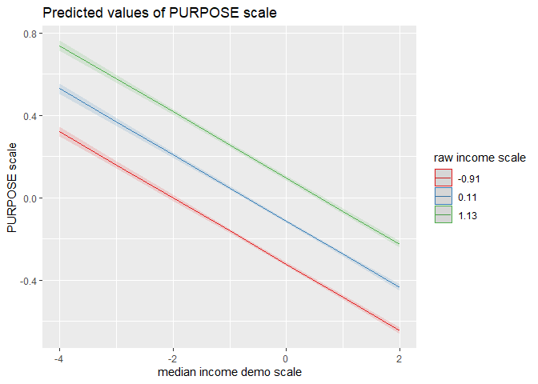
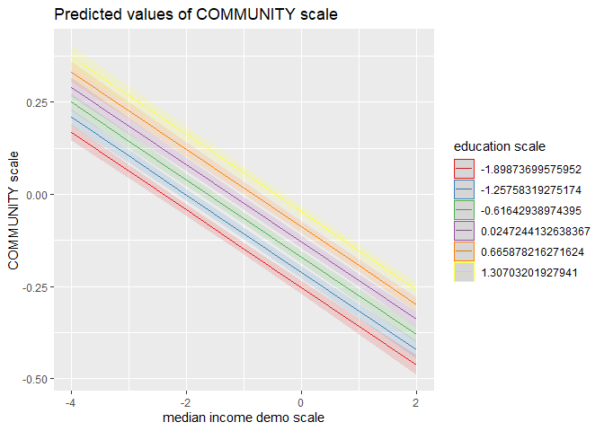

Gallup Relative Status Mechanism Regression Analysis
================
Daniel O’Leary
1/11/2021

  - [Analysis](#analysis)
      - [Purpose](#purpose)
          - [Effect of median income across the
            years](#effect-of-median-income-across-the-years)
          - [Demographic median income - all
            years](#demographic-median-income---all-years)
              - [No median income model](#no-median-income-model)
              - [Main effects model](#main-effects-model)
              - [Interactive model](#interactive-model)
                  - [Interaction plots](#interaction-plots)
              - [Model comparison](#model-comparison)
          - [Geographic median income - all
            years](#geographic-median-income---all-years)
              - [No median income model](#no-median-income-model-1)
              - [Main effects model](#main-effects-model-1)
              - [Interactive model](#interactive-model-1)
              - [Model comparison](#model-comparison-1)
      - [Financial](#financial)
          - [Effect of median income across the
            years](#effect-of-median-income-across-the-years-1)
          - [Demographic median income - all
            years](#demographic-median-income---all-years-1)
              - [No median income model](#no-median-income-model-2)
              - [Main effects model](#main-effects-model-2)
              - [Interactive model](#interactive-model-2)
                  - [Interaction plots](#interaction-plots-1)
              - [Model comparison](#model-comparison-2)
          - [Geographic median income - all
            years](#geographic-median-income---all-years-1)
              - [No median income model](#no-median-income-model-3)
              - [Main effects model](#main-effects-model-3)
              - [Interactive model](#interactive-model-3)
              - [Model comparison](#model-comparison-3)
      - [Community](#community)
          - [Effect of median income across the
            years](#effect-of-median-income-across-the-years-2)
          - [Demographic median income - all
            years](#demographic-median-income---all-years-2)
              - [No median income model](#no-median-income-model-4)
              - [Main effects model](#main-effects-model-4)
              - [Interactive model](#interactive-model-4)
                  - [Interaction plots](#interaction-plots-2)
              - [Model comparison](#model-comparison-4)
          - [Geographic median income - all
            years](#geographic-median-income---all-years-2)
              - [No median income model](#no-median-income-model-5)
              - [Main effects model](#main-effects-model-5)
              - [Interactive model](#interactive-model-5)
              - [Model comparison](#model-comparison-5)
      - [Social](#social)
          - [Effect of median income across the
            years](#effect-of-median-income-across-the-years-3)
          - [Demographic median income - all
            years](#demographic-median-income---all-years-3)
              - [No median income model](#no-median-income-model-6)
              - [Main effects model](#main-effects-model-6)
              - [Interactive model](#interactive-model-6)
                  - [Interaction plots](#interaction-plots-3)
              - [Model comparison](#model-comparison-6)
          - [Geographic median income - all
            years](#geographic-median-income---all-years-3)
              - [No median income model](#no-median-income-model-7)
              - [Main effects model](#main-effects-model-7)
              - [Interactive model](#interactive-model-7)
              - [Model comparison](#model-comparison-7)

``` r
contrasts(dfg_rs$sex) <- contr.sum(2)
contrasts(dfg_rs$employment_all) <- contr.sum(2)
contrasts(dfg_rs$race) <- contr.sum(5)
contrasts(dfg_rs$married) <- contr.sum(6)
```

# Analysis

## Purpose

### Effect of median income across the years

``` r
pur_terms %>% 
  filter(term == "median_income_var_scale") %>% 
  mutate(median_income_var = factor(median_income_var, labels = c("geo", "demo"))) %>% 
  mutate(id_controls = factor(id_controls, labels = c("id controls m.e.", "id controls int."))) %>% 
  filter(id_controls != "no id controls") %>% 
  mutate(year = as.factor(year)) %>% 
  ggplot(aes(year, estimate)) +
  geom_col() +
  geom_errorbar(aes(ymin = estimate - std.error, ymax = estimate + std.error), width = 0.1) +
  theme(axis.text.x = element_text(angle = 90, vjust = 0.5, hjust = 1)) +
  labs(
    y = "median income"
  ) +
  facet_grid(id_controls ~ median_income_var)
```

<!-- -->

### Demographic median income - all years

#### No median income model

``` r
lm0 <-
  lmer(
    PURPOSE_scale ~
      raw_income_scale +
      physicians_scale +
      unweighted_pop_county_scale +
      median_monthly_housing_cost_county_scale +
      land_area_2010_scale +
      education_scale +
      employment_all +
      sex +
      age_scale +
      race +
      married + 
      year +
      (1 + raw_income_scale | fips_code),
    REML = FALSE,
    control = lmerControl(optimizer = "bobyqa"),
    data = dfg_rs 
  )

summary(lm0)
```

    ## Linear mixed model fit by maximum likelihood  ['lmerMod']
    ## Formula: 
    ## PURPOSE_scale ~ raw_income_scale + physicians_scale + unweighted_pop_county_scale +  
    ##     median_monthly_housing_cost_county_scale + land_area_2010_scale +  
    ##     education_scale + employment_all + sex + age_scale + race +  
    ##     married + year + (1 + raw_income_scale | fips_code)
    ##    Data: dfg_rs
    ## Control: lmerControl(optimizer = "bobyqa")
    ## 
    ##       AIC       BIC    logLik  deviance  df.resid 
    ## 1563130.1 1563422.5 -781539.1 1563078.1    564209 
    ## 
    ## Scaled residuals: 
    ##     Min      1Q  Median      3Q     Max 
    ## -3.8393 -0.6082  0.1322  0.7608  2.2793 
    ## 
    ## Random effects:
    ##  Groups    Name             Variance Std.Dev. Corr 
    ##  fips_code (Intercept)      0.002877 0.05363       
    ##            raw_income_scale 0.002047 0.04524  -0.48
    ##  Residual                   0.931872 0.96534       
    ## Number of obs: 564235, groups:  fips_code, 3028
    ## 
    ## Fixed effects:
    ##                                            Estimate Std. Error t value
    ## (Intercept)                              -0.0161097  0.0048635  -3.312
    ## raw_income_scale                          0.2006760  0.0021659  92.653
    ## physicians_scale                         -0.0002417  0.0023163  -0.104
    ## unweighted_pop_county_scale              -0.0265366  0.0050415  -5.264
    ## median_monthly_housing_cost_county_scale -0.0427170  0.0025221 -16.937
    ## land_area_2010_scale                      0.0096145  0.0023386   4.111
    ## education_scale                           0.0023603  0.0014725   1.603
    ## employment_all1                           0.0676856  0.0015531  43.582
    ## sex1                                     -0.0763686  0.0013318 -57.340
    ## age_scale                                 0.0942134  0.0017150  54.934
    ## race1                                    -0.1165377  0.0032957 -35.360
    ## race2                                    -0.0313671  0.0084918  -3.694
    ## race3                                    -0.0164200  0.0044870  -3.659
    ## race4                                    -0.0231035  0.0071671  -3.224
    ## married1                                  0.0267219  0.0034628   7.717
    ## married2                                  0.1336605  0.0027639  48.359
    ## married3                                 -0.2055431  0.0078608 -26.148
    ## married4                                 -0.1417930  0.0038444 -36.883
    ## married5                                  0.1126974  0.0045316  24.869
    ## year2015                                  0.0107237  0.0036406   2.946
    ## year2016                                  0.0181943  0.0036212   5.024
    ## year2017                                 -0.0486276  0.0037162 -13.085

    ## 
    ## Correlation matrix not shown by default, as p = 22 > 12.
    ## Use print(x, correlation=TRUE)  or
    ##     vcov(x)        if you need it

#### Main effects model

``` r
lm1 <-
  lmer(
    PURPOSE_scale ~
      raw_income_scale +
      median_income_demo_scale +
      physicians_scale +
      unweighted_pop_county_scale +
      median_monthly_housing_cost_county_scale +
      land_area_2010_scale +
      education_scale +
      employment_all +
      sex +
      age_scale +
      race +
      married + 
      year +
      (1 + median_income_demo_scale | fips_code) +
      (1 + raw_income_scale | fips_code),
    REML = FALSE,
    control = lmerControl(optimizer = "bobyqa"),
    data = dfg_rs 
  )
```

    ## boundary (singular) fit: see ?isSingular

``` r
summary(lm1)
```

    ## Linear mixed model fit by maximum likelihood  ['lmerMod']
    ## Formula: PURPOSE_scale ~ raw_income_scale + median_income_demo_scale +  
    ##     physicians_scale + unweighted_pop_county_scale + median_monthly_housing_cost_county_scale +  
    ##     land_area_2010_scale + education_scale + employment_all +  
    ##     sex + age_scale + race + married + year + (1 + median_income_demo_scale |  
    ##     fips_code) + (1 + raw_income_scale | fips_code)
    ##    Data: dfg_rs
    ## Control: lmerControl(optimizer = "bobyqa")
    ## 
    ##      AIC      BIC   logLik deviance df.resid 
    ##  1559184  1559521  -779562  1559124   564205 
    ## 
    ## Scaled residuals: 
    ##     Min      1Q  Median      3Q     Max 
    ## -3.8201 -0.6083  0.1300  0.7581  2.4226 
    ## 
    ## Random effects:
    ##  Groups      Name                     Variance Std.Dev. Corr 
    ##  fips_code   (Intercept)              0.000000 0.00000       
    ##              median_income_demo_scale 0.000651 0.02551   NaN 
    ##  fips_code.1 (Intercept)              0.002593 0.05092       
    ##              raw_income_scale         0.001657 0.04071  -0.51
    ##  Residual                             0.925151 0.96185       
    ## Number of obs: 564235, groups:  fips_code, 3028
    ## 
    ## Fixed effects:
    ##                                            Estimate Std. Error t value
    ## (Intercept)                              -0.0352015  0.0048038  -7.328
    ## raw_income_scale                          0.2049951  0.0021061  97.332
    ## median_income_demo_scale                 -0.1606672  0.0028255 -56.863
    ## physicians_scale                         -0.0009569  0.0022807  -0.420
    ## unweighted_pop_county_scale              -0.0232590  0.0048153  -4.830
    ## median_monthly_housing_cost_county_scale -0.0423312  0.0024690 -17.145
    ## land_area_2010_scale                      0.0093210  0.0022918   4.067
    ## education_scale                           0.1315311  0.0025400  51.785
    ## employment_all1                           0.0557402  0.0015592  35.750
    ## sex1                                     -0.0386147  0.0014595 -26.457
    ## age_scale                                 0.0905029  0.0017101  52.924
    ## race1                                    -0.1135508  0.0032838 -34.579
    ## race2                                    -0.0272181  0.0084606  -3.217
    ## race3                                    -0.0058048  0.0044724  -1.298
    ## race4                                    -0.0269376  0.0071475  -3.769
    ## married1                                  0.0066353  0.0034661   1.914
    ## married2                                  0.1485448  0.0027647  53.730
    ## married3                                 -0.1907954  0.0078368 -24.346
    ## married4                                 -0.1233289  0.0038428 -32.094
    ## married5                                  0.0899875  0.0045309  19.861
    ## year2015                                  0.0558258  0.0036990  15.092
    ## year2016                                  0.0982985  0.0038304  25.663
    ## year2017                                  0.0258446  0.0038904   6.643

    ## 
    ## Correlation matrix not shown by default, as p = 23 > 12.
    ## Use print(x, correlation=TRUE)  or
    ##     vcov(x)        if you need it

    ## convergence code: 0
    ## boundary (singular) fit: see ?isSingular

#### Interactive model

``` r
lm2 <-
  lmer(
    PURPOSE_scale ~
      median_income_demo_scale * raw_income_scale +
      median_income_demo_scale * education_scale +
      median_income_demo_scale * employment_all +
      median_income_demo_scale * sex +
      median_income_demo_scale * age_scale +
      median_income_demo_scale * race +
      median_income_demo_scale * married +
      median_income_demo_scale * year +
      physicians_scale +
      unweighted_pop_county_scale +
      median_monthly_housing_cost_county_scale +
      land_area_2010_scale +
      education_scale +
      employment_all +
      sex +
      age_scale +
      race +
      married +
      year +
      (1 + median_income_demo_scale | fips_code) +
      (1 + raw_income_scale | fips_code),
    REML = FALSE,
    control = lmerControl(optimizer = "bobyqa"),
    data = dfg_rs 
  )
```

    ## boundary (singular) fit: see ?isSingular

``` r
summary(lm2)
```

    ## Linear mixed model fit by maximum likelihood  ['lmerMod']
    ## Formula: PURPOSE_scale ~ median_income_demo_scale * raw_income_scale +  
    ##     median_income_demo_scale * education_scale + median_income_demo_scale *  
    ##     employment_all + median_income_demo_scale * sex + median_income_demo_scale *  
    ##     age_scale + median_income_demo_scale * race + median_income_demo_scale *  
    ##     married + median_income_demo_scale * year + physicians_scale +  
    ##     unweighted_pop_county_scale + median_monthly_housing_cost_county_scale +  
    ##     land_area_2010_scale + education_scale + employment_all +  
    ##     sex + age_scale + race + married + year + (1 + median_income_demo_scale |  
    ##     fips_code) + (1 + raw_income_scale | fips_code)
    ##    Data: dfg_rs
    ## Control: lmerControl(optimizer = "bobyqa")
    ## 
    ##       AIC       BIC    logLik  deviance  df.resid 
    ## 1558102.8 1558631.2 -779004.4 1558008.8    564188 
    ## 
    ## Scaled residuals: 
    ##     Min      1Q  Median      3Q     Max 
    ## -3.8343 -0.6082  0.1299  0.7584  2.4064 
    ## 
    ## Random effects:
    ##  Groups      Name                     Variance  Std.Dev. Corr 
    ##  fips_code   (Intercept)              0.0000000 0.00000       
    ##              median_income_demo_scale 0.0005703 0.02388   NaN 
    ##  fips_code.1 (Intercept)              0.0025358 0.05036       
    ##              raw_income_scale         0.0016703 0.04087  -0.48
    ##  Residual                             0.9233812 0.96093       
    ## Number of obs: 564235, groups:  fips_code, 3028
    ## 
    ## Fixed effects:
    ##                                            Estimate Std. Error t value
    ## (Intercept)                               -0.045111   0.005081  -8.878
    ## median_income_demo_scale                  -0.193046   0.005097 -37.875
    ## raw_income_scale                           0.201762   0.002141  94.241
    ## education_scale                            0.141784   0.002614  54.237
    ## employment_all1                            0.052242   0.001580  33.063
    ## sex1                                      -0.035171   0.001519 -23.160
    ## age_scale                                  0.094704   0.001739  54.444
    ## race1                                     -0.113959   0.003544 -32.159
    ## race2                                     -0.027668   0.008550  -3.236
    ## race3                                     -0.007760   0.004647  -1.670
    ## race4                                     -0.010919   0.008564  -1.275
    ## married1                                   0.013259   0.003525   3.761
    ## married2                                   0.149420   0.002825  52.895
    ## married3                                  -0.189416   0.007858 -24.106
    ## married4                                  -0.129282   0.003915 -33.024
    ## married5                                   0.085430   0.004728  18.069
    ## year2015                                   0.062015   0.003736  16.599
    ## year2016                                   0.109270   0.003958  27.610
    ## year2017                                   0.012671   0.003942   3.214
    ## physicians_scale                          -0.001376   0.002276  -0.605
    ## unweighted_pop_county_scale               -0.024262   0.004826  -5.028
    ## median_monthly_housing_cost_county_scale  -0.043269   0.002466 -17.545
    ## land_area_2010_scale                       0.009345   0.002288   4.084
    ## median_income_demo_scale:raw_income_scale  0.013637   0.001672   8.156
    ## median_income_demo_scale:education_scale   0.006058   0.001572   3.855
    ## median_income_demo_scale:employment_all1   0.017274   0.001586  10.890
    ## median_income_demo_scale:sex1             -0.004944   0.001354  -3.651
    ## median_income_demo_scale:age_scale        -0.007613   0.001729  -4.403
    ## median_income_demo_scale:race1             0.012126   0.003188   3.804
    ## median_income_demo_scale:race2             0.024878   0.008072   3.082
    ## median_income_demo_scale:race3             0.016227   0.004296   3.778
    ## median_income_demo_scale:race4            -0.017617   0.007356  -2.395
    ## median_income_demo_scale:married1         -0.035701   0.003383 -10.553
    ## median_income_demo_scale:married2         -0.005999   0.002650  -2.264
    ## median_income_demo_scale:married3          0.017261   0.006989   2.470
    ## median_income_demo_scale:married4          0.041070   0.003802  10.804
    ## median_income_demo_scale:married5         -0.005762   0.004598  -1.253
    ## median_income_demo_scale:year2015          0.012049   0.003841   3.137
    ## median_income_demo_scale:year2016          0.008947   0.003813   2.346
    ## median_income_demo_scale:year2017          0.067554   0.003757  17.979

    ## 
    ## Correlation matrix not shown by default, as p = 40 > 12.
    ## Use print(x, correlation=TRUE)  or
    ##     vcov(x)        if you need it

    ## convergence code: 0
    ## boundary (singular) fit: see ?isSingular

##### Interaction plots

``` r
plot_model(lm1, type = "pred", terms = c("median_income_demo_scale", "education_scale"))
```

<!-- -->

``` r
plot_model(lm1, type = "pred", terms = c("median_income_demo_scale", "raw_income_scale"))
```

<!-- -->

``` r
plot_model(lm1, type = "pred", terms = c("median_income_demo_scale", "age_scale"))
```

<!-- -->

``` r
plot_model(lm1, type = "pred", terms = c("median_income_demo_scale", "sex"))
```

<!-- -->

#### Model comparison

``` r
anova(lm0, lm1, lm2)
```

    ## Data: dfg_rs
    ## Models:
    ## lm0: PURPOSE_scale ~ raw_income_scale + physicians_scale + unweighted_pop_county_scale + 
    ## lm0:     median_monthly_housing_cost_county_scale + land_area_2010_scale + 
    ## lm0:     education_scale + employment_all + sex + age_scale + race + 
    ## lm0:     married + year + (1 + raw_income_scale | fips_code)
    ## lm1: PURPOSE_scale ~ raw_income_scale + median_income_demo_scale + 
    ## lm1:     physicians_scale + unweighted_pop_county_scale + median_monthly_housing_cost_county_scale + 
    ## lm1:     land_area_2010_scale + education_scale + employment_all + 
    ## lm1:     sex + age_scale + race + married + year + (1 + median_income_demo_scale | 
    ## lm1:     fips_code) + (1 + raw_income_scale | fips_code)
    ## lm2: PURPOSE_scale ~ median_income_demo_scale * raw_income_scale + 
    ## lm2:     median_income_demo_scale * education_scale + median_income_demo_scale * 
    ## lm2:     employment_all + median_income_demo_scale * sex + median_income_demo_scale * 
    ## lm2:     age_scale + median_income_demo_scale * race + median_income_demo_scale * 
    ## lm2:     married + median_income_demo_scale * year + physicians_scale + 
    ## lm2:     unweighted_pop_county_scale + median_monthly_housing_cost_county_scale + 
    ## lm2:     land_area_2010_scale + education_scale + employment_all + 
    ## lm2:     sex + age_scale + race + married + year + (1 + median_income_demo_scale | 
    ## lm2:     fips_code) + (1 + raw_income_scale | fips_code)
    ##     npar     AIC     BIC  logLik deviance  Chisq Df Pr(>Chisq)    
    ## lm0   26 1563130 1563422 -781539  1563078                         
    ## lm1   30 1559184 1559521 -779562  1559124 3954.1  4  < 2.2e-16 ***
    ## lm2   47 1558103 1558631 -779004  1558009 1115.2 17  < 2.2e-16 ***
    ## ---
    ## Signif. codes:  0 '***' 0.001 '**' 0.01 '*' 0.05 '.' 0.1 ' ' 1

### Geographic median income - all years

#### No median income model

``` r
lm0 <-
  lmer(
    PURPOSE_scale ~
      raw_income_scale +
      physicians_scale +
      unweighted_pop_county_scale +
      median_monthly_housing_cost_county_scale +
      land_area_2010_scale +
      education_scale +
      employment_all +
      sex +
      age_scale +
      race +
      married + 
      year +
      (1 + raw_income_scale | fips_code),
    REML = FALSE,
    control = lmerControl(optimizer = "bobyqa"),
    data = dfg_rs 
  )

summary(lm0)
```

    ## Linear mixed model fit by maximum likelihood  ['lmerMod']
    ## Formula: 
    ## PURPOSE_scale ~ raw_income_scale + physicians_scale + unweighted_pop_county_scale +  
    ##     median_monthly_housing_cost_county_scale + land_area_2010_scale +  
    ##     education_scale + employment_all + sex + age_scale + race +  
    ##     married + year + (1 + raw_income_scale | fips_code)
    ##    Data: dfg_rs
    ## Control: lmerControl(optimizer = "bobyqa")
    ## 
    ##       AIC       BIC    logLik  deviance  df.resid 
    ## 1563130.1 1563422.5 -781539.1 1563078.1    564209 
    ## 
    ## Scaled residuals: 
    ##     Min      1Q  Median      3Q     Max 
    ## -3.8393 -0.6082  0.1322  0.7608  2.2793 
    ## 
    ## Random effects:
    ##  Groups    Name             Variance Std.Dev. Corr 
    ##  fips_code (Intercept)      0.002877 0.05363       
    ##            raw_income_scale 0.002047 0.04524  -0.48
    ##  Residual                   0.931872 0.96534       
    ## Number of obs: 564235, groups:  fips_code, 3028
    ## 
    ## Fixed effects:
    ##                                            Estimate Std. Error t value
    ## (Intercept)                              -0.0161097  0.0048635  -3.312
    ## raw_income_scale                          0.2006760  0.0021659  92.653
    ## physicians_scale                         -0.0002417  0.0023163  -0.104
    ## unweighted_pop_county_scale              -0.0265366  0.0050415  -5.264
    ## median_monthly_housing_cost_county_scale -0.0427170  0.0025221 -16.937
    ## land_area_2010_scale                      0.0096145  0.0023386   4.111
    ## education_scale                           0.0023603  0.0014725   1.603
    ## employment_all1                           0.0676856  0.0015531  43.582
    ## sex1                                     -0.0763686  0.0013318 -57.340
    ## age_scale                                 0.0942134  0.0017150  54.934
    ## race1                                    -0.1165377  0.0032957 -35.360
    ## race2                                    -0.0313671  0.0084918  -3.694
    ## race3                                    -0.0164200  0.0044870  -3.659
    ## race4                                    -0.0231035  0.0071671  -3.224
    ## married1                                  0.0267219  0.0034628   7.717
    ## married2                                  0.1336605  0.0027639  48.359
    ## married3                                 -0.2055431  0.0078608 -26.148
    ## married4                                 -0.1417930  0.0038444 -36.883
    ## married5                                  0.1126974  0.0045316  24.869
    ## year2015                                  0.0107237  0.0036406   2.946
    ## year2016                                  0.0181943  0.0036212   5.024
    ## year2017                                 -0.0486276  0.0037162 -13.085

    ## 
    ## Correlation matrix not shown by default, as p = 22 > 12.
    ## Use print(x, correlation=TRUE)  or
    ##     vcov(x)        if you need it

#### Main effects model

``` r
lm1 <-
  lmer(
    PURPOSE_scale ~
      raw_income_scale +
      median_income_county_scale +
      physicians_scale +
      unweighted_pop_county_scale +
      median_monthly_housing_cost_county_scale +
      land_area_2010_scale +
      education_scale +
      employment_all +
      sex +
      age_scale +
      race +
      married + 
      year +
      (1 + median_income_county_scale | fips_code) +
      (1 + raw_income_scale | fips_code),
    REML = FALSE,
    control = lmerControl(optimizer = "bobyqa"),
    data = dfg_rs 
  )
```

    ## boundary (singular) fit: see ?isSingular

``` r
summary(lm1)
```

    ## Linear mixed model fit by maximum likelihood  ['lmerMod']
    ## Formula: PURPOSE_scale ~ raw_income_scale + median_income_county_scale +  
    ##     physicians_scale + unweighted_pop_county_scale + median_monthly_housing_cost_county_scale +  
    ##     land_area_2010_scale + education_scale + employment_all +  
    ##     sex + age_scale + race + married + year + (1 + median_income_county_scale |  
    ##     fips_code) + (1 + raw_income_scale | fips_code)
    ##    Data: dfg_rs
    ## Control: lmerControl(optimizer = "bobyqa")
    ## 
    ##       AIC       BIC    logLik  deviance  df.resid 
    ## 1563136.8 1563474.1 -781538.4 1563076.8    564205 
    ## 
    ## Scaled residuals: 
    ##     Min      1Q  Median      3Q     Max 
    ## -3.8391 -0.6082  0.1323  0.7608  2.2792 
    ## 
    ## Random effects:
    ##  Groups      Name                       Variance  Std.Dev. Corr 
    ##  fips_code   (Intercept)                0.000e+00 0.000000      
    ##              median_income_county_scale 7.403e-05 0.008604  NaN 
    ##  fips_code.1 (Intercept)                2.803e-03 0.052947      
    ##              raw_income_scale           2.047e-03 0.045248 -0.49
    ##  Residual                               9.319e-01 0.965335      
    ## Number of obs: 564235, groups:  fips_code, 3028
    ## 
    ## Fixed effects:
    ##                                            Estimate Std. Error t value
    ## (Intercept)                              -1.605e-02  4.861e-03  -3.302
    ## raw_income_scale                          2.006e-01  2.166e-03  92.614
    ## median_income_county_scale                4.413e-03  4.603e-03   0.959
    ## physicians_scale                         -7.475e-05  2.320e-03  -0.032
    ## unweighted_pop_county_scale              -2.490e-02  5.160e-03  -4.825
    ## median_monthly_housing_cost_county_scale -4.740e-02  5.292e-03  -8.957
    ## land_area_2010_scale                      9.605e-03  2.330e-03   4.122
    ## education_scale                           2.386e-03  1.473e-03   1.620
    ## employment_all1                           6.772e-02  1.553e-03  43.595
    ## sex1                                     -7.636e-02  1.332e-03 -57.337
    ## age_scale                                 9.423e-02  1.715e-03  54.943
    ## race1                                    -1.167e-01  3.301e-03 -35.354
    ## race2                                    -3.142e-02  8.492e-03  -3.700
    ## race3                                    -1.623e-02  4.491e-03  -3.614
    ## race4                                    -2.317e-02  7.168e-03  -3.232
    ## married1                                  2.674e-02  3.463e-03   7.721
    ## married2                                  1.336e-01  2.765e-03  48.326
    ## married3                                 -2.055e-01  7.861e-03 -26.141
    ## married4                                 -1.418e-01  3.844e-03 -36.886
    ## married5                                  1.126e-01  4.532e-03  24.857
    ## year2015                                  1.045e-02  3.651e-03   2.862
    ## year2016                                  1.759e-02  3.677e-03   4.784
    ## year2017                                 -4.955e-02  3.852e-03 -12.864

    ## 
    ## Correlation matrix not shown by default, as p = 23 > 12.
    ## Use print(x, correlation=TRUE)  or
    ##     vcov(x)        if you need it

    ## convergence code: 0
    ## boundary (singular) fit: see ?isSingular

#### Interactive model

``` r
lm1 <-
  lmer(
    PURPOSE_scale ~
      median_income_county_scale * raw_income_scale +
      median_income_county_scale * education_scale +
      median_income_county_scale * employment_all +
      median_income_county_scale * sex +
      median_income_county_scale * age_scale +
      median_income_county_scale * race +
      median_income_county_scale * married +
      median_income_county_scale * year +
      physicians_scale +
      unweighted_pop_county_scale +
      median_monthly_housing_cost_county_scale +
      land_area_2010_scale +
      education_scale +
      employment_all +
      sex +
      age_scale +
      race +
      married +
      year +
      (1 + median_income_county_scale | fips_code) +
      (1 + raw_income_scale | fips_code),
    REML = FALSE,
    control = lmerControl(optimizer = "bobyqa"),
    data = dfg_rs 
  )
```

    ## Warning in checkConv(attr(opt, "derivs"), opt$par, ctrl = control$checkConv, :
    ## Model failed to converge with max|grad| = 0.0205333 (tol = 0.002, component 1)

``` r
summary(lm1)
```

    ## Linear mixed model fit by maximum likelihood  ['lmerMod']
    ## Formula: PURPOSE_scale ~ median_income_county_scale * raw_income_scale +  
    ##     median_income_county_scale * education_scale + median_income_county_scale *  
    ##     employment_all + median_income_county_scale * sex + median_income_county_scale *  
    ##     age_scale + median_income_county_scale * race + median_income_county_scale *  
    ##     married + median_income_county_scale * year + physicians_scale +  
    ##     unweighted_pop_county_scale + median_monthly_housing_cost_county_scale +  
    ##     land_area_2010_scale + education_scale + employment_all +  
    ##     sex + age_scale + race + married + year + (1 + median_income_county_scale |  
    ##     fips_code) + (1 + raw_income_scale | fips_code)
    ##    Data: dfg_rs
    ## Control: lmerControl(optimizer = "bobyqa")
    ## 
    ##      AIC      BIC   logLik deviance df.resid 
    ##  1562680  1563209  -781293  1562586   564188 
    ## 
    ## Scaled residuals: 
    ##     Min      1Q  Median      3Q     Max 
    ## -3.8927 -0.6091  0.1321  0.7601  2.3298 
    ## 
    ## Random effects:
    ##  Groups      Name                       Variance  Std.Dev. Corr 
    ##  fips_code   (Intercept)                0.0002178 0.01476       
    ##              median_income_county_scale 0.0002850 0.01688  -0.99
    ##  fips_code.1 (Intercept)                0.0024028 0.04902       
    ##              raw_income_scale           0.0012937 0.03597  -0.49
    ##  Residual                               0.9313584 0.96507       
    ## Number of obs: 564235, groups:  fips_code, 3028
    ## 
    ## Fixed effects:
    ##                                               Estimate Std. Error t value
    ## (Intercept)                                 -0.0078122  0.0049929  -1.565
    ## median_income_county_scale                   0.0253654  0.0061448   4.128
    ## raw_income_scale                             0.1953460  0.0020346  96.013
    ## education_scale                              0.0025752  0.0014758   1.745
    ## employment_all1                              0.0662055  0.0015588  42.473
    ## sex1                                        -0.0764540  0.0013408 -57.020
    ## age_scale                                    0.0954285  0.0017236  55.367
    ## race1                                       -0.1184530  0.0034919 -33.923
    ## race2                                       -0.0309469  0.0085713  -3.611
    ## race3                                       -0.0158925  0.0046146  -3.444
    ## race4                                       -0.0201377  0.0083782  -2.404
    ## married1                                     0.0267667  0.0034842   7.682
    ## married2                                     0.1337859  0.0027757  48.199
    ## married3                                    -0.2030263  0.0078598 -25.831
    ## married4                                    -0.1419988  0.0038463 -36.918
    ## married5                                     0.1117557  0.0045384  24.625
    ## year2015                                     0.0099967  0.0036503   2.739
    ## year2016                                     0.0165155  0.0036896   4.476
    ## year2017                                    -0.0486573  0.0039087 -12.449
    ## physicians_scale                            -0.0005074  0.0023181  -0.219
    ## unweighted_pop_county_scale                 -0.0253387  0.0050375  -5.030
    ## median_monthly_housing_cost_county_scale    -0.0478128  0.0052854  -9.046
    ## land_area_2010_scale                         0.0092779  0.0023343   3.975
    ## median_income_county_scale:raw_income_scale -0.0157336  0.0019462  -8.084
    ## median_income_county_scale:education_scale  -0.0070997  0.0014516  -4.891
    ## median_income_county_scale:employment_all1   0.0208963  0.0015058  13.877
    ## median_income_county_scale:sex1              0.0005060  0.0012772   0.396
    ## median_income_county_scale:age_scale        -0.0152380  0.0016626  -9.165
    ## median_income_county_scale:race1             0.0005566  0.0030776   0.181
    ## median_income_county_scale:race2             0.0250640  0.0083686   2.995
    ## median_income_county_scale:race3            -0.0126836  0.0042647  -2.974
    ## median_income_county_scale:race4            -0.0073853  0.0060249  -1.226
    ## median_income_county_scale:married1         -0.0180539  0.0033647  -5.366
    ## median_income_county_scale:married2         -0.0052167  0.0026775  -1.948
    ## median_income_county_scale:married3          0.0107226  0.0076620   1.399
    ## median_income_county_scale:married4          0.0133785  0.0038556   3.470
    ## median_income_county_scale:married5         -0.0088293  0.0045600  -1.936
    ## median_income_county_scale:year2015         -0.0027064  0.0036548  -0.740
    ## median_income_county_scale:year2016         -0.0035229  0.0035792  -0.984
    ## median_income_county_scale:year2017         -0.0104098  0.0036089  -2.885

    ## 
    ## Correlation matrix not shown by default, as p = 40 > 12.
    ## Use print(x, correlation=TRUE)  or
    ##     vcov(x)        if you need it

    ## convergence code: 0
    ## Model failed to converge with max|grad| = 0.0205333 (tol = 0.002, component 1)

#### Model comparison

``` r
anova(lm0, lm1, lm2)
```

    ## Data: dfg_rs
    ## Models:
    ## lm0: PURPOSE_scale ~ raw_income_scale + physicians_scale + unweighted_pop_county_scale + 
    ## lm0:     median_monthly_housing_cost_county_scale + land_area_2010_scale + 
    ## lm0:     education_scale + employment_all + sex + age_scale + race + 
    ## lm0:     married + year + (1 + raw_income_scale | fips_code)
    ## lm1: PURPOSE_scale ~ median_income_county_scale * raw_income_scale + 
    ## lm1:     median_income_county_scale * education_scale + median_income_county_scale * 
    ## lm1:     employment_all + median_income_county_scale * sex + median_income_county_scale * 
    ## lm1:     age_scale + median_income_county_scale * race + median_income_county_scale * 
    ## lm1:     married + median_income_county_scale * year + physicians_scale + 
    ## lm1:     unweighted_pop_county_scale + median_monthly_housing_cost_county_scale + 
    ## lm1:     land_area_2010_scale + education_scale + employment_all + 
    ## lm1:     sex + age_scale + race + married + year + (1 + median_income_county_scale | 
    ## lm1:     fips_code) + (1 + raw_income_scale | fips_code)
    ## lm2: PURPOSE_scale ~ median_income_demo_scale * raw_income_scale + 
    ## lm2:     median_income_demo_scale * education_scale + median_income_demo_scale * 
    ## lm2:     employment_all + median_income_demo_scale * sex + median_income_demo_scale * 
    ## lm2:     age_scale + median_income_demo_scale * race + median_income_demo_scale * 
    ## lm2:     married + median_income_demo_scale * year + physicians_scale + 
    ## lm2:     unweighted_pop_county_scale + median_monthly_housing_cost_county_scale + 
    ## lm2:     land_area_2010_scale + education_scale + employment_all + 
    ## lm2:     sex + age_scale + race + married + year + (1 + median_income_demo_scale | 
    ## lm2:     fips_code) + (1 + raw_income_scale | fips_code)
    ##     npar     AIC     BIC  logLik deviance   Chisq Df Pr(>Chisq)    
    ## lm0   26 1563130 1563422 -781539  1563078                          
    ## lm1   47 1562680 1563208 -781293  1562586  492.11 21  < 2.2e-16 ***
    ## lm2   47 1558103 1558631 -779004  1558009 4577.25  0  < 2.2e-16 ***
    ## ---
    ## Signif. codes:  0 '***' 0.001 '**' 0.01 '*' 0.05 '.' 0.1 ' ' 1

## Financial

### Effect of median income across the years

``` r
fin_terms %>% 
  filter(term == "median_income_var_scale") %>% 
  mutate(median_income_var = factor(median_income_var, labels = c("geo", "demo"))) %>% 
  mutate(id_controls = factor(id_controls, labels = c("id controls m.e.", "id controls int."))) %>% 
  filter(id_controls != "no id controls") %>% 
  mutate(year = as.factor(year)) %>% 
  ggplot(aes(year, estimate)) +
  geom_col() +
  geom_errorbar(aes(ymin = estimate - std.error, ymax = estimate + std.error), width = 0.1) +
  theme(axis.text.x = element_text(angle = 90, vjust = 0.5, hjust = 1)) +
  labs(
    y = "median income"
  ) +
  facet_grid(id_controls ~ median_income_var)
```

<!-- -->

### Demographic median income - all years

#### No median income model

``` r
lm0 <-
  lmer(
    FINANCIAL_scale ~
      raw_income_scale +
      physicians_scale +
      unweighted_pop_county_scale +
      median_monthly_housing_cost_county_scale +
      land_area_2010_scale +
      education_scale +
      employment_all +
      sex +
      age_scale +
      race +
      married + 
      year +
      (1 + raw_income_scale | fips_code),
    REML = FALSE,
    control = lmerControl(optimizer = "bobyqa"),
    data = dfg_rs 
  )
```

    ## boundary (singular) fit: see ?isSingular

``` r
summary(lm0)
```

    ## Linear mixed model fit by maximum likelihood  ['lmerMod']
    ## Formula: 
    ## FINANCIAL_scale ~ raw_income_scale + physicians_scale + unweighted_pop_county_scale +  
    ##     median_monthly_housing_cost_county_scale + land_area_2010_scale +  
    ##     education_scale + employment_all + sex + age_scale + race +  
    ##     married + year + (1 + raw_income_scale | fips_code)
    ##    Data: dfg_rs
    ## Control: lmerControl(optimizer = "bobyqa")
    ## 
    ##       AIC       BIC    logLik  deviance  df.resid 
    ## 1485119.0 1485411.3 -742533.5 1485067.0    564209 
    ## 
    ## Scaled residuals: 
    ##     Min      1Q  Median      3Q     Max 
    ## -4.0426 -0.6208  0.1344  0.7281  3.2082 
    ## 
    ## Random effects:
    ##  Groups    Name             Variance Std.Dev. Corr
    ##  fips_code (Intercept)      0.000000 0.00000      
    ##            raw_income_scale 0.001618 0.04022   NaN
    ##  Residual                   0.812921 0.90162      
    ## Number of obs: 564235, groups:  fips_code, 3028
    ## 
    ## Fixed effects:
    ##                                           Estimate Std. Error t value
    ## (Intercept)                              -0.090256   0.003938 -22.917
    ## raw_income_scale                          0.386226   0.001994 193.698
    ## physicians_scale                          0.015042   0.001562   9.627
    ## unweighted_pop_county_scale              -0.005486   0.001252  -4.381
    ## median_monthly_housing_cost_county_scale -0.030050   0.001511 -19.888
    ## land_area_2010_scale                      0.003350   0.001298   2.581
    ## education_scale                           0.003284   0.001369   2.399
    ## employment_all1                           0.102902   0.001448  71.065
    ## sex1                                      0.012060   0.001243   9.702
    ## age_scale                                 0.222144   0.001596 139.159
    ## race1                                    -0.010599   0.003027  -3.502
    ## race2                                    -0.121400   0.007886 -15.394
    ## race3                                    -0.150516   0.004096 -36.747
    ## race4                                     0.199642   0.006665  29.954
    ## married1                                  0.132283   0.003228  40.985
    ## married2                                  0.049762   0.002576  19.319
    ## married3                                 -0.306442   0.007335 -41.779
    ## married4                                 -0.112419   0.003586 -31.347
    ## married5                                  0.276548   0.004227  65.425
    ## year2015                                  0.018207   0.003396   5.361
    ## year2016                                  0.006693   0.003377   1.982
    ## year2017                                 -0.009381   0.003466  -2.707

    ## 
    ## Correlation matrix not shown by default, as p = 22 > 12.
    ## Use print(x, correlation=TRUE)  or
    ##     vcov(x)        if you need it

    ## convergence code: 0
    ## boundary (singular) fit: see ?isSingular

#### Main effects model

``` r
lm1 <-
  lmer(
    FINANCIAL_scale ~
      raw_income_scale +
      median_income_demo_scale +
      physicians_scale +
      unweighted_pop_county_scale +
      median_monthly_housing_cost_county_scale +
      land_area_2010_scale +
      education_scale +
      employment_all +
      sex +
      age_scale +
      race +
      married + 
      year +
      (1 + median_income_demo_scale | fips_code) +
      (1 + raw_income_scale | fips_code),
    REML = FALSE,
    control = lmerControl(optimizer = "bobyqa"),
    data = dfg_rs 
  )
```

    ## Warning in checkConv(attr(opt, "derivs"), opt$par, ctrl = control$checkConv, :
    ## Model failed to converge with max|grad| = 0.0223772 (tol = 0.002, component 1)

``` r
summary(lm1)
```

    ## Linear mixed model fit by maximum likelihood  ['lmerMod']
    ## Formula: FINANCIAL_scale ~ raw_income_scale + median_income_demo_scale +  
    ##     physicians_scale + unweighted_pop_county_scale + median_monthly_housing_cost_county_scale +  
    ##     land_area_2010_scale + education_scale + employment_all +  
    ##     sex + age_scale + race + married + year + (1 + median_income_demo_scale |  
    ##     fips_code) + (1 + raw_income_scale | fips_code)
    ##    Data: dfg_rs
    ## Control: lmerControl(optimizer = "bobyqa")
    ## 
    ##       AIC       BIC    logLik  deviance  df.resid 
    ## 1480521.4 1480858.7 -740230.7 1480461.4    564205 
    ## 
    ## Scaled residuals: 
    ##     Min      1Q  Median      3Q     Max 
    ## -4.0227 -0.6210  0.1302  0.7278  3.1943 
    ## 
    ## Random effects:
    ##  Groups      Name                     Variance  Std.Dev. Corr 
    ##  fips_code   (Intercept)              6.399e-06 0.00253       
    ##              median_income_demo_scale 2.536e-04 0.01593  -0.79
    ##  fips_code.1 (Intercept)              3.904e-03 0.06248       
    ##              raw_income_scale         1.960e-03 0.04428  -0.75
    ##  Residual                             8.043e-01 0.89684       
    ## Number of obs: 564235, groups:  fips_code, 3028
    ## 
    ## Fixed effects:
    ##                                           Estimate Std. Error t value
    ## (Intercept)                              -0.114956   0.004622 -24.873
    ## raw_income_scale                          0.391497   0.002039 191.970
    ## median_income_demo_scale                 -0.149858   0.002563 -58.464
    ## physicians_scale                          0.015877   0.002240   7.086
    ## unweighted_pop_county_scale              -0.023422   0.004635  -5.053
    ## median_monthly_housing_cost_county_scale -0.037309   0.002412 -15.465
    ## land_area_2010_scale                      0.005932   0.002241   2.646
    ## education_scale                           0.120583   0.002369  50.897
    ## employment_all1                           0.092793   0.001454  63.806
    ## sex1                                      0.046600   0.001361  34.240
    ## age_scale                                 0.219196   0.001595 137.400
    ## race1                                    -0.010635   0.003069  -3.466
    ## race2                                    -0.119790   0.007902 -15.160
    ## race3                                    -0.133513   0.004185 -31.905
    ## race4                                     0.190284   0.006663  28.557
    ## married1                                  0.113728   0.003233  35.179
    ## married2                                  0.061137   0.002578  23.713
    ## married3                                 -0.290442   0.007309 -39.736
    ## married4                                 -0.095427   0.003584 -26.625
    ## married5                                  0.254551   0.004226  60.236
    ## year2015                                  0.059681   0.003450  17.300
    ## year2016                                  0.080409   0.003572  22.509
    ## year2017                                  0.059433   0.003628  16.380

    ## 
    ## Correlation matrix not shown by default, as p = 23 > 12.
    ## Use print(x, correlation=TRUE)  or
    ##     vcov(x)        if you need it

    ## convergence code: 0
    ## Model failed to converge with max|grad| = 0.0223772 (tol = 0.002, component 1)

#### Interactive model

``` r
lm2 <-
  lmer(
    FINANCIAL_scale ~
      median_income_demo_scale * raw_income_scale +
      median_income_demo_scale * education_scale +
      median_income_demo_scale * employment_all +
      median_income_demo_scale * sex +
      median_income_demo_scale * age_scale +
      median_income_demo_scale * race +
      median_income_demo_scale * married +
      median_income_demo_scale * year +
      physicians_scale +
      unweighted_pop_county_scale +
      median_monthly_housing_cost_county_scale +
      land_area_2010_scale +
      education_scale +
      employment_all +
      sex +
      age_scale +
      race +
      married +
      year +
      (1 + median_income_demo_scale | fips_code) +
      (1 + raw_income_scale | fips_code),
    REML = FALSE,
    control = lmerControl(optimizer = "bobyqa"),
    data = dfg_rs 
  )
```

    ## boundary (singular) fit: see ?isSingular

``` r
summary(lm2)
```

    ## Linear mixed model fit by maximum likelihood  ['lmerMod']
    ## Formula: FINANCIAL_scale ~ median_income_demo_scale * raw_income_scale +  
    ##     median_income_demo_scale * education_scale + median_income_demo_scale *  
    ##     employment_all + median_income_demo_scale * sex + median_income_demo_scale *  
    ##     age_scale + median_income_demo_scale * race + median_income_demo_scale *  
    ##     married + median_income_demo_scale * year + physicians_scale +  
    ##     unweighted_pop_county_scale + median_monthly_housing_cost_county_scale +  
    ##     land_area_2010_scale + education_scale + employment_all +  
    ##     sex + age_scale + race + married + year + (1 + median_income_demo_scale |  
    ##     fips_code) + (1 + raw_income_scale | fips_code)
    ##    Data: dfg_rs
    ## Control: lmerControl(optimizer = "bobyqa")
    ## 
    ##      AIC      BIC   logLik deviance df.resid 
    ##  1478242  1478770  -739074  1478148   564188 
    ## 
    ## Scaled residuals: 
    ##     Min      1Q  Median      3Q     Max 
    ## -4.0157 -0.6211  0.1296  0.7283  3.2385 
    ## 
    ## Random effects:
    ##  Groups      Name                     Variance  Std.Dev. Corr 
    ##  fips_code   (Intercept)              0.0000000 0.00000       
    ##              median_income_demo_scale 0.0001958 0.01399   NaN 
    ##  fips_code.1 (Intercept)              0.0038248 0.06185       
    ##              raw_income_scale         0.0019546 0.04421  -0.74
    ##  Residual                             0.8010892 0.89504       
    ## Number of obs: 564235, groups:  fips_code, 3028
    ## 
    ## Fixed effects:
    ##                                            Estimate Std. Error t value
    ## (Intercept)                               -0.121552   0.004872 -24.948
    ## median_income_demo_scale                  -0.198805   0.004690 -42.389
    ## raw_income_scale                           0.391162   0.002063 189.600
    ## education_scale                            0.143681   0.002436  58.988
    ## employment_all1                            0.090949   0.001472  61.772
    ## sex1                                       0.054858   0.001415  38.778
    ## age_scale                                  0.219956   0.001621 135.695
    ## race1                                     -0.013181   0.003308  -3.985
    ## race2                                     -0.123057   0.007977 -15.427
    ## race3                                     -0.139904   0.004344 -32.206
    ## race4                                      0.211391   0.007979  26.495
    ## married1                                   0.114845   0.003285  34.963
    ## married2                                   0.066860   0.002632  25.405
    ## married3                                  -0.285902   0.007321 -39.053
    ## married4                                  -0.100785   0.003647 -27.631
    ## married5                                   0.245474   0.004405  55.727
    ## year2015                                   0.073425   0.003480  21.096
    ## year2016                                   0.109885   0.003687  29.802
    ## year2017                                   0.035151   0.003673   9.570
    ## physicians_scale                           0.015580   0.002233   6.976
    ## unweighted_pop_county_scale               -0.024091   0.004628  -5.206
    ## median_monthly_housing_cost_county_scale  -0.038069   0.002406 -15.821
    ## land_area_2010_scale                       0.006117   0.002235   2.738
    ## median_income_demo_scale:raw_income_scale  0.005044   0.001556   3.243
    ## median_income_demo_scale:education_scale   0.005040   0.001462   3.448
    ## median_income_demo_scale:employment_all1  -0.001228   0.001477  -0.831
    ## median_income_demo_scale:sex1             -0.005591   0.001261  -4.433
    ## median_income_demo_scale:age_scale        -0.011540   0.001610  -7.168
    ## median_income_demo_scale:race1             0.004014   0.002957   1.358
    ## median_income_demo_scale:race2             0.014774   0.007514   1.966
    ## median_income_demo_scale:race3             0.031867   0.003985   7.996
    ## median_income_demo_scale:race4            -0.039843   0.006841  -5.824
    ## median_income_demo_scale:married1         -0.015266   0.003150  -4.846
    ## median_income_demo_scale:married2         -0.014254   0.002466  -5.780
    ## median_income_demo_scale:married3         -0.003426   0.006510  -0.526
    ## median_income_demo_scale:married4          0.038549   0.003541  10.886
    ## median_income_demo_scale:married5          0.009711   0.004283   2.267
    ## median_income_demo_scale:year2015         -0.004278   0.003578  -1.196
    ## median_income_demo_scale:year2016         -0.014719   0.003552  -4.144
    ## median_income_demo_scale:year2017          0.110898   0.003500  31.688

    ## 
    ## Correlation matrix not shown by default, as p = 40 > 12.
    ## Use print(x, correlation=TRUE)  or
    ##     vcov(x)        if you need it

    ## convergence code: 0
    ## boundary (singular) fit: see ?isSingular

##### Interaction plots

``` r
plot_model(lm1, type = "pred", terms = c("median_income_demo_scale", "education_scale"))
```

<!-- -->

``` r
plot_model(lm1, type = "pred", terms = c("median_income_demo_scale", "raw_income_scale"))
```

<!-- -->

``` r
plot_model(lm1, type = "pred", terms = c("median_income_demo_scale", "age_scale"))
```

<!-- -->

``` r
plot_model(lm1, type = "pred", terms = c("median_income_demo_scale", "sex"))
```

<!-- -->

#### Model comparison

``` r
anova(lm0, lm1, lm2)
```

    ## Data: dfg_rs
    ## Models:
    ## lm0: FINANCIAL_scale ~ raw_income_scale + physicians_scale + unweighted_pop_county_scale + 
    ## lm0:     median_monthly_housing_cost_county_scale + land_area_2010_scale + 
    ## lm0:     education_scale + employment_all + sex + age_scale + race + 
    ## lm0:     married + year + (1 + raw_income_scale | fips_code)
    ## lm1: FINANCIAL_scale ~ raw_income_scale + median_income_demo_scale + 
    ## lm1:     physicians_scale + unweighted_pop_county_scale + median_monthly_housing_cost_county_scale + 
    ## lm1:     land_area_2010_scale + education_scale + employment_all + 
    ## lm1:     sex + age_scale + race + married + year + (1 + median_income_demo_scale | 
    ## lm1:     fips_code) + (1 + raw_income_scale | fips_code)
    ## lm2: FINANCIAL_scale ~ median_income_demo_scale * raw_income_scale + 
    ## lm2:     median_income_demo_scale * education_scale + median_income_demo_scale * 
    ## lm2:     employment_all + median_income_demo_scale * sex + median_income_demo_scale * 
    ## lm2:     age_scale + median_income_demo_scale * race + median_income_demo_scale * 
    ## lm2:     married + median_income_demo_scale * year + physicians_scale + 
    ## lm2:     unweighted_pop_county_scale + median_monthly_housing_cost_county_scale + 
    ## lm2:     land_area_2010_scale + education_scale + employment_all + 
    ## lm2:     sex + age_scale + race + married + year + (1 + median_income_demo_scale | 
    ## lm2:     fips_code) + (1 + raw_income_scale | fips_code)
    ##     npar     AIC     BIC  logLik deviance  Chisq Df Pr(>Chisq)    
    ## lm0   26 1485119 1485411 -742534  1485067                         
    ## lm1   30 1480521 1480859 -740231  1480461 4605.6  4  < 2.2e-16 ***
    ## lm2   47 1478242 1478770 -739074  1478148 2313.4 17  < 2.2e-16 ***
    ## ---
    ## Signif. codes:  0 '***' 0.001 '**' 0.01 '*' 0.05 '.' 0.1 ' ' 1

### Geographic median income - all years

#### No median income model

``` r
lm0 <-
  lmer(
    FINANCIAL_scale ~
      raw_income_scale +
      physicians_scale +
      unweighted_pop_county_scale +
      median_monthly_housing_cost_county_scale +
      land_area_2010_scale +
      education_scale +
      employment_all +
      sex +
      age_scale +
      race +
      married + 
      year +
      (1 + raw_income_scale | fips_code),
    REML = FALSE,
    control = lmerControl(optimizer = "bobyqa"),
    data = dfg_rs 
  )
```

    ## boundary (singular) fit: see ?isSingular

``` r
summary(lm0)
```

    ## Linear mixed model fit by maximum likelihood  ['lmerMod']
    ## Formula: 
    ## FINANCIAL_scale ~ raw_income_scale + physicians_scale + unweighted_pop_county_scale +  
    ##     median_monthly_housing_cost_county_scale + land_area_2010_scale +  
    ##     education_scale + employment_all + sex + age_scale + race +  
    ##     married + year + (1 + raw_income_scale | fips_code)
    ##    Data: dfg_rs
    ## Control: lmerControl(optimizer = "bobyqa")
    ## 
    ##       AIC       BIC    logLik  deviance  df.resid 
    ## 1485119.0 1485411.3 -742533.5 1485067.0    564209 
    ## 
    ## Scaled residuals: 
    ##     Min      1Q  Median      3Q     Max 
    ## -4.0426 -0.6208  0.1344  0.7281  3.2082 
    ## 
    ## Random effects:
    ##  Groups    Name             Variance Std.Dev. Corr
    ##  fips_code (Intercept)      0.000000 0.00000      
    ##            raw_income_scale 0.001618 0.04022   NaN
    ##  Residual                   0.812921 0.90162      
    ## Number of obs: 564235, groups:  fips_code, 3028
    ## 
    ## Fixed effects:
    ##                                           Estimate Std. Error t value
    ## (Intercept)                              -0.090256   0.003938 -22.917
    ## raw_income_scale                          0.386226   0.001994 193.698
    ## physicians_scale                          0.015042   0.001562   9.627
    ## unweighted_pop_county_scale              -0.005486   0.001252  -4.381
    ## median_monthly_housing_cost_county_scale -0.030050   0.001511 -19.888
    ## land_area_2010_scale                      0.003350   0.001298   2.581
    ## education_scale                           0.003284   0.001369   2.399
    ## employment_all1                           0.102902   0.001448  71.065
    ## sex1                                      0.012060   0.001243   9.702
    ## age_scale                                 0.222144   0.001596 139.159
    ## race1                                    -0.010599   0.003027  -3.502
    ## race2                                    -0.121400   0.007886 -15.394
    ## race3                                    -0.150516   0.004096 -36.747
    ## race4                                     0.199642   0.006665  29.954
    ## married1                                  0.132283   0.003228  40.985
    ## married2                                  0.049762   0.002576  19.319
    ## married3                                 -0.306442   0.007335 -41.779
    ## married4                                 -0.112419   0.003586 -31.347
    ## married5                                  0.276548   0.004227  65.425
    ## year2015                                  0.018207   0.003396   5.361
    ## year2016                                  0.006693   0.003377   1.982
    ## year2017                                 -0.009381   0.003466  -2.707

    ## 
    ## Correlation matrix not shown by default, as p = 22 > 12.
    ## Use print(x, correlation=TRUE)  or
    ##     vcov(x)        if you need it

    ## convergence code: 0
    ## boundary (singular) fit: see ?isSingular

#### Main effects model

``` r
lm1 <-
  lmer(
    FINANCIAL_scale ~
      raw_income_scale +
      median_income_county_scale +
      physicians_scale +
      unweighted_pop_county_scale +
      median_monthly_housing_cost_county_scale +
      land_area_2010_scale +
      education_scale +
      employment_all +
      sex +
      age_scale +
      race +
      married + 
      year +
      (1 + median_income_county_scale | fips_code) +
      (1 + raw_income_scale | fips_code),
    REML = FALSE,
    control = lmerControl(optimizer = "bobyqa"),
    data = dfg_rs 
  )
```

    ## boundary (singular) fit: see ?isSingular

``` r
summary(lm1)
```

    ## Linear mixed model fit by maximum likelihood  ['lmerMod']
    ## Formula: FINANCIAL_scale ~ raw_income_scale + median_income_county_scale +  
    ##     physicians_scale + unweighted_pop_county_scale + median_monthly_housing_cost_county_scale +  
    ##     land_area_2010_scale + education_scale + employment_all +  
    ##     sex + age_scale + race + married + year + (1 + median_income_county_scale |  
    ##     fips_code) + (1 + raw_income_scale | fips_code)
    ##    Data: dfg_rs
    ## Control: lmerControl(optimizer = "bobyqa")
    ## 
    ##       AIC       BIC    logLik  deviance  df.resid 
    ## 1484315.9 1484653.2 -742127.9 1484255.9    564205 
    ## 
    ## Scaled residuals: 
    ##     Min      1Q  Median      3Q     Max 
    ## -4.0540 -0.6203  0.1344  0.7272  3.1750 
    ## 
    ## Random effects:
    ##  Groups      Name                       Variance  Std.Dev. Corr 
    ##  fips_code   (Intercept)                0.0026979 0.05194       
    ##              median_income_county_scale 0.0002015 0.01420  -0.27
    ##  fips_code.1 (Intercept)                0.0000000 0.00000       
    ##              raw_income_scale           0.0016014 0.04002   NaN 
    ##  Residual                               0.8102132 0.90012       
    ## Number of obs: 564235, groups:  fips_code, 3028
    ## 
    ## Fixed effects:
    ##                                            Estimate Std. Error t value
    ## (Intercept)                              -0.0867529  0.0046997 -18.459
    ## raw_income_scale                          0.3850353  0.0019977 192.741
    ## median_income_county_scale                0.0470752  0.0045980  10.238
    ## physicians_scale                          0.0186097  0.0022856   8.142
    ## unweighted_pop_county_scale              -0.0049713  0.0055621  -0.894
    ## median_monthly_housing_cost_county_scale -0.0725550  0.0052683 -13.772
    ## land_area_2010_scale                      0.0061880  0.0022946   2.697
    ## education_scale                           0.0030785  0.0013740   2.241
    ## employment_all1                           0.1036039  0.0014487  71.514
    ## sex1                                      0.0120811  0.0012420   9.727
    ## age_scale                                 0.2228541  0.0015996 139.317
    ## race1                                    -0.0148987  0.0030794  -4.838
    ## race2                                    -0.1243988  0.0079182 -15.710
    ## race3                                    -0.1420463  0.0041883 -33.915
    ## race4                                     0.1948244  0.0066869  29.135
    ## married1                                  0.1327768  0.0032287  41.124
    ## married2                                  0.0471642  0.0025783  18.293
    ## married3                                 -0.3038280  0.0073289 -41.456
    ## married4                                 -0.1128783  0.0035844 -31.492
    ## married5                                  0.2750227  0.0042254  65.088
    ## year2015                                  0.0158406  0.0034065   4.650
    ## year2016                                  0.0005138  0.0034382   0.149
    ## year2017                                 -0.0201021  0.0036151  -5.561

    ## 
    ## Correlation matrix not shown by default, as p = 23 > 12.
    ## Use print(x, correlation=TRUE)  or
    ##     vcov(x)        if you need it

    ## convergence code: 0
    ## boundary (singular) fit: see ?isSingular

#### Interactive model

``` r
lm1 <-
  lmer(
    FINANCIAL_scale ~
      median_income_county_scale * raw_income_scale +
      median_income_county_scale * education_scale +
      median_income_county_scale * employment_all +
      median_income_county_scale * sex +
      median_income_county_scale * age_scale +
      median_income_county_scale * race +
      median_income_county_scale * married +
      median_income_county_scale * year +
      physicians_scale +
      unweighted_pop_county_scale +
      median_monthly_housing_cost_county_scale +
      land_area_2010_scale +
      education_scale +
      employment_all +
      sex +
      age_scale +
      race +
      married +
      year +
      (1 + median_income_county_scale | fips_code) +
      (1 + raw_income_scale | fips_code),
    REML = FALSE,
    control = lmerControl(optimizer = "bobyqa"),
    data = dfg_rs 
  )
```

    ## Warning in checkConv(attr(opt, "derivs"), opt$par, ctrl = control$checkConv, :
    ## Model failed to converge with max|grad| = 0.0188518 (tol = 0.002, component 1)

``` r
summary(lm1)
```

    ## Linear mixed model fit by maximum likelihood  ['lmerMod']
    ## Formula: FINANCIAL_scale ~ median_income_county_scale * raw_income_scale +  
    ##     median_income_county_scale * education_scale + median_income_county_scale *  
    ##     employment_all + median_income_county_scale * sex + median_income_county_scale *  
    ##     age_scale + median_income_county_scale * race + median_income_county_scale *  
    ##     married + median_income_county_scale * year + physicians_scale +  
    ##     unweighted_pop_county_scale + median_monthly_housing_cost_county_scale +  
    ##     land_area_2010_scale + education_scale + employment_all +  
    ##     sex + age_scale + race + married + year + (1 + median_income_county_scale |  
    ##     fips_code) + (1 + raw_income_scale | fips_code)
    ##    Data: dfg_rs
    ## Control: lmerControl(optimizer = "bobyqa")
    ## 
    ##      AIC      BIC   logLik deviance df.resid 
    ##  1483672  1484200  -741789  1483578   564188 
    ## 
    ## Scaled residuals: 
    ##     Min      1Q  Median      3Q     Max 
    ## -4.0323 -0.6205  0.1338  0.7285  3.1930 
    ## 
    ## Random effects:
    ##  Groups      Name                       Variance  Std.Dev. Corr 
    ##  fips_code   (Intercept)                0.0002508 0.01584       
    ##              median_income_county_scale 0.0002500 0.01581  0.59 
    ##  fips_code.1 (Intercept)                0.0028804 0.05367       
    ##              raw_income_scale           0.0012342 0.03513  -0.91
    ##  Residual                               0.8095344 0.89974       
    ## Number of obs: 564235, groups:  fips_code, 3028
    ## 
    ## Fixed effects:
    ##                                               Estimate Std. Error t value
    ## (Intercept)                                 -0.0853201  0.0046401 -18.388
    ## median_income_county_scale                   0.0664212  0.0057395  11.573
    ## raw_income_scale                             0.3809060  0.0018978 200.706
    ## education_scale                              0.0026135  0.0013759   1.899
    ## employment_all1                              0.1025441  0.0014531  70.568
    ## sex1                                         0.0124735  0.0012500   9.979
    ## age_scale                                    0.2246152  0.0016069 139.786
    ## race1                                       -0.0182027  0.0032568  -5.589
    ## race2                                       -0.1247961  0.0079959 -15.607
    ## race3                                       -0.1436631  0.0043084 -33.345
    ## race4                                        0.2030094  0.0078097  25.994
    ## married1                                     0.1317415  0.0032490  40.549
    ## married2                                     0.0471416  0.0025875  18.219
    ## married3                                    -0.3014481  0.0073290 -41.131
    ## married4                                    -0.1126481  0.0035865 -31.409
    ## married5                                     0.2743601  0.0042317  64.835
    ## year2015                                     0.0153838  0.0034020   4.522
    ## year2016                                     0.0007446  0.0034370   0.217
    ## year2017                                    -0.0228832  0.0036458  -6.277
    ## physicians_scale                             0.0170547  0.0021751   7.841
    ## unweighted_pop_county_scale                 -0.0121214  0.0037612  -3.223
    ## median_monthly_housing_cost_county_scale    -0.0818507  0.0048773 -16.782
    ## land_area_2010_scale                         0.0052004  0.0020881   2.491
    ## median_income_county_scale:raw_income_scale -0.0198058  0.0017953 -11.032
    ## median_income_county_scale:education_scale   0.0022557  0.0013550   1.665
    ## median_income_county_scale:employment_all1   0.0163687  0.0014039  11.659
    ## median_income_county_scale:sex1             -0.0033257  0.0011908  -2.793
    ## median_income_county_scale:age_scale        -0.0209219  0.0015505 -13.494
    ## median_income_county_scale:race1             0.0019538  0.0028739   0.680
    ## median_income_county_scale:race2             0.0363214  0.0078120   4.649
    ## median_income_county_scale:race3            -0.0071508  0.0039834  -1.795
    ## median_income_county_scale:race4            -0.0214436  0.0056185  -3.817
    ## median_income_county_scale:married1         -0.0132797  0.0031387  -4.231
    ## median_income_county_scale:married2         -0.0024180  0.0024962  -0.969
    ## median_income_county_scale:married3         -0.0119574  0.0071447  -1.674
    ## median_income_county_scale:married4          0.0078448  0.0035952   2.182
    ## median_income_county_scale:married5          0.0132196  0.0042523   3.109
    ## median_income_county_scale:year2015         -0.0106881  0.0034074  -3.137
    ## median_income_county_scale:year2016         -0.0143462  0.0033355  -4.301
    ## median_income_county_scale:year2017         -0.0002485  0.0033586  -0.074

    ## 
    ## Correlation matrix not shown by default, as p = 40 > 12.
    ## Use print(x, correlation=TRUE)  or
    ##     vcov(x)        if you need it

    ## convergence code: 0
    ## Model failed to converge with max|grad| = 0.0188518 (tol = 0.002, component 1)

#### Model comparison

``` r
anova(lm0, lm1, lm2)
```

    ## Data: dfg_rs
    ## Models:
    ## lm0: FINANCIAL_scale ~ raw_income_scale + physicians_scale + unweighted_pop_county_scale + 
    ## lm0:     median_monthly_housing_cost_county_scale + land_area_2010_scale + 
    ## lm0:     education_scale + employment_all + sex + age_scale + race + 
    ## lm0:     married + year + (1 + raw_income_scale | fips_code)
    ## lm1: FINANCIAL_scale ~ median_income_county_scale * raw_income_scale + 
    ## lm1:     median_income_county_scale * education_scale + median_income_county_scale * 
    ## lm1:     employment_all + median_income_county_scale * sex + median_income_county_scale * 
    ## lm1:     age_scale + median_income_county_scale * race + median_income_county_scale * 
    ## lm1:     married + median_income_county_scale * year + physicians_scale + 
    ## lm1:     unweighted_pop_county_scale + median_monthly_housing_cost_county_scale + 
    ## lm1:     land_area_2010_scale + education_scale + employment_all + 
    ## lm1:     sex + age_scale + race + married + year + (1 + median_income_county_scale | 
    ## lm1:     fips_code) + (1 + raw_income_scale | fips_code)
    ## lm2: FINANCIAL_scale ~ median_income_demo_scale * raw_income_scale + 
    ## lm2:     median_income_demo_scale * education_scale + median_income_demo_scale * 
    ## lm2:     employment_all + median_income_demo_scale * sex + median_income_demo_scale * 
    ## lm2:     age_scale + median_income_demo_scale * race + median_income_demo_scale * 
    ## lm2:     married + median_income_demo_scale * year + physicians_scale + 
    ## lm2:     unweighted_pop_county_scale + median_monthly_housing_cost_county_scale + 
    ## lm2:     land_area_2010_scale + education_scale + employment_all + 
    ## lm2:     sex + age_scale + race + married + year + (1 + median_income_demo_scale | 
    ## lm2:     fips_code) + (1 + raw_income_scale | fips_code)
    ##     npar     AIC     BIC  logLik deviance  Chisq Df Pr(>Chisq)    
    ## lm0   26 1485119 1485411 -742534  1485067                         
    ## lm1   47 1483672 1484200 -741789  1483578 1489.1 21  < 2.2e-16 ***
    ## lm2   47 1478242 1478770 -739074  1478148 5430.0  0  < 2.2e-16 ***
    ## ---
    ## Signif. codes:  0 '***' 0.001 '**' 0.01 '*' 0.05 '.' 0.1 ' ' 1

## Community

### Effect of median income across the years

``` r
com_terms %>% 
  filter(term == "median_income_var_scale") %>% 
  mutate(median_income_var = factor(median_income_var, labels = c("geo", "demo"))) %>% 
  mutate(id_controls = factor(id_controls, labels = c("id controls m.e.", "id controls int."))) %>% 
  filter(id_controls != "no id controls") %>% 
  mutate(year = as.factor(year)) %>% 
  ggplot(aes(year, estimate)) +
  geom_col() +
  geom_errorbar(aes(ymin = estimate - std.error, ymax = estimate + std.error), width = 0.1) +
  theme(axis.text.x = element_text(angle = 90, vjust = 0.5, hjust = 1)) +
  labs(
    y = "median income"
  ) +
  facet_grid(id_controls ~ median_income_var)
```

<!-- -->

### Demographic median income - all years

#### No median income model

``` r
lm0 <-
  lmer(
    COMMUNITY_scale ~
      raw_income_scale +
      physicians_scale +
      unweighted_pop_county_scale +
      median_monthly_housing_cost_county_scale +
      land_area_2010_scale +
      education_scale +
      employment_all +
      sex +
      age_scale +
      race +
      married + 
      year +
      (1 + raw_income_scale | fips_code),
    REML = FALSE,
    control = lmerControl(optimizer = "bobyqa"),
    data = dfg_rs 
  )

summary(lm0)
```

    ## Linear mixed model fit by maximum likelihood  ['lmerMod']
    ## Formula: 
    ## COMMUNITY_scale ~ raw_income_scale + physicians_scale + unweighted_pop_county_scale +  
    ##     median_monthly_housing_cost_county_scale + land_area_2010_scale +  
    ##     education_scale + employment_all + sex + age_scale + race +  
    ##     married + year + (1 + raw_income_scale | fips_code)
    ##    Data: dfg_rs
    ## Control: lmerControl(optimizer = "bobyqa")
    ## 
    ##       AIC       BIC    logLik  deviance  df.resid 
    ## 1541313.7 1541606.0 -770630.9 1541261.7    564209 
    ## 
    ## Scaled residuals: 
    ##     Min      1Q  Median      3Q     Max 
    ## -4.1978 -0.5456  0.1503  0.7057  2.6261 
    ## 
    ## Random effects:
    ##  Groups    Name             Variance Std.Dev. Corr
    ##  fips_code (Intercept)      0.023772 0.15418      
    ##            raw_income_scale 0.001486 0.03855  0.19
    ##  Residual                   0.892599 0.94477      
    ## Number of obs: 564235, groups:  fips_code, 3028
    ## 
    ## Fixed effects:
    ##                                           Estimate Std. Error t value
    ## (Intercept)                              -0.001744   0.008169  -0.213
    ## raw_income_scale                          0.149888   0.002049  73.165
    ## physicians_scale                          0.014879   0.004006   3.714
    ## unweighted_pop_county_scale              -0.126110   0.014092  -8.949
    ## median_monthly_housing_cost_county_scale -0.005773   0.005095  -1.133
    ## land_area_2010_scale                      0.011444   0.003593   3.186
    ## education_scale                          -0.019224   0.001446 -13.291
    ## employment_all1                          -0.026295   0.001523 -17.264
    ## sex1                                     -0.037266   0.001305 -28.560
    ## age_scale                                 0.182987   0.001683 108.709
    ## race1                                    -0.067036   0.003254 -20.603
    ## race2                                    -0.077626   0.008352  -9.294
    ## race3                                    -0.123877   0.004434 -27.938
    ## race4                                     0.095267   0.007030  13.551
    ## married1                                  0.004718   0.003393   1.391
    ## married2                                  0.083725   0.002710  30.895
    ## married3                                 -0.150202   0.007699 -19.510
    ## married4                                 -0.089559   0.003766 -23.782
    ## married5                                  0.175141   0.004440  39.449
    ## year2015                                 -0.005539   0.003582  -1.546
    ## year2016                                  0.006474   0.003570   1.813
    ## year2017                                 -0.010794   0.003656  -2.953

    ## 
    ## Correlation matrix not shown by default, as p = 22 > 12.
    ## Use print(x, correlation=TRUE)  or
    ##     vcov(x)        if you need it

#### Main effects model

``` r
lm1 <-
  lmer(
    COMMUNITY_scale ~
      raw_income_scale +
      median_income_demo_scale +
      physicians_scale +
      unweighted_pop_county_scale +
      median_monthly_housing_cost_county_scale +
      land_area_2010_scale +
      education_scale +
      employment_all +
      sex +
      age_scale +
      race +
      married + 
      year +
      (1 + median_income_demo_scale | fips_code) +
      (1 + raw_income_scale | fips_code),
    REML = FALSE,
    control = lmerControl(optimizer = "bobyqa"),
    data = dfg_rs 
  )
```

    ## Warning in checkConv(attr(opt, "derivs"), opt$par, ctrl = control$checkConv, :
    ## Model failed to converge with max|grad| = 0.0471785 (tol = 0.002, component 1)

    ## Warning in checkConv(attr(opt, "derivs"), opt$par, ctrl = control$checkConv, : Model is nearly unidentifiable: large eigenvalue ratio
    ##  - Rescale variables?

``` r
summary(lm1)
```

    ## Linear mixed model fit by maximum likelihood  ['lmerMod']
    ## Formula: COMMUNITY_scale ~ raw_income_scale + median_income_demo_scale +  
    ##     physicians_scale + unweighted_pop_county_scale + median_monthly_housing_cost_county_scale +  
    ##     land_area_2010_scale + education_scale + employment_all +  
    ##     sex + age_scale + race + married + year + (1 + median_income_demo_scale |  
    ##     fips_code) + (1 + raw_income_scale | fips_code)
    ##    Data: dfg_rs
    ## Control: lmerControl(optimizer = "bobyqa")
    ## 
    ##       AIC       BIC    logLik  deviance  df.resid 
    ## 1539531.2 1539868.5 -769735.6 1539471.2    564205 
    ## 
    ## Scaled residuals: 
    ##     Min      1Q  Median      3Q     Max 
    ## -4.2514 -0.5449  0.1501  0.7047  2.6913 
    ## 
    ## Random effects:
    ##  Groups      Name                     Variance  Std.Dev. Corr
    ##  fips_code   (Intercept)              0.0081989 0.09055      
    ##              median_income_demo_scale 0.0009489 0.03080  0.67
    ##  fips_code.1 (Intercept)              0.0150019 0.12248      
    ##              raw_income_scale         0.0011431 0.03381  0.05
    ##  Residual                             0.8893649 0.94306      
    ## Number of obs: 564235, groups:  fips_code, 3028
    ## 
    ## Fixed effects:
    ##                                           Estimate Std. Error t value
    ## (Intercept)                              -0.014295   0.007955  -1.797
    ## raw_income_scale                          0.153729   0.001989  77.274
    ## median_income_demo_scale                 -0.104997   0.002827 -37.146
    ## physicians_scale                          0.013797   0.003979   3.468
    ## unweighted_pop_county_scale              -0.118619   0.013469  -8.807
    ## median_monthly_housing_cost_county_scale -0.009800   0.005020  -1.952
    ## land_area_2010_scale                      0.012000   0.003571   3.360
    ## education_scale                           0.063972   0.002497  25.621
    ## employment_all1                          -0.033854   0.001532 -22.099
    ## sex1                                     -0.012971   0.001433  -9.054
    ## age_scale                                 0.180654   0.001682 107.426
    ## race1                                    -0.065134   0.003249 -20.047
    ## race2                                    -0.074523   0.008338  -8.937
    ## race3                                    -0.116939   0.004430 -26.394
    ## race4                                     0.091842   0.007025  13.074
    ## married1                                 -0.007957   0.003402  -2.339
    ## married2                                  0.093057   0.002716  34.265
    ## married3                                 -0.140693   0.007690 -18.296
    ## married4                                 -0.077529   0.003771 -20.557
    ## married5                                  0.160535   0.004447  36.097
    ## year2015                                  0.023232   0.003644   6.375
    ## year2016                                  0.057736   0.003780  15.276
    ## year2017                                  0.037106   0.003833   9.682

    ## 
    ## Correlation matrix not shown by default, as p = 23 > 12.
    ## Use print(x, correlation=TRUE)  or
    ##     vcov(x)        if you need it

    ## convergence code: 0
    ## Model failed to converge with max|grad| = 0.0471785 (tol = 0.002, component 1)
    ## Model is nearly unidentifiable: large eigenvalue ratio
    ##  - Rescale variables?

#### Interactive model

``` r
lm2 <-
  lmer(
    COMMUNITY_scale ~
      median_income_demo_scale * raw_income_scale +
      median_income_demo_scale * education_scale +
      median_income_demo_scale * employment_all +
      median_income_demo_scale * sex +
      median_income_demo_scale * age_scale +
      median_income_demo_scale * race +
      median_income_demo_scale * married +
      median_income_demo_scale * year +
      physicians_scale +
      unweighted_pop_county_scale +
      median_monthly_housing_cost_county_scale +
      land_area_2010_scale +
      education_scale +
      employment_all +
      sex +
      age_scale +
      race +
      married +
      year +
      (1 + median_income_demo_scale | fips_code) +
      (1 + raw_income_scale | fips_code),
    REML = FALSE,
    control = lmerControl(optimizer = "bobyqa"),
    data = dfg_rs 
  )
```

    ## Warning in checkConv(attr(opt, "derivs"), opt$par, ctrl = control$checkConv, :
    ## Model failed to converge with max|grad| = 0.0199102 (tol = 0.002, component 1)

``` r
summary(lm2)
```

    ## Linear mixed model fit by maximum likelihood  ['lmerMod']
    ## Formula: COMMUNITY_scale ~ median_income_demo_scale * raw_income_scale +  
    ##     median_income_demo_scale * education_scale + median_income_demo_scale *  
    ##     employment_all + median_income_demo_scale * sex + median_income_demo_scale *  
    ##     age_scale + median_income_demo_scale * race + median_income_demo_scale *  
    ##     married + median_income_demo_scale * year + physicians_scale +  
    ##     unweighted_pop_county_scale + median_monthly_housing_cost_county_scale +  
    ##     land_area_2010_scale + education_scale + employment_all +  
    ##     sex + age_scale + race + married + year + (1 + median_income_demo_scale |  
    ##     fips_code) + (1 + raw_income_scale | fips_code)
    ##    Data: dfg_rs
    ## Control: lmerControl(optimizer = "bobyqa")
    ## 
    ##       AIC       BIC    logLik  deviance  df.resid 
    ## 1538234.9 1538763.3 -769070.5 1538140.9    564188 
    ## 
    ## Scaled residuals: 
    ##     Min      1Q  Median      3Q     Max 
    ## -4.2177 -0.5449  0.1496  0.7048  2.7170 
    ## 
    ## Random effects:
    ##  Groups      Name                     Variance  Std.Dev. Corr
    ##  fips_code   (Intercept)              0.0043254 0.06577      
    ##              median_income_demo_scale 0.0008034 0.02834  0.92
    ##  fips_code.1 (Intercept)              0.0189658 0.13772      
    ##              raw_income_scale         0.0010922 0.03305  0.07
    ##  Residual                             0.8873598 0.94200      
    ## Number of obs: 564235, groups:  fips_code, 3028
    ## 
    ## Fixed effects:
    ##                                             Estimate Std. Error t value
    ## (Intercept)                               -0.0310655  0.0081060  -3.832
    ## median_income_demo_scale                  -0.1411601  0.0050347 -28.037
    ## raw_income_scale                           0.1532709  0.0020127  76.154
    ## education_scale                            0.0738097  0.0025691  28.729
    ## employment_all1                           -0.0345285  0.0015520 -22.248
    ## sex1                                      -0.0091446  0.0014903  -6.136
    ## age_scale                                  0.1824952  0.0017102 106.707
    ## race1                                     -0.0655165  0.0035022 -18.707
    ## race2                                     -0.0733488  0.0084242  -8.707
    ## race3                                     -0.1172029  0.0045990 -25.485
    ## race4                                      0.1039357  0.0084102  12.358
    ## married1                                   0.0045854  0.0034598   1.325
    ## married2                                   0.0904431  0.0027740  32.604
    ## married3                                  -0.1423346  0.0077090 -18.464
    ## married4                                  -0.0773181  0.0038412 -20.129
    ## married5                                   0.1461120  0.0046398  31.491
    ## year2015                                   0.0254748  0.0036796   6.923
    ## year2016                                   0.0646686  0.0039025  16.571
    ## year2017                                   0.0249439  0.0038829   6.424
    ## physicians_scale                           0.0142728  0.0039818   3.585
    ## unweighted_pop_county_scale               -0.1267488  0.0135012  -9.388
    ## median_monthly_housing_cost_county_scale  -0.0105684  0.0050302  -2.101
    ## land_area_2010_scale                       0.0114914  0.0035717   3.217
    ## median_income_demo_scale:raw_income_scale  0.0024122  0.0016413   1.470
    ## median_income_demo_scale:education_scale   0.0162263  0.0015436  10.512
    ## median_income_demo_scale:employment_all1   0.0116529  0.0015566   7.486
    ## median_income_demo_scale:sex1             -0.0037209  0.0013288  -2.800
    ## median_income_demo_scale:age_scale        -0.0345040  0.0016974 -20.328
    ## median_income_demo_scale:race1             0.0202720  0.0031316   6.473
    ## median_income_demo_scale:race2             0.0292292  0.0079231   3.689
    ## median_income_demo_scale:race3             0.0349320  0.0042177   8.282
    ## median_income_demo_scale:race4            -0.0218172  0.0072173  -3.023
    ## median_income_demo_scale:married1         -0.0258722  0.0033197  -7.794
    ## median_income_demo_scale:married2          0.0084075  0.0026007   3.233
    ## median_income_demo_scale:married3         -0.0101330  0.0068556  -1.478
    ## median_income_demo_scale:married4          0.0188808  0.0037297   5.062
    ## median_income_demo_scale:married5          0.0059736  0.0045114   1.324
    ## median_income_demo_scale:year2015          0.0088921  0.0037682   2.360
    ## median_income_demo_scale:year2016          0.0006121  0.0037413   0.164
    ## median_income_demo_scale:year2017          0.0451865  0.0036866  12.257

    ## 
    ## Correlation matrix not shown by default, as p = 40 > 12.
    ## Use print(x, correlation=TRUE)  or
    ##     vcov(x)        if you need it

    ## convergence code: 0
    ## Model failed to converge with max|grad| = 0.0199102 (tol = 0.002, component 1)

##### Interaction plots

``` r
plot_model(lm1, type = "pred", terms = c("median_income_demo_scale", "education_scale"))
```

<!-- -->

``` r
plot_model(lm1, type = "pred", terms = c("median_income_demo_scale", "raw_income_scale"))
```

<!-- -->

``` r
plot_model(lm1, type = "pred", terms = c("median_income_demo_scale", "age_scale"))
```

<!-- -->

``` r
plot_model(lm1, type = "pred", terms = c("median_income_demo_scale", "sex"))
```

<!-- -->

#### Model comparison

``` r
anova(lm0, lm1, lm2)
```

    ## Data: dfg_rs
    ## Models:
    ## lm0: COMMUNITY_scale ~ raw_income_scale + physicians_scale + unweighted_pop_county_scale + 
    ## lm0:     median_monthly_housing_cost_county_scale + land_area_2010_scale + 
    ## lm0:     education_scale + employment_all + sex + age_scale + race + 
    ## lm0:     married + year + (1 + raw_income_scale | fips_code)
    ## lm1: COMMUNITY_scale ~ raw_income_scale + median_income_demo_scale + 
    ## lm1:     physicians_scale + unweighted_pop_county_scale + median_monthly_housing_cost_county_scale + 
    ## lm1:     land_area_2010_scale + education_scale + employment_all + 
    ## lm1:     sex + age_scale + race + married + year + (1 + median_income_demo_scale | 
    ## lm1:     fips_code) + (1 + raw_income_scale | fips_code)
    ## lm2: COMMUNITY_scale ~ median_income_demo_scale * raw_income_scale + 
    ## lm2:     median_income_demo_scale * education_scale + median_income_demo_scale * 
    ## lm2:     employment_all + median_income_demo_scale * sex + median_income_demo_scale * 
    ## lm2:     age_scale + median_income_demo_scale * race + median_income_demo_scale * 
    ## lm2:     married + median_income_demo_scale * year + physicians_scale + 
    ## lm2:     unweighted_pop_county_scale + median_monthly_housing_cost_county_scale + 
    ## lm2:     land_area_2010_scale + education_scale + employment_all + 
    ## lm2:     sex + age_scale + race + married + year + (1 + median_income_demo_scale | 
    ## lm2:     fips_code) + (1 + raw_income_scale | fips_code)
    ##     npar     AIC     BIC  logLik deviance  Chisq Df Pr(>Chisq)    
    ## lm0   26 1541314 1541606 -770631  1541262                         
    ## lm1   30 1539531 1539868 -769736  1539471 1790.5  4  < 2.2e-16 ***
    ## lm2   47 1538235 1538763 -769070  1538141 1330.3 17  < 2.2e-16 ***
    ## ---
    ## Signif. codes:  0 '***' 0.001 '**' 0.01 '*' 0.05 '.' 0.1 ' ' 1

### Geographic median income - all years

#### No median income model

``` r
lm0 <-
  lmer(
    COMMUNITY_scale ~
      raw_income_scale +
      physicians_scale +
      unweighted_pop_county_scale +
      median_monthly_housing_cost_county_scale +
      land_area_2010_scale +
      education_scale +
      employment_all +
      sex +
      age_scale +
      race +
      married + 
      year +
      (1 + raw_income_scale | fips_code),
    REML = FALSE,
    control = lmerControl(optimizer = "bobyqa"),
    data = dfg_rs 
  )

summary(lm0)
```

    ## Linear mixed model fit by maximum likelihood  ['lmerMod']
    ## Formula: 
    ## COMMUNITY_scale ~ raw_income_scale + physicians_scale + unweighted_pop_county_scale +  
    ##     median_monthly_housing_cost_county_scale + land_area_2010_scale +  
    ##     education_scale + employment_all + sex + age_scale + race +  
    ##     married + year + (1 + raw_income_scale | fips_code)
    ##    Data: dfg_rs
    ## Control: lmerControl(optimizer = "bobyqa")
    ## 
    ##       AIC       BIC    logLik  deviance  df.resid 
    ## 1541313.7 1541606.0 -770630.9 1541261.7    564209 
    ## 
    ## Scaled residuals: 
    ##     Min      1Q  Median      3Q     Max 
    ## -4.1978 -0.5456  0.1503  0.7057  2.6261 
    ## 
    ## Random effects:
    ##  Groups    Name             Variance Std.Dev. Corr
    ##  fips_code (Intercept)      0.023772 0.15418      
    ##            raw_income_scale 0.001486 0.03855  0.19
    ##  Residual                   0.892599 0.94477      
    ## Number of obs: 564235, groups:  fips_code, 3028
    ## 
    ## Fixed effects:
    ##                                           Estimate Std. Error t value
    ## (Intercept)                              -0.001744   0.008169  -0.213
    ## raw_income_scale                          0.149888   0.002049  73.165
    ## physicians_scale                          0.014879   0.004006   3.714
    ## unweighted_pop_county_scale              -0.126110   0.014092  -8.949
    ## median_monthly_housing_cost_county_scale -0.005773   0.005095  -1.133
    ## land_area_2010_scale                      0.011444   0.003593   3.186
    ## education_scale                          -0.019224   0.001446 -13.291
    ## employment_all1                          -0.026295   0.001523 -17.264
    ## sex1                                     -0.037266   0.001305 -28.560
    ## age_scale                                 0.182987   0.001683 108.709
    ## race1                                    -0.067036   0.003254 -20.603
    ## race2                                    -0.077626   0.008352  -9.294
    ## race3                                    -0.123877   0.004434 -27.938
    ## race4                                     0.095267   0.007030  13.551
    ## married1                                  0.004718   0.003393   1.391
    ## married2                                  0.083725   0.002710  30.895
    ## married3                                 -0.150202   0.007699 -19.510
    ## married4                                 -0.089559   0.003766 -23.782
    ## married5                                  0.175141   0.004440  39.449
    ## year2015                                 -0.005539   0.003582  -1.546
    ## year2016                                  0.006474   0.003570   1.813
    ## year2017                                 -0.010794   0.003656  -2.953

    ## 
    ## Correlation matrix not shown by default, as p = 22 > 12.
    ## Use print(x, correlation=TRUE)  or
    ##     vcov(x)        if you need it

#### Main effects model

``` r
lm1 <-
  lmer(
    COMMUNITY_scale ~
      raw_income_scale +
      median_income_county_scale +
      physicians_scale +
      unweighted_pop_county_scale +
      median_monthly_housing_cost_county_scale +
      land_area_2010_scale +
      education_scale +
      employment_all +
      sex +
      age_scale +
      race +
      married + 
      year +
      (1 + median_income_county_scale | fips_code) +
      (1 + raw_income_scale | fips_code),
    REML = FALSE,
    control = lmerControl(optimizer = "bobyqa"),
    data = dfg_rs 
  )
```

    ## Warning in checkConv(attr(opt, "derivs"), opt$par, ctrl = control$checkConv, :
    ## Model failed to converge with max|grad| = 0.00789664 (tol = 0.002, component 1)

``` r
summary(lm1)
```

    ## Linear mixed model fit by maximum likelihood  ['lmerMod']
    ## Formula: COMMUNITY_scale ~ raw_income_scale + median_income_county_scale +  
    ##     physicians_scale + unweighted_pop_county_scale + median_monthly_housing_cost_county_scale +  
    ##     land_area_2010_scale + education_scale + employment_all +  
    ##     sex + age_scale + race + married + year + (1 + median_income_county_scale |  
    ##     fips_code) + (1 + raw_income_scale | fips_code)
    ##    Data: dfg_rs
    ## Control: lmerControl(optimizer = "bobyqa")
    ## 
    ##       AIC       BIC    logLik  deviance  df.resid 
    ## 1541175.7 1541513.0 -770557.9 1541115.7    564205 
    ## 
    ## Scaled residuals: 
    ##     Min      1Q  Median      3Q     Max 
    ## -4.1958 -0.5458  0.1503  0.7058  2.6421 
    ## 
    ## Random effects:
    ##  Groups      Name                       Variance  Std.Dev. Corr 
    ##  fips_code   (Intercept)                0.0035086 0.05923       
    ##              median_income_county_scale 0.0005825 0.02413  -0.90
    ##  fips_code.1 (Intercept)                0.0171597 0.13099       
    ##              raw_income_scale           0.0015079 0.03883  0.23 
    ##  Residual                               0.8925518 0.94475       
    ## Number of obs: 564235, groups:  fips_code, 3028
    ## 
    ## Fixed effects:
    ##                                           Estimate Std. Error t value
    ## (Intercept)                              -0.001967   0.007726  -0.255
    ## raw_income_scale                          0.149184   0.002054  72.645
    ## median_income_county_scale                0.090155   0.007728  11.667
    ## physicians_scale                          0.016853   0.003872   4.353
    ## unweighted_pop_county_scale              -0.088816   0.013255  -6.700
    ## median_monthly_housing_cost_county_scale -0.097408   0.009078 -10.730
    ## land_area_2010_scale                      0.009629   0.003522   2.734
    ## education_scale                          -0.019005   0.001446 -13.140
    ## employment_all1                          -0.026052   0.001523 -17.103
    ## sex1                                     -0.037228   0.001305 -28.532
    ## age_scale                                 0.182974   0.001683 108.710
    ## race1                                    -0.067975   0.003254 -20.887
    ## race2                                    -0.077868   0.008352  -9.323
    ## race3                                    -0.122497   0.004435 -27.618
    ## race4                                     0.094941   0.007030  13.506
    ## married1                                  0.004685   0.003392   1.381
    ## married2                                  0.083583   0.002710  30.844
    ## married3                                 -0.149935   0.007698 -19.476
    ## married4                                 -0.089610   0.003766 -23.796
    ## married5                                  0.174882   0.004439  39.392
    ## year2015                                 -0.011103   0.003610  -3.076
    ## year2016                                 -0.006272   0.003732  -1.680
    ## year2017                                 -0.030635   0.004051  -7.562

    ## 
    ## Correlation matrix not shown by default, as p = 23 > 12.
    ## Use print(x, correlation=TRUE)  or
    ##     vcov(x)        if you need it

    ## convergence code: 0
    ## Model failed to converge with max|grad| = 0.00789664 (tol = 0.002, component 1)

#### Interactive model

``` r
lm1 <-
  lmer(
    COMMUNITY_scale ~
      median_income_county_scale * raw_income_scale +
      median_income_county_scale * education_scale +
      median_income_county_scale * employment_all +
      median_income_county_scale * sex +
      median_income_county_scale * age_scale +
      median_income_county_scale * race +
      median_income_county_scale * married +
      median_income_county_scale * year +
      physicians_scale +
      unweighted_pop_county_scale +
      median_monthly_housing_cost_county_scale +
      land_area_2010_scale +
      education_scale +
      employment_all +
      sex +
      age_scale +
      race +
      married +
      year +
      (1 + median_income_county_scale | fips_code) +
      (1 + raw_income_scale | fips_code),
    REML = FALSE,
    control = lmerControl(optimizer = "bobyqa"),
    data = dfg_rs 
  )
```

    ## Warning in checkConv(attr(opt, "derivs"), opt$par, ctrl = control$checkConv, :
    ## Model failed to converge with max|grad| = 0.00407843 (tol = 0.002, component 1)

``` r
summary(lm1)
```

    ## Linear mixed model fit by maximum likelihood  ['lmerMod']
    ## Formula: COMMUNITY_scale ~ median_income_county_scale * raw_income_scale +  
    ##     median_income_county_scale * education_scale + median_income_county_scale *  
    ##     employment_all + median_income_county_scale * sex + median_income_county_scale *  
    ##     age_scale + median_income_county_scale * race + median_income_county_scale *  
    ##     married + median_income_county_scale * year + physicians_scale +  
    ##     unweighted_pop_county_scale + median_monthly_housing_cost_county_scale +  
    ##     land_area_2010_scale + education_scale + employment_all +  
    ##     sex + age_scale + race + married + year + (1 + median_income_county_scale |  
    ##     fips_code) + (1 + raw_income_scale | fips_code)
    ##    Data: dfg_rs
    ## Control: lmerControl(optimizer = "bobyqa")
    ## 
    ##      AIC      BIC   logLik deviance df.resid 
    ##  1540486  1541014  -770196  1540392   564188 
    ## 
    ## Scaled residuals: 
    ##     Min      1Q  Median      3Q     Max 
    ## -4.1941 -0.5452  0.1496  0.7052  2.7721 
    ## 
    ## Random effects:
    ##  Groups      Name                       Variance Std.Dev. Corr 
    ##  fips_code   (Intercept)                0.001756 0.04191       
    ##              median_income_county_scale 0.000566 0.02379  -0.99
    ##  fips_code.1 (Intercept)                0.018868 0.13736       
    ##              raw_income_scale           0.001356 0.03682  0.24 
    ##  Residual                               0.891515 0.94420       
    ## Number of obs: 564235, groups:  fips_code, 3028
    ## 
    ## Fixed effects:
    ##                                               Estimate Std. Error t value
    ## (Intercept)                                 -0.0054621  0.0078213  -0.698
    ## median_income_county_scale                   0.1044598  0.0088889  11.752
    ## raw_income_scale                             0.1476649  0.0020266  72.862
    ## education_scale                             -0.0194958  0.0014490 -13.455
    ## employment_all1                             -0.0277083  0.0015284 -18.129
    ## sex1                                        -0.0362567  0.0013134 -27.604
    ## age_scale                                    0.1861416  0.0016915 110.043
    ## race1                                       -0.0667990  0.0034399 -19.419
    ## race2                                       -0.0763392  0.0084244  -9.062
    ## race3                                       -0.1204535  0.0045538 -26.451
    ## race4                                        0.0872945  0.0082112  10.631
    ## married1                                     0.0029376  0.0034129   0.861
    ## married2                                     0.0840506  0.0027204  30.897
    ## married3                                    -0.1469146  0.0076957 -19.090
    ## married4                                    -0.0894554  0.0037669 -23.748
    ## married5                                     0.1728302  0.0044450  38.882
    ## year2015                                    -0.0111720  0.0036095  -3.095
    ## year2016                                    -0.0067929  0.0037429  -1.815
    ## year2017                                    -0.0299143  0.0040837  -7.325
    ## physicians_scale                             0.0169072  0.0038692   4.370
    ## unweighted_pop_county_scale                 -0.0914102  0.0132915  -6.877
    ## median_monthly_housing_cost_county_scale    -0.0976040  0.0091371 -10.682
    ## land_area_2010_scale                         0.0097095  0.0035148   2.762
    ## median_income_county_scale:raw_income_scale -0.0107737  0.0019722  -5.463
    ## median_income_county_scale:education_scale   0.0129886  0.0014297   9.085
    ## median_income_county_scale:employment_all1   0.0192741  0.0014756  13.062
    ## median_income_county_scale:sex1             -0.0078090  0.0012510  -6.242
    ## median_income_county_scale:age_scale        -0.0320561  0.0016306 -19.659
    ## median_income_county_scale:race1            -0.0030411  0.0030435  -0.999
    ## median_income_county_scale:race2             0.0126538  0.0082487   1.534
    ## median_income_county_scale:race3             0.0117419  0.0042206   2.782
    ## median_income_county_scale:race4            -0.0076825  0.0059133  -1.299
    ## median_income_county_scale:married1         -0.0065183  0.0032973  -1.977
    ## median_income_county_scale:married2         -0.0088118  0.0026269  -3.354
    ## median_income_county_scale:married3          0.0093036  0.0075025   1.240
    ## median_income_county_scale:married4          0.0033975  0.0037758   0.900
    ## median_income_county_scale:married5         -0.0009752  0.0044657  -0.218
    ## median_income_county_scale:year2015         -0.0069981  0.0035827  -1.953
    ## median_income_county_scale:year2016         -0.0021440  0.0035216  -0.609
    ## median_income_county_scale:year2017         -0.0069975  0.0035805  -1.954

    ## 
    ## Correlation matrix not shown by default, as p = 40 > 12.
    ## Use print(x, correlation=TRUE)  or
    ##     vcov(x)        if you need it

    ## convergence code: 0
    ## Model failed to converge with max|grad| = 0.00407843 (tol = 0.002, component 1)

#### Model comparison

``` r
anova(lm0, lm1, lm2)
```

    ## Data: dfg_rs
    ## Models:
    ## lm0: COMMUNITY_scale ~ raw_income_scale + physicians_scale + unweighted_pop_county_scale + 
    ## lm0:     median_monthly_housing_cost_county_scale + land_area_2010_scale + 
    ## lm0:     education_scale + employment_all + sex + age_scale + race + 
    ## lm0:     married + year + (1 + raw_income_scale | fips_code)
    ## lm1: COMMUNITY_scale ~ median_income_county_scale * raw_income_scale + 
    ## lm1:     median_income_county_scale * education_scale + median_income_county_scale * 
    ## lm1:     employment_all + median_income_county_scale * sex + median_income_county_scale * 
    ## lm1:     age_scale + median_income_county_scale * race + median_income_county_scale * 
    ## lm1:     married + median_income_county_scale * year + physicians_scale + 
    ## lm1:     unweighted_pop_county_scale + median_monthly_housing_cost_county_scale + 
    ## lm1:     land_area_2010_scale + education_scale + employment_all + 
    ## lm1:     sex + age_scale + race + married + year + (1 + median_income_county_scale | 
    ## lm1:     fips_code) + (1 + raw_income_scale | fips_code)
    ## lm2: COMMUNITY_scale ~ median_income_demo_scale * raw_income_scale + 
    ## lm2:     median_income_demo_scale * education_scale + median_income_demo_scale * 
    ## lm2:     employment_all + median_income_demo_scale * sex + median_income_demo_scale * 
    ## lm2:     age_scale + median_income_demo_scale * race + median_income_demo_scale * 
    ## lm2:     married + median_income_demo_scale * year + physicians_scale + 
    ## lm2:     unweighted_pop_county_scale + median_monthly_housing_cost_county_scale + 
    ## lm2:     land_area_2010_scale + education_scale + employment_all + 
    ## lm2:     sex + age_scale + race + married + year + (1 + median_income_demo_scale | 
    ## lm2:     fips_code) + (1 + raw_income_scale | fips_code)
    ##     npar     AIC     BIC  logLik deviance   Chisq Df Pr(>Chisq)    
    ## lm0   26 1541314 1541606 -770631  1541262                          
    ## lm1   47 1540486 1541014 -770196  1540392  869.69 21  < 2.2e-16 ***
    ## lm2   47 1538235 1538763 -769070  1538141 2251.11  0  < 2.2e-16 ***
    ## ---
    ## Signif. codes:  0 '***' 0.001 '**' 0.01 '*' 0.05 '.' 0.1 ' ' 1

## Social

### Effect of median income across the years

``` r
soc_terms %>% 
  filter(term == "median_income_var_scale") %>% 
  mutate(median_income_var = factor(median_income_var, labels = c("geo", "demo"))) %>% 
  mutate(id_controls = factor(id_controls, labels = c("id controls m.e.", "id controls int."))) %>% 
  filter(id_controls != "no id controls") %>% 
  mutate(year = as.factor(year)) %>% 
  ggplot(aes(year, estimate)) +
  geom_col() +
  geom_errorbar(aes(ymin = estimate - std.error, ymax = estimate + std.error), width = 0.1) +
  theme(axis.text.x = element_text(angle = 90, vjust = 0.5, hjust = 1)) +
  labs(
    y = "median income"
  ) +
  facet_grid(id_controls ~ median_income_var)
```

<!-- -->

### Demographic median income - all years

#### No median income model

``` r
lm0 <-
  lmer(
    SOCIAL_scale ~
      raw_income_scale +
      physicians_scale +
      unweighted_pop_county_scale +
      median_monthly_housing_cost_county_scale +
      land_area_2010_scale +
      education_scale +
      employment_all +
      sex +
      age_scale +
      race +
      married + 
      year +
      (1 + raw_income_scale | fips_code),
    REML = FALSE,
    control = lmerControl(optimizer = "bobyqa"),
    data = dfg_rs 
  )

summary(lm0)
```

    ## Linear mixed model fit by maximum likelihood  ['lmerMod']
    ## Formula: 
    ## SOCIAL_scale ~ raw_income_scale + physicians_scale + unweighted_pop_county_scale +  
    ##     median_monthly_housing_cost_county_scale + land_area_2010_scale +  
    ##     education_scale + employment_all + sex + age_scale + race +  
    ##     married + year + (1 + raw_income_scale | fips_code)
    ##    Data: dfg_rs
    ## Control: lmerControl(optimizer = "bobyqa")
    ## 
    ##       AIC       BIC    logLik  deviance  df.resid 
    ## 1553314.3 1553606.6 -776631.2 1553262.3    564209 
    ## 
    ## Scaled residuals: 
    ##     Min      1Q  Median      3Q     Max 
    ## -3.7906 -0.5922  0.1706  0.7707  2.4837 
    ## 
    ## Random effects:
    ##  Groups    Name             Variance  Std.Dev. Corr 
    ##  fips_code (Intercept)      0.0015999 0.04000       
    ##            raw_income_scale 0.0009629 0.03103  -0.52
    ##  Residual                   0.9168367 0.95752       
    ## Number of obs: 564235, groups:  fips_code, 3028
    ## 
    ## Fixed effects:
    ##                                           Estimate Std. Error t value
    ## (Intercept)                              -0.074186   0.004563 -16.257
    ## raw_income_scale                          0.158395   0.001941  81.585
    ## physicians_scale                          0.008560   0.002086   4.103
    ## unweighted_pop_county_scale              -0.006814   0.003906  -1.744
    ## median_monthly_housing_cost_county_scale -0.011895   0.002193  -5.424
    ## land_area_2010_scale                      0.004913   0.002095   2.345
    ## education_scale                           0.028998   0.001458  19.883
    ## employment_all1                           0.091898   0.001539  59.701
    ## sex1                                     -0.045683   0.001321 -34.595
    ## age_scale                                 0.068311   0.001699  40.204
    ## race1                                    -0.084272   0.003257 -25.874
    ## race2                                    -0.039772   0.008407  -4.731
    ## race3                                    -0.002052   0.004429  -0.463
    ## race4                                     0.033769   0.007100   4.756
    ## married1                                 -0.026488   0.003432  -7.717
    ## married2                                  0.263371   0.002739  96.146
    ## married3                                 -0.362270   0.007793 -46.484
    ## married4                                 -0.148510   0.003811 -38.966
    ## married5                                  0.101305   0.004492  22.552
    ## year2015                                 -0.002219   0.003609  -0.615
    ## year2016                                 -0.002498   0.003589  -0.696
    ## year2017                                 -0.075022   0.003684 -20.367

    ## 
    ## Correlation matrix not shown by default, as p = 22 > 12.
    ## Use print(x, correlation=TRUE)  or
    ##     vcov(x)        if you need it

#### Main effects model

``` r
lm1 <-
  lmer(
    SOCIAL_scale ~
      raw_income_scale +
      median_income_demo_scale +
      physicians_scale +
      unweighted_pop_county_scale +
      median_monthly_housing_cost_county_scale +
      land_area_2010_scale +
      education_scale +
      employment_all +
      sex +
      age_scale +
      race +
      married + 
      year +
      (1 + median_income_demo_scale | fips_code) +
      (1 + raw_income_scale | fips_code),
    REML = FALSE,
    control = lmerControl(optimizer = "bobyqa"),
    data = dfg_rs 
  )
```

    ## Warning in checkConv(attr(opt, "derivs"), opt$par, ctrl = control$checkConv, :
    ## Model failed to converge with max|grad| = 0.0126703 (tol = 0.002, component 1)

``` r
summary(lm1)
```

    ## Linear mixed model fit by maximum likelihood  ['lmerMod']
    ## Formula: SOCIAL_scale ~ raw_income_scale + median_income_demo_scale +  
    ##     physicians_scale + unweighted_pop_county_scale + median_monthly_housing_cost_county_scale +  
    ##     land_area_2010_scale + education_scale + employment_all +  
    ##     sex + age_scale + race + married + year + (1 + median_income_demo_scale |  
    ##     fips_code) + (1 + raw_income_scale | fips_code)
    ##    Data: dfg_rs
    ## Control: lmerControl(optimizer = "bobyqa")
    ## 
    ##      AIC      BIC   logLik deviance df.resid 
    ##  1550026  1550363  -774983  1549966   564205 
    ## 
    ## Scaled residuals: 
    ##     Min      1Q  Median      3Q     Max 
    ## -3.8702 -0.5906  0.1684  0.7668  2.6098 
    ## 
    ## Random effects:
    ##  Groups      Name                     Variance  Std.Dev. Corr 
    ##  fips_code   (Intercept)              0.0006511 0.02552       
    ##              median_income_demo_scale 0.0002713 0.01647  0.54 
    ##  fips_code.1 (Intercept)              0.0006615 0.02572       
    ##              raw_income_scale         0.0008155 0.02856  -0.89
    ##  Residual                             0.9114632 0.95471       
    ## Number of obs: 564235, groups:  fips_code, 3028
    ## 
    ## Fixed effects:
    ##                                           Estimate Std. Error t value
    ## (Intercept)                              -0.092402   0.004483 -20.610
    ## raw_income_scale                          0.164166   0.001906  86.113
    ## median_income_demo_scale                 -0.150089   0.002719 -55.192
    ## physicians_scale                          0.008817   0.002045   4.312
    ## unweighted_pop_county_scale              -0.005894   0.003389  -1.739
    ## median_monthly_housing_cost_county_scale -0.011603   0.002121  -5.470
    ## land_area_2010_scale                      0.004701   0.002008   2.341
    ## education_scale                           0.146637   0.002518  58.242
    ## employment_all1                           0.081069   0.001546  52.429
    ## sex1                                     -0.011232   0.001448  -7.758
    ## age_scale                                 0.064875   0.001695  38.276
    ## race1                                    -0.081427   0.003245 -25.093
    ## race2                                    -0.036308   0.008379  -4.333
    ## race3                                     0.007300   0.004414   1.654
    ## race4                                     0.029338   0.007084   4.141
    ## married1                                 -0.044885   0.003437 -13.058
    ## married2                                  0.277015   0.002741 101.047
    ## married3                                 -0.348702   0.007774 -44.855
    ## married4                                 -0.131622   0.003812 -34.529
    ## married5                                  0.080452   0.004494  17.903
    ## year2015                                  0.038872   0.003669  10.596
    ## year2016                                  0.070474   0.003799  18.553
    ## year2017                                 -0.007272   0.003858  -1.885

    ## 
    ## Correlation matrix not shown by default, as p = 23 > 12.
    ## Use print(x, correlation=TRUE)  or
    ##     vcov(x)        if you need it

    ## convergence code: 0
    ## Model failed to converge with max|grad| = 0.0126703 (tol = 0.002, component 1)

#### Interactive model

``` r
lm2 <-
  lmer(
    SOCIAL_scale ~
      median_income_demo_scale * raw_income_scale +
      median_income_demo_scale * education_scale +
      median_income_demo_scale * employment_all +
      median_income_demo_scale * sex +
      median_income_demo_scale * age_scale +
      median_income_demo_scale * race +
      median_income_demo_scale * married +
      median_income_demo_scale * year +
      physicians_scale +
      unweighted_pop_county_scale +
      median_monthly_housing_cost_county_scale +
      land_area_2010_scale +
      education_scale +
      employment_all +
      sex +
      age_scale +
      race +
      married +
      year +
      (1 + median_income_demo_scale | fips_code) +
      (1 + raw_income_scale | fips_code),
    REML = FALSE,
    control = lmerControl(optimizer = "bobyqa"),
    data = dfg_rs 
  )

summary(lm2)
```

    ## Linear mixed model fit by maximum likelihood  ['lmerMod']
    ## Formula: SOCIAL_scale ~ median_income_demo_scale * raw_income_scale +  
    ##     median_income_demo_scale * education_scale + median_income_demo_scale *  
    ##     employment_all + median_income_demo_scale * sex + median_income_demo_scale *  
    ##     age_scale + median_income_demo_scale * race + median_income_demo_scale *  
    ##     married + median_income_demo_scale * year + physicians_scale +  
    ##     unweighted_pop_county_scale + median_monthly_housing_cost_county_scale +  
    ##     land_area_2010_scale + education_scale + employment_all +  
    ##     sex + age_scale + race + married + year + (1 + median_income_demo_scale |  
    ##     fips_code) + (1 + raw_income_scale | fips_code)
    ##    Data: dfg_rs
    ## Control: lmerControl(optimizer = "bobyqa")
    ## 
    ##       AIC       BIC    logLik  deviance  df.resid 
    ## 1548699.6 1549228.0 -774302.8 1548605.6    564188 
    ## 
    ## Scaled residuals: 
    ##     Min      1Q  Median      3Q     Max 
    ## -3.8966 -0.5898  0.1678  0.7672  2.6169 
    ## 
    ## Random effects:
    ##  Groups      Name                     Variance  Std.Dev. Corr 
    ##  fips_code   (Intercept)              0.0007877 0.02807       
    ##              median_income_demo_scale 0.0001801 0.01342  0.52 
    ##  fips_code.1 (Intercept)              0.0005234 0.02288       
    ##              raw_income_scale         0.0007836 0.02799  -0.99
    ##  Residual                             0.9093581 0.95360       
    ## Number of obs: 564235, groups:  fips_code, 3028
    ## 
    ## Fixed effects:
    ##                                            Estimate Std. Error t value
    ## (Intercept)                               -0.089949   0.004768 -18.866
    ## median_income_demo_scale                  -0.177556   0.004981 -35.646
    ## raw_income_scale                           0.162861   0.001936  84.105
    ## education_scale                            0.156508   0.002591  60.405
    ## employment_all1                            0.078907   0.001567  50.370
    ## sex1                                      -0.009464   0.001506  -6.284
    ## age_scale                                  0.070146   0.001724  40.699
    ## race1                                     -0.086496   0.003499 -24.722
    ## race2                                     -0.042769   0.008466  -5.052
    ## race3                                     -0.002218   0.004584  -0.484
    ## race4                                      0.052521   0.008484   6.190
    ## married1                                  -0.040193   0.003495 -11.499
    ## married2                                   0.281259   0.002800 100.437
    ## married3                                  -0.340732   0.007794 -43.720
    ## married4                                  -0.145360   0.003882 -37.442
    ## married5                                   0.071927   0.004689  15.340
    ## year2015                                   0.047086   0.003705  12.710
    ## year2016                                   0.085865   0.003924  21.883
    ## year2017                                  -0.014790   0.003909  -3.784
    ## physicians_scale                           0.008730   0.002040   4.279
    ## unweighted_pop_county_scale               -0.005701   0.003416  -1.669
    ## median_monthly_housing_cost_county_scale  -0.011634   0.002117  -5.495
    ## land_area_2010_scale                       0.004364   0.002009   2.172
    ## median_income_demo_scale:raw_income_scale -0.003314   0.001652  -2.006
    ## median_income_demo_scale:education_scale  -0.005415   0.001555  -3.481
    ## median_income_demo_scale:employment_all1  -0.004641   0.001573  -2.951
    ## median_income_demo_scale:sex1              0.003450   0.001343   2.570
    ## median_income_demo_scale:age_scale         0.005557   0.001714   3.243
    ## median_income_demo_scale:race1            -0.002410   0.003141  -0.767
    ## median_income_demo_scale:race2             0.013767   0.007993   1.722
    ## median_income_demo_scale:race3             0.008310   0.004233   1.963
    ## median_income_demo_scale:race4            -0.037189   0.007281  -5.108
    ## median_income_demo_scale:married1         -0.063267   0.003353 -18.869
    ## median_income_demo_scale:married2         -0.004313   0.002625  -1.643
    ## median_income_demo_scale:married3         -0.002072   0.006930  -0.299
    ## median_income_demo_scale:married4          0.072874   0.003769  19.333
    ## median_income_demo_scale:married5         -0.011924   0.004559  -2.615
    ## median_income_demo_scale:year2015          0.009504   0.003809   2.495
    ## median_income_demo_scale:year2016          0.007229   0.003781   1.912
    ## median_income_demo_scale:year2017          0.063780   0.003726  17.118

    ## 
    ## Correlation matrix not shown by default, as p = 40 > 12.
    ## Use print(x, correlation=TRUE)  or
    ##     vcov(x)        if you need it

##### Interaction plots

``` r
plot_model(lm1, type = "pred", terms = c("median_income_demo_scale", "education_scale"))
```

<!-- -->

``` r
plot_model(lm1, type = "pred", terms = c("median_income_demo_scale", "raw_income_scale"))
```

<!-- -->

``` r
plot_model(lm1, type = "pred", terms = c("median_income_demo_scale", "age_scale"))
```

<!-- -->

``` r
plot_model(lm1, type = "pred", terms = c("median_income_demo_scale", "sex"))
```

<!-- -->

#### Model comparison

``` r
anova(lm0, lm1, lm2)
```

    ## Data: dfg_rs
    ## Models:
    ## lm0: SOCIAL_scale ~ raw_income_scale + physicians_scale + unweighted_pop_county_scale + 
    ## lm0:     median_monthly_housing_cost_county_scale + land_area_2010_scale + 
    ## lm0:     education_scale + employment_all + sex + age_scale + race + 
    ## lm0:     married + year + (1 + raw_income_scale | fips_code)
    ## lm1: SOCIAL_scale ~ raw_income_scale + median_income_demo_scale + 
    ## lm1:     physicians_scale + unweighted_pop_county_scale + median_monthly_housing_cost_county_scale + 
    ## lm1:     land_area_2010_scale + education_scale + employment_all + 
    ## lm1:     sex + age_scale + race + married + year + (1 + median_income_demo_scale | 
    ## lm1:     fips_code) + (1 + raw_income_scale | fips_code)
    ## lm2: SOCIAL_scale ~ median_income_demo_scale * raw_income_scale + 
    ## lm2:     median_income_demo_scale * education_scale + median_income_demo_scale * 
    ## lm2:     employment_all + median_income_demo_scale * sex + median_income_demo_scale * 
    ## lm2:     age_scale + median_income_demo_scale * race + median_income_demo_scale * 
    ## lm2:     married + median_income_demo_scale * year + physicians_scale + 
    ## lm2:     unweighted_pop_county_scale + median_monthly_housing_cost_county_scale + 
    ## lm2:     land_area_2010_scale + education_scale + employment_all + 
    ## lm2:     sex + age_scale + race + married + year + (1 + median_income_demo_scale | 
    ## lm2:     fips_code) + (1 + raw_income_scale | fips_code)
    ##     npar     AIC     BIC  logLik deviance  Chisq Df Pr(>Chisq)    
    ## lm0   26 1553314 1553607 -776631  1553262                         
    ## lm1   30 1550026 1550363 -774983  1549966 3296.4  4  < 2.2e-16 ***
    ## lm2   47 1548700 1549228 -774303  1548606 1360.4 17  < 2.2e-16 ***
    ## ---
    ## Signif. codes:  0 '***' 0.001 '**' 0.01 '*' 0.05 '.' 0.1 ' ' 1

### Geographic median income - all years

#### No median income model

``` r
lm0 <-
  lmer(
    SOCIAL_scale ~
      raw_income_scale +
      physicians_scale +
      unweighted_pop_county_scale +
      median_monthly_housing_cost_county_scale +
      land_area_2010_scale +
      education_scale +
      employment_all +
      sex +
      age_scale +
      race +
      married + 
      year +
      (1 + raw_income_scale | fips_code),
    REML = FALSE,
    control = lmerControl(optimizer = "bobyqa"),
    data = dfg_rs 
  )

summary(lm0)
```

    ## Linear mixed model fit by maximum likelihood  ['lmerMod']
    ## Formula: 
    ## SOCIAL_scale ~ raw_income_scale + physicians_scale + unweighted_pop_county_scale +  
    ##     median_monthly_housing_cost_county_scale + land_area_2010_scale +  
    ##     education_scale + employment_all + sex + age_scale + race +  
    ##     married + year + (1 + raw_income_scale | fips_code)
    ##    Data: dfg_rs
    ## Control: lmerControl(optimizer = "bobyqa")
    ## 
    ##       AIC       BIC    logLik  deviance  df.resid 
    ## 1553314.3 1553606.6 -776631.2 1553262.3    564209 
    ## 
    ## Scaled residuals: 
    ##     Min      1Q  Median      3Q     Max 
    ## -3.7906 -0.5922  0.1706  0.7707  2.4837 
    ## 
    ## Random effects:
    ##  Groups    Name             Variance  Std.Dev. Corr 
    ##  fips_code (Intercept)      0.0015999 0.04000       
    ##            raw_income_scale 0.0009629 0.03103  -0.52
    ##  Residual                   0.9168367 0.95752       
    ## Number of obs: 564235, groups:  fips_code, 3028
    ## 
    ## Fixed effects:
    ##                                           Estimate Std. Error t value
    ## (Intercept)                              -0.074186   0.004563 -16.257
    ## raw_income_scale                          0.158395   0.001941  81.585
    ## physicians_scale                          0.008560   0.002086   4.103
    ## unweighted_pop_county_scale              -0.006814   0.003906  -1.744
    ## median_monthly_housing_cost_county_scale -0.011895   0.002193  -5.424
    ## land_area_2010_scale                      0.004913   0.002095   2.345
    ## education_scale                           0.028998   0.001458  19.883
    ## employment_all1                           0.091898   0.001539  59.701
    ## sex1                                     -0.045683   0.001321 -34.595
    ## age_scale                                 0.068311   0.001699  40.204
    ## race1                                    -0.084272   0.003257 -25.874
    ## race2                                    -0.039772   0.008407  -4.731
    ## race3                                    -0.002052   0.004429  -0.463
    ## race4                                     0.033769   0.007100   4.756
    ## married1                                 -0.026488   0.003432  -7.717
    ## married2                                  0.263371   0.002739  96.146
    ## married3                                 -0.362270   0.007793 -46.484
    ## married4                                 -0.148510   0.003811 -38.966
    ## married5                                  0.101305   0.004492  22.552
    ## year2015                                 -0.002219   0.003609  -0.615
    ## year2016                                 -0.002498   0.003589  -0.696
    ## year2017                                 -0.075022   0.003684 -20.367

    ## 
    ## Correlation matrix not shown by default, as p = 22 > 12.
    ## Use print(x, correlation=TRUE)  or
    ##     vcov(x)        if you need it

#### Main effects model

``` r
lm1 <-
  lmer(
    SOCIAL_scale ~
      raw_income_scale +
      median_income_county_scale +
      physicians_scale +
      unweighted_pop_county_scale +
      median_monthly_housing_cost_county_scale +
      land_area_2010_scale +
      education_scale +
      employment_all +
      sex +
      age_scale +
      race +
      married + 
      year +
      (1 + median_income_county_scale | fips_code) +
      (1 + raw_income_scale | fips_code),
    REML = FALSE,
    control = lmerControl(optimizer = "bobyqa"),
    data = dfg_rs 
  )
```

    ## boundary (singular) fit: see ?isSingular

``` r
summary(lm1)
```

    ## Linear mixed model fit by maximum likelihood  ['lmerMod']
    ## Formula: SOCIAL_scale ~ raw_income_scale + median_income_county_scale +  
    ##     physicians_scale + unweighted_pop_county_scale + median_monthly_housing_cost_county_scale +  
    ##     land_area_2010_scale + education_scale + employment_all +  
    ##     sex + age_scale + race + married + year + (1 + median_income_county_scale |  
    ##     fips_code) + (1 + raw_income_scale | fips_code)
    ##    Data: dfg_rs
    ## Control: lmerControl(optimizer = "bobyqa")
    ## 
    ##       AIC       BIC    logLik  deviance  df.resid 
    ## 1553288.1 1553625.4 -776614.1 1553228.1    564205 
    ## 
    ## Scaled residuals: 
    ##     Min      1Q  Median      3Q     Max 
    ## -3.7888 -0.5924  0.1703  0.7707  2.4889 
    ## 
    ## Random effects:
    ##  Groups      Name                       Variance  Std.Dev. Corr 
    ##  fips_code   (Intercept)                0.0003699 0.01923       
    ##              median_income_county_scale 0.0001212 0.01101  -1.00
    ##  fips_code.1 (Intercept)                0.0011858 0.03444       
    ##              raw_income_scale           0.0009323 0.03053  -0.57
    ##  Residual                               0.9167423 0.95747       
    ## Number of obs: 564235, groups:  fips_code, 3028
    ## 
    ## Fixed effects:
    ##                                            Estimate Std. Error t value
    ## (Intercept)                              -0.0750149  0.0045522 -16.479
    ## raw_income_scale                          0.1584862  0.0019353  81.892
    ## median_income_county_scale               -0.0217986  0.0040577  -5.372
    ## physicians_scale                          0.0084405  0.0020709   4.076
    ## unweighted_pop_county_scale              -0.0122309  0.0039670  -3.083
    ## median_monthly_housing_cost_county_scale  0.0097955  0.0046122   2.124
    ## land_area_2010_scale                      0.0046849  0.0021042   2.226
    ## education_scale                           0.0288053  0.0014589  19.745
    ## employment_all1                           0.0916933  0.0015397  59.554
    ## sex1                                     -0.0457103  0.0013205 -34.616
    ## age_scale                                 0.0682189  0.0016991  40.149
    ## race1                                    -0.0831205  0.0032625 -25.477
    ## race2                                    -0.0394561  0.0084095  -4.692
    ## race3                                    -0.0030443  0.0044336  -0.687
    ## race4                                     0.0339840  0.0070977   4.788
    ## married1                                 -0.0266403  0.0034321  -7.762
    ## married2                                  0.2637650  0.0027401  96.261
    ## married3                                 -0.3625168  0.0077933 -46.517
    ## married4                                 -0.1484367  0.0038112 -38.948
    ## married5                                  0.1015977  0.0044923  22.616
    ## year2015                                 -0.0009619  0.0036167  -0.266
    ## year2016                                  0.0005178  0.0036332   0.143
    ## year2017                                 -0.0701675  0.0037910 -18.509

    ## 
    ## Correlation matrix not shown by default, as p = 23 > 12.
    ## Use print(x, correlation=TRUE)  or
    ##     vcov(x)        if you need it

    ## convergence code: 0
    ## boundary (singular) fit: see ?isSingular

#### Interactive model

``` r
lm1 <-
  lmer(
    SOCIAL_scale ~
      median_income_county_scale * raw_income_scale +
      median_income_county_scale * education_scale +
      median_income_county_scale * employment_all +
      median_income_county_scale * sex +
      median_income_county_scale * age_scale +
      median_income_county_scale * race +
      median_income_county_scale * married +
      median_income_county_scale * year +
      physicians_scale +
      unweighted_pop_county_scale +
      median_monthly_housing_cost_county_scale +
      land_area_2010_scale +
      education_scale +
      employment_all +
      sex +
      age_scale +
      race +
      married +
      year +
      (1 + median_income_county_scale | fips_code) +
      (1 + raw_income_scale | fips_code),
    REML = FALSE,
    control = lmerControl(optimizer = "bobyqa"),
    data = dfg_rs 
  )
```

    ## boundary (singular) fit: see ?isSingular

``` r
summary(lm1)
```

    ## Linear mixed model fit by maximum likelihood  ['lmerMod']
    ## Formula: SOCIAL_scale ~ median_income_county_scale * raw_income_scale +  
    ##     median_income_county_scale * education_scale + median_income_county_scale *  
    ##     employment_all + median_income_county_scale * sex + median_income_county_scale *  
    ##     age_scale + median_income_county_scale * race + median_income_county_scale *  
    ##     married + median_income_county_scale * year + physicians_scale +  
    ##     unweighted_pop_county_scale + median_monthly_housing_cost_county_scale +  
    ##     land_area_2010_scale + education_scale + employment_all +  
    ##     sex + age_scale + race + married + year + (1 + median_income_county_scale |  
    ##     fips_code) + (1 + raw_income_scale | fips_code)
    ##    Data: dfg_rs
    ## Control: lmerControl(optimizer = "bobyqa")
    ## 
    ##       AIC       BIC    logLik  deviance  df.resid 
    ## 1552987.4 1553515.8 -776446.7 1552893.4    564188 
    ## 
    ## Scaled residuals: 
    ##     Min      1Q  Median      3Q     Max 
    ## -3.7946 -0.5920  0.1695  0.7701  2.5161 
    ## 
    ## Random effects:
    ##  Groups      Name                       Variance  Std.Dev. Corr 
    ##  fips_code   (Intercept)                0.0013894 0.03727       
    ##              median_income_county_scale 0.0001488 0.01220  -0.64
    ##  fips_code.1 (Intercept)                0.0000000 0.00000       
    ##              raw_income_scale           0.0004295 0.02072   NaN 
    ##  Residual                               0.9165221 0.95735       
    ## Number of obs: 564235, groups:  fips_code, 3028
    ## 
    ## Fixed effects:
    ##                                               Estimate Std. Error t value
    ## (Intercept)                                 -0.0669687  0.0047105 -14.217
    ## median_income_county_scale                  -0.0087676  0.0056897  -1.541
    ## raw_income_scale                             0.1560873  0.0018048  86.484
    ## education_scale                              0.0288311  0.0014619  19.722
    ## employment_all1                              0.0907736  0.0015451  58.749
    ## sex1                                        -0.0453969  0.0013295 -34.145
    ## age_scale                                    0.0688250  0.0017077  40.303
    ## race1                                       -0.0864887  0.0034521 -25.054
    ## race2                                       -0.0400401  0.0084832  -4.720
    ## race3                                       -0.0035525  0.0045504  -0.781
    ## race4                                        0.0389155  0.0083039   4.686
    ## married1                                    -0.0268840  0.0034530  -7.786
    ## married2                                     0.2648265  0.0027514  96.251
    ## married3                                    -0.3608778  0.0077921 -46.313
    ## married4                                    -0.1494251  0.0038130 -39.188
    ## married5                                     0.1020768  0.0044987  22.690
    ## year2015                                    -0.0011330  0.0036168  -0.313
    ## year2016                                    -0.0001192  0.0036457  -0.033
    ## year2017                                    -0.0709549  0.0038456 -18.451
    ## physicians_scale                             0.0084912  0.0020851   4.072
    ## unweighted_pop_county_scale                 -0.0107524  0.0041756  -2.575
    ## median_monthly_housing_cost_county_scale     0.0116927  0.0046732   2.502
    ## land_area_2010_scale                         0.0034833  0.0021251   1.639
    ## median_income_county_scale:raw_income_scale -0.0096044  0.0017119  -5.610
    ## median_income_county_scale:education_scale  -0.0027942  0.0014341  -1.948
    ## median_income_county_scale:employment_all1   0.0122331  0.0014927   8.195
    ## median_income_county_scale:sex1             -0.0016455  0.0012664  -1.299
    ## median_income_county_scale:age_scale        -0.0127293  0.0016468  -7.729
    ## median_income_county_scale:race1             0.0042170  0.0030324   1.391
    ## median_income_county_scale:race2             0.0312317  0.0082679   3.777
    ## median_income_county_scale:race3            -0.0139468  0.0041999  -3.321
    ## median_income_county_scale:race4            -0.0081016  0.0059631  -1.359
    ## median_income_county_scale:married1         -0.0185190  0.0033319  -5.558
    ## median_income_county_scale:married2         -0.0150703  0.0026523  -5.682
    ## median_income_county_scale:married3         -0.0073027  0.0075957  -0.961
    ## median_income_county_scale:married4          0.0298063  0.0038219   7.799
    ## median_income_county_scale:married5          0.0052600  0.0045197   1.164
    ## median_income_county_scale:year2015         -0.0035179  0.0036234  -0.971
    ## median_income_county_scale:year2016         -0.0003652  0.0035465  -0.103
    ## median_income_county_scale:year2017         -0.0004434  0.0035713  -0.124

    ## 
    ## Correlation matrix not shown by default, as p = 40 > 12.
    ## Use print(x, correlation=TRUE)  or
    ##     vcov(x)        if you need it

    ## convergence code: 0
    ## boundary (singular) fit: see ?isSingular

#### Model comparison

``` r
anova(lm0, lm1, lm2)
```

    ## Data: dfg_rs
    ## Models:
    ## lm0: SOCIAL_scale ~ raw_income_scale + physicians_scale + unweighted_pop_county_scale + 
    ## lm0:     median_monthly_housing_cost_county_scale + land_area_2010_scale + 
    ## lm0:     education_scale + employment_all + sex + age_scale + race + 
    ## lm0:     married + year + (1 + raw_income_scale | fips_code)
    ## lm1: SOCIAL_scale ~ median_income_county_scale * raw_income_scale + 
    ## lm1:     median_income_county_scale * education_scale + median_income_county_scale * 
    ## lm1:     employment_all + median_income_county_scale * sex + median_income_county_scale * 
    ## lm1:     age_scale + median_income_county_scale * race + median_income_county_scale * 
    ## lm1:     married + median_income_county_scale * year + physicians_scale + 
    ## lm1:     unweighted_pop_county_scale + median_monthly_housing_cost_county_scale + 
    ## lm1:     land_area_2010_scale + education_scale + employment_all + 
    ## lm1:     sex + age_scale + race + married + year + (1 + median_income_county_scale | 
    ## lm1:     fips_code) + (1 + raw_income_scale | fips_code)
    ## lm2: SOCIAL_scale ~ median_income_demo_scale * raw_income_scale + 
    ## lm2:     median_income_demo_scale * education_scale + median_income_demo_scale * 
    ## lm2:     employment_all + median_income_demo_scale * sex + median_income_demo_scale * 
    ## lm2:     age_scale + median_income_demo_scale * race + median_income_demo_scale * 
    ## lm2:     married + median_income_demo_scale * year + physicians_scale + 
    ## lm2:     unweighted_pop_county_scale + median_monthly_housing_cost_county_scale + 
    ## lm2:     land_area_2010_scale + education_scale + employment_all + 
    ## lm2:     sex + age_scale + race + married + year + (1 + median_income_demo_scale | 
    ## lm2:     fips_code) + (1 + raw_income_scale | fips_code)
    ##     npar     AIC     BIC  logLik deviance   Chisq Df Pr(>Chisq)    
    ## lm0   26 1553314 1553607 -776631  1553262                          
    ## lm1   47 1552987 1553516 -776447  1552893  368.92 21  < 2.2e-16 ***
    ## lm2   47 1548700 1549228 -774303  1548606 4287.82  0  < 2.2e-16 ***
    ## ---
    ## Signif. codes:  0 '***' 0.001 '**' 0.01 '*' 0.05 '.' 0.1 ' ' 1
